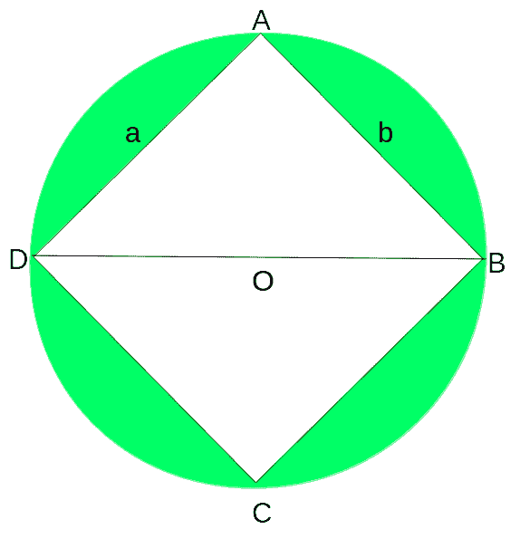
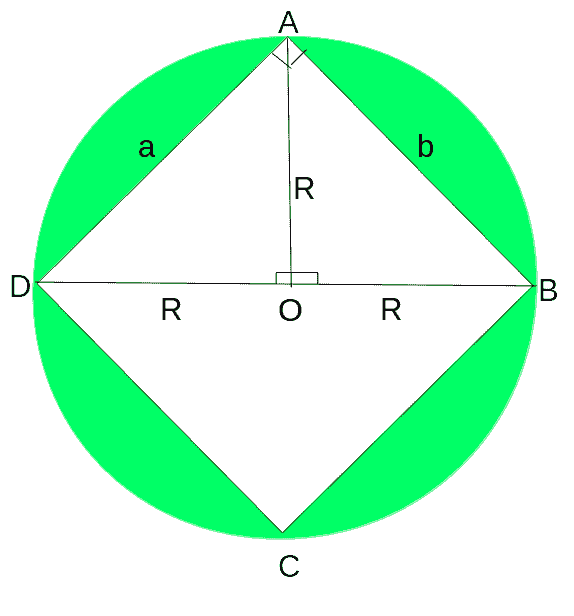

# 半径为 R 的圆内的矩形数量

> 原文:[https://www . geesforgeks . org/半径为 r 的圆内矩形数/](https://www.geeksforgeeks.org/number-of-rectangles-in-a-circle-of-radius-r/)

给定一个半径为 R 的圆形薄板，任务是找到可以从圆形薄板上切割的具有整数长度和宽度的矩形的总数，一次一个。
**例:**

> **输入** : R = 2
> **输出** : 8
> 从半径为 2 的圆形薄板上可以切割出 8 个矩形。
> 分别是:1×1、1×2、2×1、2×2、1×3、3×1、2×3、3×2。
> **输入** : R = 1
> **输出** : 1
> 只能有一个尺寸为 1×1 的矩形。

**接近**T2【考虑下图，



很容易看出，ABCD 是半径为 **R** 且中心为 O 的给定圆内能形成的最大矩形，其尺寸为 **a X b**
下降一个垂直的 AO，这样，**≈AOD =≈AOB = 90**
考虑下图进一步分析，



```
Consider triangles AOD and AOB,
In these triangles,
AO = AO (Common Side)
∠AOD = ∠AOB = 90° 
OD = OB = R
Thus, by SAS congruence ▵AOD ≅ ▵AOB
∴ AD = AB by CPCT(i.e Corresponding Parts on Congruent Triangles)
or, a = b
=> The rectangle ABCD is a square 
```

直径 BD 是矩形能够从圆形薄板切割的最大对角线。
因此，可以检查 a 和 b 的所有组合以形成所有可能的矩形，并且如果任何这样的矩形的对角线小于或等于所形成的最大矩形的对角线的长度(即 2 * R，其中 R 是如上所述的圆的半径)
现在，a 和 b 的最大长度将总是严格小于圆的直径，因此 a 和 b 的所有可能值将位于封闭区间[1，(2 * R–1)]。
以下是上述办法的实施情况:

## C++

```
// C++ program to find the number of rectangles
// that can be cut from a circle of Radius R
#include <bits/stdc++.h>
using namespace std;

// Function to return the total possible
// rectangles that can be cut from the circle
int countRectangles(int radius)
{

    int rectangles = 0;

    // Diameter = 2 * Radius
    int diameter = 2 * radius;

    // Square of diameter which is the square
    // of the maximum length diagonal
    int diameterSquare = diameter * diameter;

    // generate all combinations of a and b
    // in the range (1, (2 * Radius - 1))(Both inclusive)
    for (int a = 1; a < 2 * radius; a++) {
        for (int b = 1; b < 2 * radius; b++) {

            // Calculate the Diagonal length of
            // this rectangle
            int diagonalLengthSquare = (a * a + b * b);

            // If this rectangle's Diagonal Length
            // is less than the Diameter, it is a
            // valid rectangle, thus increment counter
            if (diagonalLengthSquare <= diameterSquare) {
                rectangles++;
            }
        }
    }

    return rectangles;
}

// Driver Code
int main()
{

    // Radius of the circle
    int radius = 2;

    int totalRectangles;
    totalRectangles = countRectangles(radius);
    cout << totalRectangles << " rectangles can be"
         << "cut from a circle of Radius " << radius;
    return 0;
}
```

## Java 语言(一种计算机语言，尤用于创建网站)

```
// Java program to find the
// number of rectangles that
// can be cut from a circle
// of Radius R
import java.io.*;

class GFG
{

// Function to return
// the total possible
// rectangles that can
// be cut from the circle
static int countRectangles(int radius)
{
    int rectangles = 0;

    // Diameter = 2 * Radius
    int diameter = 2 * radius;

    // Square of diameter
    // which is the square
    // of the maximum length
    // diagonal
    int diameterSquare = diameter *
                         diameter;

    // generate all combinations
    // of a and b in the range
    // (1, (2 * Radius - 1))
    // (Both inclusive)
    for (int a = 1;
             a < 2 * radius; a++)
    {
        for (int b = 1;
                 b < 2 * radius; b++)
        {

            // Calculate the
            // Diagonal length of
            // this rectangle
            int diagonalLengthSquare = (a * a +
                                       b * b);

            // If this rectangle's Diagonal
            // Length is less than the Diameter,
            // it is a valid rectangle, thus
            // increment counter
            if (diagonalLengthSquare <= diameterSquare)
            {
                rectangles++;
            }
        }
    }

    return rectangles;
}

// Driver Code
public static void main (String[] args)
{

// Radius of the circle
int radius = 2;

int totalRectangles;
totalRectangles = countRectangles(radius);
System.out.println(totalRectangles +
             " rectangles can be " +
            "cut from a circle of" +
               " Radius " + radius);
}
}

// This code is contributed
// by anuj_67.
```

## 蟒蛇 3

```
# Python3 program to find
# the number of rectangles
# that can be cut from a
# circle of Radius R Function
# to return the total possible
# rectangles that can be cut
# from the circle
def countRectangles(radius):

    rectangles = 0

    # Diameter = 2 * Radius
    diameter = 2 * radius

    # Square of diameter which
    # is the square of the
    # maximum length diagonal
    diameterSquare = diameter * diameter

    # generate all combinations
    # of a and b in the range
    # (1, (2 * Radius - 1))(Both inclusive)
    for a in range(1, 2 * radius):
        for b in range(1, 2 * radius):

            # Calculate the Diagonal
            # length of this rectangle
            diagonalLengthSquare = (a * a +
                                   b * b)

            # If this rectangle's Diagonal
            # Length is less than the
            # Diameter, it is a valid
            # rectangle, thus increment counter
            if (diagonalLengthSquare <= diameterSquare) :
                rectangles += 1

    return rectangles

# Driver Code

# Radius of the circle
radius = 2
totalRectangles = countRectangles(radius)
print(totalRectangles , "rectangles can be" ,
      "cut from a circle of Radius" , radius)

# This code is contributed by Smita
```

## C#

```
// C# program to find the
// number of rectangles that
// can be cut from a circle
// of Radius R
using System;

class GFG
{

// Function to return
// the total possible
// rectangles that can
// be cut from the circle
static int countRectangles(int radius)
{
    int rectangles = 0;

    // Diameter = 2 * Radius
    int diameter = 2 * radius;

    // Square of diameter
    // which is the square
    // of the maximum length
    // diagonal
    int diameterSquare = diameter *
                         diameter;

    // generate all combinations
    // of a and b in the range
    // (1, (2 * Radius - 1))
    // (Both inclusive)
    for (int a = 1;
             a < 2 * radius; a++)
    {
        for (int b = 1;
                 b < 2 * radius; b++)
        {

            // Calculate the
            // Diagonal length of
            // this rectangle
            int diagonalLengthSquare = (a * a +
                                        b * b);

            // If this rectangle's
            // Diagonal Length is
            // less than the Diameter,
            // it is a valid rectangle,
            // thus increment counter
            if (diagonalLengthSquare <=
                             diameterSquare)
            {
                rectangles++;
            }
        }
    }

    return rectangles;
}

// Driver Code
public static void Main ()
{

// Radius of the circle
int radius = 2;

int totalRectangles;
totalRectangles = countRectangles(radius);
Console.WriteLine(totalRectangles +
            " rectangles can be " +
           "cut from a circle of" +
              " Radius " + radius);
}
}

// This code is contributed
// by anuj_67.
```

## 服务器端编程语言（Professional Hypertext Preprocessor 的缩写）

```
<?php
// PHP program to find the
// number of rectangles that
// can be cut from a circle
// of Radius R

// Function to return the
// total possible rectangles
// that can be cut from the circle
function countRectangles($radius)
{

    $rectangles = 0;

    // Diameter = 2 * $Radius
    $diameter = 2 * $radius;

    // Square of diameter which
    // is the square of the
    // maximum length diagonal
    $diameterSquare = $diameter *
                      $diameter;

    // generate all combinations
    // of a and b in the range
    // (1, (2 * Radius - 1))(Both inclusive)
    for ($a = 1;
         $a < 2 * $radius; $a++)
    {
        for ($b = 1;
             $b < 2 * $radius; $b++)
        {

            // Calculate the Diagonal
            // length of this rectangle
            $diagonalLengthSquare = ($a * $a +
                                    $b * $b);

            // If this rectangle's Diagonal
            // Length is less than the
            // Diameter, it is a valid
            // rectangle, thus increment counter
            if ($diagonalLengthSquare <= $diameterSquare)
            {
                $rectangles++;
            }
        }
    }

    return $rectangles;
}

// Driver Code

// Radius of the circle
$radius = 2;

$totalRectangles;
$totalRectangles = countRectangles($radius);
echo $totalRectangles , " rectangles can be " ,
      "cut from a circle of Radius " , $radius;

// This code is contributed
// by anuj_67.
?>
```

## java 描述语言

```
<script>
// java script  program to find the
// number of rectangles that
// can be cut from a circle
// of Radius R

// Function to return the
// total possible rectangles
// that can be cut from the circle
function countRectangles(radius)
{

    let rectangles = 0;

    // Diameter = 2 * $Radius
    let diameter = 2 * radius;

    // Square of diameter which
    // is the square of the
    // maximum length diagonal
    let diameterSquare = diameter *
                    diameter;

    // generate all combinations
    // of a and b in the range
    // (1, (2 * Radius - 1))(Both inclusive)
    for (let a = 1;a < 2 * radius; a++)
    {
        for (let b = 1;
            b < 2 * radius; b++)
        {

            // Calculate the Diagonal
            // length of this rectangle
            let diagonalLengthSquare = (a * a +
                                    b * b);

            // If this rectangle's Diagonal
            // Length is less than the
            // Diameter, it is a valid
            // rectangle, thus increment counter
            if (diagonalLengthSquare <= diameterSquare)
            {
                rectangles++;
            }
        }
    }

    return rectangles;
}

// Driver Code

// Radius of the circle
let radius = 2;

let totalRectangles;
totalRectangles = countRectangles(radius);
document.write( totalRectangles + " rectangles can be cut from a circle of Radius " +radius);

// This code is contributed by sravan kumar
</script>
```

**Output:** 

```
8 rectangles can be cut from a circle of Radius 2
```

**时间复杂度:** O(R <sup>2</sup> ，其中 R 是圆的半径