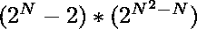

# 集合上既不自反也不反的关系数

> 原文:[https://www . geeksforgeeks . org/既不是自反的也不是非自反的集合关系数/](https://www.geeksforgeeks.org/number-of-relations-that-are-neither-reflexive-nor-irreflexive-on-a-set/)

给定一个正整数 **N** ，任务是在一组第一个**N**T10】自然数上找到既不是[反身](https://www.geeksforgeeks.org/number-reflexive-relations-set/)也不是[非反身](https://www.geeksforgeeks.org/number-of-irreflexive-relations-on-a-set/)的[关系](https://www.geeksforgeeks.org/relations-and-their-types/)的数量。由于关系的计数可能很大，打印到[模 10 <sup>9</sup> + 7](https://www.geeksforgeeks.org/modulo-1097-1000000007/) 。

> 集合 **A** 上的关系 **R** 被称为反身，如果没有 **(a，a)** € **R** 适用于每个元素 **a € A** 。
> 例如:如果集合 A = {a，b}，那么 R = {(a，b)，(b，a)}就是不可逆关系。

**示例:**

> **输入:** N = 2
> **输出:** 8
> **解释:**考虑集合{1，2}，既不是自反的也不是非自反的总可能关系是:
> 
> 1.  {(1, 1)}
> 2.  {(1, 1), (1, 2)}
> 3.  {(1, 1), (2, 1)}
> 4.  {(1, 1), (1, 2), (2, 1)}
> 5.  {(2, 2)}
> 6.  {(2, 2), (2, 1)}
> 7.  {(2, 2), (1, 2)}
> 8.  {(2, 2), (2, 1), (1, 2)}
> 
> 因此，总数是 8。
> 
> **输入:**N = 3
> T3】输出: 384

**方法:**给定的问题可以基于以下观察来解决:

*   集合 **A** 上的 A [关系](https://www.geeksforgeeks.org/relations-and-their-types/) **R** 是集合的[笛卡尔乘积的子集，即 **A * A** 与**N<sup>2</sup>T15】元素。**](https://www.geeksforgeeks.org/cartesian-product-two-sets/)
*   如果一个关系不包含至少一对 **(x，x)** 则该关系为**非反身**，如果该关系包含至少一对 **(x，x)** 则该关系为非反身，其中 **x € R** 。
*   可以得出这样的结论:如果关系至少包含一对 **(x，x)** 并且最多包含**(N–1)**对 **(x，x)** ，则该关系将是非自反和非不可反的。
*   在 **(x，x)** 的 **N** 对中，除 **0** 和**N–1**外，选择任意数量对的可能性总数为**(2<sup>N</sup>–2)**。对于剩余的**(N<sup>2</sup>–N)**元素，每个元素有两个选择，即在子集中包含或排除它。

从以上观察，第一组 **N** [自然数](https://www.geeksforgeeks.org/natural-numbers/) 上既不是[反身](https://www.geeksforgeeks.org/number-reflexive-relations-set/)也不是[非反身](https://www.geeksforgeeks.org/number-of-irreflexive-relations-on-a-set/)的关系总数由给出。

下面是上述方法的实现:

## C++

```
// C++ program for the above approach

#include <bits/stdc++.h>
using namespace std;

const int mod = 1000000007;

// Function to calculate x^y
// modulo 10^9 + 7 in O(log y)
int power(long long x, unsigned int y)
{
    // Stores the result of (x^y)
    int res = 1;

    // Update x, if it exceeds mod
    x = x % mod;

    // If x is divisible by mod
    if (x == 0)
        return 0;

    while (y > 0) {

        // If y is odd, then
        // multiply x with res
        if (y & 1)
            res = (res * x) % mod;

        // Divide y by 2
        y = y >> 1;

        // Update the value of x
        x = (x * x) % mod;
    }

    // Return the value of x^y
    return res;
}

// Function to count the number
// of relations that are neither
// reflexive nor irreflexive
void countRelations(int N)
{
    // Return the resultant count
    cout << (power(2, N) - 2)
                * power(2, N * N - N);
}

// Driver Code
int main()
{
    int N = 2;
    countRelations(N);

    return 0;
}
```

## Java 语言(一种计算机语言，尤用于创建网站)

```
// Java program for the above approach
import java.io.*;
import java.lang.*;
import java.util.*;

class GFG{

static int mod = 1000000007;

// Function to calculate x^y
// modulo 10^9 + 7 in O(log y)
static int power(int x, int y)
{

    // Stores the result of (x^y)
    int res = 1;

    // Update x, if it exceeds mod
    x = x % mod;

    // If x is divisible by mod
    if (x == 0)
        return 0;

    while (y > 0)
    {

        // If y is odd, then
        // multiply x with res
        if ((y & 1) != 0)
            res = (res * x) % mod;

        // Divide y by 2
        y = y >> 1;

        // Update the value of x
        x = (x * x) % mod;
    }

    // Return the value of x^y
    return res;
}

// Function to count the number
// of relations that are neither
// reflexive nor irreflexive
static void countRelations(int N)
{

    // Return the resultant count
    System.out.print((power(2, N) - 2) *
                      power(2, N * N - N));
}

// Driver Code
public static void main(String[] args)
{
    int N = 2;

    countRelations(N);
}
}

// This code is contributed by susmitakundugoaldanga
```

## 蟒蛇 3

```
# Python program for the above approach
mod = 1000000007

# Function to calculate x^y
# modulo 10^9 + 7 in O(log y)
def power(x, y):

    # Stores the result of (x^y)
    res = 1

    # Update x, if it exceeds mod
    x = x % mod

    # If x is divisible by mod
    if(x == 0):
        return 0

    while(y > 0):

        # If y is odd, then
        # multiply x with res
        if (y % 2 == 1):
            res = (res * x) % mod

        # Divide y by 2
        y = y >> 1

        # Update the value of x
        x = (x * x) % mod

    # Return the value of x^y
    return res

# Function to count the number
# of relations that are neither
# reflexive nor irreflexive
def countRelations(N):

    # Return the resultant count
    print((power(2, N) - 2) * power(2, N * N - N))

# Driver Code
N = 2
countRelations(N)

# This code is contributed by abhinavjain194
```

## C#

```
// C# program for the above approach
using System;

class GFG{

static int mod = 1000000007;

// Function to calculate x^y
// modulo 10^9 + 7 in O(log y)
static int power(int x, int y)
{

    // Stores the result of (x^y)
    int res = 1;

    // Update x, if it exceeds mod
    x = x % mod;

    // If x is divisible by mod
    if (x == 0)
        return 0;

    while (y > 0)
    {

        // If y is odd, then
        // multiply x with res
        if ((y & 1) != 0)
            res = (res * x) % mod;

        // Divide y by 2
        y = y >> 1;

        // Update the value of x
        x = (x * x) % mod;
    }

    // Return the value of x^y
    return res;
}

// Function to count the number
// of relations that are neither
// reflexive nor irreflexive
static void countRelations(int N)
{

    // Return the resultant count
    Console.Write((power(2, N) - 2) *
                   power(2, N * N - N));
}

// Driver Code
public static void Main(String[] args)
{
    int N = 2;
    countRelations(N);
}
}

// This code is contributed by 29AjayKumar
```

## java 描述语言

```
<script>

// Javascript program for the above approach

var mod = 1000000007;

// Function to calculate x^y
// modulo 10^9 + 7 in O(log y)
function power(x, y)
{
    // Stores the result of (x^y)
    var res = 1;

    // Update x, if it exceeds mod
    x = x % mod;

    // If x is divisible by mod
    if (x == 0)
        return 0;

    while (y > 0) {

        // If y is odd, then
        // multiply x with res
        if (y %2 != 0)
            res = (res * x) % mod;

        // Divide y by 2
        y = y >> 1;

        // Update the value of x
        x = (x * x) % mod;
    }

    // Return the value of x^y
    return res;
}

// Function to count the number
// of relations that are neither
// reflexive nor irreflexive
function countRelations(N)
{
    // Return the resultant count
    document.write((power(2, N) - 2)
                * power(2, (N * N) - N));
}

// Driver Code
var N = 2;
countRelations(N);

</script>
```

**Output:** 

```
8
```

***时间复杂度:** O(log N)*
***辅助空间:** O(1)*