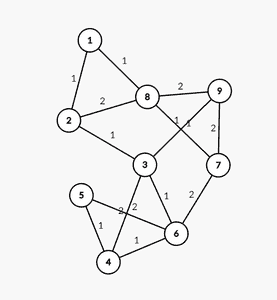

# 无向加权图中最短路径的数量

> 原文:[https://www . geesforgeks . org/无向加权图中最短路径数/](https://www.geeksforgeeks.org/number-of-shortest-paths-in-an-undirected-weighted-graph/)

给定一个[加权无向图](https://www.geeksforgeeks.org/graph-and-its-representations/) [](https://www.geeksforgeeks.org/graph-data-structure-and-algorithms/)**G** 和一个整数 **S** ，任务是打印每个节点到给定顶点 **S 的最短路径距离和[最短路径数](https://www.geeksforgeeks.org/number-shortest-paths-unweighted-directed-graph/)的计数**

**示例:**

> **输入:** S =1，G =
> 
> 
> 
> **输出:**最短路径距离为:0 1 2 4 5 3 2 1 3
> 最短路径数为:1 1 2 3 1 1 1 2
> T4】说明:
> 
> 1.  最短路径到顶点 1 的距离为 0，并且只有一条这样的路径，即{1}。
> 2.  到顶点 2 的最短路径的距离是 1，并且只有一条这样的路径，即{1→2}。
> 3.  最短路径到顶点 3 的距离是 2，这样的路径只有 1 条，就是{1→2→3}。
> 4.  最短路径到顶点 4 的距离为 4，存在 2 条这样的路径，分别是{{1→2→3→4}、{1→2→3→6→4}}。
> 5.  最短路径到顶点 5 的距离为 5，存在 3 条这样的路径，分别是{{1→2→3→4→5}、{1→2→3→6→4→5}、{1→2→3→6→5}}。
> 6.  最短路径到顶点 6 的距离是 3，这样的路径只有 1 条，就是{1→2→3→6}。
> 7.  最短路径到顶点 7 的距离是 2，这样的路径只有 1 条，就是{1→8→7}。
> 8.  到顶点 8 的最短路径的距离是 1，并且只有一条这样的路径，即{1→8}。
> 9.  最短路径到顶点 9 的距离为 3，存在 2 条这样的路径，分别是{{1→8→9}、{1→2→3→9}}。

**方法:**给定的问题可以使用[迪克斯特拉算法](https://www.geeksforgeeks.org/dijkstras-shortest-path-algorithm-greedy-algo-7/)来解决。按照以下步骤解决问题:

*   使用[数组列表<数组列表< > >](https://www.geeksforgeeks.org/arraylist-of-arraylist-in-java/) 形成给定图形的[邻接表，并将其存储在一个变量中，比如**形容词**](https://www.geeksforgeeks.org/graph-and-its-representations/)
*   初始化两个整数，[数组](https://www.geeksforgeeks.org/arrays-in-java/)表示**距离[]** 和**路径[]** 所有元素为 **0** 存储每个节点的最短距离和距离源节点最短的路径数， **S** 。
*   定义一个函数，比如 **Dijkstra()** 求每个节点的最短距离，统计最短距离的路径:
    *   初始化一个 min [PriorityQueue](https://www.geeksforgeeks.org/priority-queue-class-in-java-2/) 表示 **PQ** 和一个 [HashSet](https://www.geeksforgeeks.org/hashset-in-java/) 的[字符串](https://www.geeksforgeeks.org/strings-in-java/)表示**结算**来存储是否访问了边缘。
    *   将 **0** 分配给**区**，将 **1** 分配给**路径【S】。**
    *   现在迭代直到 [**PQ** 不为空()](https://www.geeksforgeeks.org/priority_queueempty-priority_queuesize-c-stl/)并执行以下操作:
        *   找到 **PQ** 的顶部节点，并将节点值存储在变量 **u** 中。
        *   [弹出 PQ 的顶元素。](https://www.geeksforgeeks.org/priority-queue-class-in-java-2/)
        *   [迭代数组列表](https://www.geeksforgeeks.org/iterating-arraylists-java/) **调整【u】**并执行以下操作
            *   将相邻节点存储在变量“T0”到“T1”中，将边缘成本存储在变量“T2”成本“T3”中:
            *   如果访问了边缘 **{u，to}** ，则继续。
            *   如果 **dist[to]** 大于**dist[u]+成本，**则将**dist[u]+成本**分配给 **dist[to]** ，然后将**路径[u]** 分配给**路径[to]。**
            *   否则，如果**路径【到】**等于**距离【u】+成本，**则将**路径【到】**增加 **1。**
            *   现在，马克，目前的**边{u，to}** 在**拜访了**定居。
*   调用函数 **Dijkstra()** 。
*   最后，打印阵列**距离[]** 和**路径[]** 。

下面是上述方法的实现:

## Java 语言(一种计算机语言，尤用于创建网站)

```
// Java program for the above approach
import java.io.*;
import java.util.*;
class GFG {

    // Node class
    static class Node implements Comparator<Node> {

        // Stores the node
        public int node;

        // Stores the weight
        // of the edge
        public int cost;

        public Node() {}

        // Constructor
        public Node(int node, int cost)
        {
            this.node = node;
            this.cost = cost;
        }

        // Costume comparator
        @Override
        public int compare(Node node1, Node node2)
        {
            if (node1.cost < node2.cost)
                return -1;
            if (node1.cost > node2.cost)
                return 1;
            return 0;
        }
    }

    // Function to insert a node
    // in adjacency list
    static void addEdge(ArrayList<ArrayList<Node> > adj,
                        int x, int y, int w)
    {
        adj.get(x).add(new Node(y, w));
        adj.get(y).add(new Node(x, w));
    }

    // Auxiliary function to find shortest paths using
    // Dijekstra
    static void dijkstra(ArrayList<ArrayList<Node> > adj,
                         int src, int n, int dist[],
                         int paths[])
    {
        // Stores the distances of every node in shortest
        // order
        PriorityQueue<Node> pq
            = new PriorityQueue<Node>(n + 1, new Node());

        // Stores if a vertex has been visited or not
        Set<String> settled = new HashSet<String>();

        // Adds the source node with 0 distance to pq
        pq.add(new Node(src, 0));

        dist[src] = 0;
        paths[src] = 1;

        // While pq is not empty()
        while (!pq.isEmpty()) {

            // Stores the top node of pq
            int u = pq.peek().node;

            // Stores the distance
            // of node u from s
            int d = pq.peek().cost;

            // Pop the top element
            pq.poll();

            for (int i = 0; i < adj.get(u).size(); i++) {
                int to = adj.get(u).get(i).node;
                int cost = adj.get(u).get(i).cost;

                // If edge is marked
                if (settled.contains(to + " " + u))
                    continue;

                // If dist[to] is greater
                // than dist[u] + cost
                if (dist[to] > dist[u] + cost) {

                    // Add the node to to the pq
                    pq.add(new Node(to, d + cost));

                    // Update dist[to]
                    dist[to] = dist[u] + cost;

                    // Update paths[to]
                    paths[to] = paths[u];
                }

                // Otherwise
                else if (dist[to] == dist[u] + cost) {
                    paths[to] = (paths[to] + paths[u]);
                }

                // Mark the edge visited
                settled.add(to + " " + u);
            }
        }
    }

    // Function to find the count of shortest path and
    // distances from source node to every other node
    static void
    findShortestPaths(ArrayList<ArrayList<Node> > adj,
                      int s, int n)
    {
        // Stores the distances of a
        // node from source node
        int[] dist = new int[n + 5];

        // Stores the count of shortest
        // paths of a node from
        // source node
        int[] paths = new int[n + 5];

        for (int i = 0; i <= n; i++)
            dist[i] = Integer.MAX_VALUE;

        for (int i = 0; i <= n; i++)
            paths[i] = 0;

        // Function call to find
        // the shortest paths
        dijkstra(adj, s, n, dist, paths);

        System.out.print("Shortest Paths distances are : ");
        for (int i = 1; i <= n; i++) {
            System.out.print(dist[i] + " ");
        }

        System.out.println();

        System.out.print(
            "Numbers of the shortest Paths are: ");
        for (int i = 1; i <= n; i++)
            System.out.print(paths[i] + " ");
    }

    // Driver Code
    public static void main(String[] args)
    {
        // Input
        int N = 9;
        int M = 14;

        ArrayList<ArrayList<Node> > adj = new ArrayList<>();

        for (int i = 0; i <= N; i++) {
            adj.add(new ArrayList<Node>());
        }

        addEdge(adj, 1, 2, 1);
        addEdge(adj, 2, 3, 1);
        addEdge(adj, 3, 4, 2);
        addEdge(adj, 4, 5, 1);
        addEdge(adj, 5, 6, 2);
        addEdge(adj, 6, 7, 2);
        addEdge(adj, 7, 8, 1);
        addEdge(adj, 8, 1, 1);
        addEdge(adj, 2, 8, 2);
        addEdge(adj, 3, 9, 1);
        addEdge(adj, 8, 9, 2);
        addEdge(adj, 7, 9, 2);
        addEdge(adj, 3, 6, 1);
        addEdge(adj, 4, 6, 1);

        // Function call
        findShortestPaths(adj, 1, N);
    }
}
```

**Output:**

```
Shortest Paths distances are : 0 1 2 4 5 3 2 1 3 
Numbers of the shortest Paths are: 1 1 1 2 3 1 1 1 2

```

***时间复杂度:**O(M+N * log(N))*
***辅助空间:** O(M)*