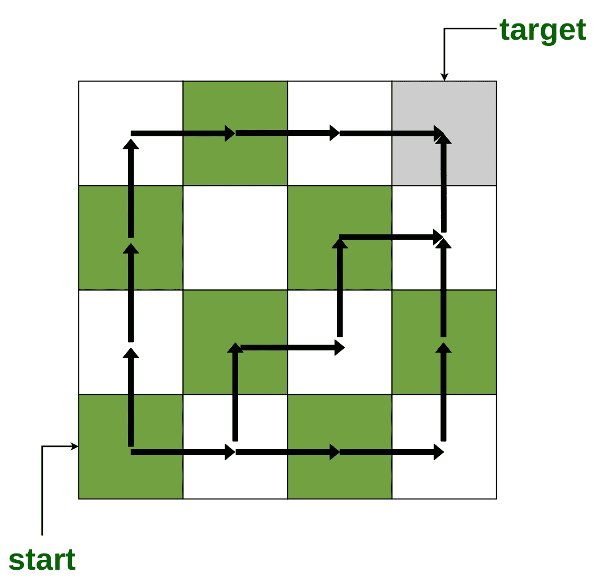

# 从网格左下角的单元格到达每个单元格的最短路径数

> 原文:[https://www . geeksforgeeks . org/从网格左下单元到达每个单元的最短路径数/](https://www.geeksforgeeks.org/number-of-shortest-paths-to-reach-every-cell-from-bottom-left-cell-in-the-grid/)

给定两个数字 **N** 和 **M** 。任务是当移动从左下角
**开始时，在大小为 **N × M** 的网格中找到到达**单元(I，j)** 的最短路径数注:**单元(I，j)代表网格
中的第 ith 行和 jth 列下图显示了到达 **4 × 4** 网格
中的**单元(1，4)** 的一些最短路径



**例:**

```
Input : N = 3, M = 4 
Output : 1 3 6 10 
         1 2 3 4 
         1 1 1 1  

Input : N = 5, M = 2 
Output : 1 5 
         1 4 
         1 3 
         1 2 
         1 1 
```

**方法:**一种有效的方法是从左下角开始计算网格。

*   到达单元(n，I)的最短路径数为 1，其中，1 < = i < = M
*   到达小区(I，1)的最短路径数是 1，其中，1 < = i < = N
*   到达小区(I，j)的最短路径数是小区(i-1，j)和(I，j+1)的最短路径数之和，其中，1 < = j < = M 和 1 < = i < = N

以下是上述方法的实现:

## C++

```
// CPP program to find number of shortest paths
#include <bits/stdc++.h>
using namespace std;

// Function to find number of shortest paths
void NumberOfShortestPaths(int n, int m)
{
    int a[n][m];

    for (int i = 0; i < n; i++)
        memset(a[i], 0, sizeof(a[i]));

    // Compute the grid starting from
    // the bottom-left corner
    for (int i = n - 1; i >= 0; i--) {
        for (int j = 0; j < m; j++) {
            if (j == 0 or i == n - 1)
                a[i][j] = 1;
            else
                a[i][j] = a[i][j - 1] + a[i + 1][j];
        }
    }

    // Print the grid
    for (int i = 0; i < n; i++) {
        for (int j = 0; j < m; j++) {
            cout << a[i][j] << " ";
        }
        cout << endl;
    }
}

// Driver code
int main()
{
    int n = 5, m = 2;

    // Function call
    NumberOfShortestPaths(n, m);

    return 0;
}
```

## Java 语言(一种计算机语言，尤用于创建网站)

```
// Java program to find number of shortest paths
class GFG
{

// Function to find number of shortest paths
static void NumberOfShortestPaths(int n, int m)
{
    int [][]a = new int[n][m];

    // Compute the grid starting from
    // the bottom-left corner
    for (int i = n - 1; i >= 0; i--)
    {
        for (int j = 0; j < m; j++)
        {
            if (j == 0 || i == n - 1)
                a[i][j] = 1;
            else
                a[i][j] = a[i][j - 1] + a[i + 1][j];
        }
    }

    // Print the grid
    for (int i = 0; i < n; i++)
    {
        for (int j = 0; j < m; j++)
        {
            System.out.print(a[i][j] + " ");
        }
        System.out.println();
    }
}

// Driver code
public static void main(String[] args)
{
    int n = 5, m = 2;

    // Function call
    NumberOfShortestPaths(n, m);
}
}

// This code is contributed by Princi Singh
```

## 蟒蛇 3

```
# Python 3 program to find
# number of shortest paths

# Function to find number of shortest paths
def NumberOfShortestPaths(n, m):
    a = [[0 for i in range(m)]
            for j in range(n)]

    for i in range(n):
        for j in range(m):
            a[i][j] = 0

    # Compute the grid starting from
    # the bottom-left corner
    i = n - 1
    while(i >= 0):
        for j in range(m):
            if (j == 0 or i == n - 1):
                a[i][j] = 1
            else:
                a[i][j] = a[i][j - 1] + \
                          a[i + 1][j]

        i -= 1

    # Print the grid
    for i in range(n):
        for j in range(m):
            print(a[i][j], end = " ")
        print("\n", end = "")

# Driver code
if __name__ == '__main__':
    n = 5
    m = 2

    # Function call
    NumberOfShortestPaths(n, m)

# This code is contributed by
# Surendra_Gangwar
```

## C#

```
// C# program to find number of shortest paths
using System;

class GFG
{

// Function to find number of shortest paths
static void NumberOfShortestPaths(int n, int m)
{
    int [,]a = new int[n, m];

    // Compute the grid starting from
    // the bottom-left corner
    for (int i = n - 1; i >= 0; i--)
    {
        for (int j = 0; j < m; j++)
        {
            if (j == 0 || i == n - 1)
                a[i, j] = 1;
            else
                a[i, j] = a[i, j - 1] + a[i + 1, j];
        }
    }

    // Print the grid
    for (int i = 0; i < n; i++)
    {
        for (int j = 0; j < m; j++)
        {
            Console.Write(a[i, j] + " ");
        }
        Console.Write("\n");
    }
}

// Driver code
public static void Main(String[] args)
{
    int n = 5, m = 2;

    // Function call
    NumberOfShortestPaths(n, m);
}
}

// This code is contributed by PrinciRaj1992
```

## java 描述语言

```
<script>
// javascript program to find number of shortest paths   
// Function to find number of shortest paths
    function NumberOfShortestPaths(n , m) {
        var a = Array(n).fill().map(() => Array(m).fill(0));

        // Compute the grid starting from
        // the bottom-left corner
        for (var i = n - 1; i >= 0; i--) {
            for (j = 0; j < m; j++) {
                if (j == 0 || i == n - 1)
                    a[i][j] = 1;
                else
                    a[i][j] = a[i][j - 1] + a[i + 1][j];
            }
        }

        // Prvar the grid
        for (var i = 0; i < n; i++) {
            for (j = 0; j < m; j++) {
                document.write(a[i][j] + " ");
            }
            document.write("<br/>");
        }
    }

    // Driver code
        var n = 5, m = 2;

        // Function call
        NumberOfShortestPaths(n, m);

// This code is contributed by gauravrajput1
</script>
```

**输出:**

```
1 5 
1 4 
1 3 
1 2 
1 1 
```

**时间复杂度:** O(N × M)