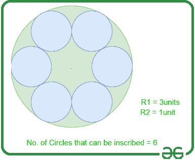
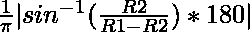

# 可以在一个大圆内接的较小圆的数目

> 原文:[https://www . geeksforgeeks . org/可在大圆内刻的小圆数量/](https://www.geeksforgeeks.org/number-of-smaller-circles-that-can-be-inscribed-in-a-larger-circle/)

给定两个正整数 **R1** 和 **R2** ，其中 **R1** 和 **R2** 分别代表较大和较小圆的半径，任务是找出可放置在较大圆内的较小圆的数量，使得较小圆接触较大圆的边界。

**示例:**

> **输入:** R1 = 3，R2 = 1
> **输出:** 6
> **说明:**圆的半径为 3 和 1。因此，半径为 1 的圆可以内接在半径为 3 的圆上。
> 
> [](https://media.geeksforgeeks.org/wp-content/uploads/20210318051458/Untitled.png)
> 
> 根据上面的表示，通过接触大圆的边界可以内切的小圆的总数是 6。
> 
> **输入:** R1 = 5，R2 = 4
> T3】输出: 1

**逼近:**求半径较小的圆 **R2** 在半径为**的圆的[圆心处与 R1](https://www.geeksforgeeks.org/equation-of-circle-from-centre-and-radius/)** 所成的角度，再除以 **360 度**，即可求解给定问题。
按照以下步骤解决给定问题:

*   如果 **R1** 的值小于 **R2** ，那么单圈是不可能落款的。因此，打印 **0** 。
*   如果 **R1** 的值小于 **2 * R2** ，即如果较小圆的[直径大于较大圆的半径，则只能内接一个圆。因此，打印 **1** 。](https://www.geeksforgeeks.org/find-the-diameter-or-longest-chord-of-a-circle/)
*   否则，用下面的公式求出大圆中心处的小圆所成的[角，然后除以 **360 度**，得到可内切圆的总数，并打印出该值。](https://www.geeksforgeeks.org/angle-subtended-by-the-chord-to-center-of-the-circle-when-the-angle-subtended-by-the-another-equal-chord-of-a-congruent-circle-is-given/)

> 

下面是上述方法的实现:

## C++

```
// C++ program for the above approach

#include <bits/stdc++.h>
using namespace std;

// Function to count number of smaller
// circles that can be inscribed in
// the larger circle touching its boundary
int countInscribed(int R1, int R2)
{
    // If R2 is greater than R1
    if (R2 > R1)
        return 0;

    // Stores the angle made
    // by the smaller circle
    double angle;

    // Stores the ratio
    // of R2 / (R1 - R2)
    double ratio;

    // Stores the count of smaller
    // circles that can be inscribed
    int number_of_circles = 0;

    // Stores the ratio
    ratio = R2 / (double)(R1 - R2);

    // If the diameter of smaller
    // circle is greater than the
    // radius of the larger circle
    if (R1 < 2 * R2) {
        number_of_circles = 1;
    }

    // Otherwise
    else {

        // Find the angle using formula
        angle = abs(asin(ratio) * 180)
                / 3.14159265;

        // Divide 360 with angle
        // and take the floor value
        number_of_circles = 360
                            / (2
                               * floor(angle));
    }

    // Return the final result
    return number_of_circles;
}

// Driver Code
int main()
{
    int R1 = 3;
    int R2 = 1;

    cout << countInscribed(R1, R2);

    return 0;
}
```

## Java 语言(一种计算机语言，尤用于创建网站)

```
// Java program for the above approach
import java.util.*;

class GFG{

// Function to count number of smaller
// circles that can be inscribed in
// the larger circle touching its boundary
static int countInscribed(int R1, int R2)
{

    // If R2 is greater than R1
    if (R2 > R1)
        return 0;

    // Stores the angle made
    // by the smaller circle
    double angle;

    // Stores the ratio
    // of R2 / (R1 - R2)
    double ratio;

    // Stores the count of smaller
    // circles that can be inscribed
    int number_of_circles = 0;

    // Stores the ratio
    ratio = R2 / (double)(R1 - R2);

    // If the diameter of smaller
    // circle is greater than the
    // radius of the larger circle
    if (R1 < 2 * R2)
    {
        number_of_circles = 1;
    }

    // Otherwise
    else
    {

        // Find the angle using formula
        angle = Math.abs(Math.asin(ratio) * 180) /
                3.14159265;

        // Divide 360 with angle
        // and take the floor value
        number_of_circles = (int)(360 /
        (2 * Math.floor(angle)));
    }

    // Return the final result
    return number_of_circles;
}

// Driver Code
public static void main(String args[])
{
    int R1 = 3;
    int R2 = 1;

    System.out.println(countInscribed(R1, R2));
}
}

// This code is contributed by ipg2016107
```

## 蟒蛇 3

```
# Python3 program for the above approach
import math

# Function to count number of smaller
# circles that can be inscribed in
# the larger circle touching its boundary
def countInscribed(R1, R2):

    # If R2 is greater than R1
    if (R2 > R1):
        return 0

    # Stores the angle made
    # by the smaller circle
    angle = 0

    # Stores the ratio
    # of R2 / (R1 - R2)
    ratio = 0

    # Stores the count of smaller
    # circles that can be inscribed
    number_of_circles = 0

    # Stores the ratio
    ratio = R2 / (R1 - R2)

    # If the diameter of smaller
    # circle is greater than the
    # radius of the larger circle
    if (R1 < 2 * R2):
        number_of_circles = 1

    # Otherwise
    else:

        # Find the angle using formula
        angle = (abs(math.asin(ratio) * 180) /
                 3.14159265)

        # Divide 360 with angle
        # and take the floor value
        number_of_circles = (360 / (2 *
               math.floor(angle)))

    # Return the final result
    return number_of_circles

# Driver Code
if __name__ == "__main__":

    R1 = 3
    R2 = 1

    print (int(countInscribed(R1, R2)))

# This code is contributed by ukasp
```

## C#

```
// C# program for the above approach
using System;

class GFG{

// Function to count number of smaller
// circles that can be inscribed in
// the larger circle touching its boundary
static int countInscribed(int R1, int R2)
{

    // If R2 is greater than R1
    if (R2 > R1)
        return 0;

    // Stores the angle made
    // by the smaller circle
    double angle;

    // Stores the ratio
    // of R2 / (R1 - R2)
    double ratio;

    // Stores the count of smaller
    // circles that can be inscribed
    int number_of_circles = 0;

    // Stores the ratio
    ratio = R2 / (double)(R1 - R2);

    // If the diameter of smaller
    // circle is greater than the
    // radius of the larger circle
    if (R1 < 2 * R2)
    {
        number_of_circles = 1;
    }

    // Otherwise
    else
    {

        // Find the angle using formula
        angle = Math.Abs(Math.Asin(ratio) * 180) /
                3.14159265;

        // Divide 360 with angle
        // and take the floor value
        number_of_circles = (int)(360 /
        (2 * Math.Floor(angle)));
    }

    // Return the final result
    return number_of_circles;
}

// Driver Code
public static void Main()
{
    int R1 = 3;
    int R2 = 1;

    Console.WriteLine(countInscribed(R1, R2));
}
}

// This code is contributed by mohit kumar 29
```

## java 描述语言

```
<script>

        // Javascript program for the above approach

        // Function to count number of smaller
        // circles that can be inscribed in
        // the larger circle touching its boundary
        function countInscribed(R1, R2)
        {
            // If R2 is greater than R1
            if (R2 > R1)
                return 0;

            // Stores the angle made
            // by the smaller circle
            let angle;

            // Stores the ratio
            // of R2 / (R1 - R2)
            let ratio;

            // Stores the count of smaller
            // circles that can be inscribed
            let number_of_circles = 0;

            // Stores the ratio
            ratio = R2 / (R1 - R2);

            // If the diameter of smaller
            // circle is greater than the
            // radius of the larger circle
            if (R1 < 2 * R2) {
                number_of_circles = 1;
            }

            // Otherwise
            else {

                // Find the angle using formula
                angle = Math.abs(Math.asin(ratio) * 180)
                    / 3.14159265;

                // Divide 360 with angle
                // and take the floor value
                number_of_circles = 360
                    / (2
                        * Math.floor(angle));
            }

            // Return the final result
            return number_of_circles;
        }

        // Driver Code

        let R1 = 3;
        let R2 = 1;

        document.write(countInscribed(R1, R2))

        // This code is contributed by Hritik

    </script>
```

**Output:** 

```
6
```

***时间复杂度:**O(1)*
T5**辅助空间:** O(1)