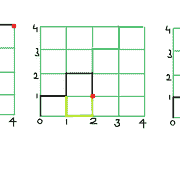

# 使用之字形方式从(0，0)到达点(x，y)所需的步数

> 原文:[https://www . geesforgeks . org/从 00 开始到达 xy 点所需的步数-使用之字形路线/](https://www.geeksforgeeks.org/number-of-steps-required-to-reach-point-xy-from-00-using-zig-zag-way/)

给定一个坐标 **(x，y)** 。任务是使用之字形方式计算从(0，0)到达点(x，y)所需的步数，并且不能直线行进超过 1 个单位。另外，开始沿着 Y 轴移动。
例如，我们可以通过下图所示的各种方式到达红色表示的点:



**例:**

```
Input: x = 4, y = 4
Output: 8
In the diagram above the line is passing
using 8 steps.

Input: x = 4, y = 3
Output: 9

Input: x = 2, y = 1
Output: 5
```

**走近**:通过画一个小图，我们可以看到两种情况:

*   **情况 1** :如果 x 小于 y，那么答案永远是**x+y+2 *(y-x)/2)**。
*   **情况 2** :如果 x 大于等于 y，那么答案永远是**x+y+2 *(x-y)+1)/2)**。

以下是上述方法的实现:

## C++

```
// C++ program to find the number of steps
// required to reach (x, y) from (0, 0) following
// a zig-zag path

#include <bits/stdc++.h>
using namespace std;

// Function to return the required position
int countSteps(int x, int y)
{
    if (x < y) {
        return x + y + 2 * ((y - x) / 2);
    }
    else {
        return x + y + 2 * (((x - y) + 1) / 2);
    }
}

// Driver Code
int main()
{
    int x = 4, y = 3;
    cout << countSteps(x, y);

    return 0;
}
```

## Java 语言(一种计算机语言，尤用于创建网站)

```
// Java program to find the number of steps
// required to reach (x, y) from (0, 0) following
// a zig-zag path

class GfG
{

// Function to return the required position
static int countSteps(int x, int y)
{
    if (x < y)
    {
        return x + y + 2 * ((y - x) / 2);
    }
    else
    {
        return x + y + 2 * (((x - y) + 1) / 2);
    }
}

// Driver Code
public static void main(String[] args)
{
    int x = 4, y = 3;
    System.out.println(countSteps(x, y));
}
}

// This code is contributed by Prerna Saini
```

## 蟒蛇 3

```
# Python3 program to find the number of
# steps required to reach (x, y) from
# (0, 0) following a zig-zag path

# Function to return the required position
def countSteps(x, y):

    if x < y:
        return x + y + 2 * ((y - x) // 2)

    else:
        return x + y + 2 * (((x - y) + 1) // 2)

# Driver Code
if __name__ == "__main__":

    x, y = 4, 3
    print(countSteps(x, y))

# This code is contributed by Rituraj Jain
```

## C#

```
// C# program to find the number of steps
// required to reach (x, y) from (0, 0) 
// following a zig-zag path
using System;

class GfG
{

// Function to return the required position
static int countSteps(int x, int y)
{
    if (x < y)
    {
        return x + y + 2 * ((y - x) / 2);
    }
    else
    {
        return x + y + 2 * (((x - y) + 1) / 2);
    }
}

// Driver Code
public static void Main()
{
    int x = 4, y = 3;
    Console.WriteLine(countSteps(x, y));
}
}

// This code is contributed by Code_Mech.
```

## 服务器端编程语言（Professional Hypertext Preprocessor 的缩写）

```
<?php
// PHP program to find the number of steps
// required to reach (x, y) from (0, 0)
// following a zig-zag path

// Function to return the required position
function countSteps($x, $y)
{
    if ($x < $y)
    {
        return $x + $y + 2 *
             (($y - $x) / 2);
    }
    else
    {
        return $x + $y + 2 *
            ((($x - $y) + 1) / 2);
    }
}

// Driver Code
$x = 4; $y = 3;
echo(countSteps($x, $y));

// This code is contributed
// by Code_Mech.
?>
```

## java 描述语言

```
<script>

    // Javascript program to find the number of steps
    // required to reach (x, y) from (0, 0) following
    // a zig-zag path

    // Function to return the required position
    function countSteps(x, y)
    {
      if (x < y) {
        return x + y + 2 * parseInt((y - x) / 2);
      }
      else {
        return x + y + 2 * parseInt(((x - y) + 1) / 2);
      }
    }

    // Driver Code
    var x = 4, y = 3;
    document.write(countSteps(x, y));

// This code is contributed by rrrtnx.
  </script>
```

**Output:** 

```
9
```

**时间复杂度:** O(1)