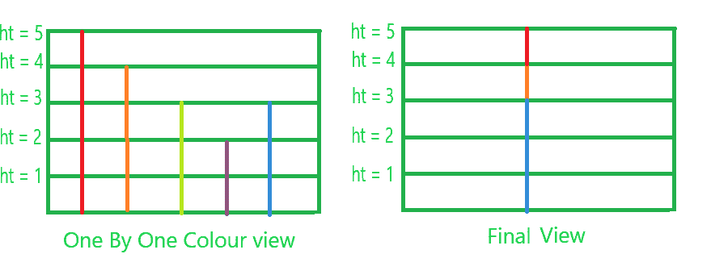

# 从右开始颜色明显增加的建筑数量

> 原文:[https://www . geeksforgeeks . org/从右至右严格递增的建筑物数量-不同颜色/](https://www.geeksforgeeks.org/number-of-strictly-increasing-buildings-from-right-with-distinct-colors/)

给定一个整数和两个大小为的整数数组 **H[]** 和 **C[]** ，其中 **H[]** 存储连续建筑物的高度， **C[]** 存储这些建筑物的颜色代码。
任务是确定从右侧(即最右侧建筑的右侧)的视图中一次可以看到多少种颜色。
**举例:**

> **输入:** K = 5，H[] = {5，4，3，2，3}，C[] = {1，2，3，4，5}
> **输出:** 3
> 
> 
> 
> **输入:** K = 5，H[] = {1，2，3，4，5}，C[] = {3，3，3，3，3}
> **输出:** 1

**方法:**仔细观察，上面的问题可以简化为寻找颜色鲜明的从右开始严格递增的建筑数量。

1.  将高度数组的最后一个元素存储在 *max* 变量中。
2.  现在在一个数组 *Arr* 中，对应于颜色数组存储 *1* 最后一个元素的位置。
3.  现在开始从 *n-2 到 0* 遍历高度数组。
4.  如果我们得到大于 *max* 的元素，那么将该变量存储在 *max* 中，并再次存储在数组 *Arr* 中，位置对应于颜色数组存储 *1* 中的*和*元素。

5.  最后数一数*阵中*1*的数量。它给出了从末端可见的颜色总数。*

以下是上述方法的实现:

## C++

```
// C++ implementation of above approach

#include <bits/stdc++.h>
using namespace std;

// Function to return the number of
// colors visible
int colourVisible(int height[], int colour[], int K)
{
    int arr[K + 1] = { 0 }, visible = 0;

    int max = height[K - 1];
    arr[colour[K - 1]] = 1;

    for (int i = K - 2; i >= 0; i--) {
        if (height[i] > max) {
            max = height[i];
            arr[colour[i]] = 1;
        }
    }

    // Count the Number of 1's
    for (int i = 1; i <= K; i++) {
        if (arr[i] == 1)
            visible++;
    }

    return visible;
}

// Driver code
int main()
{
    int height[] = { 3, 5, 1, 2, 3 };
    int colour[] = { 1, 2, 3, 4, 3 };
    int K = sizeof(colour) / sizeof(colour[0]);

    cout << colourVisible(height, colour, K);

    return 0;
}
```

## Java 语言(一种计算机语言，尤用于创建网站)

```
//Java  implementation of above approach

import java.io.*;

class GFG {
    // Function to return the number of
// colors visible
static int colourVisible(int height[], int colour[], int K)
{
    int arr[]=new int[K + 1] ;
    int visible = 0;

    int max = height[K - 1];
    arr[colour[K - 1]] = 1;

    for (int i = K - 2; i >= 0; i--) {
        if (height[i] > max) {
            max = height[i];
            arr[colour[i]] = 1;
        }
    }

    // Count the Number of 1's
    for (int i = 1; i <= K; i++) {
        if (arr[i] == 1)
            visible++;
    }

    return visible;
}

// Driver code

    public static void main (String[] args) {

    int height[] = { 3, 5, 1, 2, 3 };
    int colour[] = { 1, 2, 3, 4, 3 };
    int K = colour.length;

    System.out.println (colourVisible(height, colour, K));
    }
}
```

## 蟒蛇 3

```
# Python3 implementation of above approach

# Function to return the number of
# colors visible
def colourVisible(height, colour, K):
    arr = [0 for i in range(K + 1)]
    visible = 0

    max = height[K - 1]
    arr[colour[K - 1]] = 1

    i = K - 2
    while(i >= 0):
        if (height[i] > max):
            max = height[i]
            arr[colour[i]] = 1
        i -= 1

    # Count the Number of 1 complement
    for i in range(1, K + 1, 1):
            if (arr[i] == 1):
                visible += 1

    return visible

# Driver code
if __name__ == '__main__':
    height = [3, 5, 1, 2, 3]
    colour = [1, 2, 3, 4, 3]
    K = len(colour)

    print(colourVisible(height, colour, K))

# This code is contributed by
# Surendra_Gangwar
```

## C#

```
// C# implementation of above approach
using System;

class GFG
{
// Function to return the number of
// colors visible
static int colourVisible(int []height,
                         int []colour, int K)
{
    int []arr=new int[K + 1] ;
    int visible = 0;

    int max = height[K - 1];
    arr[colour[K - 1]] = 1;

    for (int i = K - 2; i >= 0; i--)
    {
        if (height[i] > max)
        {
            max = height[i];
            arr[colour[i]] = 1;
        }
    }

    // Count the Number of 1's
    for (int i = 1; i <= K; i++)
    {
        if (arr[i] == 1)
            visible++;
    }

    return visible;
}

// Driver code
static public void Main ()
{
    int []height = { 3, 5, 1, 2, 3 };
    int []colour = { 1, 2, 3, 4, 3 };
    int K = colour.Length;

    Console.WriteLine(colourVisible(height, colour, K));
}
}

// This code is contributed by Sach_Code
```

## 服务器端编程语言（Professional Hypertext Preprocessor 的缩写）

```
<?php
// PHP implementation of above approach

// Function to return the number of
// colors visible
function colourVisible($height, $colour, $K)
{
    $arr = array_fill(0, $K + 1, 0);
    $visible = 0;

    $max = $height[$K - 1];
    $arr[$colour[$K - 1]] = 1;

    for ($i = $K - 2; $i >= 0; $i--)
    {
        if ($height[$i] > $max)
        {
            $max = $height[$i];
            $arr[$colour[$i]] = 1;
        }
    }

    // Count the Number of 1's
    for ($i = 1; $i <= $K; $i++)
    {
        if ($arr[$i] == 1)
            $visible++;
    }

    return $visible;
}

// Driver code
$height = array( 3, 5, 1, 2, 3 );
$colour = array( 1, 2, 3, 4, 3 );
$K = count($colour);

echo colourVisible($height, $colour, $K);

// This code is contributed by mits
?>
```

## java 描述语言

```
<script>

// Javascript implementation of above approach

// Function to return the number of
// colors visible
function colourVisible(height, colour, K)
{
    var arr = Array(K+1).fill(0), visible = 0;

    var max = height[K - 1];
    arr[colour[K - 1]] = 1;

    for (var i = K - 2; i >= 0; i--) {
        if (height[i] > max) {
            max = height[i];
            arr[colour[i]] = 1;
        }
    }

    // Count the Number of 1's
    for (var i = 1; i <= K; i++) {
        if (arr[i] == 1)
            visible++;
    }

    return visible;
}

// Driver code
var height = [ 3, 5, 1, 2, 3 ];
var colour = [ 1, 2, 3, 4, 3 ];
var K = colour.length;
document.write( colourVisible(height, colour, K));

</script>
```

**Output:** 

```
2
```