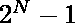
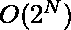
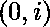
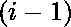

# 奇数和偶数的子序列数

> 原文:[https://www . geeksforgeeks . org/带奇偶和的子序列数/](https://www.geeksforgeeks.org/number-of-subsequences-with-even-and-odd-sum/)

给定一个数组，求和为偶数的子序列数和和为奇数的子序列数。

**示例:**

> **输入:** arr[] = {1，2，2，3}
> **输出:** EvenSum = 7，OddSum = 8
> 有个可能的子序列。
> 偶和的子序列是
> 1) {1，3} Sum = 4
> 2) {1，2，2，3} Sum = 8
> 3) {1，2，3} Sum = 6(索引 1 的)
> 4) {1，2，3} Sum = 6(索引 2 的)
> 5) {2} Sum = 2(索引 1 的)
> 6) {2，2} Sum = 4
> 7) {2} Sum =
> 
> **输入：** 疤痕[] = { 2， 2， 2， 2 }
> **输出：** 偶数 = 15， 奇数 = 0

**天真方法** :
一个简单的方法是递归生成所有可能的子序列，用偶数和计数子序列的数量，然后从总子序列中减去，这个数量将是奇数子序列。这种方法的时间复杂度将是。

**更好的方法** :
更好的方法是使用 [**动态编程**](https://www.geeksforgeeks.org/dynamic-programming/) 。

*   当我们遍历数组时，我们会计算偶数子序列的计数。我们创建了两个数组 countODD[N]和 count everyn[N]，其中 countODD[i]表示范围内奇数和的子序列数，count everyn[I]表示范围内偶数和的子序列数
*   如果我们在位置 I，并且数是*奇数*，那么具有偶数和的子序列的总数将是
    *   对于**count every[I]**，第 I 个数字不与任何其他子序列配对(即直到位置的偶数子序列) **+** 第 I 个数字与所有其他奇数子序列配对，直到位置(奇数+奇数=偶数)
    *   对于 **countODD[i]** ，第 I 个数字不与任何其他子序列配对(即奇数子序列直到位置) **+** 第 I 个数字与所有其他偶数子序列配对直到位置(奇数+偶数=奇数) **+** 一个只有 1 个元素的子序列，即第 I 个数字本身
*   如果我们在位置 I，并且数是*偶数*，那么具有偶数和的子序列的总数将是
    *   对于 **countEVEN[i]** ，第 I 个数不与任何其他子序列配对(即直到位置的偶数子序列) **+** 第 I 个数与所有其他偶数子序列配对，直到位置(偶数+偶数=偶数) **+** 一个只有 1 个元素的子序列，即第 I 个数本身
    *   对于**count odd【I】**，第 I 个数不与任何其他子序列配对(即奇数子序列直到位置) **+** 第 I 个数与所有其他奇数子序列配对直到位置(偶数+奇数=奇数)

下面是上述方法的实现:

## C++

```
// C++ implementation
#include <bits/stdc++.h>
using namespace std;

// returns the count of odd and
// even subsequences
pair<int, int> countSum(int arr[], int n)
{
    int result = 0;

    // Arrays to store the count of even
    // subsequences and odd subsequences
    int countODD[n + 1], countEVEN[n + 1];

    // Initialising countEVEN[0] and countODD[0] to 0
    // since as there is no subsequence before the
    // iteration with even or odd count.
    countODD[0] = 0;
    countEVEN[0] = 0;

    // Find sum of all subsequences with even count
    // and odd count storing them as we iterate.

    // Here countEVEN[i] denotes count of
    // even subsequences till i

    // Here countODD[i] denotes count of
    // odd subsequences till i

    for (int i = 1; i <= n; i++) {

        // if the number is even
        if (arr[i - 1] % 2 == 0) {
            countEVEN[i] = countEVEN[i - 1]
                           + countEVEN[i - 1] + 1;

            countODD[i] = countODD[i - 1]
                          + countODD[i - 1];
        }
        // if the number is odd
        else {
            countEVEN[i] = countEVEN[i - 1]
                           + countODD[i - 1];

            countODD[i] = countODD[i - 1]
                          + countEVEN[i - 1] + 1;
        }
    }

    return { countEVEN[n], countODD[n] };
}

// Driver code
int main()
{
    int arr[] = { 1, 2, 2, 3 };
    int n = sizeof(arr) / sizeof(arr[0]);

    // Calling the function

    pair<int, int> ans = countSum(arr, n);

    cout << "EvenSum = " << ans.first;
    cout << " OddSum = " << ans.second;

    return 0;
}
```

## Java 语言(一种计算机语言，尤用于创建网站)

```
// Java implementation to find the number
// of Subsequences with Even and Odd Sum
import java.util.*;
import java.lang.*;

class GFG
{
    public static int[] countSum(int arr[], int n)
    {
        int result = 0;

        // Arrays to store the count of even
        // subsequences and odd subsequences
        int[] countODD = new int[n + 1];
        int[] countEVEN = new int[n + 1];

        // Initialising countEVEN[0] and countODD[0] to 0
        // since as there is no subsequence before the
        // iteration with even or odd count.
        countODD[0] = 0;
        countEVEN[0] = 0;

        // Find sum of all subsequences with even count
        // and odd count storing them as we iterate.

        // Here countEVEN[i] denotes count of
        // even subsequences till i

        // Here countODD[i] denotes count of
        // odd subsequences till i
        for (int i = 1; i <= n; i++)
        {

            // if the number is even
            if (arr[i - 1] % 2 == 0)
            {
                countEVEN[i] = countEVEN[i - 1] +
                               countEVEN[i - 1] + 1;

                countODD[i] = countODD[i - 1] +
                              countODD[i - 1];
            }

            // if the number is odd
            else
            {
                countEVEN[i] = countEVEN[i - 1] +
                               countODD[i - 1];

                countODD[i] = countODD[i - 1] +
                              countEVEN[i - 1] + 1;
            }
        }

        int[] ans = new int[2];
        ans[0] = countEVEN[n];
        ans[1] = countODD[n];
        return ans;
    }

    // Driver Code
    public static void main (String[] args)
    {
        int[] arr = new int[]{ 1, 2, 2, 3 };
        int n = 4;
        int[] ans = countSum(arr, n);
        System.out.println("EvenSum = " + ans[0]);
        System.out.println("OddSum = " + ans[1]);
    }
}

// This code is contributed by Shivam Sharma
```

## 蟒蛇 3

```
# Python3 implementation of above approach

# Returns the count of odd and
# even subsequences
def countSum(arr, n):

    result = 0

    # Variables to store the count of even
    # subsequences and odd subsequences

    # Initialising count_even and count_odd to 0
    # since as there is no subsequence before the
    # iteration with even or odd count.
    count_odd = 0
    count_even = 0

    # Find sum of all subsequences with even count
    # and odd count and storing them as we iterate.

    for i in range(n):

        # if the number is even
        if arr[i - 1] % 2 == 0:
            count_even = count_even + count_even + 1
            count_odd = count_odd + count_odd

        # if the number is odd
        else:
            temp = count_even
            count_even = count_even + count_odd
            count_odd = count_odd + temp + 1

    return [count_even, count_odd]

# Driver code
arr = [ 1, 2, 2, 3 ]
n = len(arr)

# Calling the function
ans = countSum(arr, n)

print('EvenSum =', ans[0],
      'OddSum =', ans[1])

# This code is contributed
# by Saurabh_shukla
```

## C#

```
// C# implementation to find the number
// of Subsequences with Even and Odd Sum
using System;
class GFG
{
    public static int[] countSum(int []arr, int n)
    {

        // Arrays to store the count of even
        // subsequences and odd subsequences
        int[] countODD = new int[n + 1];
        int[] countEVEN = new int[n + 1];

        // Initialising countEVEN[0] and countODD[0] to 0
        // since as there is no subsequence before the
        // iteration with even or odd count.
        countODD[0] = 0;
        countEVEN[0] = 0;

        // Find sum of all subsequences with even count
        // and odd count storing them as we iterate.

        // Here countEVEN[i] denotes count of
        // even subsequences till i

        // Here countODD[i] denotes count of
        // odd subsequences till i
        for (int i = 1; i <= n; i++)
        {

            // if the number is even
            if (arr[i - 1] % 2 == 0)
            {
                countEVEN[i] = countEVEN[i - 1] +
                               countEVEN[i - 1] + 1;

                countODD[i] = countODD[i - 1] +
                              countODD[i - 1];
            }

            // if the number is odd
            else
            {
                countEVEN[i] = countEVEN[i - 1] +
                               countODD[i - 1];

                countODD[i] = countODD[i - 1] +
                              countEVEN[i - 1] + 1;
            }
        }

        int[] ans = new int[2];
        ans[0] = countEVEN[n];
        ans[1] = countODD[n];
        return ans;
    }

    // Driver Code
    public static void Main (String[] args)
    {
        int[] arr = new int[]{ 1, 2, 2, 3 };
        int n = 4;
        int[] ans = countSum(arr, n);
        Console.WriteLine("EvenSum = " + ans[0]);
        Console.WriteLine("OddSum = " + ans[1]);
    }
}

// This code is contributed by Rajput-Ji
```

## java 描述语言

```
<script>

// JavaScript implementation to find the number
// of Subsequences with Even and Odd Sum
function countSum(arr, n)
{
    // Arrays to store the count of even
    // subsequences and odd subsequences
    var countODD = Array(n+1).fill(0);
    var countEVEN = Array(n+1).fill(0);

    // Initialising countEVEN[0] and countODD[0] to 0
    // since as there is no subsequence before the
    // iteration with even or odd count.
    countODD[0] = 0;
    countEVEN[0] = 0;

    // Find sum of all subsequences with even count
    // and odd count storing them as we iterate.

    // Here countEVEN[i] denotes count of
    // even subsequences till i

    // Here countODD[i] denotes count of
    // odd subsequences till i
    for (var i = 1; i <= n; i++)
    {
        // if the number is even
        if (arr[i - 1] % 2 == 0)
        {
            countEVEN[i] = countEVEN[i - 1] +
                           countEVEN[i - 1] + 1;

            countODD[i] = countODD[i - 1] +
                          countODD[i - 1];
        }

        // if the number is odd
        else
        {
            countEVEN[i] = countEVEN[i - 1] +
                           countODD[i - 1];

            countODD[i] = countODD[i - 1] +
                          countEVEN[i - 1] + 1;
        }
    }

    var ans = [0,0];
    ans[0] = countEVEN[n];
    ans[1] = countODD[n];
    return ans;
}
// Driver Code
var arr = [ 1, 2, 2, 3 ];
var n = 4;
var ans = countSum(arr, n);
document.write("EvenSum = " + ans[0]);
document.write(" OddSum = " + ans[1]);

</script>
```

**Output:** 

```
EvenSum = 7 OddSum = 8
```

**时间复杂度:O(N)** 。
**空间复杂度:O(N)** 其中 N 是数组中元素的个数。

**高效的方法** :
我们不需要制作 count 偶数[N]和 count 奇数[N]数组，我们只需要 count _ 偶数变量和 count _ 奇数变量，并像前面一样进行更改。
以下是上述方法的实施:

## C++

```
// C++ implementation
#include <bits/stdc++.h>
using namespace std;

// Returns the count of odd and
// even subsequences
pair<int, int> countSum(int arr[], int n)
{
    int result = 0;

    // Variables to store the count of even
    // subsequences and odd subsequences
    int count_odd, count_even;

    // Initialising count_even and count_odd to 0
    // since as there is no subsequence before the
    // iteration with even or odd count.
    count_odd = 0;
    count_even = 0;

    // Find sum of all subsequences with even count
    // and odd count and storing them as we iterate.

    for (int i = 1; i <= n; i++) {

        // if the number is even
        if (arr[i - 1] % 2 == 0) {
            count_even = count_even + count_even + 1;
            count_odd = count_odd + count_odd;
        }

        // if the number is odd
        else {
            int temp = count_even;
            count_even = count_even + count_odd;
            count_odd = count_odd + temp + 1;
        }
    }

    return { count_even, count_odd };
}

// Driver code
int main()
{
    int arr[] = { 1, 2, 2, 3 };
    int n = sizeof(arr) / sizeof(arr[0]);

    // Calling the function

    pair<int, int> ans = countSum(arr, n);

    cout << "EvenSum = " << ans.first;
    cout << " OddSum = " << ans.second;

    return 0;
}
```

## Java 语言(一种计算机语言，尤用于创建网站)

```
// Java program to get minimum cost to sort
// strings by reversal operation
class GFG
{

static class pair
{
    int first, second;
    public pair(int first, int second)
    {
        this.first = first;
        this.second = second;
    }
}

// Returns the count of odd and
// even subsequences
static pair countSum(int arr[], int n)
{
    int result = 0;

    // Variables to store the count of even
    // subsequences and odd subsequences
    int count_odd, count_even;

    // Initialising count_even and count_odd to 0
    // since as there is no subsequence before the
    // iteration with even or odd count.
    count_odd = 0;
    count_even = 0;

    // Find sum of all subsequences with even count
    // and odd count and storing them as we iterate.
    for (int i = 1; i <= n; i++)
    {

        // if the number is even
        if (arr[i - 1] % 2 == 0)
        {
            count_even = count_even + count_even + 1;
            count_odd = count_odd + count_odd;
        }

        // if the number is odd
        else
        {
            int temp = count_even;
            count_even = count_even + count_odd;
            count_odd = count_odd + temp + 1;
        }
    }
    return new pair(count_even, count_odd );
}

// Driver code
public static void main(String[] args)
{
    int arr[] = { 1, 2, 2, 3 };
    int n = arr.length;

    // Calling the function

    pair ans = countSum(arr, n);

    System.out.print("EvenSum = " + ans.first);
    System.out.print(" OddSum = " + ans.second);
}
}

// This code is contributed by 29AjayKumar
```

## 蟒蛇 3

```
# Python3 implementation of above approach

# Returns the count of odd and
# even subsequences
def countSum(arr, n):
    result = 0

    # Variables to store the count of even
    # subsequences and odd subsequences
    # Initialising count_even and count_odd to 0
    # since as there is no subsequence before the
    # iteration with even or odd count.
    count_odd = 0
    count_even = 0

    # Find sum of all subsequences with even count
    # and odd count and storing them as we iterate.

    for i in range(1, n + 1):

        # if the number is even
        if (arr[i - 1] % 2 == 0):
            count_even = count_even + count_even + 1
            count_odd = count_odd + count_odd

        # if the number is odd
        else:
            temp = count_even
            count_even = count_even + count_odd
            count_odd = count_odd + temp + 1

    return (count_even, count_odd)

# Driver code
arr = [1, 2, 2, 3];
n = len(arr)

# Calling the function
count_even, count_odd = countSum(arr, n);

print("EvenSum = ", count_even,
      " OddSum = ", count_odd)

# This code is contributed
# by ANKITKUMAR34
```

## C#

```
// C# program to get minimum cost to sort
// strings by reversal operation
using System;

class GFG
{

public class pair
{
    public int first, second;
    public pair(int first, int second)
    {
        this.first = first;
        this.second = second;
    }
}

// Returns the count of odd and
// even subsequences
static pair countSum(int []arr, int n)
{
    // Variables to store the count of even
    // subsequences and odd subsequences
    int count_odd, count_even;

    // Initialising count_even and count_odd to 0
    // since as there is no subsequence before the
    // iteration with even or odd count.
    count_odd = 0;
    count_even = 0;

    // Find sum of all subsequences with even count
    // and odd count and storing them as we iterate.
    for (int i = 1; i <= n; i++)
    {

        // if the number is even
        if (arr[i - 1] % 2 == 0)
        {
            count_even = count_even + count_even + 1;
            count_odd = count_odd + count_odd;
        }

        // if the number is odd
        else
        {
            int temp = count_even;
            count_even = count_even + count_odd;
            count_odd = count_odd + temp + 1;
        }
    }
    return new pair(count_even, count_odd );
}

// Driver code
public static void Main(String[] args)
{
    int []arr = { 1, 2, 2, 3 };
    int n = arr.Length;

    // Calling the function

    pair ans = countSum(arr, n);

    Console.Write("EvenSum = " + ans.first);
    Console.Write(" OddSum = " + ans.second);
}
}

// This code is contributed by PrinciRaj1992
```

## java 描述语言

```
<script>

// Java program to get minimum cost to sort
// strings by reversal operation
var first, second;
function pair( first,  second)
{
    this.first = first;
    this.second = second;
}

// Returns the count of odd and
// even subsequences
function countSum(arr, n)
{
    var result = 0;

    // Variables to store the count of even
    // subsequences and odd subsequences
    var count_odd, count_even;

    // Initialising count_even and count_odd to 0
    // since as there is no subsequence before the
    // iteration with even or odd count.
    count_odd = 0;
    count_even = 0;

    // Find sum of all subsequences with even count
    // and odd count and storing them as we iterate.
    for (var i = 1; i <= n; i++)
    {

        // if the number is even
        if (arr[i - 1] % 2 == 0)
        {
            count_even = count_even + count_even + 1;
            count_odd = count_odd + count_odd;
        }

        // if the number is odd
        else
        {
            var temp = count_even;
            count_even = count_even + count_odd;
            count_odd = count_odd + temp + 1;
        }
    }
    return new pair(count_even, count_odd );
}

// Driver code
var arr = [ 1, 2, 2, 3 ];
var n = arr.length;

// Calling the function

var ans = countSum(arr, n);

document.write("EvenSum = " + ans.first);
document.write(" OddSum = " + ans.second);

// This code is contributed by shivanisinghss2110

</script>
```

**Output:** 

```
EvenSum = 7 OddSum = 8
```

**时间复杂度:O(N)** 。
**空间复杂度:O(1)** ，其中 N 为数组中的元素个数。