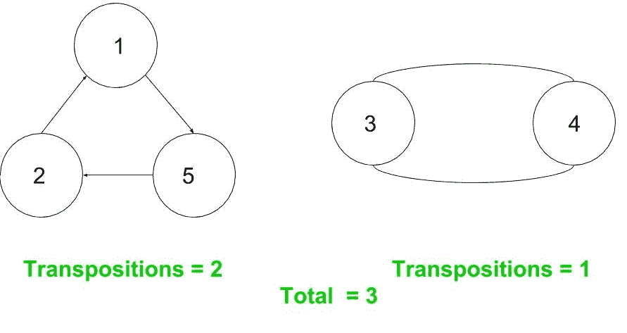

# 置换中的置换数

> 原文:[https://www . geeksforgeeks . org/置换置换数/](https://www.geeksforgeeks.org/number-of-transpositions-in-a-permutation/)

**排列**排列是元素的排列。n 个元素的排列可以用数字 1，2，…n 以某种顺序排列来表示。五，一，四，二，三。
**循环记数法**一个排列可以表示为排列循环的组合。置换循环是置换中相互交换位置的一组元素。
例如

> P = { 5，1，4，2，3 }:
> 这里，5 去 1，1 去 2，依此类推(根据它们的指数位置):
> 5->1
> 1->2
> 2->4
> 4->3
> 3->5
> 因此可以表示为单个循环:(5，1，2，4，3)。
> 现在考虑排列:{5，1，4，3，2}。这里
> 5->1
> 1->2
> 2->5 这就结束了一个循环。
> 另一个循环是
> 4 - > 3
> 3 - > 4
> 在循环符号中，它将表示为(5，1，2) (4，3)。

**换位**
现在所有的循环都可以分解成 2 个循环的组合(换位)。置换中置换的数量很重要，因为它给出了从单位排列中获得这种特殊排列所需的 2 个元素交换的最小数量:1，2，3，… n。这 2 个循环的数量的奇偶性表示置换是偶数还是奇数。
例如

> 循环(5，1，2，4，3)可以写成(5，3)(5，4)(5，2)(5，1)。4 个换位(偶数)。
> 同样，
> (5，1，2) - > (5，2)(5，1)
> (5，1，2)(4，3) - > (5，2)(5，1)(4，3)。3 个换位(奇数)。
> 从例子中可以清楚地看出，**一个循环的换位次数=循环长度–1。**

**问题**
给定 n 个数字的排列 P <sub>1</sub> ，P <sub>2</sub> ，P <sub>3</sub> ，… P <sub>n</sub> 。计算其中的换位数。
示例:

```
Input: 5 1 4 3 2
Output: 3 
```

**逼近**:置换可以很容易地表示为有向图，其中连通分支的个数给出了循环的个数。并且(每个组件的大小–1)给出了该循环的置换数。
**示例排列** : {5，1，4，3，2} - > (5，1，2)(4，3)



下面是上述方法的实现。

## C++

```
// CPP Program to find the number of
// transpositions in a permutation
#include <bits/stdc++.h>
using namespace std;

#define N 1000001

int visited[N];

// This array stores which element goes to which position
int goesTo[N];

// For eg. in { 5, 1, 4, 3, 2 }
// goesTo[1] = 2
// goesTo[2] = 5
// goesTo[3] = 4
// goesTo[4] = 3
// goesTo[5] = 1

// This function returns the size of a component cycle
int dfs(int i)
{
    // If it is already visited
    if (visited[i] == 1)
        return 0;

    visited[i] = 1;
    int x = dfs(goesTo[i]);
    return (x + 1);
}

// This functio returns the number
// of transpositions in the permutation
int noOfTranspositions(int P[], int n)
{
    // Initializing visited[] array
    for (int i = 1; i <= n; i++)
        visited[i] = 0;

    // building the goesTo[] array
    for (int i = 0; i < n; i++)
        goesTo[P[i]] = i + 1;

    int transpositions = 0;

    for (int i = 1; i <= n; i++) {
        if (visited[i] == 0) {
            int ans = dfs(i);
            transpositions += ans - 1;
        }
    }
    return transpositions;
}

// Driver Code
int main()
{
    int permutation[] = { 5, 1, 4, 3, 2 };
    int n = sizeof(permutation) / sizeof(permutation[0]);

    cout << noOfTranspositions(permutation, n);
    return 0;
}
```

## Java 语言(一种计算机语言，尤用于创建网站)

```
// Java Program to find the number of
// transpositions in a permutation
import java.io.*;

class GFG {

    static int N = 1000001;

    static int visited[] = new int[N];

    // This array stores which element
    // goes to which position
    static int goesTo[]= new int[N];

    // For eg. in { 5, 1, 4, 3, 2 }
    // goesTo[1] = 2
    // goesTo[2] = 5
    // goesTo[3] = 4
    // goesTo[4] = 3
    // goesTo[5] = 1

    // This function returns the size
    // of a component cycle
    static int dfs(int i)
    {

        // If it is already visited
        if (visited[i] == 1)
            return 0;

        visited[i] = 1;
        int x = dfs(goesTo[i]);
        return (x + 1);
    }

    // This functio returns the number
    // of transpositions in the
    // permutation
    static int noOfTranspositions(int P[],
                                    int n)
    {
        // Initializing visited[] array
        for (int i = 1; i <= n; i++)
            visited[i] = 0;

        // building the goesTo[] array
        for (int i = 0; i < n; i++)
            goesTo[P[i]] = i + 1;

        int transpositions = 0;

        for (int i = 1; i <= n; i++) {
            if (visited[i] == 0) {
                int ans = dfs(i);
                transpositions += ans - 1;
            }
        }
        return transpositions;
    }

    // Driver Code
    public static void main (String[] args)
    {
        int permutation[] = { 5, 1, 4, 3, 2 };
        int n = permutation.length ;

        System.out.println(
           noOfTranspositions(permutation, n));
    }
}

// This code is contributed by anuj_67.
```

## 蟒蛇 3

```
# Python Program to find the number of
# transpositions in a permutation
N = 1000001

visited = [0] * N;

# This array stores which element goes to which position
goesTo = [0] * N;

# For eg. in { 5, 1, 4, 3, 2 }
# goesTo[1] = 2
# goesTo[2] = 5
# goesTo[3] = 4
# goesTo[4] = 3
# goesTo[5] = 1

# This function returns the size of a component cycle
def dfs(i) :

    # If it is already visited
    if (visited[i] == 1) :
        return 0;

    visited[i] = 1;
    x = dfs(goesTo[i]);
    return (x + 1);

# This functio returns the number
# of transpositions in the permutation
def noOfTranspositions(P, n) :

    # Initializing visited[] array
    for i in range(1, n + 1) :
        visited[i] = 0;

    # building the goesTo[] array
    for i in range(n) :
        goesTo[P[i]] = i + 1;

    transpositions = 0;

    for i in range(1, n + 1) :
        if (visited[i] == 0) :
            ans = dfs(i);
            transpositions += ans - 1;

    return transpositions;

# Driver Code
if __name__ == "__main__" :

    permutation = [ 5, 1, 4, 3, 2 ];
    n = len(permutation);

    print(noOfTranspositions(permutation, n));

# This code is contributed by AnkitRai01
```

## C#

```
// C# Program to find the number of
// transpositions in a permutation
using System;

class GFG {

    static int N = 1000001;

    static int []visited = new int[N];

    // This array stores which element
    // goes to which position
    static int []goesTo= new int[N];

    // For eg. in { 5, 1, 4, 3, 2 }
    // goesTo[1] = 2
    // goesTo[2] = 5
    // goesTo[3] = 4
    // goesTo[4] = 3
    // goesTo[5] = 1

    // This function returns the size
    // of a component cycle
    static int dfs(int i)
    {

        // If it is already visited
        if (visited[i] == 1)
            return 0;

        visited[i] = 1;
        int x = dfs(goesTo[i]);
        return (x + 1);
    }

    // This functio returns the number
    // of transpositions in the
    // permutation
    static int noOfTranspositions(int []P,
                                    int n)
    {
        // Initializing visited[] array
        for (int i = 1; i <= n; i++)
            visited[i] = 0;

        // building the goesTo[] array
        for (int i = 0; i < n; i++)
            goesTo[P[i]] = i + 1;

        int transpositions = 0;

        for (int i = 1; i <= n; i++) {
            if (visited[i] == 0) {
                int ans = dfs(i);
                transpositions += ans - 1;
            }
        }
        return transpositions;
    }

    // Driver Code
    public static void Main ()
    {
        int []permutation = { 5, 1, 4, 3, 2 };
        int n = permutation.Length ;

        Console.WriteLine(
        noOfTranspositions(permutation, n));
    }
}

// This code is contributed by anuj_67.
```

## java 描述语言

```
<script>

// Javascript Program to find the number of
// transpositions in a permutation

let N = 1000001
var visited = new Array(N);

// This array stores which element goes to which position
var goesTo = new Array(N);

// For eg. in { 5, 1, 4, 3, 2 }
// goesTo[1] = 2
// goesTo[2] = 5
// goesTo[3] = 4
// goesTo[4] = 3
// goesTo[5] = 1

// This function returns the size of a component cycle
function dfs( i)
{
    // If it is already visited
    if (visited[i] == 1)
        return 0;

    visited[i] = 1;
    let x = dfs(goesTo[i]);
    return (x + 1);
}

// This functio returns the number
// of transpositions in the permutation
function noOfTranspositions( P, n)
{
    // Initializing visited[] array
    for (let i = 1; i <= n; i++)
        visited[i] = 0;

    // building the goesTo[] array
    for (let i = 0; i < n; i++)
        goesTo[P[i]] = i + 1;

    let transpositions = 0;

    for (let i = 1; i <= n; i++) {
        if (visited[i] == 0) {
            let ans = dfs(i);
            transpositions += ans - 1;
        }
    }
    return transpositions;
}

// Driver Code

let permutation = [ 5, 1, 4, 3, 2 ];
let n = permutation.length;

document.write(noOfTranspositions(permutation, n));

</script>
```

**输出:**

```
3
```

**时间复杂度:**O(n)
T3】辅助空间: O(n)