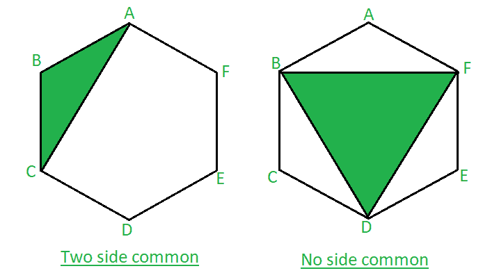

# 有两条公共边和没有公共边的 n 边多边形的顶点连接而成的三角形数

> 原文:[https://www . geeksforgeeks . org/由 n 边多边形的顶点连接而成的三角形数量，该多边形有两条公共边和没有公共边/](https://www.geeksforgeeks.org/number-of-triangles-formed-by-joining-vertices-of-n-sided-polygon-with-two-common-sides-and-no-common-sides/)

给定 **N** 条边的多边形，我们需要找到由给定多边形的顶点连接而成的三角形的总数，其中恰好有两条边是公共的，没有一条边是公共的。
**例:**

> **输入:** N = 6
> **输出:** 6 2
> 下图是通过连接顶点在六边形内形成的三角形，如上图所示。
> 形成的三角形有两条边(AB 和 BC)与多边形的边相同。同理 BC 和
> CD 可以组成一个三角形。有了这个，我们可以说总共有 6 个三角形可能
> 有两个与多边形相同的边。六边形的第二个图像，
> 三角形没有与多边形相同的边。
> 可能只有 2 个三角形，BFD 和 ACE。
> 
> 
> 
> 六边形有两个公共边和没有公共边的三角形
> 
> 形成的三角形数量分别为 6 个和 2 个，两个边公共，没有边公共。
> **输入:** N = 7
> **输出:**7

**进场:**

*   为了使一个三角形的两条边与一个多边形共用，我们将取一个 n 边多边形的任意一条边，取所选边的一个顶点，并与另一个顶点的顶点相邻的边连接。
*   穿过每个顶点并与另一个顶点的顶点相邻的边邻接，将会有 **N** 个具有两条公共边的三角形。
*   现在，为了计算没有公共边的三角形的数量，从一个多边形中可能的三角形的总数中减去一个公共边的三角形的总数和两个公共边的三角形的总数。
*   没有公共边的三角形=三角形总数(<sup>n</sup>C<sub>3</sub>)–一侧公共三角形(n *(n–4)–两侧公共三角形(n)。
*   因此，与多边形没有公共边的三角形的数量将等于 n *(n–4)*(n–5)/6。

**注意:**要计算与多边形有一条公共边的三角形的数量，请单击此处的
以下是上述方法的实现:

## C++

```
// C++ program to implement
// the above problem
#include <bits/stdc++.h>
using namespace std;

// Function to find the number of triangles
void findTriangles(int n)
{
    int num = n;

    // print the number of triangles
    // having two side common
    cout << num << " ";

    // print the number of triangles
    // having no side common
    cout << num * (num - 4) * (num - 5) / 6;
}

// Driver code
int main()
{
    // initialize the number
    // of sides of a polygon
    int n;
    n = 6;

    findTriangles(n);

    return 0;
}
```

## Java 语言(一种计算机语言，尤用于创建网站)

```
// Java program to implement
// the above problem
import java.io.*;

class GFG
{

// Function to find the number of triangles
static void findTriangles(int n)
{
    int num = n;

    // print the number of triangles
    // having two side common
    System.out.print( num + " ");

    // print the number of triangles
    // having no side common
    System.out.print( num * (num - 4) * (num - 5) / 6);
}

// Driver code
public static void main (String[] args)
{
    // initialize the number
    // of sides of a polygon
    int n;
    n = 6;

    findTriangles(n);
}
}

// This code is contributed by anuj_67..
```

## 蟒蛇 3

```
# Python3 program to implement
# the above problem

# Function to find the number of triangles
def findTriangles(n):
    num = n

    # print the number of triangles
    # having two side common
    print(num, end = " ")

    # print the number of triangles
    # having no side common
    print(num * (num - 4) * (num - 5) // 6)

# Driver code

# initialize the number
# of sides of a polygon
n = 6;

findTriangles(n)

# This code is contributed by Mohit Kumar
```

## C#

```
// C# program to implement
// the above problem
using System;

class GFG
{

// Function to find the number of triangles
static void findTriangles(int n)
{
    int num = n;

    // print the number of triangles
    // having two side common
    Console.Write( num + " ");

    // print the number of triangles
    // having no side common
    Console.WriteLine( num * (num - 4) * (num - 5) / 6);
}

// Driver code
public static void Main ()
{
    // initialize the number
    // of sides of a polygon
    int n;
    n = 6;

    findTriangles(n);
}
}

// This code is contributed by anuj_67..
```

## java 描述语言

```
<script>

// javascript program to implement
// the above problem

// Function to find the number of triangles

function findTriangles(n)
{
    var num = n;

    // print the number of triangles
    // having two side common
    document.write( num + " ");

    // print the number of triangles
    // having no side common
    document.write( num * (num - 4) * (num - 5) / 6);
}

// Driver code
// initialize the number
// of sides of a polygon
var n;
n = 6;

findTriangles(n);

// This code is contributed by 29AjayKumar

</script>
```

**Output:** 

```
6 2
```

**时间复杂度:** O(1)