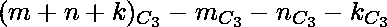

# 由三条线上的一组点形成的三角形数量

> 原文:[https://www . geeksforgeeks . org/从三线一组点形成的三角形数量/](https://www.geeksforgeeks.org/number-of-triangles-formed-from-a-set-of-points-on-three-lines/)

给定三个整数 *m、n 和 k* ，分别存储 l1、l2 和 l3 线上不相交的点数。任务是找出可能由这组点形成的三角形的数量。
**例:**

```
Input: m = 3, n =  4, k = 5 
Output: 205

Input: m = 2, n =  2, k = 1 
Output: 10
```

**进场:**

*   点的总数是(m + n + k)，这必须给出个三角形。
*   但是‘L1’上的‘m’点给出了不能形成三角形的组合。
*   同样的，和数量的三角形也无法形成。
*   因此，所需的三角形数量= 

以下是上述方法的实现:

## C++

```
// CPP program to find the possible number
// of triangles that can be formed from
// set of points on three lines
#include <bits/stdc++.h>
using namespace std;

// Returns factorial of a number
int factorial(int n)
{
    int fact = 1;
    for (int i = 2; i <= n; i++)
        fact = fact * i;
    return fact;
}

// calculate c(n, r)
int ncr(int n, int r)
{

    return factorial(n)
           / (factorial(r) * factorial(n - r));
}

// Driver code
int main()
{
    int m = 3, n = 4, k = 5;
    int totalTriangles
        = ncr(m + n + k, 3)
          - ncr(m, 3) - ncr(n, 3) - ncr(k, 3);
    cout << totalTriangles << endl;
}
```

## Java 语言(一种计算机语言，尤用于创建网站)

```
//Java  program to find the possible number
// of triangles that can be formed from
// set of points on three lines

import java.io.*;

class GFG {

// Returns factorial of a number
static int factorial(int n)
{
    int fact = 1;
    for (int i = 2; i <= n; i++)
        fact = fact * i;
    return fact;
}

// calculate c(n, r)
static int ncr(int n, int r)
{

    return factorial(n)
        / (factorial(r) * factorial(n - r));
}

// Driver code

    public static void main (String[] args) {

        int m = 3, n = 4, k = 5;
        int totalTriangles = ncr(m + n + k, 3) -
           ncr(m, 3) - ncr(n, 3) - ncr(k, 3);
        System.out.println (totalTriangles);

    }
}
```

## 蟒蛇 3

```
# Python 3 program to find the
# possible number of triangles
# that can be formed from set of
# points on three lines

# Returns factorial of a number
def factorial(n):
    fact = 1
    for i in range(2, n + 1):
        fact = fact * i
    return fact

# calculate c(n, r)
def ncr(n, r):

    return (factorial(n) // (factorial(r) *
                             factorial(n - r)))

# Driver code
if __name__ == "__main__":
    m = 3
    n = 4
    k = 5
    totalTriangles = (ncr(m + n + k, 3) -
                      ncr(m, 3) - ncr(n, 3) -
                      ncr(k, 3))
    print(totalTriangles)

# This code is contributed
# by ChitraNayal
```

## C#

```
// C# program to find the possible number
// of triangles that can be formed from
// set of points on three lines
using System;

class GFG
{

// Returns factorial of a number
static int factorial(int n)
{
    int fact = 1;
    for (int i = 2; i <= n; i++)
        fact = fact * i;
    return fact;
}

// calculate c(n, r)
static int ncr(int n, int r)
{

    return factorial(n) / (factorial(r) *
                           factorial(n - r));
}

// Driver code
public static void Main ()
{
    int m = 3, n = 4, k = 5;

    int totalTriangles = ncr(m + n + k, 3) -
                         ncr(m, 3) - ncr(n, 3) -
                         ncr(k, 3);

    Console.WriteLine (totalTriangles);
}
}

// This code is contributed
// by anuj_67..
```

## 服务器端编程语言（Professional Hypertext Preprocessor 的缩写）

```
<?php
// PHP program to find the possible
// number of triangles that can be
// formed from set of points on
// three lines

// Returns factorial of a number
function factorial($n)
{
    $fact = 1;
    for ($i = 2; $i <= $n; $i++)
        $fact = $fact * $i;
    return $fact;
}

// calculate c(n, r)
function ncr($n, $r)
{
    return factorial($n) / (factorial($r) *
                            factorial($n - $r));
}

// Driver code
$m = 3; $n = 4; $k = 5;
$totalTriangles = ncr($m + $n + $k, 3) -
                  ncr($m, 3) - ncr($n, 3) -
                  ncr($k, 3);
echo $totalTriangles . "\n";

// This code is contributed
// by Akanksha Rai
```

## java 描述语言

```
<script>

//JavaScript  program to find the possible number
// of triangles that can be formed from
// set of points on three lines

// Returns factorial of a number
function factorial(n)
{
    var fact = 1;
    for (i = 2; i <= n; i++)
        fact = fact * i;
    return fact;
}

// calculate c(n, r)
function ncr(n , r)
{

    return factorial(n)
        / (factorial(r) * factorial(n - r));
}

// Driver code
var m = 3, n = 4, k = 5;
var totalTriangles = ncr(m + n + k, 3) -
   ncr(m, 3) - ncr(n, 3) - ncr(k, 3);
document.write(totalTriangles);

// This code is contributed by 29AjayKumar

</script>
```

**Output:** 

```
205
```