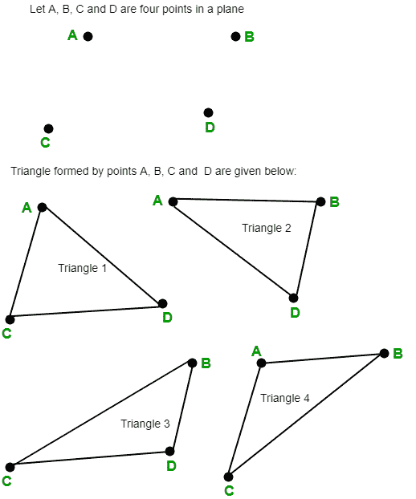

# 如果不超过两个点共线，则平面中三角形的数量

> 原文:[https://www . geeksforgeeks . org/平面三角形的数量-如果不超过两个点共线/](https://www.geeksforgeeks.org/number-of-triangles-in-a-plane-if-no-more-than-two-points-are-collinear/)

给定平面中的 n 个点，并且不超过两个点共线，任务是计算给定平面中三角形的数量。
**例:**

```
Input :  n = 3
Output : 1

Input :  n = 4
Output : 4
```



假设一个平面上有 n 个点，并且没有三个或更多的点共线，那么给定平面上的三角形数量由
给出

## C++

```
// C++ program to find the number of
// triangles in a plane if no more
// then two points are collinear.
#include <bits/stdc++.h>
using namespace std;

// Function to find number of triangles
// in a plane.
int countNumberOfTriangles(int n)
{

    // Formula to find number of triangles
    // nC3 = n * (n - 1) * (n - 2) / 6
    return n * (n - 1) * (n - 2) / 6;
}

// Driver code
int main()
{
    int n = 4;
    cout << countNumberOfTriangles(n);
    return 0;
}
```

## Java 语言(一种计算机语言，尤用于创建网站)

```
// Java program to find the number of
// triangles in a plane if no more
// then two points are collinear.
import java.io.*;

class GFG {

    // Function to find number of triangles
    // in a plane.
    static int countNumberOfTriangles(int n)
    {

        // Formula to find number of triangle
        // nC3 = n * (n - 1) * (n - 2) / 6
        return n * (n - 1) * (n - 2) / 6;
    }

    // Driver code
    public static void main(String[] args)
    {
        int n = 4;

        System.out.println(
            countNumberOfTriangles(n));
    }
}
```

## 蟒蛇 3

```
# Python3 program to find
# the number of triangles
# in a plane if no more
# then two points are collinear.

# Function to find number
# of triangles in a plane.
def countNumberOfTriangles(n) :

    # Formula to find
    # number of triangles
    # nC3 = n * (n - 1) *
    # (n - 2) / 6
    return (n * (n - 1) *
                (n - 2) // 6)

# Driver Code
if __name__ == '__main__' :

    n = 4
    print(countNumberOfTriangles(n))

# This code is contributed
# by ajit
```

## C#

```
// C# program to find the
// number of triangles in
// a plane if no more then
// two points are collinear.
using System;

class GFG
{

    // Function to find number
    // of triangles in a plane.
    static int countNumberOfTriangles(int n)
    {

        // Formula to find number
        // of triangle
        // nC3 = n * (n - 1) *
        //           (n - 2) / 6
        return n * (n - 1) *
                   (n - 2) / 6;
    }

    // Driver code
    public static void Main()
    {
        int n = 4;

        Console.WriteLine(
            countNumberOfTriangles(n));
    }
}

// This code is contributed by anuj_67.
```

## 服务器端编程语言（Professional Hypertext Preprocessor 的缩写）

```
<?php
// PHP program to find the
// number of triangles in a
// plane if no more then
// two points are collinear.

// Function to find number
// of triangles in a plane.
function countNumberOfTriangles($n)
{
    // Formula to find number
    // of triangles nC3 = n *
    // (n - 1) * (n - 2) / 6
    return $n * ($n - 1) *
                ($n - 2) / 6;
}

// Driver code
$n = 4;
echo countNumberOfTriangles($n);

// This code is contributed
// by anuj_67.
?>
```

## java 描述语言

```
<script>
// javascript program to find the number of
// triangles in a plane if no more
// then two points are collinear.

    // Function to find number of triangles
    // in a plane.
    function countNumberOfTriangles(n)
    {

        // Formula to find number of triangle
        // nC3 = n * (n - 1) * (n - 2) / 6
        return n * (n - 1) * (n - 2) / 6;
    }

    // Driver code
        var n = 4;
        document.write(countNumberOfTriangles(n));

// This code is contributed by aashish1995
</script>
```

**Output:** 

```
4
```