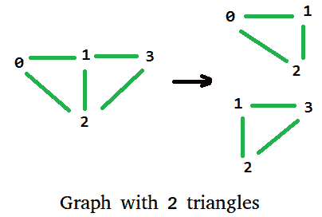

# 无向图中三角形的数量

> 原文:[https://www . geesforgeks . org/无向图中的三角形数量/](https://www.geeksforgeeks.org/number-of-triangles-in-a-undirected-graph/)

给定一个无向图，我们需要知道它能有多少个三角形。例如下图中有两个三角形。



设 A[][]为图的邻接矩阵表示。如果我们计算 A <sup>3</sup> ，那么无向图中三角形的个数等于迹(A <sup>3</sup> ) / 6。其中迹线(A)是矩阵 A 主对角线上元素的和

```
Trace of a graph represented as adjacency matrix A[V][V] is,
trace(A[V][V]) = A[0][0] + A[1][1] + .... + A[V-1][V-1]

Count of triangles = trace(A3) / 6
```

下面是上面公式的实现。

## C++

```
// A C++ program for finding
// number of triangles in an
// Undirected Graph. The program
// is for adjacency matrix
// representation of the graph
#include <bits/stdc++.h>
using namespace std;

// Number of vertices in the graph
#define V 4

//  Utility function for matrix
// multiplication
void multiply(int A[][V], int B[][V], int C[][V])
{
    for (int i = 0; i < V; i++)
    {
        for (int j = 0; j < V; j++)
        {
            C[i][j] = 0;
            for (int k = 0; k < V; k++)
                C[i][j] += A[i][k]*B[k][j];
        }
    }
}

// Utility function to calculate
// trace of a matrix (sum of
// diagonal elements)
int getTrace(int graph[][V])
{
    int trace = 0;
    for (int i = 0; i < V; i++)
        trace += graph[i][i];
    return trace;
}

//  Utility function for calculating
// number of triangles in graph
int triangleInGraph(int graph[][V])
{
    // To Store graph^2
    int aux2[V][V];

    // To Store graph^3
    int aux3[V][V];

    //  Initialising aux
    // matrices with 0
    for (int i = 0; i < V; ++i)
        for (int j = 0; j < V; ++j)
            aux2[i][j] = aux3[i][j] = 0;

    // aux2 is graph^2 now  printMatrix(aux2);
    multiply(graph, graph, aux2);

    // after this multiplication aux3 is
    // graph^3 printMatrix(aux3);
    multiply(graph, aux2, aux3);

    int trace = getTrace(aux3);
    return trace / 6;
}

// driver code
int main()
{

    int graph[V][V] = {{0, 1, 1, 0},
                       {1, 0, 1, 1},
                       {1, 1, 0, 1},
                       {0, 1, 1, 0}
                      };

    printf("Total number of Triangle in Graph : %d\n",
            triangleInGraph(graph));
    return 0;
}
```

## Java 语言(一种计算机语言，尤用于创建网站)

```
// Java program to find number
// of triangles in an Undirected
// Graph. The program is for
// adjacency matrix representation
// of the graph
import java.io.*;

class Directed
{
    // Number of vertices in
    // the graph
    int V = 4;

   //  Utility function for
   // matrix multiplication
   void multiply(int A[][], int B[][],
                            int C[][])
   {
       for (int i = 0; i < V; i++)
       {
           for (int j = 0; j < V; j++)
           {
               C[i][j] = 0;
               for (int k = 0; k < V;
                                   k++)
               {
                   C[i][j] += A[i][k]*
                              B[k][j];
               }
           }
       }
   }

   // Utility function to calculate
   // trace of a matrix (sum of
   // diagonal elements)
   int getTrace(int graph[][])
   {
       int trace = 0;

       for (int i = 0; i < V; i++)
       {
           trace += graph[i][i];
       }
       return trace;
   }

   // Utility function for
   // calculating number of
   // triangles in graph
   int triangleInGraph(int graph[][])
   {
       // To Store graph^2
       int[][] aux2 = new int[V][V]; 

       // To Store graph^3
       int[][] aux3 = new int[V][V];

       // Initialising aux matrices
       // with 0
       for (int i = 0; i < V; ++i)
       {
           for (int j = 0; j < V; ++j)
           {
               aux2[i][j] = aux3[i][j] = 0;
           }
       }

       // aux2 is graph^2 now
       // printMatrix(aux2)
       multiply(graph, graph, aux2);

       // after this multiplication aux3
       // is graph^3 printMatrix(aux3)
       multiply(graph, aux2, aux3);

       int trace = getTrace(aux3);

       return trace / 6;
   }

   // Driver code
   public static void main(String args[])
   {
       Directed obj = new Directed();

       int graph[][] = { {0, 1, 1, 0},
                         {1, 0, 1, 1},
                         {1, 1, 0, 1},
                         {0, 1, 1, 0}
                       };

       System.out.println("Total number of Triangle in Graph : "+
              obj.triangleInGraph(graph));
   }
}

// This code is contributed by Anshika Goyal.
```

## 蟒蛇 3

```
# A Python3 program for finding number of
# triangles in an Undirected Graph. The
# program is for adjacency matrix
# representation of the graph

# Utility function for matrix
# multiplication
def multiply(A, B, C):
    global V
    for i in range(V):
        for j in range(V):
            C[i][j] = 0
            for k in range(V):
                C[i][j] += A[i][k] * B[k][j]

# Utility function to calculate
# trace of a matrix (sum of
# diagonal elements)
def getTrace(graph):
    global V
    trace = 0
    for i in range(V):
        trace += graph[i][i]
    return trace

# Utility function for calculating
# number of triangles in graph
def triangleInGraph(graph):
    global V

    # To Store graph^2
    aux2 = [[None] * V for i in range(V)]

    # To Store graph^3
    aux3 = [[None] * V for i in range(V)]

    # Initialising aux
    # matrices with 0
    for i in range(V):
        for j in range(V):
            aux2[i][j] = aux3[i][j] = 0

    # aux2 is graph^2 now printMatrix(aux2)
    multiply(graph, graph, aux2)

    # after this multiplication aux3 is
    # graph^3 printMatrix(aux3)
    multiply(graph, aux2, aux3)

    trace = getTrace(aux3)
    return trace // 6

# Driver Code

# Number of vertices in the graph
V = 4
graph = [[0, 1, 1, 0],
         [1, 0, 1, 1],
         [1, 1, 0, 1],
         [0, 1, 1, 0]]

print("Total number of Triangle in Graph :",
                    triangleInGraph(graph))

# This code is contributed by PranchalK
```

## C#

```
// C# program to find number
// of triangles in an Undirected
// Graph. The program is for
// adjacency matrix representation
// of the graph
using System;

class GFG
{
// Number of vertices
// in the graph
int V = 4;

// Utility function for
// matrix multiplication
void multiply(int [,]A, int [,]B,
                        int [,]C)
{
    for (int i = 0; i < V; i++)
    {
        for (int j = 0; j < V; j++)
        {
            C[i, j] = 0;
            for (int k = 0; k < V;
                              k++)
            {
                C[i, j] += A[i, k]*
                           B[k, j];
            }
        }
    }
}

// Utility function to
// calculate trace of
// a matrix (sum of
// diagonal elements)
int getTrace(int [,]graph)
{
    int trace = 0;

    for (int i = 0; i < V; i++)
    {
        trace += graph[i, i];
    }
    return trace;
}

// Utility function for
// calculating number of
// triangles in graph
int triangleInGraph(int [,]graph)
{
    // To Store graph^2
    int[,] aux2 = new int[V, V];

    // To Store graph^3
    int[,] aux3 = new int[V, V];

    // Initialising aux matrices
    // with 0
    for (int i = 0; i < V; ++i)
    {
        for (int j = 0; j < V; ++j)
        {
            aux2[i, j] = aux3[i, j] = 0;
        }
    }

    // aux2 is graph^2 now
    // printMatrix(aux2)
    multiply(graph, graph, aux2);

    // after this multiplication aux3
    // is graph^3 printMatrix(aux3)
    multiply(graph, aux2, aux3);

    int trace = getTrace(aux3);

    return trace / 6;
}

// Driver code
public static void Main()
{
    GFG obj = new GFG();

    int [,]graph = {{0, 1, 1, 0},
                    {1, 0, 1, 1},
                    {1, 1, 0, 1},
                    {0, 1, 1, 0}};

    Console.WriteLine("Total number of " +
                   "Triangle in Graph : "+
              obj.triangleInGraph(graph));
}
}

// This code is contributed by anuj_67.
```

## java 描述语言

```
<script>

// Javascript program to find number
// of triangles in an Undirected
// Graph. The program is for
// adjacency matrix representation
// of the graph

// Number of vertices in the graph
let V = 4;

//  Utility function for matrix
// multiplication
function multiply(A, B, C)
{
    for(let i = 0; i < V; i++)
    {
        for(let j = 0; j < V; j++)
        {
            C[i][j] = 0;
            for(let k = 0; k < V; k++)
                C[i][j] += A[i][k] * B[k][j];
        }
    }
}

// Utility function to calculate
// trace of a matrix (sum of
// diagonal elements)
function getTrace(graph)
{
    let trace = 0;
    for(let i = 0; i < V; i++)
        trace += graph[i][i];

    return trace;
}

//  Utility function for calculating
// number of triangles in graph
function triangleInGraph(graph)
{

    // To Store graph^2
    let aux2 = new Array(V);

    // To Store graph^3
    let aux3 = new Array(V);

    // Initialising aux
    // matrices with 0
    for(let i = 0; i < V; ++i)
    {
        aux2[i] = new Array(V);
        aux3[i] = new Array(V);
        for(let j = 0; j < V; ++j)
        {
            aux2[i][j] = aux3[i][j] = 0;
        }
    }      

    // aux2 is graph^2 now  printMatrix(aux2);
    multiply(graph, graph, aux2);

    // After this multiplication aux3 is
    // graph^3 printMatrix(aux3);
    multiply(graph, aux2, aux3);

    let trace = getTrace(aux3);
    return (trace / 6);
}

// Driver code
let graph = [ [ 0, 1, 1, 0 ],
              [ 1, 0, 1, 1 ],
              [ 1, 1, 0, 1 ],
              [ 0, 1, 1, 0 ] ];

document.write("Total number of Triangle in Graph : " +
               triangleInGraph(graph));

// This code is contributed by divyesh072019    

</script>
```

**输出:**

```
Total number of Triangle in Graph : 2
```

**这是如何工作的？**
如果我们为图的邻接矩阵表示计算 A <sup>n</sup> ，那么值 A<sup>n</sup>【I】【j】表示图中顶点 I 到 j 之间的不同步数。在 A <sup>3</sup> 中，我们得到每对顶点之间长度为 3 的所有不同路径。
三角形是长度为三的循环路径，即在同一个顶点开始和结束。所以 A<sup>3</sup>【I】【I】代表一个以顶点 I 开始和结束的三角形，由于一个三角形有三个顶点，并且是为每个顶点计数的，所以我们需要将结果除以 3。此外，由于图是无向的，每个三角形都是 i-p-q-j 和 i-q-p-j 的两倍，所以我们也除以 2。所以三角形的数量是迹(A <sup>3</sup> ) / 6。

**时间复杂度:**
上述算法的时间复杂度为 O(V <sup>3</sup> )其中 V 为图中顶点数，我们可以利用[斯特拉森矩阵乘法](https://www.geeksforgeeks.org/strassens-matrix-multiplication/)算法将性能提升到 O(V <sup>2.8074</sup> )。

**另一种方法:**使用[位集](https://www.geeksforgeeks.org/c-bitset-and-its-application/)作为邻接表。

*   对于图中的每个节点，计算相应的邻接表作为位掩码。
*   如果两个节点 i & j 相邻，计算与 i & j 相邻的节点数，并将其添加到答案中。
*   最后，将答案除以 6 以避免重复。

为了计算与两个节点 i & j 相邻的节点数，我们在 I 和 j 的邻接表上使用逐位运算 **&** (and)，然后计算 1 的个数。

下面是上述方法的实现:

## C++

```
#include<iostream>
#include<string>
#include<algorithm>
#include<cstring>
#include<vector>
#include<bitset>

using namespace std;

#define V 4

int main()
{
    // Graph represented as adjacency matrix
    int graph[][V] = {{0, 1, 1, 0},
                      {1, 0, 1, 1},
                      {1, 1, 0, 1},
                      {0, 1, 1, 0}};

    // create the adjacency list of the graph (as bit masks)
    // set the bits at positions [i][j] & [j][i] to 1, if there is an undirected edge between i and j
    vector<bitset<V>> Bitset_Adj_List(V);
    for (int i = 0; i < V;i++)
        for (int j = 0; j < V;j++)
            if(graph[i][j])
                Bitset_Adj_List[i][j] = 1,
                Bitset_Adj_List[j][i] = 1;

    int ans = 0;

    for (int i = 0; i < V;i++)
        for (int j = 0; j < V;j++)

            // if i & j are adjancent
            // compute the number of nodes that are adjancent to i & j
            if(Bitset_Adj_List[i][j] == 1 && i != j){
                bitset<V> Mask = Bitset_Adj_List[i] & Bitset_Adj_List[j];
                ans += Mask.count();
            }

   // divide the answer by 6 to avoid duplicates
   ans /= 6;

   cout << "The number of Triangles in the Graph is : " << ans;

    // This code is contributed
    // by Gatea David
}
```

**Output**

```
The number of Triangles in the Graph is : 2
```

**时间复杂度:**首先我们有两个用于嵌套循环的 O(V <sup>2</sup> )流的位集运算&和 count，两者的时间复杂度都为 O(V / Word RAM)，其中 V =图中的节点数，Word RAM 通常为 32 或 64。所以最后的时间复杂度是 O(V <sup>2</sup> * V / 32)或者 O(V <sup>3</sup> )。

**参考文献:**

[http://www . d . umn . edu/math/Technical % 20 reports/Technical % 20 reports % 202007-/TR % 202012/yang . pdf](https://scse.d.umn.edu/about/departments-and-programs/mathematics-statistics-department)

[有向图和无向图中的三角形数量](https://www.geeksforgeeks.org/number-of-triangles-in-directed-and-undirected-graphs/)。

本文由乌卡什·特里维迪供稿。如果你发现任何不正确的地方，或者你想分享更多关于上面讨论的话题的信息，请写评论。