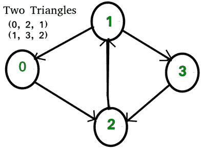

# 有向图和无向图中的三角形数量

> 原文:[https://www . geesforgeks . org/有向图和无向图中的三角形数量/](https://www.geeksforgeeks.org/number-of-triangles-in-directed-and-undirected-graphs/)

给定一个图形，计算其中三角形的数量。这个图可以是有向的，也可以是无向的。

**示例:**

```
Input: digraph[V][V] = { {0, 0, 1, 0},
                        {1, 0, 0, 1},
                        {0, 1, 0, 0},
                        {0, 0, 1, 0}
                      };
Output: 2
Give adjacency matrix represents following 
directed graph.
```



我们讨论了一种基于图迹的[方法](https://www.geeksforgeeks.org/number-of-triangles-in-a-undirected-graph/)，它适用于无向图。在这篇文章中，我们讨论了一种新的方法，它比较简单，适用于有向图和无向图。
想法是使用三个嵌套循环来考虑每个三元组(I，j，k)并检查上述条件(从 I 到 j，j 到 k 和 k 到 I 有一条边)
然而，在一个**无向图**中，三元组(I，j，k)可以被置换以给出六个组合(详见[之前的帖子](https://www.geeksforgeeks.org/number-of-triangles-in-a-undirected-graph/))。因此，我们将总数除以 6，得到三角形的实际数量。
在**有向图**的情况下，排列的数量将是 3(随着节点的顺序变得相关)。因此，在这种情况下，三角形的总数将通过总计数除以 3 来获得。例如，考虑下面给出的有向图

下面是实现。

## C++

```
// C++ program to count triangles
// in a graph. The program is for
// adjacency matrix representation
// of the graph.
#include<bits/stdc++.h>

// Number of vertices in the graph
#define V 4

using namespace std;

// function to calculate the
// number of triangles in a
// simple directed/undirected
// graph. isDirected is true if
// the graph is directed, its
// false otherwise
int countTriangle(int graph[V][V],
                  bool isDirected)
{
    // Initialize result
    int count_Triangle = 0;

    // Consider every possible
    // triplet of edges in graph
    for (int i = 0; i < V; i++)
    {
        for (int j = 0; j < V; j++)
        {
            for (int k = 0; k < V; k++)
            {
               // Check the triplet if
               // it satisfies the condition
               if (graph[i][j] && graph[j][k]
                               && graph[k][i])
                  count_Triangle++;
             }
        }
    }

    // If graph is directed ,
    // division is done by 3,
    // else division by 6 is done
    isDirected? count_Triangle /= 3 :
                count_Triangle /= 6;

    return count_Triangle;
}

//driver function to check the program
int main()
{
    // Create adjacency matrix
    // of an undirected graph
    int graph[][V] = { {0, 1, 1, 0},
                       {1, 0, 1, 1},
                       {1, 1, 0, 1},
                       {0, 1, 1, 0}
                     };

    // Create adjacency matrix
    // of a directed graph
    int digraph[][V] = { {0, 0, 1, 0},
                        {1, 0, 0, 1},
                        {0, 1, 0, 0},
                        {0, 0, 1, 0}
                       };

    cout << "The Number of triangles in undirected graph : "
         << countTriangle(graph, false);
    cout << "\n\nThe Number of triangles in directed graph : "
         << countTriangle(digraph, true);

    return 0;
}
```

## Java 语言(一种计算机语言，尤用于创建网站)

```
// Java program to count triangles
// in a graph.  The program is
// for adjacency matrix
// representation of the graph.
import java.io.*;

class GFG {

    // Number of vertices in the graph
    int V = 4;

    // function to calculate the number
    // of triangles in a simple
    // directed/undirected graph. isDirected
    // is true if the graph is directed,
    // its false otherwise.
    int countTriangle(int graph[][],
                      boolean isDirected)
   {
       // Initialize result
       int count_Triangle = 0;

       // Consider every possible
       // triplet of edges in graph
       for (int i = 0; i < V; i++)
       {
           for (int j = 0; j < V; j++)
           {
               for (int k=0; k<V; k++)
               {
                  // Check the triplet if it
                  // satisfies the condition
                  if (graph[i][j] == 1 &&
                      graph[j][k] == 1 &&
                      graph[k][i] == 1)
                      count_Triangle++;
               }
           }
       }

       // If graph is directed , division
       // is done by 3 else division
       // by 6 is done
       if(isDirected == true)
       {
           count_Triangle /= 3;
       }
       else
       {
           count_Triangle /= 6;
       }
       return count_Triangle;
   }

   // Driver code
    public static void main(String args[])
   {

       // Create adjacency matrix
       // of an undirected graph
       int graph[][] = {{0, 1, 1, 0},
                        {1, 0, 1, 1},
                        {1, 1, 0, 1},
                        {0, 1, 1, 0}
                       };

       // Create adjacency matrix
       // of a directed graph
       int digraph[][] = { {0, 0, 1, 0},
                           {1, 0, 0, 1},
                           {0, 1, 0, 0},
                           {0, 0, 1, 0}
                         };

      GFG obj = new GFG();

    System.out.println("The Number of triangles "+
                       "in undirected graph : " +
                        obj.countTriangle(graph, false));

    System.out.println("\n\nThe Number of triangles"+
                       " in directed graph : "+
                       obj.countTriangle(digraph, true));

   }
}

// This code is contributed by Anshika Goyal.
```

## 计算机编程语言

```
# Python program to count triangles
# in a graph.  The program is
# for adjacency matrix
# representation of the graph.

# function to calculate the number
# of triangles in a simple
# directed/undirected graph.
# isDirected is true if the graph
# is directed, its false otherwise
def countTriangle(g, isDirected):
    nodes = len(g)
    count_Triangle = 0

    # Consider every possible
    # triplet of edges in graph
    for i in range(nodes):
        for j in range(nodes):
            for k in range(nodes):

                # check the triplet
                # if it satisfies the condition
                if(i != j and i != k
                   and j != k and
                   g[i][j] and g[j][k]
                   and g[k][i]):
                    count_Triangle += 1

    # If graph is directed , division is done by 3
    # else division by 6 is done
    if isDirected:
      return count_Triangle/3 
    else: return count_Triangle/6

# Create adjacency matrix of an undirected graph
graph = [[0, 1, 1, 0],
         [1, 0, 1, 1],
         [1, 1, 0, 1],
         [0, 1, 1, 0]]
# Create adjacency matrix of a directed graph
digraph = [[0, 0, 1, 0],
           [1, 0, 0, 1],
           [0, 1, 0, 0],
           [0, 0, 1, 0]]

print("The Number of triangles in undirected graph : %d" %
      countTriangle(graph, False))

print("The Number of triangles in directed graph : %d" %
      countTriangle(digraph, True))

# This code is contributed by Neelam Yadav
```

## C#

```
// C# program to count triangles in a graph.
// The program is for adjacency matrix
// representation of the graph.
using System;

class GFG {

    // Number of vertices in the graph
    const int V = 4;

    // function to calculate the
    // number of triangles in a
    // simple directed/undirected
    // graph. isDirected is true if
    // the graph is directed, its
    // false otherwise
    static int countTriangle(int[, ] graph, bool isDirected)
    {
        // Initialize result
        int count_Triangle = 0;

        // Consider every possible
        // triplet of edges in graph
        for (int i = 0; i < V; i++)
        {
            for (int j = 0; j < V; j++)
            {
                for (int k = 0; k < V; k++)
                {
                    // check the triplet if
                    // it satisfies the condition
                    if (graph[i, j] != 0
                        && graph[j, k] != 0
                        && graph[k, i] != 0)
                        count_Triangle++;
                }
            }
        }

        // if graph is directed ,
        // division is done by 3,
        // else division by 6 is done
        if (isDirected != false)
            count_Triangle = count_Triangle / 3;
        else
            count_Triangle = count_Triangle / 6;

        return count_Triangle;
    }

    // Driver code
    static void Main()
    {

        // Create adjacency matrix
        // of an undirected graph
        int[, ] graph = new int[4, 4] { { 0, 1, 1, 0 },
                                        { 1, 0, 1, 1 },
                                        { 1, 1, 0, 1 },
                                        { 0, 1, 1, 0 } };

        // Create adjacency matrix
        // of a directed graph
        int[, ] digraph = new int[4, 4] { { 0, 0, 1, 0 },
                                          { 1, 0, 0, 1 },
                                          { 0, 1, 0, 0 },
                                          { 0, 0, 1, 0 } };

        Console.Write("The Number of triangles"
                      + " in undirected graph : "
                      + countTriangle(graph, false));

        Console.Write("\n\nThe Number of "
                      + "triangles in directed graph : "
                      + countTriangle(digraph, true));
    }
}

// This code is contributed by anuj_67
```

## 服务器端编程语言（Professional Hypertext Preprocessor 的缩写）

```
<?php
// PHP program to count triangles
// in a graph. The program is for
// adjacency matrix representation
// of the graph.

// Number of vertices in the graph
$V = 4;

// function to calculate the
// number of triangles in a
// simple directed/undirected
// graph. isDirected is true if
// the graph is directed, its
// false otherwise
function countTriangle($graph,
                       $isDirected)
{
    global $V;

    // Initialize result
    $count_Triangle = 0;

    // Consider every possible
    // triplet of edges in graph
    for($i = 0; $i < $V; $i++)
    {
        for($j = 0; $j < $V; $j++)
        {
            for($k = 0; $k < $V; $k++)
            {

                // check the triplet if
                // it satisfies the condition
                if ($graph[$i][$j] and $graph[$j][$k]
                                   and $graph[$k][$i])
                    $count_Triangle++;
            }
        }
    }

    // if graph is directed ,
    // division is done by 3,
    // else division by 6 is done
    $isDirected? $count_Triangle /= 3 :
                 $count_Triangle /= 6;

    return $count_Triangle;
}

    // Driver Code
    // Create adjacency matrix
    // of an undirected graph
    $graph = array(array(0, 1, 1, 0),
                   array(1, 0, 1, 1),
                   array(1, 1, 0, 1),
                   array(0, 1, 1, 0));

    // Create adjacency matrix
    // of a directed graph
    $digraph = array(array(0, 0, 1, 0),
                     array(1, 0, 0, 1),
                     array(0, 1, 0, 0),
                     array(0, 0, 1, 0));

    echo "The Number of triangles in undirected graph : "
                        , countTriangle($graph, false);
    echo "\nThe Number of triangles in directed graph : "
                        , countTriangle($digraph, true);

// This code is contributed by anuj_67
?>
```

## java 描述语言

```
<script>

// Javascript program to count triangles
// in a graph. The program is for
// adjacency matrix representation
// of the graph.

// Number of vertices in the graph
let V = 4;

// Function to calculate the
// number of triangles in a
// simple directed/undirected
// graph. isDirected is true if
// the graph is directed, its
// false otherwise
function countTriangle(graph, isDirected)
{

    // Initialize result
    let count_Triangle = 0;

    // Consider every possible
    // triplet of edges in graph
    for(let i = 0; i < V; i++)
    {
        for(let j = 0; j < V; j++)
        {
            for(let k = 0; k < V; k++)
            {
                // Check the triplet if
                // it satisfies the condition
                if (graph[i][j] && graph[j][k] &&
                    graph[k][i])
                    count_Triangle++;
             }
        }
    }

    // If graph is directed ,
    // division is done by 3,
    // else division by 6 is done
    isDirected ? count_Triangle /= 3 :
                 count_Triangle /= 6;

    return count_Triangle;
}

// Driver code

// Create adjacency matrix
// of an undirected graph
let graph = [ [ 0, 1, 1, 0 ],
              [ 1, 0, 1, 1 ],
              [ 1, 1, 0, 1 ],
              [ 0, 1, 1, 0 ] ];

// Create adjacency matrix
// of a directed graph
let digraph = [ [ 0, 0, 1, 0 ],
                [ 1, 0, 0, 1 ],
                [ 0, 1, 0, 0 ],
                [ 0, 0, 1, 0 ] ];

document.write("The Number of triangles " +
               "in undirected graph : " +
               countTriangle(graph, false) +
               "</br></br>");
document.write("The Number of triangles " +
               "in directed graph : " +
               countTriangle(digraph, true));

// This code is contributed by divyesh072019

</script>
```

**Output**

```
The Number of triangles in undirected graph : 2

The Number of triangles in directed graph : 2
```

**此方法与** [**之前方法**](https://www.geeksforgeeks.org/number-of-triangles-in-a-undirected-graph/) **的比较:**
优点:

*   不需要计算 Trace。
*   不需要矩阵乘法。
*   不需要辅助矩阵，因此在空间上进行了优化。
*   适用于有向图。

缺点:

*   时间复杂度为 O(n <sup>3</sup> )，不能再降低了。

本文由**阿舒托什·库马尔**供稿。如果你喜欢极客博客并想投稿，你也可以写一篇文章并把你的文章邮寄到 contribute@geeksforgeeks.org。看到你的文章出现在极客博客主页上，帮助其他极客。
如发现任何不正确的地方，请写评论，或者您想分享更多关于上述话题的信息