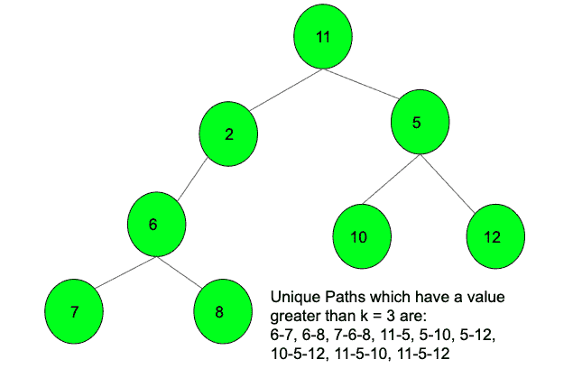

# 树中唯一路径的数量，使得每条路径的值大于 K

> 原文:[https://www . geesforgeks . org/树中唯一路径的数量，这样每个路径的值都大于 k/](https://www.geeksforgeeks.org/number-of-unique-paths-in-tree-such-that-every-path-has-a-value-greater-than-k/)

给定一棵树作为一组边，使得每个节点都有唯一的值。我们还被赋予一个值 K，任务是计算树中的唯一路径，使得每条路径都有一个大于 K 的值。如果路径中的每条边都连接着两个节点，并且这两个节点都有值 **> K** ，则路径值被称为 **> K** 。

**示例:**

> **输入:**
> 
> 
> 
> **输出:** 9

**方法:**想法是不要形成所有给定边的树。我们只在满足> k 条件的情况下增加一条边，在这种情况下，会形成很多树。在形成不同的树时，只有当两个节点值都大于 k 时，我们才会将边添加到树中。之后，将创建不同数量的树。为每个节点运行一个 DFS，最终遍历该节点所连接的完整树，并计算每个树中的节点数。节点数为 **X** 的每棵树的唯一路径数为**X *(X–1)/2**。

下面是上述方法的实现:

## C++

```
// C++ implementation of the approach
#include <bits/stdc++.h>
using namespace std;

// Function to count the number of nodes
// in the tree using DFS
int dfs(int node, int parent, list<int>* adj, bool vis[])
{

    // Base case
    int ans = 1;

    // Mark as visited
    vis[node] = true;

    // Traverse for all children
    for (auto it : adj[node]) {

        // If not equal to parent
        if (it != parent)
            ans += dfs(it, node, adj, vis);
    }
    return ans;
}

// Function that returns the count of
// unique paths
int countPaths(list<int>* adj, int k, int maxn)
{

    // An array that marks if the node
    // is visited or not
    bool vis[maxn + 1];
    int ans = 0;

    // Initially marked as false
    memset(vis, false, sizeof vis);

    // Traverse till max value of node
    for (int i = 1; i <= maxn; i++) {

        // If not visited
        if (!vis[i]) {

            // Get the number of nodes in that
            // tree
            int numNodes = dfs(i, 0, adj, vis);

            // Total unique paths in the current
            // tree where numNodes is the total
            // nodes in the tree
            ans += numNodes * (numNodes - 1) / 2;
        }
    }
    return ans;
}

// Function to add edges to tree if value
// is less than K
void addEdge(list<int>* adj, int u, int v, int k)
{
    if (u > k && v > k) {
        adj[u].push_back(v);
        adj[v].push_back(u);
    }
}

// Driver code
int main()
{
    int maxn = 12;

    list<int>* adj = new list<int>[maxn + 1];
    int k = 3;

    // Create undirected edges
    addEdge(adj, 2, 11, k);
    addEdge(adj, 2, 6, k);
    addEdge(adj, 5, 11, k);
    addEdge(adj, 5, 10, k);
    addEdge(adj, 5, 12, k);
    addEdge(adj, 6, 7, k);
    addEdge(adj, 6, 8, k);

    cout << countPaths(adj, k, maxn);

    return 0;
}
```

## Java 语言(一种计算机语言，尤用于创建网站)

```
// Java implementation of the approach
import java.util.*;

class GFG
{

    // Function to count the number of nodes
    // in the tree using DFS
    static int dfs(int node, int parent,
                Vector<Integer>[] adj, boolean[] vis)
    {

        // Base case
        int ans = 1;

        // Mark as visited
        vis[node] = true;

        // Traverse for all children
        for (Integer it : adj[node])
        {

            // If not equal to parent
            if (it != parent)
                ans += dfs(it, node, adj, vis);
        }
        return ans;
    }

    // Function that returns the count of
    // unique paths
    static int countPaths(Vector<Integer>[] adj,
                        int k, int maxn)
    {

        // An array that marks if the node
        // is visited or not
        boolean[] vis = new boolean[maxn + 1];
        int ans = 0;

        // Initially marked as false
        Arrays.fill(vis, false);

        // Traverse till max value of node
        for (int i = 1; i <= maxn; i++)
        {

            // If not visited
            if (!vis[i])
            {

                // Get the number of nodes in that
                // tree
                int numNodes = dfs(i, 0, adj, vis);

                // Total unique paths in the current
                // tree where numNodes is the total
                // nodes in the tree
                ans += numNodes * (numNodes - 1) / 2;
            }
        }
        return ans;
    }

    // Function to add edges to tree if value
    // is less than K
    static void addEdge(Vector<Integer>[] adj,
                        int u, int v, int k)
    {
        if (u > k && v > k) {
            adj[u].add(v);
            adj[v].add(u);
        }
    }

    // Driver Code
    public static void main(String[] args)
    {
        int maxn = 12;

        @SuppressWarnings("unchecked")
        Vector<Integer>[] adj = new Vector[maxn + 1];
        for (int i = 0; i < maxn + 1; i++)
        {
            adj[i] = new Vector<>();
        }
        int k = 3;

        // Create undirected edges
        addEdge(adj, 2, 11, k);
        addEdge(adj, 2, 6, k);
        addEdge(adj, 5, 11, k);
        addEdge(adj, 5, 10, k);
        addEdge(adj, 5, 12, k);
        addEdge(adj, 6, 7, k);
        addEdge(adj, 6, 8, k);

        System.out.println(countPaths(adj, k, maxn));
    }
}

// This code is contributed by
// sanjeev2552
```

## 蟒蛇 3

```
# Python3 implementation of the approach

# Function to count the number of
# nodes in the tree using DFS
def dfs(node, parent, adj, vis):

    # Base case
    ans = 1

    # Mark as visited
    vis[node] = True

    # Traverse for all children
    for it in adj[node]:

        # If not equal to parent
        if it != parent:
            ans += dfs(it, node, adj, vis)

    return ans

# Function that returns the
# count of unique paths
def countPaths(adj, k, maxn):

    # An array that marks if
    # the node is visited or not
    vis = [False] * (maxn + 1)
    ans = 0

    # Traverse till max value of node
    for i in range(1, maxn+1):

        # If not visited
        if not vis[i]:

            # Get the number of
            # nodes in that tree
            numNodes = dfs(i, 0, adj, vis)

            # Total unique paths in the current
            # tree where numNodes is the total
            # nodes in the tree
            ans += numNodes * (numNodes - 1) // 2

    return ans

# Function to add edges to
# tree if value is less than K
def addEdge(adj, u, v, k):

    if u > k and v > k:
        adj[u].append(v)
        adj[v].append(u)

# Driver code
if __name__ == "__main__":

    maxn = 12

    adj = [[] for i in range(maxn + 1)]
    k = 3

    # Create undirected edges
    addEdge(adj, 2, 11, k)
    addEdge(adj, 2, 6, k)
    addEdge(adj, 5, 11, k)
    addEdge(adj, 5, 10, k)
    addEdge(adj, 5, 12, k)
    addEdge(adj, 6, 7, k)
    addEdge(adj, 6, 8, k)

    print(countPaths(adj, k, maxn))

# This code is contributed by Rituraj Jain
```

## C#

```
// C# implementation of the approach
using System;
using System.Collections.Generic;

class GFG{

// Function to count the number of nodes
// in the tree using DFS
static int dfs(int node, int parent,
          List<int>[] adj, bool[] vis)
{

    // Base case
    int ans = 1;

    // Mark as visited
    vis[node] = true;

    // Traverse for all children
    foreach(int it in adj[node])
    {

        // If not equal to parent
        if (it != parent)
            ans += dfs(it, node, adj, vis);
    }
    return ans;
}

// Function that returns the count of
// unique paths
static int countPaths(List<int>[] adj,
                    int k, int maxn)
{

    // An array that marks if the node
    // is visited or not
    bool[] vis = new bool[maxn + 1];
    int ans = 0;

    // Traverse till max value of node
    for(int i = 1; i <= maxn; i++)
    {

        // If not visited
        if (!vis[i])
        {

            // Get the number of nodes in that
            // tree
            int numNodes = dfs(i, 0, adj, vis);

            // Total unique paths in the current
            // tree where numNodes is the total
            // nodes in the tree
            ans += numNodes * (numNodes - 1) / 2;
        }
    }
    return ans;
}

// Function to add edges to tree if value
// is less than K
static void addEdge(List<int>[] adj,
                    int u, int v, int k)
{
    if (u > k && v > k)
    {
        adj[u].Add(v);
        adj[v].Add(u);
    }
}

// Driver Code
public static void Main(String[] args)
{
    int maxn = 12;

    List<int>[] adj = new List<int>[maxn + 1];
    for(int i = 0; i < maxn + 1; i++)
    {
        adj[i] = new List<int>();
    }
    int k = 3;

    // Create undirected edges
    addEdge(adj, 2, 11, k);
    addEdge(adj, 2, 6, k);
    addEdge(adj, 5, 11, k);
    addEdge(adj, 5, 10, k);
    addEdge(adj, 5, 12, k);
    addEdge(adj, 6, 7, k);
    addEdge(adj, 6, 8, k);

    Console.WriteLine(countPaths(adj, k, maxn));
}
}

// This code is contributed by Princi Singh
```

## java 描述语言

```
<script>

    // JavaScript implementation of the approach

    // Function to count the number of nodes
    // in the tree using DFS
    function dfs(node, parent, adj, vis)
    {

        // Base case
        let ans = 1;

        // Mark as visited
        vis[node] = true;

        // Traverse for all children
        for (let it = 0; it < adj[node].length; it++)
        {

            // If not equal to parent
            if (adj[node][it] != parent)
                ans += dfs(adj[node][it], node, adj, vis);
        }
        return ans;
    }

    // Function that returns the count of
    // unique paths
    function countPaths(adj, k, maxn)
    {

        // An array that marks if the node
        // is visited or not
        let vis = new Array(maxn + 1);
        let ans = 0;

        // Initially marked as false
        vis.fill(false);

        // Traverse till max value of node
        for (let i = 1; i <= maxn; i++)
        {

            // If not visited
            if (!vis[i])
            {

                // Get the number of nodes in that
                // tree
                let numNodes = dfs(i, 0, adj, vis);

                // Total unique paths in the current
                // tree where numNodes is the total
                // nodes in the tree
                ans += numNodes * (numNodes - 1) / 2;
            }
        }
        return ans;
    }

    // Function to add edges to tree if value
    // is less than K
    function addEdge(adj, u, v, k)
    {
        if (u > k && v > k) {
            adj[u].push(v);
            adj[v].push(u);
        }
    }

    let maxn = 12;

    let adj = new Array(maxn + 1);
    for (let i = 0; i < maxn + 1; i++)
    {
      adj[i] = [];
    }
    let k = 3;

    // Create undirected edges
    addEdge(adj, 2, 11, k);
    addEdge(adj, 2, 6, k);
    addEdge(adj, 5, 11, k);
    addEdge(adj, 5, 10, k);
    addEdge(adj, 5, 12, k);
    addEdge(adj, 6, 7, k);
    addEdge(adj, 6, 8, k);

    document.write(countPaths(adj, k, maxn));

</script>
```

**Output:** 

```
9
```