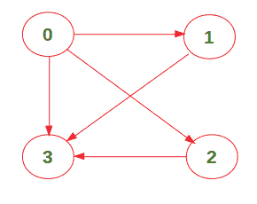
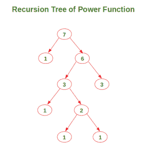
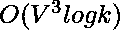

# 从源到目的地的步行次数

> 原文:[https://www . geesforgeks . org/从源到目的地的步行次数/](https://www.geeksforgeeks.org/number-of-walks-from-source-to-destination/)

给定一个图和两个顶点 src 和 dest，计算从 src 到 dest 的路径总数，其中路径长度为 k(它们之间应该正好有 k 条边)。请注意，该图表示为邻接矩阵。
例如，考虑以下图表:



长度为 2 的从顶点 0 到顶点 3 的路径数为 2 ({0->1->3}和{0->2->3})。
我们已经在[中讨论了 O(V <sup>3</sup> K)方法，计算从一个源到一个目的地的所有可能的步行，正好有 K 条边](https://www.geeksforgeeks.org/count-possible-paths-source-destination-exactly-k-edges/)。本文讨论了一种 O(V <sup>3</sup> Log K)方法。

**方法:**想法是计算结果矩阵，其中*结果=(图表) <sup>k</sup>* 。长度为 k 的从源到目的地的路径总数将简单地为*结果【src】【dest】*。我们使用[这个](https://www.geeksforgeeks.org/write-a-c-program-to-calculate-powxn/)技术来计算给定图的邻接矩阵的幂。
这里指数= 7 所用的幂函数递归树如下:



下面是上述方法的实现:

**Output:** 

```
Total number of walks: 2

```

**时间复杂度:**

