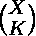

# 为每个查询选择任意长度的 K 个相等子串的方式数

> 原文:[https://www . geeksforgeeks . org/每次查询选择任意长度的 k 个相等子字符串的方式数/](https://www.geeksforgeeks.org/number-of-ways-of-choosing-k-equal-substrings-of-any-length-for-every-query/)

给定一个字符串**字符串**和 **Q** 查询。每个查询由一个整数 **K** 组成。任务是为每个查询找到选择任意长度的相等子串的方法数量。**注意**K 个子串的集合必须唯一。
**举例:**

> **输入:** str = "aabaab "，que[] = {3}
> **输出:**4
> “a”是唯一出现 3 次以上的子串即 4。
> 从给定的 4 个字符串中选择 3 个不同的字符串有 4 种方式。
> **输入:**str = " agghh "，que[] = {1，2，3}
> **输出:**
> 21
> 5
> 1

**方法:**可以遵循以下步骤来解决问题，并在尽可能短的时间内回答每个查询。

*   为一个字符串生成所有子字符串，并使用哈希算法计算每个唯一子字符串的出现次数。
*   对于每个查询，答案将是选择出现超过 K 次的每个字符串的 K 个子字符串(比如 X)。答案将是
*   通过预先计算[二项式](https://www.geeksforgeeks.org/binomial-coefficient-dp-9/)系数，可以降低每个查询的时间复杂度

以下是上述方法的实现:

## C++

```
// C++ implementation of the approach
#include <bits/stdc++.h>
using namespace std;
#define maxlen 100

// Function to generate all the sub-strings
void generateSubStrings(string s, unordered_map<string,
                                                int>& mpp)
{

    // Length of the string
    int l = s.length();

    // Generate all sub-strings
    for (int i = 0; i < l; i++) {
        string temp = "";
        for (int j = i; j < l; j++) {
            temp += s[j];

            // Count the occurrence of
            // every sub-string
            mpp[temp] += 1;
        }
    }
}

// Compute the Binomial Coefficient
void binomialCoeff(int C[maxlen][maxlen])
{
    int i, j;

    // Calculate value of Binomial Coefficient
    // in bottom up manner
    for (i = 0; i < 100; i++) {
        for (j = 0; j < 100; j++) {

            // Base Cases
            if (j == 0 || j == i)
                C[i][j] = 1;

            // Calculate value using previously
            // stored values
            else
                C[i][j] = C[i - 1][j - 1] + C[i - 1][j];
        }
    }
}

// Function to return the result for a query
int answerQuery(unordered_map<string, int>& mpp,
                int C[maxlen][maxlen], int k)
{
    int ans = 0;

    // Iterate for every
    // unique sub-string
    for (auto it : mpp) {

        // Count the combinations
        if (it.second >= k)
            ans += C[it.second][k];
    }

    return ans;
}

// Driver code
int main()
{
    string s = "aabaab";

    // Get all the sub-strings
    // Store the occurrence of
    // all the sub-strings
    unordered_map<string, int> mpp;
    generateSubStrings(s, mpp);

    // Pre-computation
    int C[maxlen][maxlen];
    memset(C, 0, sizeof C);
    binomialCoeff(C);

    // Queries
    int queries[] = { 2, 3, 4 };
    int q = sizeof(queries) / sizeof(queries[0]);

    // Perform queries
    for (int i = 0; i < q; i++)
        cout << answerQuery(mpp, C, queries[i]) << endl;

    return 0;
}
```

## Java 语言(一种计算机语言，尤用于创建网站)

```
// Java implementation of the approach
import java.util.HashMap;

class GFG
{
    static int maxlen = 100;

    // Function to generate all the sub-strings
    public static void generateSubStrings(
                       String s, HashMap<String,
                                         Integer> mpp)
    {

        // Length of the string
        int l = s.length();

        // Generate all sub-strings
        for (int i = 0; i < l; i++)
        {
            String temp = "";
            for (int j = i; j < l; j++)
            {
                temp += s.charAt(j);

                // Count the occurrence of
                // every sub-string
                if (mpp.containsKey(temp))
                {
                    int x = mpp.get(temp);
                    mpp.put(temp, ++x);
                }
                else
                    mpp.put(temp, 1);
            }
        }
    }

    // Compute the Binomial Coefficient
    public static void binomialCoeff(int[][] C)
    {
        int i, j;

        // Calculate value of Binomial Coefficient
        // in bottom up manner
        for (i = 1; i < 100; i++)
        {
            for (j = 0; j < 100; j++)
            {

                // Base Cases
                if (j == 0 || j == i)
                    C[i][j] = 1;

                // Calculate value using previously
                // stored values
                else
                    C[i][j] = C[i - 1][j - 1] +
                              C[i - 1][j];
            }
        }
    }

    // Function to return the result for a query
    public static int answerQuery(HashMap<String,
                                          Integer> mpp,
                                      int[][] C, int k)
    {
        int ans = 0;

        // Iterate for every
        // unique sub-string
        for (HashMap.Entry<String,
                           Integer> entry : mpp.entrySet())
        {

            // Count the combinations
            if (entry.getValue() >= k)
                ans += C[entry.getValue()][k];
        }
        return ans;
    }

    // Driver code
    public static void main(String[] args)
    {
        String s = "aabaab";

        // Get all the sub-strings
        // Store the occurrence of
        // all the sub-strings
        HashMap<String,
                Integer> mpp = new HashMap<>();
        generateSubStrings(s, mpp);

        // Pre-computation
        int[][] C = new int[maxlen][maxlen];
        binomialCoeff(C);

        // Queries
        int[] queries = { 2, 3, 4 };
        int q = queries.length;

        // Perform queries
        for (int i = 0; i < q; i++)
            System.out.println(answerQuery(mpp, C,
                                     queries[i]));
    }
}

// This code is contributed by
// sanjeev2552
```

## 蟒蛇 3

```
# Python3 implementation of the approach
from collections import defaultdict

maxlen = 100

# Function to generate all the sub-strings
def generateSubStrings(s, mpp):

    # Length of the string
    l = len(s)

    # Generate all sub-strings
    for i in range(0, l):
        temp = ""
        for j in range(i, l):
            temp += s[j]

            # Count the occurrence of
            # every sub-string
            mpp[temp] += 1

# Compute the Binomial Coefficient
def binomialCoeff(C):

    # Calculate value of Binomial
    # Coefficient in bottom up manner
    for i in range(0, 100):
        for j in range(0, 100):

            # Base Cases
            if j == 0 or j == i:
                C[i][j] = 1

            # Calculate value using previously
            # stored values
            else:
                C[i][j] = C[i - 1][j - 1] + C[i - 1][j]

# Function to return the result for a query
def answerQuery(mpp, C, k):

    ans = 0
    # Iterate for every
    # unique sub-string
    for it in mpp:

        # Count the combinations
        if mpp[it] >= k:
            ans += C[mpp[it]][k]

    return ans

# Driver code
if __name__ == "__main__":

    s = "aabaab"

    # Get all the sub-strings
    # Store the occurrence of
    # all the sub-strings
    mpp = defaultdict(lambda:0)
    generateSubStrings(s, mpp)

    # Pre-computation
    C = [[0 for i in range(maxlen)]
            for j in range(maxlen)]
    binomialCoeff(C)

    # Queries
    queries = [2, 3, 4]
    q = len(queries)

    # Perform queries
    for i in range(0, q):
        print(answerQuery(mpp, C, queries[i]))

# This code is contributed by Rituraj Jain
```

## C#

```
// C# code to print level order
// traversal in sorted order
using System;
using System.Collections.Generic;

class GFG
{
    static int maxlen = 100;

    // Function to generate all the sub-strings
    public static void generateSubStrings(String s,
                               Dictionary<String, int> mpp)
    {

        // Length of the string
        int l = s.Length;

        // Generate all sub-strings
        for (int i = 0; i < l; i++)
        {
            String temp = "";
            for (int j = i; j < l; j++)
            {
                temp += s[j];

                // Count the occurrence of
                // every sub-string
                if (mpp.ContainsKey(temp))
                {
                    mpp[temp] = ++mpp[temp];
                }
                else
                    mpp.Add(temp, 1);
            }
        }
    }

    // Compute the Binomial Coefficient
    public static void binomialCoeff(int[,] C)
    {
        int i, j;

        // Calculate value of Binomial Coefficient
        // in bottom up manner
        for (i = 1; i < 100; i++)
        {
            for (j = 0; j < 100; j++)
            {

                // Base Cases
                if (j == 0 || j == i)
                    C[i, j] = 1;

                // Calculate value using previously
                // stored values
                else
                    C[i, j] = C[i - 1, j - 1] +
                              C[i - 1, j];
            }
        }
    }

    // Function to return the result for a query
    public static int answerQuery(Dictionary<String, int> mpp,
                                           int[,] C, int k)
    {
        int ans = 0;

        // Iterate for every
        // unique sub-string
        foreach(KeyValuePair<String, int> entry in mpp)
        {

            // Count the combinations
            if (entry.Value >= k)
                ans += C[entry.Value, k];
        }
        return ans;
    }

    // Driver code
    public static void Main(String[] args)
    {
        String s = "aabaab";

        // Get all the sub-strings
        // Store the occurrence of
        // all the sub-strings
        Dictionary<String,
                   int> mpp = new Dictionary<String,   
                                             int>();
        generateSubStrings(s, mpp);

        // Pre-computation
        int[,] C = new int[maxlen, maxlen];
        binomialCoeff(C);

        // Queries
        int[] queries = { 2, 3, 4 };
        int q = queries.Length;

        // Perform queries
        for (int i = 0; i < q; i++)
            Console.WriteLine(answerQuery(mpp, C,
                                    queries[i]));
    }
}

// This code is contributed by 29AjayKumar
```

## java 描述语言

```
<script>

// JavaScript implementation of the approach

let maxlen = 100;

// Function to generate all the sub-strings
function generateSubStrings(s,mpp)
{
    // Length of the string
        let l = s.length;

        // Generate all sub-strings
        for (let i = 0; i < l; i++)
        {
            let temp = "";
            for (let j = i; j < l; j++)
            {
                temp += s[j];

                // Count the occurrence of
                // every sub-string
                if (mpp.has(temp))
                {
                    let x = mpp.get(temp);
                    mpp.set(temp, ++x);
                }
                else
                    mpp.set(temp, 1);
            }
        }
}

// Compute the Binomial Coefficient
function binomialCoeff(C)
{
    let i, j;

        // Calculate value of Binomial Coefficient
        // in bottom up manner
        for (i = 1; i < 100; i++)
        {
            for (j = 0; j < 100; j++)
            {

                // Base Cases
                if (j == 0 || j == i)
                    C[i][j] = 1;

                // Calculate value using previously
                // stored values
                else
                    C[i][j] = C[i - 1][j - 1] +
                              C[i - 1][j];
            }
        }
}

// Function to return the result for a query
function answerQuery(mpp,C,k)
{
    let ans = 0;

        // Iterate for every
        // unique sub-string
        for (let[key,value] of mpp.entries())
        {

            // Count the combinations
            if (value >= k)
                ans += C[value][k];
        }
        return ans;
}

// Driver code
let s = "aabaab";

// Get all the sub-strings
// Store the occurrence of
// all the sub-strings
let mpp = new Map();
generateSubStrings(s, mpp);

// Pre-computation
let C = new Array(maxlen);
for(let i=0;i<maxlen;i++)
{
    C[i]=new Array(maxlen);
    for(let j=0;j<maxlen;j++)
        C[i][j]=0;
}
binomialCoeff(C);

// Queries
let queries = [ 2, 3, 4 ];
let q = queries.length;

// Perform queries
for (let i = 0; i < q; i++)
    document.write(answerQuery(mpp, C,
                               queries[i])+"<br>");

// This code is contributed by rag2127

</script>
```

**Output:** 

```
10
4
1
```