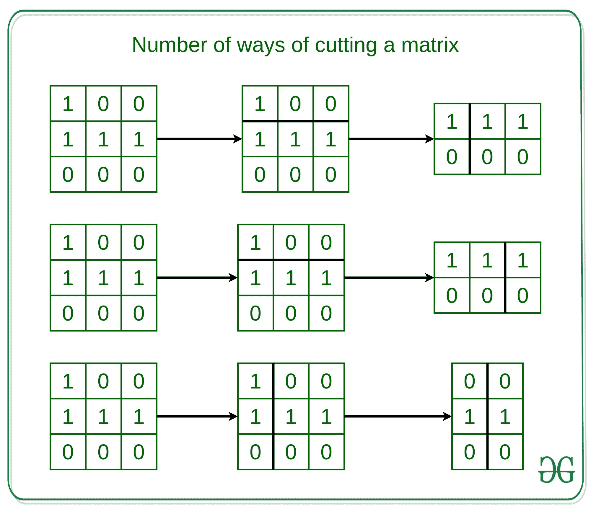

# 切割矩阵以使每个部分至少填充一个单元的方法数量

> 原文:[https://www . geeksforgeeks . org/切割矩阵的方式数量-每个部分至少填充一个单元/](https://www.geeksforgeeks.org/number-of-ways-of-cutting-a-matrix-such-that-atleast-one-cell-is-filled-in-each-part/)

给定一个整数 **K** 和一个包含 1 和 0 的矩阵 **mat[][]** ，其中 1 表示单元格已填充，0 表示一个空单元格。任务是找到使用 **K-1** 切割将矩阵切割成 **K** 部分的方法，使得矩阵的每个部分包含至少一个填充单元。

> 对于每个切口，必须有一个水平或垂直方向。然后在单元边界选择一个切割位置，将矩阵切割成两部分。如果您垂直切割矩阵，矩阵的左侧部分将不会再次用于进一步的处理。如果水平切割矩阵，矩阵的上部将不再使用。

**示例:**

> **输入:** mat[][] = {{1，0，0}，{1，1，1}，{0，0，0}}，K = 3
> T3】输出:3
> T6】解释:
> 
> 
> 
> **输入:**矩阵= {{1，0，0}，{1，1，0}，{0，0，0}}，K = 3
> T3】输出: 1

**方法:**想法是使用[动态编程](https://www.geeksforgeeks.org/dynamic-programming/)来计算切割具有至少一个填充单元的矩阵的方法的数量。

*   计算矩阵的[前缀和](https://www.geeksforgeeks.org/prefix-sum-array-implementation-applications-competitive-programming/)，这样我们就可以在 0(1)时间内计算出矩阵的特定部分是否包含一个填充的单元格。
*   定义一个 dp 表，存储将比萨切割成 K 个部分的方法数量，其中 dp[k][r]表示从左上方到第 R <sup>行和第 C <sup>列将矩阵切割成 K 个部分的方法数量。</sup></sup>
*   最后，对每一个可能的矩阵进行迭代，检查矩阵是否可以被分成两部分，直到索引，并且这两部分是否都有效。

下面是上述方法的实现:

## C++

```
// CPP implementation to find the
// number of ways to cut the matrix
// into the K parts such that each
// part have atleast one filled cell
#include <bits/stdc++.h>
using namespace std;

// Function  to find the number of
// ways to cut the matrix into the
// K parts such that each part have
// atleast one filled cell
int ways(vector<vector<int>> &arr, int K)
{
  int R = arr.size();
  int C = arr[0].size();

  int preSum[R][C];

  // Loop to find prefix sum of the
  // given matrix
  for (int r = R - 1; r >= 0; r--)
  {
    for (int c = C - 1; c >= 0; c--)
    {
      preSum[r] = arr[r];

      if (r + 1 < R) preSum[r] += preSum[r + 1];

      if (c + 1 < C) preSum[r] += preSum[r];

      if (r + 1 < R && c + 1 < C) preSum[r] -= preSum[r + 1];
    }
  }

  // dp(r, c, 1) = 1
  // if preSum[r] else 0
  int dp[K + 1][R][C];

  // Loop to iterate over the dp
  // table of the given matrix
  for (int k = 1; k <= K; k++)
  {
    for (int r = R - 1; r >= 0; r--)
    {
      for (int c = C - 1; c >= 0; c--)
      {
        if (k == 1)
        {
          dp[k][r] = (preSum[r] > 0) ? 1 : 0;
        } else {
          dp[k][r] = 0;
          for (int r1 = r + 1; r1 < R; r1++)
          {

            // Check if can cut horizontally
            // at r1, at least one apple in
            // matrix (r, c) -> r1, C-1
            if (preSum[r] - preSum[r1] > 0)
              dp[k][r] += dp[k - 1][r1];
          }
          for (int c1 = c + 1; c1 < C; c1++)
          {

            // Check if we can cut vertically
            // at c1, at least one apple in
            // matrix (r, c) -> R-1, c1
            if (preSum[r] - preSum[r][c1] > 0)
              dp[k][r] += dp[k - 1][r][c1];
          }
        }
      }
    }
  }
  return dp[K][0][0];
}

// Driver code
int main()
{
  vector<vector<int>> arr = {{1, 0, 0}, {1, 1, 1}, {0, 0, 0}};
  int k = 3;

  // Function Call
  cout << ways(arr, k) << endl;
  return 0;
}

// This code is contributed by sanjeev2552
```

## Java 语言(一种计算机语言，尤用于创建网站)

```
// Java implementation to find the 
// number of ways to cut the matrix 
// into the K parts such that each
// part have atleast one filled cell
import java.util.*;
import java.lang.*;
import java.io.*;

class GFG{

// Function  to find the number of
// ways to cut the matrix into the
// K parts such that each part have
// atleast one filled cell    
static int ways(int[][] arr, int K)
{
    int R = arr.length;
    int C = arr[0].length;

    int[][] preSum = new int[R][C];

    // Loop to find prefix sum of the 
    // given matrix
    for(int r = R - 1; r >= 0; r--)
    {
        for(int c = C - 1; c >= 0; c--)
        {
            preSum[r] = arr[r];

            if (r + 1 < R)
            preSum[r] += preSum[r + 1];

            if (c + 1 < C)
            preSum[r] += preSum[r];

            if (r + 1 < R && c + 1 < C)
            preSum[r] -= preSum[r + 1];
        }
    }

    // dp(r, c, 1) = 1 
    // if preSum[r] else 0
    int[][][] dp = new int[K + 1][R][C];

    // Loop to iterate over the dp 
    // table of the given matrix
    for(int k = 1; k <= K; k++)
    {
        for(int r = R - 1; r >= 0; r--)
        {
            for(int c = C - 1; c >= 0; c--)
            {
                if (k == 1)
                {
                    dp[k][r] = (preSum[r] > 0) ?
                                              1 : 0;
                }
                else
                {
                    dp[k][r] = 0;
                    for(int r1 = r + 1; r1 < R; r1++)
                    {

                        // Check if can cut horizontally
                        // at r1, at least one apple in 
                        // matrix (r, c) -> r1, C-1
                        if (preSum[r] - preSum[r1] > 0)
                             dp[k][r] += dp[k - 1][r1];
                    }
                    for(int c1 = c + 1; c1 < C; c1++)
                    {

                        // Check if we can cut vertically 
                        // at c1, at least one apple in 
                        // matrix (r, c) -> R-1, c1
                        if (preSum[r] - preSum[r][c1] > 0)
                            dp[k][r] += dp[k - 1][r][c1];
                    }
                }
            }
        }
    }
    return dp[K][0][0];
}

// Driver code
public static void main(String[] args)
{
    int[][] arr = { { 1, 0, 0 },
                    { 1, 1, 1 },
                    { 0, 0, 0 } };
    int k = 3;

    // Function Call
    System.out.println(ways(arr, k));
}
}

// This code is contributed by offbeat
```

## 蟒蛇 3

```
# Python3 implementation to find the
# number of ways to cut the matrix
# into the K parts such that each
# part have atleast one filled cell

# Function  to find the
# number of ways to cut the matrix
# into the K parts such that each
# part have atleast one filled cell
def ways(arr, k):
    R = len(arr)
    C = len(arr[0])
    K = k
    preSum = [[0 for _ in range(C)]\
                 for _ in range(R)]

    # Loop to find prefix sum of the
    # given matrix
    for r in range(R-1, -1, -1):
        for c in range(C-1, -1, -1):
            preSum[r] = arr[r]

            if r + 1 < R:
                preSum[r] += preSum[r + 1]
            if c + 1 < C:
                preSum[r] += preSum[r]

            if r + 1 < R and c + 1 < C:
                preSum[r] -= preSum[r + 1]

    # dp(r, c, 1) = 1
    # if preSum[r] else 0
    dp = [[[0 for _ in range(C)]\
              for _ in range(R)]\
              for _ in range(K + 1)]

    # Loop to iterate over the dp
    # table of the given matrix
    for k in range(1, K + 1):
        for r in range(R-1, -1, -1):
            for c in range(C-1, -1, -1):
                if k == 1:
                    dp[k][r] = 1 \
                        if preSum[r] > 0\
                        else 0
                else:
                    dp[k][r] = 0
                    for r1 in range(r + 1, R):

                        # Check if can cut horizontally
                        # at r1, at least one apple in
                        # matrix (r, c) -> r1, C-1
                        if preSum[r] - preSum[r1] > 0:
                            dp[k][r] += dp[k-1][r1]
                    for c1 in range(c + 1, C):

                        # Check if we can cut vertically
                        # at c1, at least one apple in
                        # matrix (r, c) -> R-1, c1
                        if preSum[r] - preSum[r][c1] > 0:
                            dp[k][r] += dp[k-1][r][c1]
    return dp[K][0][0]

# Driver Code
if __name__ == "__main__":
    arr = [[1, 0, 0], [1, 1, 1], [0, 0, 0]]
    k = 3

    # Function Call
    print(ways(arr, k))
```

## C#

```
// C# implementation to find the
// number of ways to cut the matrix
// into the K parts such that each
// part have atleast one filled cell
using System;
class GFG {

    // Function  to find the number of
    // ways to cut the matrix into the
    // K parts such that each part have
    // atleast one filled cell
    static int ways(int[, ] arr, int K)
    {
        int R = arr.GetLength(0);
        int C = arr.GetLength(1);

        int[, ] preSum = new int[R, C];

        // Loop to find prefix sum of the
        // given matrix
        for (int r = R - 1; r >= 0; r--) {
            for (int c = C - 1; c >= 0; c--) {
                preSum[r, c] = arr[r, c];

                if (r + 1 < R)
                    preSum[r, c] += preSum[r + 1, c];

                if (c + 1 < C)
                    preSum[r, c] += preSum[r, c + 1];

                if (r + 1 < R && c + 1 < C)
                    preSum[r, c] -= preSum[r + 1, c + 1];
            }
        }

        // dp(r, c, 1) = 1
        // if preSum[r] else 0
        int[, , ] dp = new int[K + 1, R, C];

        // Loop to iterate over the dp
        // table of the given matrix
        for (int k = 1; k <= K; k++) {
            for (int r = R - 1; r >= 0; r--) {
                for (int c = C - 1; c >= 0; c--) {
                    if (k == 1) {
                        dp[k, r, c]
                            = (preSum[r, c] > 0) ? 1 : 0;
                    }
                    else {
                        dp[k, r, c] = 0;
                        for (int r1 = r + 1; r1 < R; r1++) {

                            // Check if can cut horizontally
                            // at r1, at least one apple in
                            // matrix (r, c) -> r1, C-1
                            if (preSum[r, c] - preSum[r1, c]
                                > 0)
                                dp[k, r, c]
                                    += dp[k - 1, r1, c];
                        }
                        for (int c1 = c + 1; c1 < C; c1++) {

                            // Check if we can cut
                            // vertically at c1, at least
                            // one apple in matrix (r, c) ->
                            // R-1, c1
                            if (preSum[r, c] - preSum[r, c1]
                                > 0)
                                dp[k, r, c]
                                    += dp[k - 1, r, c1];
                        }
                    }
                }
            }
        }
        return dp[K, 0, 0];
    }

    // Driver code
    public static void Main(string[] args)
    {
        int[, ] arr
            = { { 1, 0, 0 }, { 1, 1, 1 }, { 0, 0, 0 } };
        int k = 3;

        // Function Call
        Console.WriteLine(ways(arr, k));
    }
}

// This code is contributed by ukasp.
```

## java 描述语言

```
<script>
// Javascript implementation to find the
// number of ways to cut the matrix
// into the K parts such that each
// part have atleast one filled cell

// Function  to find the number of
// ways to cut the matrix into the
// K parts such that each part have
// atleast one filled cell   
function ways(arr, K)
{
    let R = arr.length;
    let C = arr[0].length;

    let preSum = new Array(R);
    for(let i = 0; i < R; i++)
    {
        preSum[i] = new Array(C);
        for(let j = 0; j < C; j++)
        {
            preSum[i][j] = 0;
        }
    }

    // Loop to find prefix sum of the
    // given matrix
    for(let r = R - 1; r >= 0; r--)
    {
        for(let c = C - 1; c >= 0; c--)
        {
            preSum[r] = arr[r];

            if (r + 1 < R)
            preSum[r] += preSum[r + 1];

            if (c + 1 < C)
            preSum[r] += preSum[r];

            if (r + 1 < R && c + 1 < C)
            preSum[r] -= preSum[r + 1];
        }
    }

    // dp(r, c, 1) = 1
    // if preSum[r] else 0
    let dp = new Array(K + 1);
    for(let i = 0; i < dp.length; i++)
    {
        dp[i] = new Array(R);
        for(let j = 0; j < R; j++)
        {
            dp[i][j] = new Array(C);
            for(let k = 0; k < C; k++)
            {
                dp[i][j][k] = 0;
            }
        }
    }

    // Loop to iterate over the dp
    // table of the given matrix
    for(let k = 1; k <= K; k++)
    {
        for(let r = R - 1; r >= 0; r--)
        {
            for(let c = C - 1; c >= 0; c--)
            {
                if (k == 1)
                {
                    dp[k][r] = (preSum[r] > 0) ?
                                              1 : 0;
                }
                else
                {
                    dp[k][r] = 0;
                    for(let r1 = r + 1; r1 < R; r1++)
                    {

                        // Check if can cut horizontally
                        // at r1, at least one apple in
                        // matrix (r, c) -> r1, C-1
                        if (preSum[r] - preSum[r1] > 0)
                             dp[k][r] += dp[k - 1][r1];
                    }
                    for(let c1 = c + 1; c1 < C; c1++)
                    {

                        // Check if we can cut vertically
                        // at c1, at least one apple in
                        // matrix (r, c) -> R-1, c1
                        if (preSum[r] - preSum[r][c1] > 0)
                            dp[k][r] += dp[k - 1][r][c1];
                    }
                }
            }
        }
    }
    return dp[K][0][0];
}

// Driver code
let arr = [[1, 0, 0 ],
                    [ 1, 1, 1 ],
                    [ 0, 0, 0 ]];
    let k = 3;

    // Function Call
    document.write(ways(arr, k));

// This code is contributed by avanitrachhadiya2155.
</script>
```

**Output:** 

```
3
```