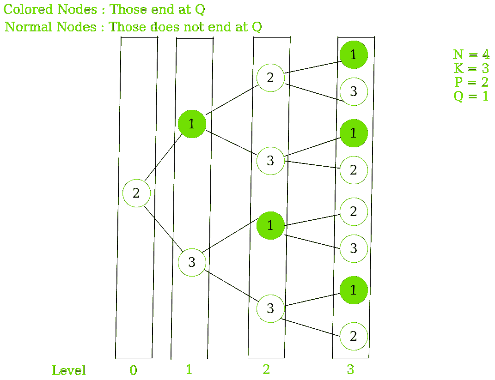

# 在给定的约束条件下，排列 1 到 K 范围内的 N 个数字的方式数。

> 原文:[https://www . geeksforgeeks . org/在给定约束条件下排列 n 个数字的方式数范围从 1 到 k/](https://www.geeksforgeeks.org/number-of-ways-to-arrange-n-numbers-which-are-in-a-range-from-1-to-k-under-given-constraints/)

给定四个整数 **N** 、 **K** 、 **P** 和 **Q** 。任务是计算排列从 1 到 K 范围内的 N 个数字的方法的数量，使得第一个数字是 P，最后一个数字是 Q，并且没有两个相邻的数字是连续的。
**示例:**

```
Input:  N = 4, K = 3, P = 2, Q = 3 
Output: 3
Explanation:
For N=4, K=3, P=2, Q=3,
ways are [2, 1, 2, 3], [2, 3, 1, 3], [2, 3, 2, 3]

Input:  N = 5, K = 3, P = 2, Q = 1 
Output: 5

```

**方法:**思路是用[动态规划](https://www.geeksforgeeks.org/dynamic-programming/)解决这个问题。

*   我们举个例子来试着理解一下，N = 4，K = 3，P = 2，Q = 1。
    我们将观察从 P 开始的所有可能的排列，并试图找到对应用动态规划有用的任何模式。
*   下图显示了从 P = 2 开始的所有可能的排列。
    

*   设 A 是由在特定级别以 Q 结尾的节点数组成的数组
    A = { 0，1，1，3 }
    设 B 是由在特定级别不以 Q 结尾的节点数组成的数组
    B = {1，1，3，5 }
*   仔细观察可以发现:
    1.  **A[i] = B[i-1]**
        原因:
        所有的有利节点(以 Q 结尾)只会由前一级的非有利节点(不以 Q 结尾)产生。

    2.  **B[I]= A[I-1]*(K–1)+B[I-1]*(K–2)**
        原因:
        *   对于 A[I-1]*(K-1)，一些非有利节点由前一级的有利节点产生，乘以(K-1)，因为每个有利节点将产生 K-1 个非有利节点
        *   对于 B[I-1]*(K–2)，剩余的非有利节点由前一级的非有利节点产生，乘以(K-2)，因为一个产生的节点是有利的，所以我们从中减去 2。

## C++

```
// C++ program to calculate Number of 
// ways to arrange N numbers under
// given constraints.
#include <bits/stdc++.h>
using namespace std;

class element {
public:
    // For favourable nodes 
    // (ending at Q)
    int A;

    // For Non-favourable nodes
    // (NOT ending at Q)
    int B;
};

// Function to print Total number
// of ways
void NumberOfWays(int n, int k, int p, 
                                int q)
{
    element* dp = new element[n];

    // If the First number and the
    // last number is same.
    if (p == q) {
        dp[0].A = 1;
        dp[0].B = 0;
    }
    else
    {
        dp[0].A = 0;
        dp[0].B = 1;
    }

    // DP approach to find current state 
    // with the help of previous state.
    for (int i = 1; i < n; i++)
    {
        dp[i].A = dp[i - 1].B;
        dp[i].B = (dp[i - 1].A * (k - 1))
                 + (dp[i - 1].B * (k - 2));
    }

    cout << dp[n - 1].A << endl;

    return;
}

// Driver code
int main()
{

   int N = 5;
   int K = 3;
   int P = 2;
   int Q = 1;

   // Function call
   NumberOfWays(N, K, P, Q);
}

```

## Java 语言(一种计算机语言，尤用于创建网站)

```
// Java program to calculate number of  
// ways to arrange N numbers under 
// given constraints. 
import java.io.*;
import java.util.*; 

class GFG{

// Function to print Total number 
// of ways 
static void NumberOfWays(int n, int k, 
                         int p, int q) 
{ 
    int[][] dp = new int[n][2]; 

    // If the First number and the 
    // last number is same. 
    if (p == q) 
    { 
        dp[0][0] = 1; 
        dp[0][1] = 0; 
    } 
    else
    { 
        dp[0][0] = 0; 
        dp[0][1] = 1; 
    } 

    // DP approach to find current state 
    // with the help of previous state. 
    for(int i = 1; i < n; i++) 
    { 
        dp[i][0] = dp[i - 1][1]; 
        dp[i][1] = (dp[i - 1][0] * (k - 1)) +
                   (dp[i - 1][1] * (k - 2)); 
    } 
    System.out.println(dp[n - 1][0]); 
} 

// Driver Code 
public static void main(String args[]) 
{ 
    int N = 5; 
    int K = 3; 
    int P = 2; 
    int Q = 1; 

    // Function call 
    NumberOfWays(N, K, P, Q); 
}
} 

// This code is contributed by offbeat
```

**Output:** 

```
5

```

**时间复杂度:** O(N)。