# 改变数组以使最大元素为数组的 LCM 的方法数

> 原文:[https://www . geeksforgeeks . org/更改数组的方式数-最大元素是数组的 LCM/](https://www.geeksforgeeks.org/number-of-ways-to-change-the-array-such-that-largest-element-is-lcm-of-array/)

给定一个数组 **arr[]** ，任务是通过将给定数组的元素更新为[1，arr[i]]范围内的任何元素，使得更新后的数组的[最小公倍数](https://www.geeksforgeeks.org/c-program-find-lcm-two-numbers/)等于最大元素，来计算可以形成的唯一数组的数量。

**示例:**

> **输入:** arr[] = {6，3}
> **输出:** 13
> **解释:**
> 可能的数组是–
> {[1，1]，[1，2]，[2，2]，[1，3]，
> [3，1]，[3，3]，[4，1]，[4，2]，[5，1]，
> [6，1]，[6]
> 
> **输入:** arr[] = {1，4，3，2 }
> T3】输出: 15

**进场:**

*   为了使最大元素成为数组的 LCM，我们需要固定数组的最大元素。
*   因为，我们已经固定了一些数字作为最大值，现在 LCM 为，我们需要确保数组中的每个元素都是的倍数，包括
*   我们将找到数字的因子，并找到将它们放置在数组中的方法的数量。
*   假设的因子是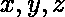。因素的计数是。
*   假设为的位置数表示数组中有个位置的个数大于等于，让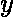有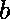个位置，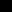有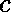个位置。
*   现在位置的、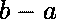位置的、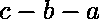位置的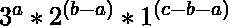等分配 x [/Tex]的方式有很多。
*   现在，我们必须减去那些有 LCM 但没有的路。
*   我们需要从这些方式中减去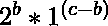。
*   我们将使用[位(二进制索引树)](https://www.geeksforgeeks.org/binary-indexed-tree-or-fenwick-tree-2/)来查找大于某个数字的位置数。

以下是上述方法的实现:

## C++

```
// C++ implementation to find the
// Number of ways to change the array
// such that maximum element of the
// array is the LCM of the array

#include <bits/stdc++.h>
using namespace std;

// Modulo
const int MOD = 1e9 + 7;
const int N = 1e5 + 5;

// Fenwick tree to find number
// of indexes greater than x
vector<int> BIT(N, 0);

// Function to compute
// x ^ y % MOD
int power(int x, int y)
{
    if (x == 0)
        return 0;

    int ans = 1;

    // Loop to compute the
    // x^y % MOD
    while (y > 0) {
        if (y & 1)
            ans = (1LL * ans * x) % MOD;

        x = (1LL * x * x) % MOD;
        y >>= 1;
    }
    return ans;
}

// Function to update the binary
// indexed tree
void updateBIT(int idx, int val)
{
    assert(idx > 0);
    while (idx < N) {
        BIT[idx] += val;
        idx += idx & -idx;
    }
}

// Function to find the prefix sum
// upto the current index
int queryBIT(int idx)
{
    int ans = 0;
    while (idx > 0) {
        ans += BIT[idx];
        idx -= idx & -idx;
    }
    return ans;
}

// Function to find the number of
// ways to change the array such
// that the LCM of array is
// maximum element of the array
int numWays(int arr[], int n)
{

    int mx = 0;
    for (int i = 0; i < n; i++) {

        // Updating BIT with the
        // frequency of elements
        updateBIT(arr[i], 1);

        // Maximum element in the array
        mx = max(mx, arr[i]);
    }

    // 1 is for every element
    // is 1 in the array;
    int ans = 1;
    for (int i = 2; i <= mx; i++) {

        // Vector for storing the factors
        vector<int> factors;
        for (int j = 1; j * j <= i; j++) {

            // finding factors of i
            if (i % j == 0) {
                factors.push_back(j);
                if (i / j != j)
                    factors.push_back(i / j);
            }
        }
        // Sorting in descending order
        sort(factors.rbegin(), factors.rend());

        int cnt = 1;

        // for storing number of indexex
        // greater than the i - 1 element
        int prev = 0;
        for (int j = 0; j < factors.size(); j++) {

            // Number of remaining factors
            int remFactors = int(factors.size()) - j;

            // Number of indexes in the array
            // with element factor[j] and above
            int indexes = n - queryBIT(factors[j] - 1);

            // Multiplying count with
            // remFcators ^ (indexes - prev)
            cnt = (1LL
                   * cnt
                   * power(remFactors,
                           indexes - prev))
                  % MOD;
            prev = max(prev, indexes);
        }

        // Remove those counts which have
        // lcm as i but i is not present
        factors.erase(factors.begin());

        int toSubtract = 1;
        prev = 0;

        // Loop to find the count which have
        // lcm as i  but i is not present
        for (int j = 0; j < factors.size(); j++) {
            int remFactors = int(factors.size()) - j;
            int indexes = n - queryBIT(factors[j] - 1);

            toSubtract = (1LL
                          * toSubtract
                          * power(remFactors,
                                  indexes - prev));
            prev = max(prev, indexes);
        }

        // Adding cnt - toSubtract to answer
        ans = (1LL * ans + cnt
               - toSubtract + MOD)
              % MOD;
    }
    return ans;
}

// Driver Code
int main()
{
    int arr[] = { 6, 3 };
    int n = sizeof(arr) / sizeof(arr[0]);

    int ans = numWays(arr, n);
    cout << ans << endl;
    return 0;
}
```

## 蟒蛇 3

```
# Python implementation to find the 
# Number of ways to change the array
# such that maximum element of the
# array is the LCM of the array

# Modulo
MOD = int(1e9) + 9
MAXN = int(1e5) + 5

# Fenwick tree to find number
# of indexes greater than x
BIT = [0 for _ in range(MAXN)]

# Function to compute
# x ^ y % MOD
def power(x, y):
    if x == 0:
        return 0
    ans = 1

    # Loop to compute the 
    # x ^ y % MOD
    while y > 0:
        if y % 2 == 1:
            ans = (ans * x) % MOD
        x = (x * x) % MOD
        y = y // 2
    return ans

# Function to update the 
# Binary Indexed Tree
def updateBIT(idx, val):

    # Loop to update the BIT
    while idx < MAXN:
        BIT[idx] += val
        idx += idx & (-idx)

# Function to find 
# prefix sum upto idx
def queryBIT(idx):
    ans = 0
    while idx > 0:
        ans += BIT[idx]
        idx -= idx & (-idx)
    return ans

# Function to find number of ways
# to change the array such that
# MAX of array is same as LCM
def numWays(arr):
    mx = 0

    # Updating BIT with the
    # frequency of elements
    for i in arr:
        updateBIT(i, 1)

        # Maximum element 
        # in the array
        mx = max(mx, i)

    ans = 1
    for i in range(2, mx + 1):

        # For storing factors of i
        factors = []
        for j in range(1, i + 1):
            if j * j > i:
                break

            # Finding factors of i
            if i % j == 0:
                factors.append(j)
                if i // j != j:
                    factors.append(i // j)

        # Sorting in descending order
        factors.sort()
        factors.reverse()

        # For storing ans
        cnt = 1

        # For storing number of indexes
        # greater than the i - 1 element
        prev = 0
        for j in range(len(factors)):

            # Number of remaining factors
            remFactors = len(factors) - j

            # Number of indexes in the array
            # with element factor[j] and above
            indexes = len(arr) - queryBIT(factors[j] - 1)

            # Multiplying count with 
            # remFcators ^ (indexes - prev)
            cnt = (cnt * power(remFactors, \
                     indexes - prev)) % MOD
            prev = max(prev, indexes)

        # Remove those counts which have
        # lcm as i but i is not present
        factors.remove(factors[0])

        toSubtract = 1
        prev = 0
        for j in range(len(factors)):
            remFactors = len(factors) - j
            indexes = len(arr) - queryBIT(factors[j] - 1)

            toSubtract = (toSubtract *\
              power(remFactors, indexes - prev))
            prev = max(prev, indexes)

        # Adding cnt - toSubtract to ans;
        ans = (ans + cnt - toSubtract + MOD) % MOD;

    return ans

# Driver Code
if __name__ == "__main__":
    arr = [1, 4, 3, 2]

    ans = numWays(arr);
    print(ans)
```

**Output:**

```
13

```

**时间复杂度:** 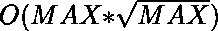，其中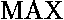是数组中最大的元素。