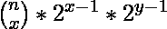

# 使用给定操作对 N-K 块进行着色的方式数量

> 原文:[https://www . geeksforgeeks . org/color-n-k-blocks-使用给定操作的方式数/](https://www.geeksforgeeks.org/number-of-ways-to-color-n-k-blocks-using-given-operation/)

给定 **N** 个块，其中 **K** 是彩色的。这些 K 色块由数组 **arr[]** 表示。任务是计算剩余未着色块的着色方法的数量，以便一个着色块中只有任何一个相邻块可以在一个步骤中着色。用模 10 <sup>9</sup> +7 打印答案。

**示例:**

> **输入:** N = 6，K = 3，arr[] = {1，2，6}
> **输出:** 4
> **解释:**
> 以下是给块着色的 4 种方式(每组 reblockquotesents 呈现块着色的顺序):
> 1。{3，4，5}
> 2。{3，5，4}
> 3。{5，3，4}
> 4。{5, 4, 3}
> 
> **输入:** N = 9，K = 3，A = [3，6，7]
> T3】输出: 180

**天真方法:**想法是使用[递归](https://www.geeksforgeeks.org/recursion/)。以下是步骤:

1.  从 1 到 n 遍历每个块
2.  如果当前块(比如 **b** )没有着色，那么检查相邻块中的一个是否着色。
3.  如果相邻的块是彩色的，那么给当前块着色，并递归迭代以找到下一个未着色的块。
4.  上述递归调用结束后，取消块引用递归调用的块着色，并对下一个未着色的块重复上述步骤。
5.  在上述所有递归调用中，对块进行着色的次数给出了对未着色块进行着色的方法。

下面是上述方法的实现:

## C++

```
// C++ program for the above approach

#include <bits/stdc++.h>
using namespace std;

const int mod = 1000000007;

// Recursive function to count the ways
int countWays(int colored[], int count,
              int n)
{

    // Base case
    if (count == n) {
        return 1;
    }

    // Initialise answer to 0
    int answer = 0;

    // Color each uncolored block according
    // to the given condition
    for (int i = 1; i < n + 1; i++) {

        // If any block is uncolored
        if (colored[i] == 0) {

            // Check if adjacent blocks
            // are colored or not
            if (colored[i - 1] == 1
                || colored[i + 1] == 1) {

                // Color the block
                colored[i] = 1;

                // recursively iterate for
                // next uncolored block
                answer = (answer
                          + countWays(colored,
                                      count + 1,
                                      n))
                         % mod;

                // Uncolored for the next
                // recursive call
                colored[i] = 0;
            }
        }
    }

    // Return the final count
    return answer;
}

// Function to count the ways to color
// block
int waysToColor(int arr[], int n, int k)
{

    // Mark which blocks are colored in
    // each recursive step
    int colored[n + 2] = { 0 };

    for (int i = 0; i < k; i++) {
        colored[arr[i]] = 1;
    }

    // Function call to count the ways
    return countWays(colored, k, n);
}

// Driver Code
int main()
{
    // Number of blocks
    int N = 6;

    // Number of colored blocks
    int K = 3;
    int arr[K] = { 1, 2, 6 };

    // Function call
    cout << waysToColor(arr, N, K);
    return 0;
}
```

## Java 语言(一种计算机语言，尤用于创建网站)

```
// Java program for the above approach
import java.util.*;
class GFG{

static int mod = 1000000007;

// Recursive function to count the ways
static int countWays(int colored[],
                     int count, int n)
{

    // Base case
    if (count == n)
    {
        return 1;
    }

    // Initialise answer to 0
    int answer = 0;

    // Color each uncolored block according
    // to the given condition
    for (int i = 1; i < n + 1; i++)
    {

        // If any block is uncolored
        if (colored[i] == 0)
        {

            // Check if adjacent blocks
            // are colored or not
            if (colored[i - 1] == 1 ||
                colored[i + 1] == 1)
            {

                // Color the block
                colored[i] = 1;

                // recursively iterate for
                // next uncolored block
                answer = (answer +
                          countWays(colored,
                                    count + 1,
                                    n)) % mod;

                // Uncolored for the next
                // recursive call
                colored[i] = 0;
            }
        }
    }

    // Return the final count
    return answer;
}

// Function to count the ways to color
// block
static int waysToColor(int arr[],
                       int n, int k)
{

    // Mark which blocks are colored in
    // each recursive step
    int colored[] = new int[n + 2];

    for (int i = 0; i < k; i++)
    {
        colored[arr[i]] = 1;
    }

    // Function call to count the ways
    return countWays(colored, k, n);
}

// Driver Code
public static void main(String[] args)
{
    // Number of blocks
    int N = 6;

    // Number of colored blocks
    int K = 3;
    int arr[] = { 1, 2, 6 };

    // Function call
    System.out.print(waysToColor(arr, N, K));
}
}

// This code is contributed by sapnasingh4991
```

## 蟒蛇 3

```
# Python3 program for the above approach
mod = 1000000007

# Recursive function to count the ways
def countWays(colored, count, n):

    # Base case
    if (count == n):
        return 1

    # Initialise answer to 0
    answer = 0

    # Color each uncolored block according
    # to the given condition
    for i in range(1, n + 1):

        # If any block is uncolored
        if (colored[i] == 0):

            # Check if adjacent blocks
            # are colored or not
            if (colored[i - 1] == 1 or
                colored[i + 1] == 1):

                # Color the block
                colored[i] = 1

                # recursively iterate for
                # next uncolored block
                answer = ((answer +
                           countWays(colored,
                                     count + 1,
                                       n)) % mod)

                # Uncolored for the next
                # recursive call
                colored[i] = 0

    # Return the final count
    return answer

# Function to count the ways to color
# block
def waysToColor( arr, n, k):

    # Mark which blocks are colored in
    # each recursive step
    colored = [0] * (n + 2)

    for i in range(k):
        colored[arr[i]] = 1

    # Function call to count the ways
    return countWays(colored, k, n)

# Driver Code
if __name__ == "__main__":

    # Number of blocks
    N = 6

    # Number of colored blocks
    K = 3
    arr = [ 1, 2, 6 ]

    # Function call
    print(waysToColor(arr, N, K))

# This code is contributed by chitranayal
```

## C#

```
// C# program for the above approach
using System;
class GFG{

static int mod = 1000000007;

// Recursive function to count the ways
static int countWays(int []colored,
                     int count, int n)
{

    // Base case
    if (count == n)
    {
        return 1;
    }

    // Initialise answer to 0
    int answer = 0;

    // Color each uncolored block according
    // to the given condition
    for (int i = 1; i < n + 1; i++)
    {

        // If any block is uncolored
        if (colored[i] == 0)
        {

            // Check if adjacent blocks
            // are colored or not
            if (colored[i - 1] == 1 ||
                colored[i + 1] == 1)
            {

                // Color the block
                colored[i] = 1;

                // recursively iterate for
                // next uncolored block
                answer = (answer +
                          countWays(colored,
                                    count + 1,
                                    n)) % mod;

                // Uncolored for the next
                // recursive call
                colored[i] = 0;
            }
        }
    }

    // Return the final count
    return answer;
}

// Function to count the ways to color
// block
static int waysToColor(int []arr,
                    int n, int k)
{

    // Mark which blocks are colored in
    // each recursive step
    int []colored = new int[n + 2];

    for (int i = 0; i < k; i++)
    {
        colored[arr[i]] = 1;
    }

    // Function call to count the ways
    return countWays(colored, k, n);
}

// Driver Code
public static void Main()
{
    // Number of blocks
    int N = 6;

    // Number of colored blocks
    int K = 3;
    int []arr = { 1, 2, 6 };

    // Function call
    Console.Write(waysToColor(arr, N, K));
}
}

// This code is contributed by Code_Mech
```

## java 描述语言

```
<script>

// Javascript program for the above approach

let mod = 1000000007;

// Recursive function to count the ways
function countWays(colored,
                     count, n)
{

    // Base case
    if (count == n)
    {
        return 1;
    }

    // Let initialise answer to 0
    let answer = 0;

    // Color each uncolored block according
    // to the given condition
    for (let i = 1; i < n + 1; i++)
    {

        // If any block is uncolored
        if (colored[i] == 0)
        {

            // Check if adjacent blocks
            // are colored or not
            if (colored[i - 1] == 1 ||
                colored[i + 1] == 1)
            {

                // Color the block
                colored[i] = 1;

                // recursively iterate for
                // next uncolored block
                answer = (answer +
                          countWays(colored,
                                    count + 1,
                                    n)) % mod;

                // Uncolored for the next
                // recursive call
                colored[i] = 0;
            }
        }
    }

    // Return the final count
    return answer;
}

// Function to count the ways to color
// block
function waysToColor(arr, n, k)
{

    // Mark which blocks are colored in
    // each recursive step
    let colored = Array.from({length: n+2}, (_, i) => 0);

    for (let i = 0; i < k; i++)
    {
        colored[arr[i]] = 1;
    }

    // Function call to count the ways
    return countWays(colored, k, n);
}

// Driver Code

    // Number of blocks
    let N = 6;

    // Number of colored blocks
    let K = 3;
    let arr = [ 1, 2, 6 ];

    // Function call
    document.write(waysToColor(arr, N, K));

</script>
```

**Output:** 

```
4
```

***时间复杂度:** O(N <sup>N-K</sup> )*

***辅助空间:** O(N)*

**高效方法:**为了高效地解决这个问题，我们将使用[排列组合](https://www.geeksforgeeks.org/permutation-and-combination/)的概念。以下是步骤:

1.如果两个连续彩色块之间的块数为 x，则给这组块着色的方法数由下式给出:

> 途径= 2 <sup>x-1</sup>

2.给每组未着色的块着色是相互独立的。假设一段有**个 x 块**，另一段有**个 y 块**。当两个部分合并时，求总组合由下式给出:

> 总组合= 

3.对彩色块索引进行排序，以找到每个未着色块部分的长度，并使用上述公式迭代和找到每个两部分的组合。

4.使用[这篇](https://www.geeksforgeeks.org/binomial-coefficient-dp-9/)文章中讨论的方法找到[二项式系数](https://www.geeksforgeeks.org/dynamic-programming-set-9-binomial-coefficient/)。

下面是上述方法的实现:

## C++

```
// C++ program for the above approach
#include <bits/stdc++.h>
using namespace std;

const int mod = 1000000007;

// Function to count the ways to color
// block
int waysToColor(int arr[], int n, int k)
{
    // For storing powers of 2
    int powOf2[500] = { 0 };

    // For storing binomial coefficient
    // values
    int c[500][500];

    // Calculating binomial coefficient
    // using DP
    for (int i = 0; i <= n; i++) {

        c[i][0] = 1;
        for (int j = 1; j <= i; j++) {
            c[i][j] = (c[i - 1][j]
                       + c[i - 1][j - 1])
                      % mod;
        }
    }

    powOf2[0] = powOf2[1] = 1;

    // Calculating powers of 2
    for (int i = 2; i <= n; i++) {

        powOf2[i] = powOf2[i - 1] * 2 % mod;
    }

    int rem = n - k;
    arr[k++] = n + 1;

    // Sort the indices to calculate
    // length of each section
    sort(arr, arr + k);

    // Initialise answer to 1
    int answer = 1;

    for (int i = 0; i < k; i++) {

        // Find the length of each section
        int x = arr[i] - (i - 1 >= 0
                              ? arr[i - 1]
                              : 0)
                - 1;

        // Merge this section
        answer *= c[rem][x] % mod * (i != 0
                                             && i != k - 1
                                         ? powOf2[x]
                                         : 1)
                  % mod;
        rem -= x;
    }

    // Return the final count
    return answer;
}

// Driver Code
int main()
{
    // Number of blocks
    int N = 6;

    // Number of colored blocks
    int K = 3;
    int arr[K] = { 1, 2, 6 };

    // Function call
    cout << waysToColor(arr, N, K);
    return 0;
}
```

## Java 语言(一种计算机语言，尤用于创建网站)

```
// Java program for the above approach
import java.util.*;

class GFG{

static int mod = 1000000007;

// Function to count the ways to color
// block
static int waysToColor(int arr[], int n, int k)
{

    // For storing powers of 2
    int powOf2[] = new int[500];

    // For storing binomial coefficient
    // values
    int [][]c = new int[500][500];

    // Calculating binomial coefficient
    // using DP
    for(int i = 0; i <= n; i++)
    {
       c[i][0] = 1;
       for(int j = 1; j <= i; j++)
       {
          c[i][j] = (c[i - 1][j] +
                     c[i - 1][j - 1]) % mod;
       }
    }

    powOf2[0] = powOf2[1] = 1;

    // Calculating powers of 2
    for(int i = 2; i <= n; i++)
    {
       powOf2[i] = powOf2[i - 1] * 2 % mod;
    }

    int rem = n - k;
    arr[k++] = n + 1;

    // Sort the indices to calculate
    // length of each section
    Arrays.sort(arr);

    // Initialise answer to 1
    int answer = 1;

    for(int i = 0; i < k; i++)
    {

       // Find the length of each section
       int x = arr[i] - (i - 1 >= 0 ?
                     arr[i - 1] : 0) - 1;

       // Merge this section
       answer *= c[rem][x] % mod * (i != 0 &&
                                    i != k - 1 ?
                                    powOf2[x] : 1) %
                                    mod;
       rem -= x;
    }

    // Return the final count
    return answer;
}

// Driver Code
public static void main(String[] args)
{

    // Number of blocks
    int N = 6;

    // Number of colored blocks
    int K = 3;
    int arr[] = { 1, 2, 6 ,0 };

    // Function call
    System.out.print(waysToColor(arr, N, K));
}
}

// This code is contributed by 29AjayKumar
```

## 蟒蛇 3

```
# Python3 program for the above approach
mod = 1000000007

# Function to count the ways to color
# block
def waysToColor(arr, n, k):

    global mod

    # For storing powers of 2
    powOf2 = [0 for i in range(500)]

    # For storing binomial coefficient
    # values
    c = [[0 for i in range(500)] for j in range(500)]

    # Calculating binomial coefficient
    # using DP
    for i in range(n + 1):

        c[i][0] = 1;

        for j in range(1, i + 1):

            c[i][j] = (c[i - 1][j]+ c[i - 1][j - 1])% mod;

    powOf2[0] = 1
    powOf2[1] = 1;

    # Calculating powers of 2
    for i in range(2, n + 1):

        powOf2[i] = (powOf2[i - 1] * 2) % mod;

    rem = n - k;
    arr[k] = n + 1;
    k += 1

    # Sort the indices to calculate
    # length of each section
    arr.sort()

    # Initialise answer to 1
    answer = 1;

    for i in range(k):

        x = 0

        # Find the length of each section
        if i - 1 >= 0:
            x = arr[i] - arr[i - 1] -1
        else:
            x = arr[i] - 1

        # Merge this section
        answer = answer * (c[rem][x] % mod) * ((powOf2[x] if (i != 0 and i != k - 1) else 1))% mod
        rem -= x;

    # Return the final count
    return answer;

# Driver Code
if __name__=='__main__':

    # Number of blocks
    N = 6;

    # Number of colored blocks
    K = 3;
    arr = [ 1, 2, 6, 0]

    # Function call
    print(waysToColor(arr, N, K))

# This code is contributed by rutvik_56
```

## C#

```
// C# program for the above approach
using System;
class GFG{

static int mod = 1000000007;

// Function to count the ways to color
// block
static int waysToColor(int []arr, int n, int k)
{

    // For storing powers of 2
    int []powOf2 = new int[500];

    // For storing binomial coefficient
    // values
    int [,]c = new int[500, 500];

    // Calculating binomial coefficient
    // using DP
    for(int i = 0; i <= n; i++)
    {
        c[i, 0] = 1;
        for(int j = 1; j <= i; j++)
        {
            c[i, j] = (c[i - 1, j] +
                       c[i - 1, j - 1]) % mod;
        }
    }

    powOf2[0] = powOf2[1] = 1;

    // Calculating powers of 2
    for(int i = 2; i <= n; i++)
    {
        powOf2[i] = powOf2[i - 1] * 2 % mod;
    }

    int rem = n - k;
    arr[k++] = n + 1;

    // Sort the indices to calculate
    // length of each section
    Array.Sort(arr);

    // Initialise answer to 1
    int answer = 1;

    for(int i = 0; i < k; i++)
    {

        // Find the length of each section
        int x = arr[i] - (i - 1 >= 0 ?
                arr[i - 1] : 0) - 1;

        // Merge this section
        answer *= c[rem, x] % mod * (i != 0 &&
                                     i != k - 1 ?
                                     powOf2[x] : 1) %
                                     mod;
        rem -= x;
    }

    // Return the readonly count
    return answer;
}

// Driver Code
public static void Main(String[] args)
{

    // Number of blocks
    int N = 6;

    // Number of colored blocks
    int K = 3;
    int []arr = { 1, 2, 6, 0 };

    // Function call
    Console.Write(waysToColor(arr, N, K));
}
}

// This code is contributed by 29AjayKumar
```

## java 描述语言

```
<script>

// JavaScript program for the above approach

let mod = 1000000007;

// Function to count the ways to color
// block
function waysToColor(arr,n,k)
{
    // For storing powers of 2
    let powOf2 = new Array(500);

    // For storing binomial coefficient
    // values
    let c = new Array(500);
    for(let i=0;i<500;i++)
    {
        c[i]=new Array(500);
        for(let j=0;j<500;j++)
        {
            c[i][j]=0;
        }
    }

    // Calculating binomial coefficient
    // using DP
    for(let i = 0; i <= n; i++)
    {
       c[i][0] = 1;
       for(let j = 1; j <= i; j++)
       {
          c[i][j] = (c[i - 1][j] +
                     c[i - 1][j - 1]) % mod;
       }
    }

    powOf2[0] = powOf2[1] = 1;

    // Calculating powers of 2
    for(let i = 2; i <= n; i++)
    {
       powOf2[i] = powOf2[i - 1] * 2 % mod;
    }

    let rem = n - k;
    arr[k++] = n + 1;

    // Sort the indices to calculate
    // length of each section
    arr.sort(function(a,b){return a-b;});

    // Initialise answer to 1
    let answer = 1;

    for(let i = 0; i < k; i++)
    {

       // Find the length of each section
       let x = arr[i] - (i - 1 >= 0 ?
                     arr[i - 1] : 0) - 1;

       // Merge this section
       answer *= c[rem][x] % mod * (i != 0 &&
                                    i != k - 1 ?
                                    powOf2[x] : 1) %
                                    mod;
       rem -= x;
    }

    // Return the final count
    return answer;
}

// Driver Code
// Number of blocks
let N = 6;

// Number of colored blocks
let K = 3;
let arr=[ 1, 2, 6 ,0];

// Function call
document.write(waysToColor(arr, N, K));

// This code is contributed by avanitrachhadiya2155

</script>
```

**Output:** 

```
4
```

***时间复杂度:** O(N <sup>2</sup> )*

***辅助空间:**O(5<sup>2</sup>* 10<sup>4</sup>)*