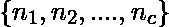
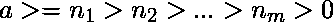
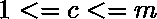

# 将一个给定的数按递减顺序划分为一组整数的方法数

> 原文:[https://www . geeksforgeeks . org/给定数字按递减顺序除以整数集的方法数/](https://www.geeksforgeeks.org/number-of-ways-to-divide-a-given-number-as-a-set-of-integers-in-decreasing-order/)

给定两个数字和。任务是找到用集合表示 **a** 的方法数，使得和这些数的和等于 **a** 。还有(套件最大尺寸不能超过 **m** )。

**示例**:

> **输入** : a = 4，m = 4
> **输出**:2–>({ 4 }、{3，1})
> **注意** : {2，2}不是一个有效的集合，因为值不是按降序排列的
> 
> **输入** : a = 7，m = 5
> 输出:5–>({ 7 }、{6，1}、{5，2}、{4，3}、{4，2，1})

**方法:**这个问题可以通过分治法使用递归方法来解决，该方法遵循以下条件:

*   如果 **a** 等于零，则找到了一个解。
*   如果 a > 0 且 m == 0，则该集合违反了条件，因为不能在该集合中添加更多的值。
*   如果已经对 **a** 、 **m** 和 prev(当前设置中包含的最后一个值)的给定值进行了计算，则返回该值。
*   从 **i** = **a** 到 0 开始循环，如果 **i** < **prev** ，如果我们在当前集合中包含 **i** ，则计算解的数量并返回。

下面是上述方法的实现:

```
# Python3 code to calculate the number of ways 
# in which a given number can be represented 
# as set of finite numbers

# Import function to initialize the dictionary
from collections import defaultdict

# Initialize dictionary which is used 
# to check if given solution is already 
# visited or not to avoid
# calculating it again
visited = defaultdict(lambda : False)

# Initialize dictionary which is used to
# store the number of ways in which solution
# can be obtained for given values
numWays = defaultdict(lambda : 0)

# This function returns the total number
# of sets which satisfy given criteria
# a --> number to be divided into sets
# m --> maximum possible size of the set
# x --> previously selected value
def countNumOfWays(a, m, prev):

    # number is divided properly and
    # hence solution is obtained
    if a == 0:
        return 1

    # Solution can't be obtained
    elif a > 0 and m == 0:
        return 0

    # Return the solution if it has
    # already been calculated
    elif visited[(a, m, prev)] == True:
        return numWays[(a, m, prev)]

    else:
        visited[(a, m, prev)] = True

        for i in range(a, -1, -1):
            # Continue only if current value is 
            # smaller compared to previous value
            if i < prev:
                numWays[(a,m,prev)] += countNumOfWays(a-i,m-1,i)

        return numWays[(a, m, prev)]

# Values of 'a' and 'm' for which
# solution is to be found
# MAX_CONST is extremely large value 
# used for first comparison in the function
a, m, MAX_CONST = 7, 5, 10**5
print(countNumOfWays(a, m, MAX_CONST))
```

**Output:**

```
5

```

**时间复杂度:** O(a*log(a))