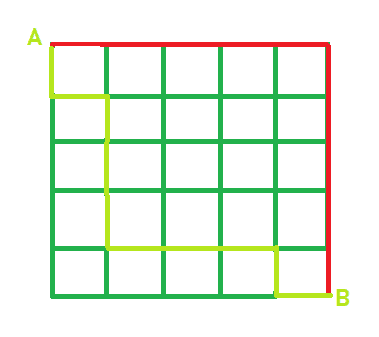

# 网格中从一点到另一点的路径数

> 原文:[https://www . geeksforgeeks . org/从一个网格点到另一个网格的路线数/](https://www.geeksforgeeks.org/number-of-ways-to-go-from-one-point-to-another-in-a-grid/)

给定水平和垂直道路的 **NxN** 网格。任务是找出这个人可以用最短的路径从 A 点到 B 点的路的数量。
**注:** A、B 点固定，即 A 位于左上角，B 位于右下角，如下图所示。



在上图中，红色和浅绿色所示的路径是从 A 点到 b 点的两条可能路径。
**示例:**

```
Input: N = 3
Output: Ways = 20

Input: N = 4
Output: Ways = 70
```

**公式:**
让网格为 N×N，路数可以写成。


**以上公式是如何工作的？**
让我们考虑一下上面所示的 5×5 网格的例子。为了从 5×5 网格中的 A 点到 B 点，我们必须走 5 个水平步和 5 个垂直步。每条路径将由 10 个台阶组成，其中 5 个台阶在一种情况下是相同的，另外 5 个台阶在另一种情况下是相同的。因此
路数= 10！/ (5!* 5!)即 252 种方式。

## C++

```
// C++ implementation of above approach
#include <bits/stdc++.h>
using namespace std;

// function that will
// calculate the factorial
long factorial(int N)
{
    int result = 1;
    while (N > 0) {
        result = result * N;
        N--;
    }
    return result;
}

long countWays(int N)
{
    long total = factorial(N + N);
    long total1 = factorial(N);
    return (total / total1) / total1;
}

// Driver code
int main()
{
    int N = 5;
    cout << "Ways = " << countWays(N);
    return 0;
}
```

## Java 语言(一种计算机语言，尤用于创建网站)

```
// Java implementation of above approach
class GfG {

    // function that will
    // calculate the factorial
    static long factorial(int N)
    {
        int result = 1;
        while (N > 0) {
            result = result * N;
            N--;
        }
        return result;
    }

    static long countWays(int N)
    {
        long total = factorial(N + N);
        long total1 = factorial(N);
        return (total / total1) / total1;
    }

    // Driver code
    public static void main(String[] args)
    {
        int N = 5;
        System.out.println("Ways = " + countWays(N));
    }
}
```

## 蟒蛇 3

```
# Python3 implementation of above approach

# function that will calculate the factorial
def factorial(N) :

    result = 1;

    while (N > 0) :

        result = result * N;
        N -= 1;

    return result;

def countWays(N) :

    total = factorial(N + N);
    total1 = factorial(N);

    return (total // total1) // total1;

# Driver code
if __name__ == "__main__" :

    N = 5;

    print("Ways =", countWays(N));

# This code is contributed by Ryuga
```

## C#

```
// C# implementation of above approach
using System;
class GfG
{

    // function that will
    // calculate the factorial
    static long factorial(int N)
    {
        int result = 1;
        while (N > 0)
        {
            result = result * N;
            N--;
        }
        return result;
    }

    static long countWays(int N)
    {
        long total = factorial(N + N);
        long total1 = factorial(N);
        return (total / total1) / total1;
    }

    // Driver code
    public static void Main(String []args)
    {
        int N = 5;
        Console.WriteLine("Ways = " + countWays(N));
    }
}

// This code is contributed by Arnab Kundu
```

## 服务器端编程语言（Professional Hypertext Preprocessor 的缩写）

```
<?php
// PHP implementation of above approach

// function that will
// calculate the factorial
function factorial($N)
{
    $result = 1;
    while ($N > 0)
    {
        $result = $result * $N;
        $N--;
    }
    return $result;
}

function countWays($N)
{
    $total = factorial($N + $N);
    $total1 = factorial($N);
    return ($total / $total1) / $total1;
}

// Driver code
$N = 5;
echo "Ways = ", countWays($N);

// This code is contributed by ajit
?>
```

## java 描述语言

```
<script>

// Javascript implementation of above approach

// function that will
// calculate the factorial
function factorial(N)
{
    var result = 1;
    while (N > 0) {
        result = result * N;
        N--;
    }
    return result;
}

function countWays(N)
{
    var total = factorial(N + N);
    var total1 = factorial(N);
    return (total / total1) / total1;
}

// Driver code
var N = 5;
document.write( "Ways = " + countWays(N));

// This code is contributed by rutvik_56.
</script>
```

**Output:** 

```
Ways = 252
```