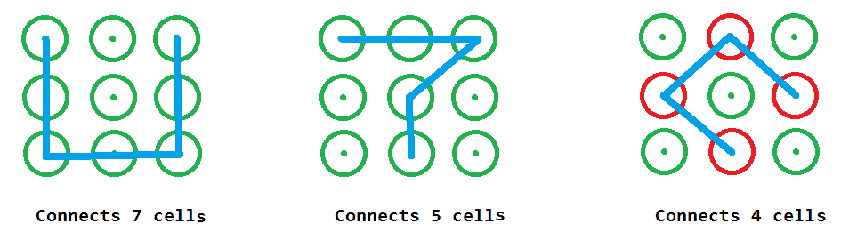
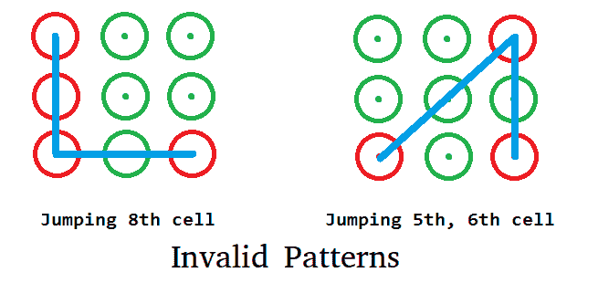

# 制作移动锁图案的方法数量

> 原文:[https://www . geeksforgeeks . org/移动锁模式的制造方式数/](https://www.geeksforgeeks.org/number-of-ways-to-make-mobile-lock-pattern/)

移动模式是一个 3X3 单元格的网格，在这里绘制一个特定的模式(按顺序连接特定的单元格序列)将解锁移动。在这个问题中，任务是用给定范围内的连接数计算生成锁模式的方法数。一般来说，我们给定一个最小和最大的范围，我们需要告诉多少模式可以使用至少最小连接单元和最多最大连接单元。

```
Input  : min = 5, max = 7
Output : 106080
Below are some example patterns

```



一个简单的解决方案是通过从所有的起点经过各种连接来进行简单的 DFS。我们可以通过看到图案之间的对称性来优化，我们可以把 1 号、3 号、7 号和 9 号细胞视为相同的。同样，我们也可以把 2、4、6、8 看成是一样的。同组成员返回的答案可以乘以 4 得到所有成员的结果。
接下来要注意的是，下面的模式无效，因为不允许跳转某些单元格，如下图所示，单元格 8 和单元格 5、6 被跳转。



为了处理这种无效的移动，在下面的代码中采用了一个 2D 跳转数组，它在跳转数组中存储了可能的跳转单元。当我们递归调用时，我们强加了一个额外的条件，如果我们从一个单元格移动到另一个单元格，这涉及到一些跳转单元格，那么这个单元格应该已经被访问过，以忽略无效的移动。
在下面的代码中，我们从 1、2 和 5 进行递归调用，只是因为 1 将覆盖 3、5 和 7，而 2 由于对称性将覆盖 4、6 和 8。
为了更好的理解，请参见下面的代码:

## C++

```
//  C/C++ program to find number of ways to lock the mobile
// pattern
#include <bits/stdc++.h>
using namespace std;
#define DOTS 10

//  method to find total pattern starting from current cell
int totalPatternFromCur(bool visit[DOTS], int jump[DOTS][DOTS],
                                          int cur, int toTouch)
{
    if (toTouch <= 0)
    {
        //  if last cell then return 1 way
        return (toTouch == 0)? 1 : 0;
    }

    int ways = 0;

    //  make this cell visited before going to next call
    visit[cur] = true;

    for (int i=1; i<DOTS; i++)
    {
       /*  if this cell is not visit AND
           either i and cur are adjacent (then jump[i][cur] = 0)
           or between cell must be visit already (
           then visit[jump[i][cur]] = 1)   */
       if (!visit[i] && (!jump[i][cur] || visit[jump[i][cur]]))
         ways += totalPatternFromCur(visit, jump, i, toTouch - 1);
    }

    //  make this cell not visited after returning from call
    visit[cur] = false;

    return ways;
}

//  method returns number of pattern with minimum m connection
// and maximum n connection
int waysOfConnection(int m, int n)
{
    int jump[DOTS][DOTS] = {0};

    //  2 lies between 1 and 3
    jump[1][3] = jump[3][1] = 2;

    //  8 lies between 7 and 9
    jump[7][9] = jump[9][7] = 8;

    //  4 lies between 1 and 7
    jump[1][7] = jump[7][1] = 4;

    //  6 lies between 3 and 9
    jump[3][9] = jump[9][3] = 6;

    //  5 lies between 1, 9  2, 8  3, 7 and 4, 6
    jump[1][9] = jump[9][1] = jump[2][8] = jump[8][2]
     = jump[3][7] = jump[7][3] = jump[4][6] = jump[6][4] = 5;

    bool visit[DOTS] = {0};
    int ways = 0;
    for (int i = m; i <= n; i++)
    {
        //  1, 3, 7, 9 are symmetric so multiplying by 4
        ways += 4 * totalPatternFromCur(visit, jump, 1, i - 1);

        //  2, 4, 6, 8 are symmetric so multiplying by 4
        ways += 4 * totalPatternFromCur(visit, jump, 2, i - 1);

        ways += totalPatternFromCur(visit, jump, 5, i - 1);
    }

    return ways;
}

//  Driver code to test above method
int main()
{
    int minConnect = 4;
    int maxConnect = 6;

    cout << waysOfConnection(minConnect, maxConnect);

    return 0;
}
```

## Java 语言(一种计算机语言，尤用于创建网站)

```
// Java program to find number of ways
// to lock the mobile pattern
class GFG
{
static int DOTS = 10;

// method to find total pattern starting from current cell
static int totalPatternFromCur(boolean visit[], int jump[][],
                                       int cur, int toTouch)
{
    if (toTouch <= 0)
    {
        // if last cell then return 1 way
        return (toTouch == 0) ? 1 : 0;
    }

    int ways = 0;

    // make this cell visited before
    // going to next call
    visit[cur] = true;

    for (int i = 1; i < DOTS; i++)
    {

    /* if this cell is not visit AND
        either i and cur are adjacent (then jump[i][cur] = 0)
        or between cell must be visit already (
        then visit[jump[i][cur]] = 1) */
    if (!visit[i] && (jump[i][cur] == 0 ||
         visit[jump[i][cur]]))
        ways += totalPatternFromCur(visit, jump,
                                    i, toTouch - 1);
    }

    // make this cell not visited
    // after returning from call
    visit[cur] = false;

    return ways;
}

// method returns number of pattern with
// minimum m connection and maximum n connection
static int waysOfConnection(int m, int n)
{
    int [][]jump = new int[DOTS][DOTS];

    // 2 lies between 1 and 3
    jump[1][3] = jump[3][1] = 2;

    // 8 lies between 7 and 9
    jump[7][9] = jump[9][7] = 8;

    // 4 lies between 1 and 7
    jump[1][7] = jump[7][1] = 4;

    // 6 lies between 3 and 9
    jump[3][9] = jump[9][3] = 6;

    // 5 lies between 1, 9 2, 8 3, 7 and 4, 6
    jump[1][9] = jump[9][1] = jump[2][8] =
                 jump[8][2] = jump[3][7] =
                 jump[7][3] = jump[4][6] =
                 jump[6][4] = 5;

    boolean []visit = new boolean[DOTS];
    int ways = 0;
    for (int i = m; i <= n; i++)
    {
        // 1, 3, 7, 9 are symmetric so multiplying by 4
        ways += 4 * totalPatternFromCur(visit,
                                        jump, 1, i - 1);

        // 2, 4, 6, 8 are symmetric so multiplying by 4
        ways += 4 * totalPatternFromCur(visit,
                                        jump, 2, i - 1);

        ways += totalPatternFromCur(visit,
                                    jump, 5, i - 1);
    }
    return ways;
}

// Driver Code
public static void main(String[] args)
{
    int minConnect = 4;
    int maxConnect = 6;

    System.out.println(waysOfConnection(minConnect,
                                        maxConnect));
}
}

// This code is contributed by PrinciRaj1992
```

## 蟒蛇 3

```
# Python3 program to find number of ways
# to lock the mobile pattern

DOTS = 10;

# method to find total pattern starting from current cell
def totalPatternFromCur(visit, jump, cur, toTouch):
    if (toTouch <= 0):

        # if last cell then return 1 way
        if (toTouch == 0):
            return 1;
        else:
            return 0;

    ways = 0;

    # make this cell visited before
    # going to next call
    visit[cur] = True;

    for i in range(1, DOTS):

        '''
        * if this cell is not visit AND either i and cur are adjacent (then
        * jump[i][cur] = 0) or between cell must be visit already ( then
        * visit[jump[i][cur]] = 1)
        '''
        if (visit[i] == False and (jump[i][cur] == 0 or visit[jump[i][cur]])):
            ways += totalPatternFromCur(visit, jump, i, toTouch - 1);

    # make this cell not visited
    # after returning from call
    visit[cur] = False;

    return ways;

# method returns number of pattern with
# minimum m connection and maximum n connection
def waysOfConnection(m, n):
    jump = [[0 for i in range(DOTS)] for j in range(DOTS)];

    # 2 lies between 1 and 3
    jump[1][3] = jump[3][1] = 2;

    # 8 lies between 7 and 9
    jump[7][9] = jump[9][7] = 8;

    # 4 lies between 1 and 7
    jump[1][7] = jump[7][1] = 4;

    # 6 lies between 3 and 9
    jump[3][9] = jump[9][3] = 6;

    # 5 lies between 1, 9 2, 8 3, 7 and 4, 6
    jump[1][9] = jump[9][1] = jump[2][8] = jump[8][2] =\
        jump[3][7] = jump[7][3] = jump[4][6] = jump[6][4] = 5;

    visit = [False]*DOTS;
    ways = 0;
    for i in range(m, n + 1):

        # 1, 3, 7, 9 are symmetric so multiplying by 4
        ways += 4 * totalPatternFromCur(visit, jump, 1, i - 1);

        # 2, 4, 6, 8 are symmetric so multiplying by 4
        ways += 4 * totalPatternFromCur(visit, jump, 2, i - 1);

        ways += totalPatternFromCur(visit, jump, 5, i - 1);

    return ways;

# Driver Code
if __name__ == '__main__':
    minConnect = 4;
    maxConnect = 6;

    print(waysOfConnection(minConnect, maxConnect));

# This code is contributed by 29AjayKumar
```

## C#

```
// C# program to find number of ways
// to lock the mobile pattern
using System;

class GFG
{
static int DOTS = 10;

// method to find total pattern starting from current cell
static int totalPatternFromCur(Boolean []visit, int [,]jump,
                                       int cur, int toTouch)
{
    if (toTouch <= 0)
    {
        // if last cell then return 1 way
        return (toTouch == 0) ? 1 : 0;
    }

    int ways = 0;

    // make this cell visited before
    // going to next call
    visit[cur] = true;

    for (int i = 1; i < DOTS; i++)
    {

    /* if this cell is not visit AND
        either i and cur are adjacent (then jump[i,cur] = 0)
        or between cell must be visit already (
        then visit[jump[i,cur]] = 1) */
    if (!visit[i] && (jump[i, cur] == 0 ||
        visit[jump[i, cur]]))
        ways += totalPatternFromCur(visit, jump,
                                    i, toTouch - 1);
    }

    // make this cell not visited
    // after returning from call
    visit[cur] = false;

    return ways;
}

// method returns number of pattern with
// minimum m connection and maximum n connection
static int waysOfConnection(int m, int n)
{
    int [,]jump = new int[DOTS, DOTS];

    // 2 lies between 1 and 3
    jump[1, 3] = jump[3, 1] = 2;

    // 8 lies between 7 and 9
    jump[7, 9] = jump[9, 7] = 8;

    // 4 lies between 1 and 7
    jump[1, 7] = jump[7, 1] = 4;

    // 6 lies between 3 and 9
    jump[3, 9] = jump[9, 3] = 6;

    // 5 lies between 1, 9 2, 8 3, 7 and 4, 6
    jump[1, 9] = jump[9, 1] = jump[2, 8] =
                 jump[8, 2] = jump[3, 7] =
                 jump[7, 3] = jump[4, 6] =
                 jump[6, 4] = 5;

    Boolean []visit = new Boolean[DOTS];
    int ways = 0;
    for (int i = m; i <= n; i++)
    {
        // 1, 3, 7, 9 are symmetric so multiplying by 4
        ways += 4 * totalPatternFromCur(visit,
                                        jump, 1, i - 1);

        // 2, 4, 6, 8 are symmetric so multiplying by 4
        ways += 4 * totalPatternFromCur(visit,
                                        jump, 2, i - 1);

        ways += totalPatternFromCur(visit,
                                    jump, 5, i - 1);
    }
    return ways;
}

// Driver Code
public static void Main(String[] args)
{
    int minConnect = 4;
    int maxConnect = 6;

    Console.WriteLine(waysOfConnection(minConnect,
                                       maxConnect));
}
}

// This code is contributed by 29AjayKumar
```

## java 描述语言

```
<script>

// JavaScript program to find number of ways
// to lock the mobile pattern

let DOTS = 10;

// method to find total pattern starting from current cell
function totalPatternFromCur(visit,jump,cur,toTouch)
{
    if (toTouch <= 0)
    {
        // if last cell then return 1 way
        return (toTouch == 0) ? 1 : 0;
    }

    let ways = 0;

    // make this cell visited before
    // going to next call
    visit[cur] = true;

    for (let i = 1; i < DOTS; i++)
    {

    /* if this cell is not visit AND
        either i and cur are adjacent (then jump[i][cur] = 0)
        or between cell must be visit already (
        then visit[jump[i][cur]] = 1) */
    if (!visit[i] && (jump[i][cur] == 0 ||
         visit[jump[i][cur]]))
        ways += totalPatternFromCur(visit, jump,
                                    i, toTouch - 1);
    }

    // make this cell not visited
    // after returning from call
    visit[cur] = false;

    return ways;
}

// method returns number of pattern with
// minimum m connection and maximum n connection
function waysOfConnection(m,n)
{
    let jump = new Array(DOTS);
    for(let i=0;i<DOTS;i++)
    {
        jump[i]=new Array(DOTS);
        for(let j=0;j<DOTS;j++)
        {
            jump[i][j]=0;
        }
    }

    // 2 lies between 1 and 3
    jump[1][3] = jump[3][1] = 2;

    // 8 lies between 7 and 9
    jump[7][9] = jump[9][7] = 8;

    // 4 lies between 1 and 7
    jump[1][7] = jump[7][1] = 4;

    // 6 lies between 3 and 9
    jump[3][9] = jump[9][3] = 6;

    // 5 lies between 1, 9 2, 8 3, 7 and 4, 6
    jump[1][9] = jump[9][1] = jump[2][8] =
                 jump[8][2] = jump[3][7] =
                 jump[7][3] = jump[4][6] =
                 jump[6][4] = 5;

    let visit = new Array(DOTS);
    let ways = 0;
    for (let i = m; i <= n; i++)
    {
        // 1, 3, 7, 9 are symmetric so multiplying by 4
        ways += 4 * totalPatternFromCur(visit,
                                        jump, 1, i - 1);

        // 2, 4, 6, 8 are symmetric so multiplying by 4
        ways += 4 * totalPatternFromCur(visit,
                                        jump, 2, i - 1);

        ways += totalPatternFromCur(visit,
                                    jump, 5, i - 1);
    }
    return ways;
}

// Driver Code
let minConnect = 4;
let maxConnect = 6;

document.write(waysOfConnection(minConnect,
                                    maxConnect));

// This code is contributed by rag2127

</script>
```

**输出:**

```
34792
```

本文由 [**乌卡什·特里维迪**](https://in.linkedin.com/in/utkarsh-trivedi-253069a7) 供稿。如果你喜欢 GeeksforGeeks 并想投稿，你也可以使用[write.geeksforgeeks.org](https://write.geeksforgeeks.org)写一篇文章或者把你的文章邮寄到 review-team@geeksforgeeks.org。看到你的文章出现在极客博客主页上，帮助其他极客。
如果发现有不正确的地方，或者想分享更多关于上述话题的信息，请写评论。