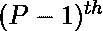

# 在 3×N 网格中绘制 K 个单元格的方法数量，这样就不会有 P 个连续的列未被绘制

> 原文:[https://www . geeksforgeeks . org/绘制方式数-k-cells-in-3-x-n-grid-so-no-p-continuous-columns-left-unpaid/](https://www.geeksforgeeks.org/number-of-ways-to-paint-k-cells-in-3-x-n-grid-such-that-no-p-continuous-columns-are-left-unpainted/)

给定三个整数 **N** 、 **P** 和 **K** ，任务是找到绘制 3×N 网格的 K 个单元的方法数量，使得没有相邻的单元被绘制，也没有连续的 P 列未被绘制。
**注**:对角线单元格不视为相邻单元格。
**举例:**

> **输入:** N = 1，P = 3，K = 1
> **输出:** 3
> 在一个 3×1 的网格中绘制一个单元格有 3 种方式。
> **输入:** N = 2，P = 2，K = 2
> **输出:** 8
> 在 3×2 的网格中绘制 2 个单元格有 8 种方式。
> 绘制的单元格组合如下所示–
> 1(0，0)和(1，1)
> 2(0，0)和(2，1)
> 3(0，0)和(2，0)
> 4(1，0)和(0，1)
> 5(1，0)和(2，1)
> 6(2，0)和(0，1)
> 7(2，0)和(1，1)

**方法:**思路是用[动态规划](https://www.geeksforgeeks.org/dynamic-programming/)解决这个问题。从这个问题中我们知道


只有在下列情况下才能绘制柱


柱未涂漆。如果


立柱没有喷漆，那么我们有以下五种情况–

*   绘制第一行。
*   画第二行。
*   画第三行。
*   画第一排和第三排。
*   如果至少有一列，则保留当前列



*   柱子是油漆过的。

因此，利用这个事实，我们可以很容易地解决这个问题。
以下是上述方法的实现:

## C++

```
// C++ implementation to find the
// number of ways to paint K cells of
// 3 x N grid such that No two adjacent
// cells are painted

#include <bits/stdc++.h>
using namespace std;

int mod = 1e9 + 7;
#define MAX 301
#define MAXP 3
#define MAXK 600
#define MAXPREV 4

int dp[MAX][MAXP + 1][MAXK][MAXPREV + 1];

// Visited array to keep track
// of which columns were painted
bool vis[MAX];

// Recursive Function to compute the
// number of ways to paint the K cells
// of the 3 x N grid
int helper(int col, int prevCol,
           int painted, int prev,
           int N, int P, int K)
{

    // Condition to check if total
    // cells painted are K
    if (painted >= K) {
        int continuousCol = 0;
        int maxContinuousCol = 0;

        // Check if any P continuous
        // columns were left unpainted
        for (int i = 0; i < N; i++) {

            if (vis[i] == false)
                continuousCol++;
            else {
                maxContinuousCol
                    = max(maxContinuousCol,
                          continuousCol);
                continuousCol = 0;
            }
        }

        maxContinuousCol = max(
            maxContinuousCol,
            continuousCol);

        // Condition to check if no P
        // continuous columns were
        // left unpainted
        if (maxContinuousCol < P)
            return 1;

        // return 0 if there are P
        // continuous columns are
        // left unpainted
        return 0;
    }

    // Condition to check if No
    // further cells can be
    // painted, so return 0
    if (col >= N)
        return 0;

    // if already calculated the value
    // return the val instead
    // of calculating again
    if (dp[col][prevCol][painted][prev] != -1)
        return dp[col][prevCol][painted][prev];

    int res = 0;

    // Previous column was not painted
    if (prev == 0) {

        // Column is painted so,
        // make vis[col]=true
        vis[col] = true;
        res += (helper(
                   col + 1, 0, painted + 1,
                   1, N, P, K))
               % mod;

        res += (helper(
                   col + 1, 0, painted + 1,
                   2, N, P, K))
               % mod;

        res += (helper(
                   col + 1, 0, painted + 1,
                   3, N, P, K))
               % mod;

        // Condition to check if the number
        // of cells to be painted is equal
        // to or more than 2, then we can
        // paint first and third row
        if (painted + 2 <= K) {
            res
                += (helper(
                       col + 1, 0, painted + 2,
                       4, N, P, K))
                   % mod;
        }
        vis[col] = false;

        // Condition to check if number of
        // previous continuous columns left
        // unpainted is less than P
        if (prevCol + 1 < P) {
            res
                += (helper(
                       col + 1, prevCol + 1,
                       painted, 0, N, P, K))
                   % mod;
        }
    }

    // Condition to check if first row
    // was painted in previous column
    else if (prev == 1) {
        vis[col] = true;
        res += (helper(
                   col + 1, 0, painted + 1,
                   2, N, P, K))
               % mod;
        res += (helper(
                   col + 1, 0, painted + 1,
                   3, N, P, K))
               % mod;
        vis[col] = false;
        if (prevCol + 1 < P) {
            res += (helper(
                       col + 1, prevCol + 1,
                       painted, 0, N, P, K))
                   % mod;
        }
    }

    // Condition to check if second row
    // was painted in previous column
    else if (prev == 2) {
        vis[col] = true;
        res += (helper(
                   col + 1, 0, painted + 1,
                   1, N, P, K))
               % mod;
        res += (helper(
                   col + 1, 0, painted + 1,
                   3, N, P, K))
               % mod;

        // Condition to check if the number
        // of cells to be painted is equal to
        // or more than 2, then we can
        // paint first and third row
        if (painted + 2 <= K) {
            res
                += (helper(
                       col + 1, 0, painted + 2,
                       4, N, P, K))
                   % mod;
        }
        vis[col] = false;
        if (prevCol + 1 < P) {
            res
                += (helper(
                       col + 1, prevCol + 1,
                       painted, 0, N, P, K))
                   % mod;
        }
    }

    // Condition to check if third row
    // was painted in previous column
    else if (prev == 3) {
        vis[col] = true;
        res += (helper(
                   col + 1, 0, painted + 1,
                   1, N, P, K))
               % mod;
        res += (helper(
                   col + 1, 0, painted + 1,
                   2, N, P, K))
               % mod;
        vis[col] = false;
        if (prevCol + 1 < P) {
            res += (helper(
                       col + 1, prevCol + 1,
                       painted, 0, N, P, K))
                   % mod;
        }
    }

    // Condition to check if first and
    // third row were painted
    // in previous column
    else {
        vis[col] = true;
        res += (helper(
                   col + 1, 0, painted + 1,
                   2, N, P, K))
               % mod;
        vis[col] = false;
        if (prevCol + 1 < P) {
            res += (helper(
                       col + 1, prevCol + 1,
                       painted, 0, N, P, K))
                   % mod;
        }
    }

    // Memoize the data and return the
    // Computed value
    return dp[col][prevCol][painted][prev]
           = res % mod;
}

// Function to find the number of
// ways to paint 3 x N grid
int solve(int n, int p, int k)
{
    // Set all values
    // of dp to -1;
    memset(dp, -1, sizeof(dp));

    // Set all values of Visited
    // array to false
    memset(vis, false, sizeof(vis));

    return helper(0, 0, 0, 0, n, p, k);
}

// Driver Code
int main()
{

    int N = 2, K = 2, P = 2;
    cout << solve(N, P, K) << endl;

    return 0;
}
```

## Java 语言(一种计算机语言，尤用于创建网站)

```
// Java implementation to find the
// number of ways to paint K cells of
// 3 x N grid such that No two adjacent
// cells are painted
import java.util.*;

class GFG{

static int mod = (int)(1e9 + 7);
static final int MAX = 301;
static final int MAXP = 3;
static final int MAXK = 600;
static final int MAXPREV = 4;

static int [][][][]dp = new int[MAX][MAXP + 1][MAXK][MAXPREV + 1];

// Visited array to keep track
// of which columns were painted
static boolean []vis = new boolean[MAX];

// Recursive Function to compute the
// number of ways to paint the K cells
// of the 3 x N grid
static int helper(int col, int prevCol,
                  int painted, int prev,
                  int N, int P, int K)
{

    // Condition to check if total
    // cells painted are K
    if (painted >= K)
    {
        int continuousCol = 0;
        int maxContinuousCol = 0;

        // Check if any P continuous
        // columns were left unpainted
        for(int i = 0; i < N; i++)
        {

            if (vis[i] == false)
                continuousCol++;
            else
            {
                maxContinuousCol = Math.max(
                                   maxContinuousCol,
                                   continuousCol);
                continuousCol = 0;
            }
        }

        maxContinuousCol = Math.max(
                           maxContinuousCol,
                           continuousCol);

        // Condition to check if no P
        // continuous columns were
        // left unpainted
        if (maxContinuousCol < P)
            return 1;

        // return 0 if there are P
        // continuous columns are
        // left unpainted
        return 0;
    }

    // Condition to check if No
    // further cells can be
    // painted, so return 0
    if (col >= N)
        return 0;

    // If already calculated the value
    // return the val instead
    // of calculating again
    if (dp[col][prevCol][painted][prev] != -1)
        return dp[col][prevCol][painted][prev];

    int res = 0;

    // Previous column was not painted
    if (prev == 0)
    {

        // Column is painted so,
        // make vis[col]=true
        vis[col] = true;
        res += (helper(col + 1, 0,
                       painted + 1,
                       1, N, P, K)) % mod;

        res += (helper(col + 1, 0,
                       painted + 1,
                       2, N, P, K)) % mod;

        res += (helper(col + 1, 0,
                       painted + 1,
                       3, N, P, K)) % mod;

        // Condition to check if the number
        // of cells to be painted is equal
        // to or more than 2, then we can
        // paint first and third row
        if (painted + 2 <= K)
        {
            res += (helper(col + 1, 0,
                           painted + 2,
                           4, N, P, K)) % mod;
        }
        vis[col] = false;

        // Condition to check if number of
        // previous continuous columns left
        // unpainted is less than P
        if (prevCol + 1 < P)
        {
            res += (helper(col + 1,
                           prevCol + 1,
                           painted, 0,
                           N, P, K)) % mod;
        }
    }

    // Condition to check if first row
    // was painted in previous column
    else if (prev == 1)
    {
        vis[col] = true;
        res += (helper(col + 1, 0,
                       painted + 1,
                       2, N, P, K)) % mod;
        res += (helper(col + 1, 0,
                       painted + 1,
                       3, N, P, K)) % mod;
        vis[col] = false;
        if (prevCol + 1 < P)
        {
            res += (helper(col + 1,
                           prevCol + 1,
                           painted, 0,
                           N, P, K)) % mod;
        }
    }

    // Condition to check if second row
    // was painted in previous column
    else if (prev == 2)
    {
        vis[col] = true;
        res += (helper(col + 1, 0,
                       painted + 1,
                       1, N, P, K)) % mod;
        res += (helper(col + 1, 0,
                       painted + 1,
                       3, N, P, K)) % mod;

        // Condition to check if the number
        // of cells to be painted is equal to
        // or more than 2, then we can
        // paint first and third row
        if (painted + 2 <= K)
        {
            res += (helper(col + 1, 0,
                           painted + 2,
                           4, N, P, K)) % mod;
        }
        vis[col] = false;
        if (prevCol + 1 < P)
        {
            res += (helper(col + 1,
                           prevCol + 1,
                           painted, 0,
                           N, P, K)) % mod;
        }
    }

    // Condition to check if third row
    // was painted in previous column
    else if (prev == 3)
    {
        vis[col] = true;
        res += (helper(col + 1, 0,
                       painted + 1,
                       1, N, P, K)) % mod;
        res += (helper(col + 1, 0,
                       painted + 1,
                       2, N, P, K)) % mod;
        vis[col] = false;
        if (prevCol + 1 < P)
        {
            res += (helper(col + 1,
                           prevCol + 1,
                           painted, 0,
                           N, P, K)) % mod;
        }
    }

    // Condition to check if first and
    // third row were painted
    // in previous column
    else
    {
        vis[col] = true;
        res += (helper(col + 1, 0,
                       painted + 1,
                       2, N, P, K)) % mod;
        vis[col] = false;
        if (prevCol + 1 < P)
        {
            res += (helper(col + 1,
                           prevCol + 1,
                           painted, 0,
                           N, P, K)) % mod;
        }
    }

    // Memoize the data and return
    // the computed value
    return dp[col][prevCol][painted][prev] = res % mod;
}

// Function to find the number of
// ways to paint 3 x N grid
static int solve(int n, int p, int K)
{

    // Set all values
    // of dp to -1;
    for(int i = 0; i < MAX; i++)
        for(int j = 0; j < MAXP + 1; j++)
            for(int k = 0; k < MAXK; k++)
                for(int l = 0; l < MAXPREV + 1; l++)
                    dp[i][j][k][l] = -1;

    // Set all values of Visited
    // array to false
    Arrays.fill(vis, false);

    return helper(0, 0, 0, 0, n, p, K);
}

// Driver Code
public static void main(String[] args)
{
    int N = 2, K = 2, P = 2;

    System.out.print(solve(N, P, K) + "\n");
}
}

// This code is contributed by Amit Katiyar
```

## 蟒蛇 3

```
# Python 3 implementation to find the
# number of ways to paint K cells of
# 3 x N grid such that No two adjacent
# cells are painted

mod = 1e9 + 7
MAX = 301
MAXP = 3
MAXK = 600
MAXPREV = 4

dp = [[[[-1 for x in range(MAXPREV + 1)]for y in range(MAXK)]
       for z in range(MAXP + 1)]for k in range(MAX)]

# Visited array to keep track
# of which columns were painted
vis = [False] * MAX

# Recursive Function to compute the
# number of ways to paint the K cells
# of the 3 x N grid
def helper(col, prevCol,
           painted, prev,
           N, P, K):

    # Condition to check if total
    # cells painted are K
    if (painted >= K):
        continuousCol = 0
        maxContinuousCol = 0

        # Check if any P continuous
        # columns were left unpainted
        for i in range(N):
            if (vis[i] == False):
                continuousCol += 1
            else:
                maxContinuousCol = max(maxContinuousCol,
                                       continuousCol)
                continuousCol = 0

        maxContinuousCol = max(
            maxContinuousCol,
            continuousCol)

        # Condition to check if no P
        # continuous columns were
        # left unpainted
        if (maxContinuousCol < P):
            return 1

        # return 0 if there are P
        # continuous columns are
        # left unpainted
        return 0

    # Condition to check if No
    # further cells can be
    # painted, so return 0
    if (col >= N):
        return 0

    # if already calculated the value
    # return the val instead
    # of calculating again
    if (dp[col][prevCol][painted][prev] != -1):
        return dp[col][prevCol][painted][prev]

    res = 0

    # Previous column was not painted
    if (prev == 0):

        # Column is painted so,
        # make vis[col]=true
        vis[col] = True
        res += ((helper(
            col + 1, 0, painted + 1,
            1, N, P, K))
            % mod)

        res += ((helper(
            col + 1, 0, painted + 1,
            2, N, P, K))
            % mod)

        res += ((helper(
            col + 1, 0, painted + 1,
            3, N, P, K))
            % mod)

        # Condition to check if the number
        # of cells to be painted is equal
        # to or more than 2, then we can
        # paint first and third row
        if (painted + 2 <= K):
            res += ((helper(
                col + 1, 0, painted + 2,
                4, N, P, K))
                % mod)

        vis[col] = False

        # Condition to check if number of
        # previous continuous columns left
        # unpainted is less than P
        if (prevCol + 1 < P):
            res += ((helper(
                col + 1, prevCol + 1,
                painted, 0, N, P, K))
                % mod)

    # Condition to check if first row
    # was painted in previous column
    elif (prev == 1):
        vis[col] = True
        res += ((helper(
            col + 1, 0, painted + 1,
            2, N, P, K))
            % mod)
        res += ((helper(
            col + 1, 0, painted + 1,
            3, N, P, K))
            % mod)
        vis[col] = False
        if (prevCol + 1 < P):
            res += ((helper(
                col + 1, prevCol + 1,
                painted, 0, N, P, K))
                % mod)

    # Condition to check if second row
    # was painted in previous column
    elif (prev == 2):
        vis[col] = True
        res += ((helper(
            col + 1, 0, painted + 1,
            1, N, P, K))
            % mod)
        res += ((helper(
            col + 1, 0, painted + 1,
            3, N, P, K))
            % mod)

        # Condition to check if the number
        # of cells to be painted is equal to
        # or more than 2, then we can
        # paint first and third row
        if (painted + 2 <= K):
            res += ((helper(
                col + 1, 0, painted + 2,
                4, N, P, K))
                % mod)

        vis[col] = False
        if (prevCol + 1 < P):
            res += ((helper(
                col + 1, prevCol + 1,
                painted, 0, N, P, K))
                % mod)

    # Condition to check if third row
    # was painted in previous column
    elif (prev == 3):
        vis[col] = True
        res += ((helper(
            col + 1, 0, painted + 1,
            1, N, P, K))
            % mod)
        res += ((helper(
            col + 1, 0, painted + 1,
            2, N, P, K))
            % mod)
        vis[col] = False
        if (prevCol + 1 < P):
            res += ((helper(
                col + 1, prevCol + 1,
                painted, 0, N, P, K))
                % mod)

    # Condition to check if first and
    # third row were painted
    # in previous column
    else:
        vis[col] = True
        res += ((helper(
            col + 1, 0, painted + 1,
            2, N, P, K))
            % mod)
        vis[col] = False
        if (prevCol + 1 < P):
            res += ((helper(
                col + 1, prevCol + 1,
                painted, 0, N, P, K))
                % mod)

    # Memoize the data and return the
    # Computed value
    dp[col][prevCol][painted][prev] = res % mod
    return dp[col][prevCol][painted][prev]

# Function to find the number of
# ways to paint 3 x N grid

def solve(n, p, k):

    # Set all values
    # of dp to -1;
    global dp

    # Set all values of Visited
    # array to false
    global vis

    return helper(0, 0, 0, 0, n, p, k)

# Driver Code
if __name__ == "__main__":

    N = 2
    K = 2
    P = 2
    print(int(solve(N, P, K)))

    # This code is contributed by ukasp.
```

## C#

```
// C# implementation to find the
// number of ways to paint K cells of
// 3 x N grid such that No two adjacent
// cells are painted
using System;
class GFG{

static int mod = (int)(1e9 + 7);
static readonly int MAX = 301;
static readonly int MAXP = 3;
static readonly int MAXK = 600;
static readonly int MAXPREV = 4;

static int [,,,]dp = new int[MAX, MAXP + 1,
                             MAXK, MAXPREV + 1];

// Visited array to keep track
// of which columns were painted
static bool []vis = new bool[MAX];

// Recursive Function to compute the
// number of ways to paint the K cells
// of the 3 x N grid
static int helper(int col, int prevCol,
                int painted, int prev,
                int N, int P, int K)
{

    // Condition to check if total
    // cells painted are K
    if (painted >= K)
    {
        int continuousCol = 0;
        int maxContinuousCol = 0;

        // Check if any P continuous
        // columns were left unpainted
        for(int i = 0; i < N; i++)
        {

            if (vis[i] == false)
                continuousCol++;
            else
            {
                maxContinuousCol = Math.Max(
                                   maxContinuousCol,
                                   continuousCol);
                continuousCol = 0;
            }
        }

        maxContinuousCol = Math.Max(
                           maxContinuousCol,
                           continuousCol);

        // Condition to check if no P
        // continuous columns were
        // left unpainted
        if (maxContinuousCol < P)
            return 1;

        // return 0 if there are P
        // continuous columns are
        // left unpainted
        return 0;
    }

    // Condition to check if No
    // further cells can be
    // painted, so return 0
    if (col >= N)
        return 0;

    // If already calculated the value
    // return the val instead
    // of calculating again
    if (dp[col, prevCol, painted, prev] != -1)
        return dp[col, prevCol, painted, prev];

    int res = 0;

    // Previous column was not painted
    if (prev == 0)
    {

        // Column is painted so,
        // make vis[col]=true
        vis[col] = true;
        res += (helper(col + 1, 0,
                       painted + 1,
                       1, N, P, K)) % mod;

        res += (helper(col + 1, 0,
                       painted + 1,
                       2, N, P, K)) % mod;

        res += (helper(col + 1, 0,
                       painted + 1,
                       3, N, P, K)) % mod;

        // Condition to check if the number
        // of cells to be painted is equal
        // to or more than 2, then we can
        // paint first and third row
        if (painted + 2 <= K)
        {
            res += (helper(col + 1, 0,
                           painted + 2,
                           4, N, P, K)) % mod;
        }
        vis[col] = false;

        // Condition to check if number of
        // previous continuous columns left
        // unpainted is less than P
        if (prevCol + 1 < P)
        {
            res += (helper(col + 1,
                           prevCol + 1,
                           painted, 0,
                           N, P, K)) % mod;
        }
    }

    // Condition to check if first row
    // was painted in previous column
    else if (prev == 1)
    {
        vis[col] = true;
        res += (helper(col + 1, 0,
                       painted + 1,
                       2, N, P, K)) % mod;
        res += (helper(col + 1, 0,
                       painted + 1,
                       3, N, P, K)) % mod;
        vis[col] = false;
        if (prevCol + 1 < P)
        {
            res += (helper(col + 1,
                           prevCol + 1,
                           painted, 0,
                           N, P, K)) % mod;
        }
    }

    // Condition to check if second row
    // was painted in previous column
    else if (prev == 2)
    {
        vis[col] = true;
        res += (helper(col + 1, 0,
                       painted + 1,
                       1, N, P, K)) % mod;
        res += (helper(col + 1, 0,
                       painted + 1,
                       3, N, P, K)) % mod;

        // Condition to check if the number
        // of cells to be painted is equal to
        // or more than 2, then we can
        // paint first and third row
        if (painted + 2 <= K)
        {
            res += (helper(col + 1, 0,
                           painted + 2,
                           4, N, P, K)) % mod;
        }
        vis[col] = false;
        if (prevCol + 1 < P)
        {
            res += (helper(col + 1,
                           prevCol + 1,
                           painted, 0,
                           N, P, K)) % mod;
        }
    }

    // Condition to check if third row
    // was painted in previous column
    else if (prev == 3)
    {
        vis[col] = true;
        res += (helper(col + 1, 0,
                       painted + 1,
                       1, N, P, K)) % mod;
        res += (helper(col + 1, 0,
                       painted + 1,
                       2, N, P, K)) % mod;
        vis[col] = false;
        if (prevCol + 1 < P)
        {
            res += (helper(col + 1,
                           prevCol + 1,
                           painted, 0,
                           N, P, K)) % mod;
        }
    }

    // Condition to check if first and
    // third row were painted
    // in previous column
    else
    {
        vis[col] = true;
        res += (helper(col + 1, 0,
                       painted + 1,
                       2, N, P, K)) % mod;
        vis[col] = false;
        if (prevCol + 1 < P)
        {
            res += (helper(col + 1,
                           prevCol + 1,
                           painted, 0,
                           N, P, K)) % mod;
        }
    }

    // Memoize the data and return
    // the computed value
    return dp[col, prevCol, painted, prev] = res % mod;
}

// Function to find the number of
// ways to paint 3 x N grid
static int solve(int n, int p, int K)
{

    // Set all values
    // of dp to -1;
    for(int i = 0; i < MAX; i++)
        for(int j = 0; j < MAXP + 1; j++)
            for(int k = 0; k < MAXK; k++)
                for(int l = 0; l < MAXPREV + 1; l++)
                    dp[i, j, k, l] = -1;

    // Set all values of Visited
    // array to false
    for(int i = 0; i < vis.Length; i++)
        vis[i] = false;

    return helper(0, 0, 0, 0, n, p, K);
}

// Driver Code
public static void Main(String[] args)
{
    int N = 2, K = 2, P = 2;

    Console.Write(solve(N, P, K) + "\n");
}
}

// This code is contributed by Rohit_ranjan
```

## java 描述语言

```
<script>
// Javascript implementation to find the
// number of ways to paint K cells of
// 3 x N grid such that No two adjacent
// cells are painted

let mod = (1e9 + 7);
let MAX = 301;
let MAXP = 3;
let MAXK = 600;
let MAXPREV = 4;

let dp = new Array(MAX);
for(let i = 0; i < MAX; i++)
{
    dp[i] = new Array(MAXP + 1);
    for(let j = 0; j < (MAXP + 1); j++)
    {
        dp[i][j] = new Array(MAXK);
        for(let k = 0; k < MAXK; k++)
        {
            dp[i][j][k] = new Array(MAXPREV + 1);
            for(let l = 0; l < (MAXPREV + 1); l++)
            {
                dp[i][j][k][l] = -1;
            }
        }
    }
}

// Visited array to keep track
// of which columns were painted
let vis = new Array(MAX);
for(let i = 0; i < MAX; i++)
{
    vis[i] = false;
}

// Recursive Function to compute the
// number of ways to paint the K cells
// of the 3 x N grid
function helper(col, prevCol, painted, prev, N, P, K)
{

    // Condition to check if total
    // cells painted are K
    if (painted >= K)
    {
        let continuousCol = 0;
        let maxContinuousCol = 0;

        // Check if any P continuous
        // columns were left unpainted
        for(let i = 0; i < N; i++)
        {

            if (vis[i] == false)
                continuousCol++;
            else
            {
                maxContinuousCol = Math.max(
                                   maxContinuousCol,
                                   continuousCol);
                continuousCol = 0;
            }
        }

        maxContinuousCol = Math.max(
                           maxContinuousCol,
                           continuousCol);

        // Condition to check if no P
        // continuous columns were
        // left unpainted
        if (maxContinuousCol < P)
            return 1;

        // return 0 if there are P
        // continuous columns are
        // left unpainted
        return 0;
    }

    // Condition to check if No
    // further cells can be
    // painted, so return 0
    if (col >= N)
        return 0;

    // If already calculated the value
    // return the val instead
    // of calculating again
    if (dp[col][prevCol][painted][prev] != -1)
        return dp[col][prevCol][painted][prev];

    let res = 0;

    // Previous column was not painted
    if (prev == 0)
    {

        // Column is painted so,
        // make vis[col]=true
        vis[col] = true;
        res += (helper(col + 1, 0,
                       painted + 1,
                       1, N, P, K)) % mod;

        res += (helper(col + 1, 0,
                       painted + 1,
                       2, N, P, K)) % mod;

        res += (helper(col + 1, 0,
                       painted + 1,
                       3, N, P, K)) % mod;

        // Condition to check if the number
        // of cells to be painted is equal
        // to or more than 2, then we can
        // paint first and third row
        if (painted + 2 <= K)
        {
            res += (helper(col + 1, 0,
                           painted + 2,
                           4, N, P, K)) % mod;
        }
        vis[col] = false;

        // Condition to check if number of
        // previous continuous columns left
        // unpainted is less than P
        if (prevCol + 1 < P)
        {
            res += (helper(col + 1,
                           prevCol + 1,
                           painted, 0,
                           N, P, K)) % mod;
        }
    }

    // Condition to check if first row
    // was painted in previous column
    else if (prev == 1)
    {
        vis[col] = true;
        res += (helper(col + 1, 0,
                       painted + 1,
                       2, N, P, K)) % mod;
        res += (helper(col + 1, 0,
                       painted + 1,
                       3, N, P, K)) % mod;
        vis[col] = false;
        if (prevCol + 1 < P)
        {
            res += (helper(col + 1,
                           prevCol + 1,
                           painted, 0,
                           N, P, K)) % mod;
        }
    }

    // Condition to check if second row
    // was painted in previous column
    else if (prev == 2)
    {
        vis[col] = true;
        res += (helper(col + 1, 0,
                       painted + 1,
                       1, N, P, K)) % mod;
        res += (helper(col + 1, 0,
                       painted + 1,
                       3, N, P, K)) % mod;

        // Condition to check if the number
        // of cells to be painted is equal to
        // or more than 2, then we can
        // paint first and third row
        if (painted + 2 <= K)
        {
            res += (helper(col + 1, 0,
                           painted + 2,
                           4, N, P, K)) % mod;
        }
        vis[col] = false;
        if (prevCol + 1 < P)
        {
            res += (helper(col + 1,
                           prevCol + 1,
                           painted, 0,
                           N, P, K)) % mod;
        }
    }

    // Condition to check if third row
    // was painted in previous column
    else if (prev == 3)
    {
        vis[col] = true;
        res += (helper(col + 1, 0,
                       painted + 1,
                       1, N, P, K)) % mod;
        res += (helper(col + 1, 0,
                       painted + 1,
                       2, N, P, K)) % mod;
        vis[col] = false;
        if (prevCol + 1 < P)
        {
            res += (helper(col + 1,
                           prevCol + 1,
                           painted, 0,
                           N, P, K)) % mod;
        }
    }

    // Condition to check if first and
    // third row were painted
    // in previous column
    else
    {
        vis[col] = true;
        res += (helper(col + 1, 0,
                       painted + 1,
                       2, N, P, K)) % mod;
        vis[col] = false;
        if (prevCol + 1 < P)
        {
            res += (helper(col + 1,
                           prevCol + 1,
                           painted, 0,
                           N, P, K)) % mod;
        }
    }

    // Memoize the data and return
    // the computed value
    return dp[col][prevCol][painted][prev] = res % mod;
}

// Function to find the number of
// ways to paint 3 x N grid
function solve(n,p,k)
{
    return helper(0, 0, 0, 0, n, p, K);
}

// Driver Code
let N = 2, K = 2, P = 2;
document.write(solve(N, P, K) + "<br>");

// This code is contributed by avanitrachhadiya2155
</script>
```

**Output:** 

```
8
```