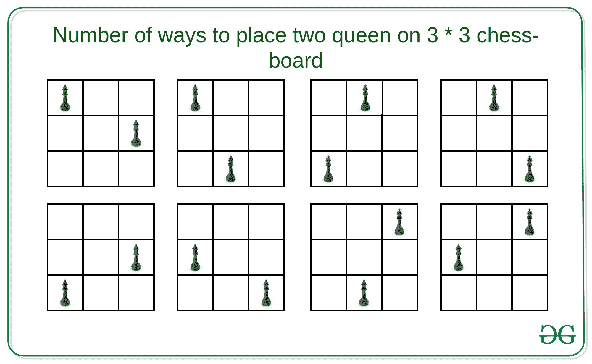

# 在 N*N 棋盘上放置两个皇后的方法数量

> 原文:[https://www . geesforgeks . org/去地方的路数-两个皇后在棋盘上/](https://www.geeksforgeeks.org/number-of-ways-to-place-two-queens-on-a-nn-chess-board/)

给定一个整数 **N** 表示一个 **N * N** 棋盘，任务是计算在棋盘上放置两个皇后的方法的数量，这样它们就不会互相攻击。
**例:**

> **输入:** N = 9
> **输出:** 2184
> **说明:**
> 9 * 9 棋盘上有 2184 种放置两个皇后的方法。
> **输入:** N = 3
> **输出:** 8
> **说明:**
> 在 3 * 3 棋盘上放置两个皇后有 8 种方式。



**天真方法:**一个简单的解决方案是为 N * N 矩阵上的两个皇后选择两个每可能的位置，并检查它们不在水平、垂直、正对角线或负对角线上。如果是，则将计数增加 1。
**时间复杂度:** O(N <sup>4</sup> )
**高效方法:**思路是利用[组合](https://www.geeksforgeeks.org/permutation-and-combination/)计算蚁后的可能位置，使其不相互攻击。一个有用的观察是，计算单个女王攻击的位置数量非常容易。那就是–

```
Number of positions a queen attack = 
    (N - 1) + (N - 1) + (D - 1)

Here, 
// First N-1 denotes positions in horizontal direction
// Second N-1 denotes positions in vertical direction
// D = Number of positions in 
    positive and negative diagonal
```

如果我们不把皇后放在最后一行和最后一列，那么答案将只是放在(N-1)*(N-1)棋盘上的位置数，而如果我们放在最后一列和最后一行，那么皇后的可能位置将是 2 * N-1，并在 3 *(N-1)个位置进行攻击。因此，另一个皇后的可能位置将是 N<sup>2</sup>–3 *(N-1)–1。最后，有(N-1)*(N-2)种组合，其中两个皇后都在最后一行和最后一列。因此，重复关系将是–

```
Q(N) = Q(N-1) + (N2-3*(N-1)-1)-(N-1)*(N-2)

// By Induction
Q(N) = (N4)/2 - 5*(N3)/3 + 3*(N2)/2 - N/3
```

下面是上述方法的实现:

## C++

```
// C++ implementation to find the
// number of ways to place two
// queens on the N * N chess board

#include <bits/stdc++.h>

#define ll long long
using namespace std;

// Function to find number of valid
// positions for two queens in the
// N * N chess board
ll possiblePositions(ll n)
{
    ll term1 = pow(n, 4);
    ll term2 = pow(n, 3);
    ll term3 = pow(n, 2);
    ll term4 = n / 3;
    ll ans = (ceil)(term1) / 2 -
             (ceil)(5 * term2) / 3 +
             (ceil)(3 * term3) / 2 - term4;
    return ans;
}

// Driver Code
int main()
{
    ll n;
    n = 3;

    // Function Call
    ll ans = possiblePositions(n);
    cout << ans << endl;
    return 0;
}
```

## Java 语言(一种计算机语言，尤用于创建网站)

```
// Java implementation to find the
// number of ways to place two
// queens on the N * N chess board
class GFG{

// Function to find number of valid
// positions for two queens in the
// N * N chess board
static double possiblePositions(double n)
{
    double term1 = Math.pow(n, 4);
    double term2 = Math.pow(n, 3);
    double term3 = Math.pow(n, 2);
    double term4 = n / 3;
    double ans = (Math.ceil(term1 / 2)) -
                 (Math.ceil(5 * term2) / 3) +
                 (Math.ceil(3 * term3) / 2) - term4;

    return (long)ans;
}

// Driver Code
public static void main(String[] args)
{
    double n;
    n = 3;

    // Function Call
    double ans = possiblePositions(n);
    System.out.print(ans + "\n");
}
}

// This code is contributed by sapnasingh4991
```

## 蟒蛇 3

```
# Python3 implementation to find the
# number of ways to place two
# queens on the N * N chess board
import math

# Function to find number of valid
# positions for two queens in the
# N * N chess board
def possiblePositions(n):

    term1 = pow(n, 4);
    term2 = pow(n, 3);
    term3 = pow(n, 2);
    term4 = n / 3;

    ans = ((math.ceil(term1)) / 2 -
           (math.ceil(5 * term2)) / 3 +
           (math.ceil(3 * term3)) / 2 - term4);

    return ans;

# Driver code
if __name__ == '__main__':

    n = 3

    # Function call
    ans = possiblePositions(n)

    print(int(ans))

# This code is contributed by jana_sayantan
```

## C#

```
// C# implementation to find the
// number of ways to place two
// queens on the N * N chess board
using System;

class GFG{

// Function to find number of valid
// positions for two queens in the
// N * N chess board
static double possiblePositions(double n)
{
    double term1 = Math.Pow(n, 4);
    double term2 = Math.Pow(n, 3);
    double term3 = Math.Pow(n, 2);
    double term4 = n / 3;
    double ans = (Math.Ceiling(term1 / 2)) -
                 (Math.Ceiling(5 * term2) / 3) +
                 (Math.Ceiling(3 * term3) / 2) - term4;

    return (long)ans;
}

// Driver Code
public static void Main(String[] args)
{
    double n;
    n = 3;

    // Function Call
    double ans = possiblePositions(n);
    Console.Write(ans + "\n");
}
}

// This code is contributed by Amit Katiyar
```

## java 描述语言

```
<script>

// Javascript implementation to find the
// number of ways to place two
// queens on the N * N chess board

// Function to find number of valid
// positions for two queens in the
// N * N chess board
function possiblePositions(n)
{
    let term1 = Math.pow(n, 4);
    let term2 = Math.pow(n, 3);
    let term3 = Math.pow(n, 2);
    let term4 = n / 3;
    let ans = (Math.ceil(term1 / 2)) -
                 (Math.ceil(5 * term2) / 3) +
                 (Math.ceil(3 * term3) / 2) - term4;

    return ans;
}

    // Driver Code
    let n;
    n = 3;

    // Function Call
    let ans = possiblePositions(n);
    document.write(Math.floor(ans));

// This code is contributed by souravghosh0416.
</script>
```

**Output:** 

```
8
```

**时间复杂度:** O(1)