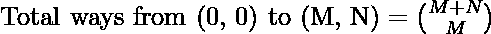
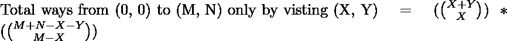
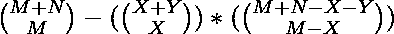

# 在矩阵中从原点开始到达(M，N)而不访问(X，Y)的方式数

> 原文:[https://www . geeksforgeeks . org/到达矩阵中 m-n-n-从原点开始-无需访问-x-y/](https://www.geeksforgeeks.org/number-of-ways-to-reach-m-n-in-a-matrix-starting-from-the-origin-without-visiting-x-y/)

给定四个正整数 **M、N、X 和 Y** ，任务是计算从大小为 **(M+1)x(N+1)** 的矩阵的左上角(即 **(0，0)** )到右下角 **(M，N)** 的所有可能到达方式，而无需访问单元格 **(X，Y)** 。给出了从每个单元格 **(i，j)** 你可以只向右移动 **(i，j + 1)** 或者向下移动 **(i + 1，j)** 。
**举例:**

> **输入:** M = 2，N = 2，X = 1，Y = 1
> **输出:** 2
> **说明:**
> 不拜访(1，1)到达(2，2)的方式只有 2 种，两条路径分别为:
> (0，0)-(T22】(0，1)-(T23】(0，2)-(T24】(1，2)-(T25)【2，2】
> (0，0)-- 2)
> **输入:** M = 5，N = 4，X = 3，Y = 2
> **输出:** 66
> **说明:**
> 不访问(3，2)到达(5，4)有 66 种方式。

**方法:**
解决上述问题的思路是从 **(0，0)** 到 **(X，Y)** 减去到达的路数，然后通过访问 **(X，Y)** 从 **(0，0)到达 **(M，N)** 的路总数减去 **(X，Y)** 到达的路数
因此，** 

1.  从 **(M，N)** 到达原点 **(0，0)** 的途径数由:
    给出

> 

1.  仅通过访问 **(X，Y)** 到达 **(M，N)** 的途径数是从 **(0，0)** 到达 **(X，Y)** ，然后从 **(X，Y)** 到达 **(M，N)** 的途径数由:
    给出

> 
> 
> 
> 因此，
> 
> 

1.  因此，总路数的等式为:

> 

以下是上述方法的实现:

## C++

```
// C++ program from the above approach
#include <bits/stdc++.h>
using namespace std;

int fact(int n);

// Function for computing nCr
int nCr(int n, int r)
{
    return fact(n)
           / (fact(r) * fact(n - r));
}

// Function to find factorial of a number
int fact(int n)
{
    int res = 1;

    for (int i = 2; i <= n; i++)
        res = res * i;

    return res;
}

// Function for counting the number
// of ways to reach (m, n) without
// visiting (x, y)
int countWays(int m, int n, int x, int y)
{
    return nCr(m + n, m)
           - nCr(x + y, x) * nCr(m + n
                                     - x - y,
                                 m - x);
}

// Driver Code
int main()
{
    // Given Dimensions of Matrix
    int m = 5;
    int n = 4;

    // Cell not to be visited
    int x = 3;
    int y = 2;

    // Function Call
    cout << countWays(m, n, x, y);
    return 0;
}
```

## Java 语言(一种计算机语言，尤用于创建网站)

```
// Java program from the above approach    
import java.util.*;    
class GFG{   

// Function for computing nCr    
public static int nCr(int n, int r)        
{    
    return fact(n) / (fact(r) * fact(n - r));        
}    

// Function to find factorial of a number    
public static int fact(int n)    
{    
    int res = 1;

    for(int i = 2; i <= n; i++)        
        res = res * i;        
    return res;        
}    

// Function for counting the number        
// of ways to reach (m, n) without        
// visiting (x, y)        
public static int countWays(int m, int n,
                            int x, int y)        
{    
    return nCr(m + n, m) -
           nCr(x + y, x) *
           nCr(m + n - x - y, m - x);        
}

// Driver code
public static void main(String[] args)
{    

    // Given Dimensions of Matrix    
    int m = 5;        
    int n = 4;        

    // Cell not to be visited    
    int x = 3;        
    int y = 2;        

    // Function Call    
    System.out.println(countWays(m, n, x, y));    
}    
}

// This code is contributed by divyeshrabadiya07
```

## 蟒蛇 3

```
# Python3 program for the above approach

# Function for computing nCr
def nCr(n, r):

    return (fact(n) // (fact(r) *
                        fact(n - r)))

# Function to find factorial of a number
def fact(n):

    res = 1
    for i in range(2, n + 1):
        res = res * i

    return res

# Function for counting the number
# of ways to reach (m, n) without
# visiting (x, y)
def countWays(m, n, x, y):

    return (nCr(m + n, m) - nCr(x + y, x) *
            nCr(m + n - x - y, m - x))

# Driver Code

# Given dimensions of Matrix
m = 5
n = 4

# Cell not to be visited
x = 3
y = 2

# Function call
print(countWays(m, n, x, y))

# This code is contributed by sanjoy_62
```

## C#

```
// C# program from the above approach    
using System;

class GFG{

// Function for computing nCr    
public static int nCr(int n, int r)        
{    
    return fact(n) / (fact(r) * fact(n - r));        
}    

// Function to find factorial of a number    
public static int fact(int n)    
{    
    int res = 1;

    for(int i = 2; i <= n; i++)        
        res = res * i;

    return res;        
}    

// Function for counting the number        
// of ways to reach (m, n) without        
// visiting (x, y)        
public static int countWays(int m, int n,
                            int x, int y)        
{    
    return nCr(m + n, m) -
           nCr(x + y, x) *
           nCr(m + n - x - y, m - x);        
}

// Driver code
public static void Main(String[] args)
{    

    // Given dimensions of Matrix    
    int m = 5;        
    int n = 4;        

    // Cell not to be visited    
    int x = 3;        
    int y = 2;        

    // Function call    
    Console.WriteLine(countWays(m, n, x, y));    
}    
}

// This code is contributed by Rajput-Ji
```

## java 描述语言

```
<script>

// Javascript Program to implement
// the above approach

// Function for computing nCr    
function nCr(n, r)        
{    
    return fact(n) / (fact(r) * fact(n - r));        
}    

// Function to find factorial of a number    
function fact(n)    
{    
    let res = 1;

    for(let i = 2; i <= n; i++)        
        res = res * i;        
    return res;        
}    

// Function for counting the number        
// of ways to reach (m, n) without        
// visiting (x, y)        
function countWays(m, n, x, y)        
{    
    return nCr(m + n, m) -
           nCr(x + y, x) *
           nCr(m + n - x - y, m - x);        
}

// Driver Code

    // Given Dimensions of Matrix    
    let m = 5;        
    let n = 4;        

    // Cell not to be visited    
    let x = 3;        
    let y = 2;        

    // Function Call    
    document.write(countWays(m, n, x, y));

// This code is contributed by avijitmondal1998.
</script>
```

**Output:** 

```
66
```