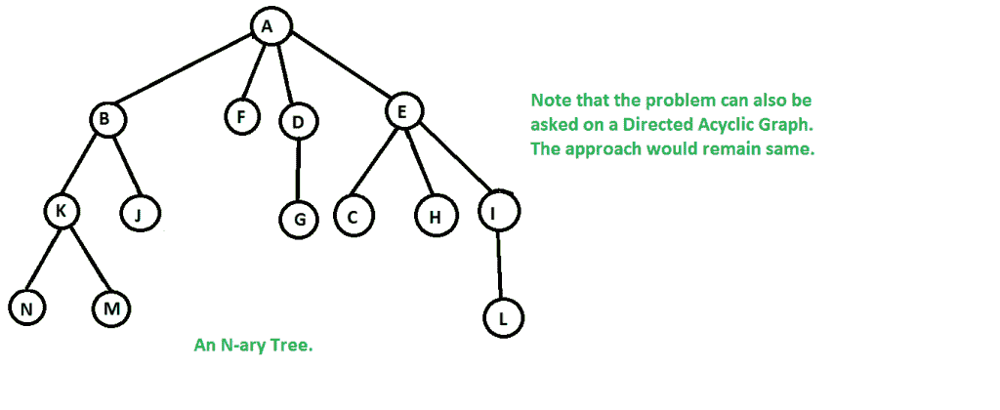
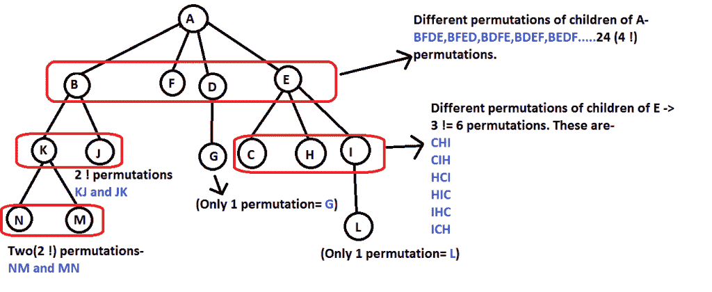

# 遍历 N 元树的方式数

> 原文:[https://www . geesforgeks . org/遍历树的路径数/](https://www.geeksforgeeks.org/number-of-ways-to-traverse-an-n-ary-tree/)

给定一棵 n 元树，计算从根顶点开始遍历 n 元树(或有向无环图)的方法数。
假设我们有一个给定的 N 元树，如下所示。



现在我们必须找到从根顶点开始遍历整棵树的方法的数量。这样的方式可以有很多。下面列出了其中的一些。
**1)**N->M->K->J->B->F->D->E->C->H->I->L->A(类-深度优先遍历)。
**2)**A->B->F->D->E->K->J->G->C->H->I->N->M->L(层级顺序遍历)
**3)**……
**4)**……
。
。
。
以此类推。
**我们强烈建议你尽量减少浏览器，先自己试试这个。**
所有遍历方式的计数是每个节点子节点数的阶乘乘积。请参考下图，以便清楚理解-



这里，
‘A’有四个孩子，所以 4！排列可能
‘B’有两个孩子，所以 2！排列可能
‘F’没有孩子，所以 0！可能的排列
…..
等等
因此所有这样的方式都是- 4！* 2 !* 0 !* 1 !* 3 !* 2 !* 0 !* 0 !* 0 !* 0 !* 1 !* 0 !* 0 != 576 路
这是一个巨大的数量的方法，其中只有少数被证明是有用的，如-order，level-order，preorder，postorder(根据这些遍历的流行程度排列)

## C++

```
// C++ program to find the number of ways to traverse a
// n-ary tree starting from the root node
#include <bits/stdc++.h>
using namespace std;

// Structure of a node of an n-ary tree
struct Node
{
   char key;
   vector<Node *> child;
};

// Utility function to create a new tree node
Node *newNode(int key)
{
   Node *temp = new Node;
   temp->key = key;
   return temp;
}

// Untility Function to find factorial of given number
int factorial(int n)
{
   if (n == 0)
     return 1;
   return n*factorial(n-1);
}

// Function to calculate the number of ways of travesing
// the n-ary starting from root.
// This function is just a modified breadth-first search.
// We can use a depth-first search too.
int calculateWays(Node * root)
{
   int ways = 1;  // Initialize result

   // If the tree is empty there is no way of traversing
   // the tree.
   if (root == NULL)
      return 0;

   // Create a queue and enqueue root to it.
   queue<Node *>q;
   q.push(root);

   // Level order traversal.
   while (!q.empty())
   {
         // Dequeue an item from queue and print it
         Node * p = q.front();
         q.pop();

         // The number of ways is the product of
         // factorials of number of children of each node.
         ways = ways*(factorial(p->child.size()));

         // Enqueue all childrent of the dequeued item
         for (int i=0; i<p->child.size(); i++)
            q.push(p->child[i]);
    }

   return(ways);
}

// Driver program
int main()
{
   /*   Let us create below tree
   *           A
   *         / /  \  \
   *       B  F   D  E
   *      / \     |  /|\
   *     K  J    G  C H I
   *      /\            \
   *    N   M            L
   */

   Node *root = newNode('A');
   (root->child).push_back(newNode('B'));
   (root->child).push_back(newNode('F'));
   (root->child).push_back(newNode('D'));
   (root->child).push_back(newNode('E'));
   (root->child[0]->child).push_back(newNode('K'));
   (root->child[0]->child).push_back(newNode('J'));
   (root->child[2]->child).push_back(newNode('G'));
   (root->child[3]->child).push_back(newNode('C'));
   (root->child[3]->child).push_back(newNode('H'));
   (root->child[3]->child).push_back(newNode('I'));
   (root->child[0]->child[0]->child).push_back(newNode('N'));
   (root->child[0]->child[0]->child).push_back(newNode('M'));
   (root->child[3]->child[2]->child).push_back(newNode('L'));

   cout << calculateWays(root); ;

   return 0;
}
```

## java 描述语言

```
<script>

    // JavaScript program to find the
    // number of ways to traverse a
    // n-ary tree starting from the root node

    class Node
    {
        constructor(key) {
           this.child = [];
           this.key = key;
        }
    }

    // Utility function to create a new tree node
    function newNode(key)
    {
       let temp = new Node(key);
       return temp;
    }

    // Untility Function to find factorial of given number
    function factorial(n)
    {
       if (n == 0)
         return 1;
       return n*factorial(n-1);
    }

    // Function to calculate the number of ways of travesing
    // the n-ary starting from root.
    // This function is just a modified breadth-first search.
    // We can use a depth-first search too.
    function calculateWays(root)
    {
       let ways = 1;  // Initialize result

       // If the tree is empty there is no way of traversing
       // the tree.
       if (root == null)
          return 0;

       // Create a queue and enqueue root to it.
       let q = [];
       q.push(root);

       // Level order traversal.
       while (q.length > 0)
       {
             // Dequeue an item from queue and print it
             let p = q[0];
             q.shift();

             // The number of ways is the product of
             // factorials of number of children of each node.
             ways = ways*(factorial(p.child.length));

             // Enqueue all childrent of the dequeued item
             for (let i=0; i< p.child.length; i++)
                q.push(p.child[i]);
        }

       return(ways);
    }

    /*   Let us create below tree
   *           A
   *         / /  \  \
   *       B  F   D  E
   *      / \     |  /|\
   *     K  J    G  C H I
   *      /\            \
   *    N   M            L
   */

   let root = newNode('A');
   (root.child).push(newNode('B'));
   (root.child).push(newNode('F'));
   (root.child).push(newNode('D'));
   (root.child).push(newNode('E'));
   (root.child[0].child).push(newNode('K'));
   (root.child[0].child).push(newNode('J'));
   (root.child[2].child).push(newNode('G'));
   (root.child[3].child).push(newNode('C'));
   (root.child[3].child).push(newNode('H'));
   (root.child[3].child).push(newNode('I'));
   (root.child[0].child[0].child).push(newNode('N'));
   (root.child[0].child[0].child).push(newNode('M'));
   (root.child[3].child[2].child).push(newNode('L'));

   document.write(calculateWays(root));

</script>
```

**输出:**

```
576
```

**时间复杂度:**我们在级序遍历中访问每个节点一次，用 O(n)个时间计算每个节点的阶乘。总时间为 O(Nn)，其中 N =元树中的节点数。我们可以通过计算从 1 到 N 的所有数字的阶乘来优化解决方案，使其在 O(N)时间内工作。
**辅助空间:**由于我们只对每个节点使用一个队列和一个结构，因此整体空间复杂度也是 O(N)。
**常见陷阱:**因为阶乘的乘积往往会变得非常巨大，所以可能会溢出。在 C/C++中最好使用像-unsigned long int 这样的数据类型，因为路的数量永远不能是负数。在 Java 和 Python 中，有大整数来处理溢出。

本文由**拉希特·贝尔瓦亚尔**供稿。如果你喜欢极客博客并想投稿，你也可以写一篇文章并把你的文章邮寄到 review-team@geeksforgeeks.org。看到你的文章出现在极客博客主页上，帮助其他极客。
如发现任何不正确的地方，请写评论，或者您想分享更多关于上述话题的信息