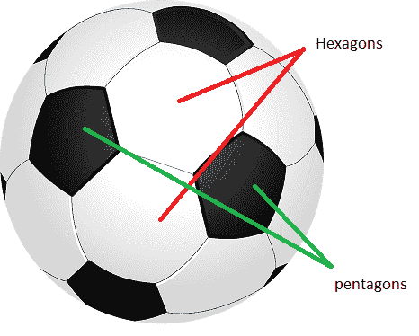
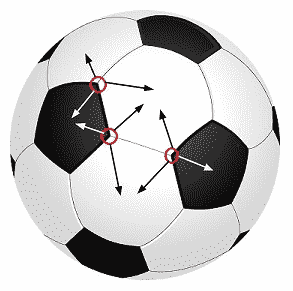
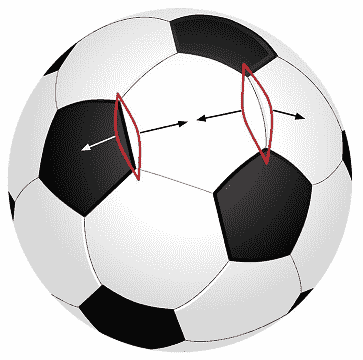
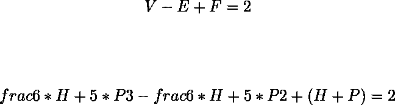

# 足球上五边形和六边形的数量

> 原文:[https://www . geesforgeks . org/number-五边形-六边形-足球/](https://www.geeksforgeeks.org/number-pentagons-hexagons-football/)

给定一个标准的足球，在上面画出规则的六边形和五边形，如图所示。找出六边形和五边形的数量。

我们可以应用[欧拉特征](https://en.wikipedia.org/wiki/Euler_characteristic)找出一个标准足球上的六边形和五边形的数量。
根据欧拉特征:每个曲面 S 存在一个整数

使得每当具有 V 个顶点和 E 条边的图 G 嵌入到 S 中从而存在 F 个面(由该图划分的区域)时，我们具有:

对于球体(足球的形状)

= 2.
因此，方程变成 V–E+F = 2。

现在，让五边形的数量 P 和六边形的数量 h。

顶点的数量将是:
每个六边形 6 个顶点，即 6*H.
每个五边形 5 个顶点，即 5*P.
但是我们已经计算了每个顶点三次，每个相邻多边形一次，如下图

因此，顶点的数量 V = (6*H + 5*P)/3。

边的数量将是:
每个六边形 6 条边，即每个五边形 6*H.
5 条边，即 5*P.
但是我们已经计算了每个边两次，每个相邻多边形一次，如下图

因此，边的数量 E = (6*H + 5*P)/2。

面数将为:
有 H 六边形和 P 五边形，各形成一个面。因此，面的总数，F = (H + P)。

所以，我们可以写道:

求解这个方程后，我们将得到 P = 12。所以，有 12 个五角星。
现在六边形的数量:
我们可以看到每个五边形被 5 个六边形包围。所以应该有 5*P 个六边形，但是我们已经为每个六边形的 3 个相邻五边形计算了三次。因此，六边形的数量= 5*P/3 = 5*12/3 = 20。

因此，一个标准足球中有 20 个六边形和 12 个五边形。