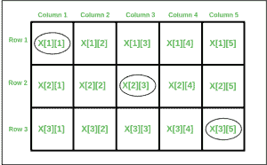

# 行主位和列主位顺序中地址相同的位置数

> 原文:[https://www . geesforgeks . org/number-positions-address-row-major-column-major-order/](https://www.geeksforgeeks.org/number-positions-address-row-major-column-major-order/)

给定一个大小为 M×n 的 2D 数组。计算 2D 数组中的位置数，其中按行主顺序的地址等于按列主顺序的地址。
**例:**

> 输入:3 5
> 输出:3
> 对于下列 I，j
> 对(1，1)，(2，3) & (3，5)
> ，行主地址与列主地址相同
> 
> 
> 
> 输入:4 4
> 输出:4

让我们考虑指数为 I，j 的元素

```
Row major address = B + w * (N * (i-1) + j-1) 
Column major address = B + w * (M * (j-1) + i-1) 
```

**B** :数组的基地址
**w** :数组每个元素的大小

```
Equating both addresses, we get
B + w * (N * (i-1) + j-1)  = B + w * (M * (j-1) + i-1)
N * (i-1) + j  = M * (j-1) + i
N*i - N + j  = M*j - M + i
M*j - j = N*i - N + M - i
(M-1) * j = N*i - N + M - i
j = (N*i - N + M - i)/(M-1)    - (Eq. 1)
Similarly
i = (M*j - M + N - j)/(N-1)    - (Eq. 2)
```

现在我们已经在 I 和 j 之间建立了关系

```
Iterate for all possible i and find corresponding j 
If j comes out to be an integer in the range 1 to N, 
increment the counter. 
```

下面是上述方法的实现。

## C++

```
// CPP Program to count the number
// of positions with same address
// in row major and column major order
#include <bits/stdc++.h>

using namespace std;

// Returns count of required positions
int getCount(int M, int N)
{
    int count = 0;

    // horizontal 1D array
    if (M == 1)
        return N;

    // vertical 1D array
    if (N == 1)
        return M;

    if (N > M) {

        // iterating for all possible i
        for (int i = 1; i <= M; i++) {
            int numerator = N * i - N + M - i;
            int denominator = M - 1;

            // checking if j is integer
            if (numerator % denominator == 0) {
                int j = numerator / denominator;

                // checking if j lies b/w 1 to N
                if (j >= 1 && j <= N)
                    count++;
            }
        }
    }
    else {

        // iterating for all possible j
        for (int j = 1; j <= N; j++) {
            int numerator = M * j - M + N - j;
            int denominator = N - 1;

            // checking if i is integer
            if (numerator % denominator == 0) {
                int i = numerator / denominator;

                // checking if i lies b/w 1 to M
                if (i >= 1 && i <= M)
                    count++;
            }
        }
    }
    return count;
}

// Driver Code
int main()
{
    int M = 3, N = 5;
    cout << getCount(M, N) << endl;
    return 0;
}
```

## Java 语言(一种计算机语言，尤用于创建网站)

```
// Java Program to count the number
// of positions with same address
// in row major and column major order
import java.io.*;
class GFG {

// Returns count of
// required positions
static int getCount(int M, int N)
{
    int count = 0;

    // horizontal 1D array
    if (M == 1)
        return N;

    // vertical 1D array
    if (N == 1)
        return M;

    if (N > M) {

        // iterating for all possible i
        for (int i = 1; i <= M; i++) {
            int numerator = N * i - N + M - i;
            int denominator = M - 1;

            // checking if j is integer
            if (numerator % denominator == 0) {
                int j = numerator / denominator;

                // checking if j lies b/w 1 to N
                if (j >= 1 && j <= N)
                    count++;
            }
        }
    }
    else {

        // iterating for all possible j
        for (int j = 1; j <= N; j++) {
            int numerator = M * j - M + N - j;
            int denominator = N - 1;

            // checking if i is integer
            if (numerator % denominator == 0) {
                int i = numerator / denominator;

                // checking if i lies b/w 1 to M
                if (i >= 1 && i <= M)
                    count++;
            }
        }
    }
    return count;
}

    // Driver Code
    public static void main (String[] args)
    {
        int M = 3, N = 5;
        System.out.println( getCount(M, N));
    }
}

// This code is contributed by vt_m.
```

## 蟒蛇 3

```
# Python3 Program to count the number
# of positions with same address
# in row major and column major order

# Returns count of
# required positions
def getCount(M, N):
    count = 0;

    # horizontal 1D array
    if (M == 1):
        return N;

    # vertical 1D array
    if (N == 1):
        return M;

    if (N > M):

        # iterating for all possible i
        for i in range(1, M + 1):
            numerator = N * i - N + M - i;
            denominator = M - 1;

            # checking if j is integer
            if (numerator % denominator == 0):
                j = numerator / denominator;

                # checking if j lies b/w 1 to N
                if (j >= 1 and j <= N):
                    count += 1;
    else:

        # iterating for all possible j
        for j in range(1, N + 1):
            numerator = M * j - M + N - j;
            denominator = N - 1;

            # checking if i is integer
            if (numerator % denominator == 0):
                i = numerator / denominator;

                # checking if i lies b/w 1 to M
                if (i >= 1 and i <= M):
                    count += 1;

    return count;

# Driver Code
if __name__ == '__main__':
    M, N = 3, 5;
    print(getCount(M, N));

# This code is contributed by Rajput-Ji
```

## C#

```
// C# Program to count the number
// of positions with same address
// in row major and column major order
using System;
class GFG {

    // Returns count of
    // required positions
    static int getCount(int M, int N)
    {
        int count = 0;

        // horizontal 1D array
        if (M == 1)
            return N;

        // vertical 1D array
        if (N == 1)
            return M;

        if (N > M) {

            // iterating for all possible i
            for (int i = 1; i <= M; i++) {
                int numerator = N * i - N + M - i;
                int denominator = M - 1;

                // checking if j is integer
                if (numerator % denominator == 0) {
                    int j = numerator / denominator;

                    // checking if j lies b/w 1 to N
                    if (j >= 1 && j <= N)
                        count++;
                }
            }
        }
        else {

            // iterating for all possible j
            for (int j = 1; j <= N; j++) {
                int numerator = M * j - M + N - j;
                int denominator = N - 1;

                // checking if i is integer
                if (numerator % denominator == 0) {
                    int i = numerator / denominator;

                    // checking if i lies b/w 1 to M
                    if (i >= 1 && i <= M)
                        count++;
                }
            }
        }
        return count;
    }

    // Driver Code
    public static void Main ()
    {
        int M = 3, N = 5;
        Console.WriteLine( getCount(M, N));
    }
}

// This code is contributed by anuj_67.
```

## 服务器端编程语言（Professional Hypertext Preprocessor 的缩写）

```
<?php
// PHP Program to count the number
// of positions with same address
// in row major and column major order

// Returns count of required positions
function getCount( $M, $N)
{
    $count = 0;

    // horizontal 1D array
    if ($M == 1)
        return $N;

    // vertical 1D array
    if ($N == 1)
        return $M;

    if ($N > $M)
    {

        // iterating for all possible i
        for($i = 1; $i <= $M; $i++)
        {
            $numerator = $N * $i - $N + $M - $i;
            $denominator = $M - 1;

            // checking if j is integer
            if ($numerator % $denominator == 0)
            {
                $j = $numerator / $denominator;

                // checking if j lies b/w 1 to N
                if ($j >= 1 and $j <= $N)
                    $count++;
            }
        }
    }
    else
    {

        // iterating for all possible j
        for ( $j = 1; $j <= $N; $j++)
        {
            $numerator = $M * $j - $M + $N - $j;
            $denominator = $N - 1;

            // checking if i is integer
            if ($numerator % $denominator == 0)
            {
                $i = $numerator / $denominator;

                // checking if i lies b/w 1 to M
                if ($i >= 1 and $i <= $M)
                    $count++;
            }
        }
    }
    return $count;
}

    // Driver Code
    $M = 3; $N = 5;
    echo getCount($M, $N) ;

// This code is contributed by anuj_67.
?>
```

## java 描述语言

```
<script>

    // JavaScript Program to count the number
    // of positions with same address
    // in row major and column major order

    // Returns count of
    // required positions
    function getCount(M, N)
    {
        let count = 0;

        // horizontal 1D array
        if (M == 1)
            return N;

        // vertical 1D array
        if (N == 1)
            return M;

        if (N > M) {

            // iterating for all possible i
            for (let i = 1; i <= M; i++) {
                let numerator = N * i - N + M - i;
                let denominator = M - 1;

                // checking if j is integer
                if (numerator % denominator == 0) {
                    let j =
                    parseInt(numerator / denominator, 10);

                    // checking if j lies b/w 1 to N
                    if (j >= 1 && j <= N)
                        count++;
                }
            }
        }
        else {

            // iterating for all possible j
            for (let j = 1; j <= N; j++) {
                let numerator = M * j - M + N - j;
                let denominator = N - 1;

                // checking if i is integer
                if (numerator % denominator == 0) {
                    let i =
                    parseInt(numerator / denominator, 10);

                    // checking if i lies b/w 1 to M
                    if (i >= 1 && i <= M)
                        count++;
                }
            }
        }
        return count;
    }

    let M = 3, N = 5;
    document.write( getCount(M, N));

</script>
```

**输出:**

```
3
```

**时间复杂度**:通过用 j(等式)建立 I 的关系，可以将 O(M)
复杂度降低到 O(min(M，N))。2)在 N < M 的情况下迭代所有可能的 j，并且通过根据 I(等式)建立关系 j。1)迭代所有可能的 I 否则。