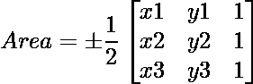
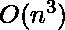

# 笛卡尔坐标系中可能的三角形数量

> 原文:[https://www . geesforgeks . org/number-可能-三角形-笛卡尔-坐标系/](https://www.geeksforgeeks.org/number-possible-triangles-cartesian-coordinate-system/)

给定笛卡尔坐标系中的 n 个点。数一数形成的三角形的数量。

**示例:**

```
Input  : point[] = {(0, 0), (1, 1), (2, 0), (2, 2)
Output : 3
Three triangles can be formed from above points.
```

一个简单的解决方法是检查所选三点的[行列式](https://en.wikipedia.org/wiki/Determinant)是否非零。下面的行列式给出了三角形的面积(也称为克莱姆法则)。
角在(x1，y1)、(x2，y2)和(x3，y3)的三角形面积由下式给出:

我们可以通过取 3 个点的所有可能的组合并求行列式来解决这个问题。

## C++

```
// C++ program to count number of triangles that can
// be formed with given points in 2D
#include <bits/stdc++.h>
using namespace std;

// A point in 2D
struct Point
{
   int x, y;
};

// Returns determinant value of three points in 2D
int det(int x1, int y1, int x2, int y2, int x3, int y3)
{
   return x1*(y2 - y3) - y1*(x2 - x3) + 1*(x2*y3 - y2*x3);
}

// Returns count of possible triangles with given array
// of points in 2D.
int countPoints(Point arr[], int n)
{
    int result = 0;  // Initialize result

    // Consider all triplets of points given in inputs
    // Increment the result when determinant of a triplet
    // is not 0.
    for (int i=0; i<n; i++)
        for (int j=i+1; j<n; j++)
            for (int k=j+1; k<n; k++)
                if (det(arr[i].x, arr[i].y, arr[j].x,
                        arr[j].y, arr[k].x, arr[k].y))
                    result++;

    return result;
}

// Driver code
int main()
{
    Point arr[] = {{0, 0}, {1, 1}, {2, 0}, {2, 2}};
    int n = sizeof(arr)/sizeof(arr[0]);
    cout << countPoints(arr, n);
    return 0;
}
```

## Java 语言(一种计算机语言，尤用于创建网站)

```
// Java program to count number
// of triangles that can be formed
// with given points in 2D

class GFG{
// Returns determinant value
// of three points in 2D
static int det(int x1, int y1, int x2, int y2, int x3, int y3)
{
    return (x1 * (y2 - y3) - y1 *
        (x2 - x3) + 1 * (x2 *
            y3 - y2 * x3));
}

// Returns count of possible
// triangles with given array
// of points in 2D.
static int countPoints(int [][]Point, int n)
{
    int result = 0; // Initialize result

    // Consider all triplets of
    // points given in inputs
    // Increment the result when
    // determinant of a triplet is not 0.
    for(int i = 0; i < n; i++)
        for(int j = i + 1; j < n; j++)
            for(int k = j + 1; k < n; k++)
                if(det(Point[i][0], Point[i][1],
                    Point[j][0], Point[j][1],
                    Point[k][0], Point[k][1])>=0)
                    result = result + 1;

    return result;
}

// Driver code
public static void main(String[] args)
{
int Point[][] = {{0, 0},{1, 1},{2, 0},{2, 2}};
int n = Point.length;
System.out.println(countPoints(Point, n));
}
}
// This code is contributed by
// mits
```

## 计算机编程语言

```
# Python program to count number
# of triangles that can be formed
# with given points in 2D

# Returns determinant value
# of three points in 2D
def det(x1, y1, x2, y2, x3, y3):
    return (x1 * (y2 - y3) - y1 *
            (x2 - x3) + 1 * (x2 *
             y3 - y2 * x3))

# Returns count of possible
# triangles with given array
# of points in 2D.
def countPoints(Point, n):

    result = 0 # Initialize result

    # Consider all triplets of
    # points given in inputs
    # Increment the result when
    # determinant of a triplet is not 0.
    for i in range(n):
        for j in range(i + 1, n):
            for k in range(j + 1, n):
                if(det(Point[i][0], Point[i][1],
                       Point[j][0], Point[j][1],
                       Point[k][0], Point[k][1])):
                    result = result + 1

    return result

# Driver code
Point = [[0, 0], [1, 1],
         [2, 0], [2, 2]]
n = len(Point)
print(countPoints(Point, n))

# This code is contributed by
# Sanjit_Prasad
```

## C#

```
// C# program to count number
// of triangles that can be formed
// with given points in 2D
using System;

class GFG{
// Returns determinant value
// of three points in 2D
static int det(int x1, int y1, int x2, int y2, int x3, int y3)
{
    return (x1 * (y2 - y3) - y1 *
        (x2 - x3) + 1 * (x2 *
            y3 - y2 * x3));
}

// Returns count of possible
// triangles with given array
// of points in 2D.
static int countPoints(int[,] Point, int n)
{
    int result = 0; // Initialize result

    // Consider all triplets of
    // points given in inputs
    // Increment the result when
    // determinant of a triplet is not 0.
    for(int i = 0; i < n; i++)
        for(int j = i + 1; j < n; j++)
            for(int k = j + 1; k < n; k++)
                if(det(Point[i,0], Point[i,1], Point[j,0], Point[j,1],Point[k,0], Point[k,1])>=0)
                    result = result + 1;

    return result;
}

// Driver code
public static void Main()
{
int[,] Point = new int[,] { { 0, 0 }, { 1, 1 }, { 2, 0 }, { 2, 2 } };
int n = Point.Length/Point.Rank;
Console.WriteLine(countPoints(Point, n));
}
}
// This code is contributed by mits
```

## 服务器端编程语言（Professional Hypertext Preprocessor 的缩写）

```
<?php
// PHP program to count number
// of triangles that can be formed
// with given points in 2D

// Returns determinant value
// of three points in 2D
function det($x1, $y1, $x2,
             $y2, $x3, $y3)
{
    return ($x1 * ($y2 - $y3) - $y1 *
           ($x2 - $x3) + 1 * ($x2 *
            $y3 - $y2 * $x3));
}

// Returns count of possible
// triangles with given array
// of points in 2D.
function countPoints($Point, $n)
{
    $result = 0; // Initialize result

    // Consider all triplets of
    // points given in inputs
    // Increment the result when
    // determinant of a triplet is not 0.
    for($i = 0; $i < $n; $i++)
        for($j = $i + 1; $j < $n; $j++)
            for($k = $j + 1; $k < $n; $k++)
                if(det($Point[$i][0], $Point[$i][1],
                       $Point[$j][0], $Point[$j][1],
                       $Point[$k][0], $Point[$k][1]))
                       $result = $result + 1;

    return $result;
}

// Driver code
$Point = array(array(0, 0),
               array(1, 1),
               array(2, 0),
               array(2, 2));
$n = count($Point);
echo countPoints($Point, $n);

// This code is contributed by
// mits
?>
```

## java 描述语言

```
<script>

// JavaScript program to count number
// of triangles that can be formed
// with given points in 2D

// Returns determinant value
// of three points in 2D
function det(x1, y1, x2, y2, x3, y3)
{
    return (x1 * (y2 - y3) -
            y1 * (x2 - x3) +
             1 * (x2 * y3 - y2 * x3));
}

// Returns count of possible
// triangles with given array
// of points in 2D.
function countPoints(Point, n)
{

    // Initialize result
    let result = 0;

    // Consider all triplets of
    // points given in inputs
    // Increment the result when
    // determinant of a triplet is not 0.
    for(let i = 0; i < n; i++)
        for(let j = i + 1; j < n; j++)
            for(let k = j + 1; k < n; k++)
                if (det(Point[i][0], Point[i][1],
                    Point[j][0], Point[j][1],
                    Point[k][0], Point[k][1]) >= 0)
                    result = result + 1;

    return result;
}

// Driver Code
let Point = [ [ 0, 0 ], [ 1, 1 ],
              [ 2, 0 ], [ 2, 2 ] ];
let n = Point.length;

document.write(countPoints(Point, n));

// This code is contributed by souravghosh0416

</script>
```

**输出:**

```
3
```

**时间复杂度:** 。

**优化:**
我们可以利用三个点如果共线就不能形成三角形这一事实，对上述解进行优化，使其在 O(n)<sup>2</sup>中工作。我们可以使用哈希来存储所有对的斜率，并在 O(n <sup>2</sup> )时间内找到所有三角形。
本文由 **Vrushank Upadhyay** 供稿。如果你喜欢 GeeksforGeeks 并想投稿，你也可以使用[contribute.geeksforgeeks.org](http://www.contribute.geeksforgeeks.org)写一篇文章或者把你的文章邮寄到 contribute@geeksforgeeks.org。看到你的文章出现在极客博客主页上，帮助其他极客。
如果发现有不正确的地方，或者想分享更多关于上述话题的信息，请写评论。