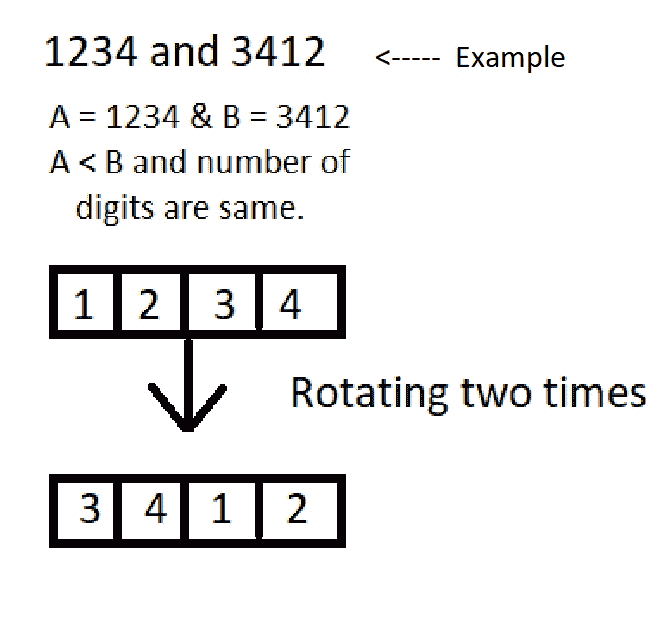

# 阵列中回收对的数量

> 原文:[https://www.geeksforgeeks.org/number-recycled-pairs-array/](https://www.geeksforgeeks.org/number-recycled-pairs-array/)

给定一个整数数组 arr[]，求数组中回收对的个数。两个数字{a，b}的回收对具有以下属性:

1.  a 应该比 b 小。
2.  位数应该相同。
3.  通过在一个方向上旋转 A 任意多次，我们应该得到 b。



示例:

```
Input : arr[] = {32, 42, 13, 23, 9, 5, 31}
Output : 2
Explanation : Since there are two pairs {13, 31} and {23, 32}. 
By rotating 13 for first time, output is 31 and by rotating 23 once output is 32\. 
Both of these pairs satisfy our criteria.

Input : arr[] = {1212, 2121}
Output : 1
Explanation : Since there are two pairs {1212, 2121}. By rotating 1212
for first time, output is 2121\. This pair satisfies our criteria.
Note that if rotation id done further, rotating 1212 again output is 1212 
which is given number and 2121 which has been already counted.
So discard both of these results. 

```

下面是解决上述问题的分步算法:

1.  对数组排序。
2.  创建一个大小为 n 的新数组“temp ”,其中 n 是原始数组的长度。
3.  通过将唯一值复制到新数组“temp”来删除数组中的重复项。
4.  找出从原始数组中复制的元素数，并让这个数等于数组的大小。
5.  创建一个 HashSet，只存储当前数字的唯一旋转。
6.  用值= 0 初始化计数器。
7.  遍历“temp ”,对每个数字执行以下步骤–
    *   找出位数。让它成为‘D1’。
    *   将数字旋转 d-1 次，并将每次旋转形成的每个数字存储在哈希集中。
    *   如果在 HashSet 中找到形成的数字，忽略它。
    *   对于每个旋转的数字，在数组的其余部分做一个二分搜索法。
    *   如果存在，递增计数器。

## C++

```
// C++ code for Recycled Pairs in array.
#include<bits/stdc++.h>
using namespace std;

// Function to find recycled pairs
int recycledPairs(int a[], int n)
{
    int count = 0;

    // Sorting array
    sort(a, a + n);

    // Removing duplicates by creating new array temp.
    int temp[n];
    memset(temp, -1, n);
    int j = 0;

    for (int i = 0; i < n - 1; i++)
        if (a[i] != a[i + 1])
            temp[j++] = a[i];
    temp[j++] = a[n - 1];
    int size = n;

    // Finding number of locations in temp 
    // which are occupied from copying.
    for (int i = n - 1; i >= 0; i--)
        if (temp[i] != -1) 
        {
            size = i;
            break;
        }

    // Hashset to store new Rotations
    set<int>hs;

    for (int i = 0; i < size + 1; i++) 
    {

        // Clearing hashset for each number in temp.
        hs.clear();
        int x = temp[i];

        // Finding number of digits of taken number
        int d1 = (int)log10(temp[i]) + 1;

        int f = (int)pow(10, d1 - 1);
        for (j = 1; j <= d1 - 1; j++) 
        {

            // Remainder
            int r = x % 10;

            // Quotient
            int q = x / 10;

            // Forming new number by rotating.
            x = r * f + q;

            // Number of digits of newly formed rotated number
            // to avoid duplicate numbers.
            int d2 = (int)log10(x) + 1;
            set<int>::iterator it = hs.find(x);

            // Inserting formed rotated number to set s
            if (it == hs.end()) 
            {
                hs.insert(x);

                // Checking for number of digits of new number.
                if ((d1 == d2))
                { 

                    // Searching for the formed element in rest of array.
                    int position = lower_bound(temp + i,
                                temp + size + 1 , x)-(temp + i + 1);

                    // If position found
                    if(position >= 0)
                    {
                        // Increment counter.
                        count++;
                    }
                }
            }
        }
    }

    // Return counter
    return count;
}

// Driver function
int main()
{
    int a[] = { 32, 42, 13, 23, 9, 5, 31 };
    int n = sizeof(a)/sizeof(a[0]);
    int result = recycledPairs(a,n);
    cout << (result);
    return 0;
}

// This code is contributed by Rajput-Ji
```

## Java 语言(一种计算机语言，尤用于创建网站)

```
// Java code for Recycled Pairs in array.
import java.util.*;

class GFG {

    // Function to find recycled pairs
    static int recycledPairs(int[] a)
    {
        int count = 0;

        // Sorting array
        Arrays.sort(a);
        int n = a.length;

        // Removing duplicates by creating new array temp.
        int[] temp = new int[n];
        Arrays.fill(temp, -1);
        int j = 0;

        for (int i = 0; i < n - 1; i++)
            if (a[i] != a[i + 1])
                temp[j++] = a[i];
        temp[j++] = a[n - 1];
        int size = n;

        // Finding number of locations in temp which are occupied from copying.
        for (int i = n - 1; i >= 0; i--)
            if (temp[i] != -1) {
                size = i;
                break;
            }

        // Hashset to store new Rotations
        HashSet<Integer> hs = new HashSet<Integer>();

        for (int i = 0; i < size + 1; i++) {

            // Clearing hashset for each number in temp.
            hs.clear();
            int x = temp[i];

            // Finding number of digits of taken number
            int d1 = (int)Math.log10(temp[i]) + 1;

            int f = (int)Math.pow(10, d1 - 1);
            for (j = 1; j <= d1 - 1; j++) {

                // Remainder
                int r = x % 10;

                // Quotient
                int q = x / 10;

                // Forming new number by rotating.
                x = r * f + q;

                // Number of digits of newly formed rotated number
                // to avoid duplicate numbers.
                int d2 = (int)Math.log10(x) + 1;

                // Inserting formed rotated number to set s
                if (!hs.contains(x)) {
                    hs.add(x);

                    // Checking for number of digits of new number.
                    if ((d1 == d2))
                    {
                        // Searching for the formed element in rest of array.
                        int position = Arrays.binarySearch(temp, i + 1, size + 1, x);

                        // If position found
                        if(position >= 0)
                        {
                            // Increment counter.
                            count++;
                        }
                    }
                }
            }
        }

        // Return counter
        return count;
    }

    // Driver function
    public static void main(String[] args)
    {
        int a[] = { 32, 42, 13, 23, 9, 5, 31 };
        int result = recycledPairs(a);
        System.out.println(result);
    }
}
```

## C#

```
// C# code for Recycled Pairs in array.
using System;
using System.Collections.Generic; 

class GFG 
{

    // Function to find recycled pairs
    static int recycledPairs(int[] a)
    {
        int count = 0;

        // Sorting array
        Array.Sort(a);
        int n = a.Length;

        // Removing duplicates by 
        // creating new array temp.
        int[] temp = new int[n];
        for (int i = 0; i < n; i++)
            temp[i] = -1;
        int j = 0;

        for (int i = 0; i < n - 1; i++)
            if (a[i] != a[i + 1])
                temp[j++] = a[i];
        temp[j++] = a[n - 1];
        int size = n;

        // Finding number of locations in temp 
        // which are occupied from copying.
        for (int i = n - 1; i >= 0; i--)
            if (temp[i] != -1) 
            {
                size = i;
                break;
            }

        // Hashset to store new Rotations
        HashSet<int> hs = new HashSet<int>();

        for (int i = 0; i < size + 1; i++) 
        {

            // Clearing hashset for each number in temp.
            hs.Clear();
            int x = temp[i];

            // Finding number of digits of taken number
            int d1 = (int)Math.Log10(temp[i]) + 1;

            int f = (int)Math.Pow(10, d1 - 1);
            for (j = 1; j <= d1 - 1; j++)
            {

                // Remainder
                int r = x % 10;

                // Quotient
                int q = x / 10;

                // Forming new number by rotating.
                x = r * f + q;

                // Number of digits of newly formed rotated number
                // to avoid duplicate numbers.
                int d2 = (int)Math.Log10(x) + 1;

                // Inserting formed rotated number to set s
                if (!hs.Contains(x)) 
                {
                    hs.Add(x);

                    // Checking for number of digits of new number.
                    if ((d1 == d2))
                    {
                        // Searching for the formed element in rest of array.
                        int position = Array.BinarySearch(temp, i + 1,  
                                                          size - i, x);

                        // If position found
                        if(position >= 0)
                        {
                            // Increment counter.
                            count++;
                        }
                    }
                }
            }
        }

        // Return counter
        return count;
    }

    // Driver Code
    public static void Main(String[] args)
    {
        int []a = { 32, 42, 13, 23, 9, 5, 31 };
        int result = recycledPairs(a);
        Console.WriteLine(result);
    }
}

// This code is contributed by 29AjayKumar
```

**Output:**

```
2

```

**时间复杂度** : O(n*log(n))。

**注**:对于任意给定的整数，形成新数的最大转数是固定的，即(位数-1 的个数)。因此，这个操作是恒定时间，即 0(1)。

Asked in Google.