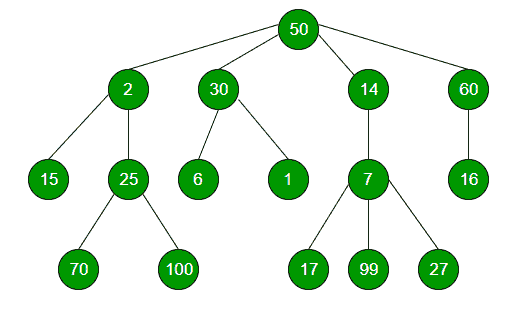

# n 元树中给定节点的兄弟节点数

> 原文:[https://www . geesforgeks . org/number-sibers-given-node-n-ary-tree/](https://www.geeksforgeeks.org/number-siblings-given-node-n-ary-tree/)

给定一个 N 元树，找出给定节点 x 的兄弟节点数。假设 x 存在于给定的 N 元树中。



**例:**

```
Input : 30
Output : 3
```

**方法:**对于给定 n 元树中的每个节点，推送队列中当前节点的子节点。在队列中添加当前节点的子节点时，检查是否有任何子节点等于给定值 x。如果是，那么返回 x 的兄弟姐妹数量。
**下面是上面思路的实现:**

## C++

```
// C++ program to find number
// of siblings of a given node
#include <bits/stdc++.h>
using namespace std;

// Represents a node of an n-ary tree
class Node {
public:
    int key;
    vector<Node*> child;

    Node(int data)
    {
        key = data;
    }
};

// Function to calculate number
// of siblings of a given node
int numberOfSiblings(Node* root, int x)
{
    if (root == NULL)
        return 0;

    // Creating a queue and
    // pushing the root
    queue<Node*> q;
    q.push(root);

    while (!q.empty()) {
        // Dequeue an item from queue and
        // check if it is equal to x If YES,
        // then return number of children
        Node* p = q.front();
        q.pop();

        // Enqueue all children of
        // the dequeued item
        for (int i = 0; i < p->child.size(); i++) {
            // If the value of children
            // is equal to x, then return
            // the number of siblings
            if (p->child[i]->key == x)
                return p->child.size() - 1;
            q.push(p->child[i]);
        }
    }
}

// Driver program
int main()
{
    // Creating a generic tree as shown in above figure
    Node* root = new Node(50);
    (root->child).push_back(new Node(2));
    (root->child).push_back(new Node(30));
    (root->child).push_back(new Node(14));
    (root->child).push_back(new Node(60));
    (root->child[0]->child).push_back(new Node(15));
    (root->child[0]->child).push_back(new Node(25));
    (root->child[0]->child[1]->child).push_back(new Node(70));
    (root->child[0]->child[1]->child).push_back(new Node(100));
    (root->child[1]->child).push_back(new Node(6));
    (root->child[1]->child).push_back(new Node(1));
    (root->child[2]->child).push_back(new Node(7));
    (root->child[2]->child[0]->child).push_back(new Node(17));
    (root->child[2]->child[0]->child).push_back(new Node(99));
    (root->child[2]->child[0]->child).push_back(new Node(27));
    (root->child[3]->child).push_back(new Node(16));

    // Node whose number of
    // siblings is to be calculated
    int x = 100;

    // Function calling
    cout << numberOfSiblings(root, x) << endl;

    return 0;
}
```

## Java 语言(一种计算机语言，尤用于创建网站)

```
// Java program to find number
// of siblings of a given node
import java.util.*;

class GFG
{

// Represents a node of an n-ary tree
static class Node
{
    int key;
    Vector<Node> child;

    Node(int data)
    {
        key = data;
        child = new Vector<Node>();
    }
};

// Function to calculate number
// of siblings of a given node
static int numberOfSiblings(Node root, int x)
{
    if (root == null)
        return 0;

    // Creating a queue and
    // pushing the root
    Queue<Node> q = new LinkedList<>();
    q.add(root);

    while (q.size() > 0)
    {
        // Dequeue an item from queue and
        // check if it is equal to x If YES,
        // then return number of children
        Node p = q.peek();
        q.remove();

        // Enqueue all children of
        // the dequeued item
        for (int i = 0; i < p.child.size(); i++)
        {
            // If the value of children
            // is equal to x, then return
            // the number of siblings
            if (p.child.get(i).key == x)
                return p.child.size() - 1;
            q.add(p.child.get(i));
        }
    }
    return -1;
}

// Driver code
public static void main(String args[])
{
    // Creating a generic tree as shown in above figure
    Node root = new Node(50);
    (root.child).add(new Node(2));
    (root.child).add(new Node(30));
    (root.child).add(new Node(14));
    (root.child).add(new Node(60));
    (root.child.get(0).child).add(new Node(15));
    (root.child.get(0).child).add(new Node(25));
    (root.child.get(0).child.get(1).child).add(new Node(70));
    (root.child.get(0).child.get(1).child).add(new Node(100));
    (root.child.get(1).child).add(new Node(6));
    (root.child.get(1).child).add(new Node(1));
    (root.child.get(2).child).add(new Node(7));
    (root.child.get(2).child.get(0).child).add(new Node(17));
    (root.child.get(2).child.get(0).child).add(new Node(99));
    (root.child.get(2).child.get(0).child).add(new Node(27));
    (root.child.get(3).child).add(new Node(16));

    // Node whose number of
    // siblings is to be calculated
    int x = 100;

    // Function calling
    System.out.println( numberOfSiblings(root, x) );
}
}

// This code is contributed by Arnab Kundu
```

## 蟒蛇 3

```
# Python3 program to find number
# of siblings of a given node
from queue import Queue

# Represents a node of an n-ary tree
class newNode:
    def __init__(self,data):
        self.child = []
        self.key = data

# Function to calculate number
# of siblings of a given node
def numberOfSiblings(root, x):
    if (root == None):
        return 0

    # Creating a queue and
    # pushing the root
    q = Queue()
    q.put(root)

    while (not q.empty()):

        # Dequeue an item from queue and
        # check if it is equal to x If YES,
        # then return number of children
        p = q.queue[0]
        q.get()

        # Enqueue all children of
        # the dequeued item
        for i in range(len(p.child)):

            # If the value of children
            # is equal to x, then return
            # the number of siblings
            if (p.child[i].key == x):
                return len(p.child) - 1
            q.put(p.child[i])

# Driver Code
if __name__ == '__main__':

    # Creating a generic tree as
    # shown in above figure
    root = newNode(50)
    (root.child).append(newNode(2))
    (root.child).append(newNode(30))
    (root.child).append(newNode(14))
    (root.child).append(newNode(60))
    (root.child[0].child).append(newNode(15))
    (root.child[0].child).append(newNode(25))
    (root.child[0].child[1].child).append(newNode(70))
    (root.child[0].child[1].child).append(newNode(100))
    (root.child[1].child).append(newNode(6))
    (root.child[1].child).append(newNode(1))
    (root.child[2].child).append(newNode(7))
    (root.child[2].child[0].child).append(newNode(17))
    (root.child[2].child[0].child).append(newNode(99))
    (root.child[2].child[0].child).append(newNode(27))
    (root.child[3].child).append(newNode(16))

    # Node whose number of
    # siblings is to be calculated
    x = 100

    # Function calling
    print(numberOfSiblings(root, x))

# This code is contributed by PranchalK
```

## C#

```
// C# program to find number
// of siblings of a given node
using System;
using System.Collections.Generic;

class GFG
{

// Represents a node of an n-ary tree
public class Node
{
    public int key;
    public List<Node> child;

    public Node(int data)
    {
        key = data;
        child = new List<Node>();
    }
};

// Function to calculate number
// of siblings of a given node
static int numberOfSiblings(Node root, int x)
{
    if (root == null)
        return 0;

    // Creating a queue and
    // pushing the root
    Queue<Node> q = new Queue<Node>();
    q.Enqueue(root);

    while (q.Count > 0)
    {
        // Dequeue an item from queue and
        // check if it is equal to x If YES,
        // then return number of children
        Node p = q.Peek();
        q.Dequeue();

        // Enqueue all children of
        // the dequeued item
        for (int i = 0; i < p.child.Count; i++)
        {
            // If the value of children
            // is equal to x, then return
            // the number of siblings
            if (p.child[i].key == x)
                return p.child.Count - 1;
            q.Enqueue(p.child[i]);
        }
    }
    return -1;
}

// Driver code
public static void Main(String []args)
{
    // Creating a generic tree
    // as shown in above figure
    Node root = new Node(50);
    (root.child).Add(new Node(2));
    (root.child).Add(new Node(30));
    (root.child).Add(new Node(14));
    (root.child).Add(new Node(60));
    (root.child[0].child).Add(new Node(15));
    (root.child[0].child).Add(new Node(25));
    (root.child[0].child[1].child).Add(new Node(70));
    (root.child[0].child[1].child).Add(new Node(100));
    (root.child[1].child).Add(new Node(6));
    (root.child[1].child).Add(new Node(1));
    (root.child[2].child).Add(new Node(7));
    (root.child[2].child[0].child).Add(new Node(17));
    (root.child[2].child[0].child).Add(new Node(99));
    (root.child[2].child[0].child).Add(new Node(27));
    (root.child[3].child).Add(new Node(16));

    // Node whose number of
    // siblings is to be calculated
    int x = 100;

    // Function calling
    Console.WriteLine( numberOfSiblings(root, x));
}
}

// This code is contributed by PrinciRaj1992
```

## java 描述语言

```
<script>

// JavaScript program to find number
// of siblings of a given node

// Represents a node of an n-ary tree
class Node
{
  constructor(data)
  {
    this.key = data;
    this.child = [];
  }
};

// Function to calculate number
// of siblings of a given node
function numberOfSiblings(root, x)
{
    if (root == null)
        return 0;

    // Creating a queue and
    // pushing the root
    var q = [];
    q.push(root);

    while (q.length > 0)
    {
        // Dequeue an item from queue and
        // check if it is equal to x If YES,
        // then return number of children
        var p = q[0];
        q.shift();

        // push all children of
        // the dequeued item
        for (var i = 0; i < p.child.length; i++)
        {
            // If the value of children
            // is equal to x, then return
            // the number of siblings
            if (p.child[i].key == x)
                return p.child.length - 1;
            q.push(p.child[i]);
        }
    }
    return -1;
}

// Driver code
// Creating a generic tree
// as shown in above figure
var root = new Node(50);
(root.child).push(new Node(2));
(root.child).push(new Node(30));
(root.child).push(new Node(14));
(root.child).push(new Node(60));
(root.child[0].child).push(new Node(15));
(root.child[0].child).push(new Node(25));
(root.child[0].child[1].child).push(new Node(70));
(root.child[0].child[1].child).push(new Node(100));
(root.child[1].child).push(new Node(6));
(root.child[1].child).push(new Node(1));
(root.child[2].child).push(new Node(7));
(root.child[2].child[0].child).push(new Node(17));
(root.child[2].child[0].child).push(new Node(99));
(root.child[2].child[0].child).push(new Node(27));
(root.child[3].child).push(new Node(16));
// Node whose number of
// siblings is to be calculated
var x = 100;
// Function calling
document.write( numberOfSiblings(root, x));

</script>
```

**Output:** 

```
1
```

**时间复杂度:** O(N)，其中 N 为树中节点数。
**辅助空间:** O(N)，其中 N 为树中节点数。