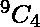
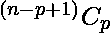
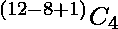

# 进站问题次数

> 原文:[https://www . geesforgeks . org/number-stop-station-problem/](https://www.geeksforgeeks.org/number-stopping-station-problem/)

两个地方 A 和 b 之间有 12 个中间站。找出一列火车可以在其中 4 个中间站停车的方法，这样就不会有两个停车站是连续的？
**示例–**

```
Input  : n = 12, s = 4
Output : 126

Input  : n = 16, s = 5
Output : 792
```

**解释 1 :**
固定/移除四个停靠点中的一个作为固定点，并计算在它们之间可以插入多少个其他站点，如果停靠点之间必须至少有一个站点。

```
            A   x   x   x   x   x   x   x   x   B
```

在这 8 个不停站之间，我们有 9 个位置，我们选择这 9 个位置作为这 8 个站之间的停站。
所以，答案应该是 = 126
**解释 2 :**
如果你知道关于不可区分的球组合成可区分的盒子，那么你可以简单的使用，。在这个问题中，$n$是站点的数量，$p$是您想要停止的站点的数量。在这里，停靠站就像不可区分的球，不停靠站就像可区分的盒子。
因此， =  = 126
**代码–**

## C++

```
#include <stdio.h>
int stopping_station(int, int);

// function to calculate number
// of ways of selecting 'p' non consecutive
// stations out of 'n' stations
int stopping_station(int p, int n)
{

    int num = 1, dem = 1, s = p;

    // selecting 's' positions out of 'n-s+1'
    while (p != 1) {

        dem *= p;
        p--;
    }

    int t = n - s + 1;
    while (t != (n - 2 * s + 1)) {

        num *= t;
        t--;
    }

    if ((n - s + 1) >= s)
        printf("%d", num / dem);

    else

        // if conditions does not satisfy of combinatorics
        printf("not possible");
}

// driver code
int main()
{

    // n is total number of stations
    // s is no. of stopping stations
    int n, s;

    // arguments of function are
    // number of stopping station
    // and total number of stations
    stopping_station(4, 12);
}
```

## Java 语言(一种计算机语言，尤用于创建网站)

```
// Java code to calculate number
// of ways of selecting 'p' non
// consecutive stations out of
// 'n' stations

import java.io.*;
import java.util.*;

class GFG
{
    public static int stopping_station(int p, int n)
    {
        int num = 1, dem = 1, s = p;

        // selecting 's' positions out of 'n-s+1'
        while (p != 1)
        {
            dem *= p;
            p--;
        }

        int t = n - s + 1;
        while (t != (n - 2 * s + 1))
        {
            num *= t;
            t--;
        }

        if ((n - s + 1) >= s)
            System.out.print(num / dem);

        else
            // if conditions does not satisfy of combinatorics
            System.out.print("not possible");

        return 0;
    }

    public static void main (String[] args)
    {
        // n is total number of stations
        // s is no. of stopping stations
        int n, s;

        // arguments of function are
        // number of stopping station
        // and total number of stations
        stopping_station(4, 12);
    }
}
// ""This code is contributed by Mohit Gupta_OMG ""
```

## 蟒蛇 3

```
# Python code to calculate number
# of ways of selecting 'p' non
# consecutive stations out of
# 'n' stations

def stopping_station( p, n):
    num = 1
    dem = 1
    s = p

    # selecting 's' positions
    # out of 'n-s+1'
    while p != 1:
        dem *= p
        p-=1

    t = n - s + 1
    while t != (n-2 * s + 1):
        num *= t
        t-=1
    if (n - s + 1) >= s:
        return int(num/dem)
    else:
        # if conditions does not
        # satisfy of combinatorics
        return -1

# driver code
num = stopping_station(4, 12)
if num != -1:
    print(num)
else:
    print("Not Possible")

# This code is contributed by "Abhishek Sharma 44"
```

## C#

```
// C# code to calculate number
// of ways of selecting 'p' non
// consecutive stations out of
// 'n' stations
using System;

class GFG {

    public static int stopping_station(int p,
                                       int n)
    {
        int num = 1, dem = 1, s = p;

        // selecting 's' positions
        // out of 'n-s+1'
        while (p != 1)
        {
            dem *= p;
            p--;
        }

        int t = n - s + 1;
        while (t != (n - 2 * s + 1))
        {
            num *= t;
            t--;
        }

        if ((n - s + 1) >= s)
            Console.WriteLine(num / dem);

        // if conditions does not
        // satisfy of combinatorics
        else
          Console.WriteLine("Not possible");
        return 0;
    }

    // Driver Code
    public static void Main(String []args)
    {

        // arguments of function are
        // number of stopping station
        // and total number of stations
        stopping_station(4, 12);
    }
}

// This code is contributed by vt_m.
```

## 服务器端编程语言（Professional Hypertext Preprocessor 的缩写）

```
<?php
// PHP code for Number of stopping
// station problem

// function to calculate number
// of ways of selecting 'p' non
// consecutive stations out of
// 'n' stations
function stopping_station(int $p, int $n)
{
    $num = 1;
    $dem = 1;
    $s = $p;

    // selecting 's' positions
    // out of 'n-s+1'
    while($p != 1)
    {

        $dem *= $p;
        $p--;
    }

    $t = $n - $s + 1;
    while($t != ($n - 2 * $s + 1))
    {
        $num *= $t;
        $t--;
    }

    if (($n - $s + 1) >= $s)
        echo $num / $dem;

    else

        // if conditions does not
        // satisfy of combinatorics
        echo "not possible";
}

    // Driver Code
    // n is total number of stations
    // s is no. of stopping stations
    $n; $s;

    // arguments of function are
    // number of stopping station
    // and total number of stations
    stopping_station(4, 12);

// This code is contributed by anuj_67.
?>
```

## java 描述语言

```
<script>

// Javascript code to calculate number
// of ways of selecting 'p' non
// consecutive stations out of
// 'n' stations

    function stopping_station( p,  n)
    {
        var num = 1, dem = 1, s = p;

        // selecting 's' positions
        // out of 'n-s+1'
        while (p != 1)
        {
            dem *= p;
            p--;
        }

        var t = n - s + 1;
        while (t != (n - 2 * s + 1))
        {
            num *= t;
            t--;
        }

        if ((n - s + 1) >= s){
            document.write(num / dem);
         }

        // if conditions does not
        // satisfy of combinatorics
        else{
          document.write("Not possible");
          }
        return 0;
    }

    // Driver Code

        // arguments of function are
        // number of stopping station
        // and total number of stations
        stopping_station(4, 12);

</script>

```

**输出:**

```
126
```