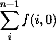

# 整数串中可被 6 整除的子串数

> 原文:[https://www . geesforgeks . org/number-substrings-整除-6-string-integers/](https://www.geeksforgeeks.org/number-substrings-divisible-6-string-integers/)

给定一个由 0 到 9 的整数组成的字符串。任务是计算子串的数量，当转换为整数时，这些子串可以被 6 整除。子字符串不包含前导零。

**示例:**

```
Input : s = "606".
Output : 5
Substrings "6", "0", "6", "60", "606"
are divisible by 6.

Input : s = "4806".
Output : 5
"0", "6", "48", "480", "4806" are 
substring which are divisible by 6.

```

**方法一:(蛮力)**思路是[找到给定字符串的所有子串](https://www.geeksforgeeks.org/subarraysubstring-vs-subsequence-and-programs-to-generate-them/)，[检查子串是否能被 6 整除](https://www.geeksforgeeks.org/check-large-number-divisible-6-not/)。
**时间复杂度:** O(n <sup>2</sup> )。

**方法 2:(动态规划)**如[所述，检查一个大数是否能被 6 整除](https://www.geeksforgeeks.org/check-large-number-divisible-6-not/)。如果最后一个数字能被 2 整除，并且数字的总和能被 3 整除，那么一个数就能被 6 整除。

这个想法是使用动态编程，它使我们能够通过跟踪以前计算的答案并使用这些存储的答案来快速有效地计算答案，而不是重新计算值。

设 ***f(i，m)是从索引 I 开始的字符串数，它们的数字模 3 之和(到目前为止)是 m，它所代表的数是偶数*** 。所以，我们的答案是


让 x 是字符串中的第 I<sup>位。从 f(i，m)开始，我们需要找到从 i + 1 开始的所有偶数子串。
同样，如果(x + m)本身可以被 3 整除，并且 x 是偶数，我们将得到一个额外的子串。因此，我们得到递归关系</sup>

```
// We initially pass m (sum modulo 3 so far) as 0
f(i, m) = ((x + m)%3 == 0 and x%2 == 0) + 
          f(i + 1, (m + x)%3)  // Recursive 
```

通过记忆状态，我们得到了 O(n)解。

以下是该方法的实现:

## C++

```
// C++ program to calculate number of substring
// divisible by 6.
#include <bits/stdc++.h>
#define MAX 100002
using namespace std;

// Return the number of substring divisible by 6
// and starting at index i in s[] and previous sum
// of digits modulo 3 is m.
int f(int i, int m, char s[], int memoize[][3])
{
    // End of the string.
    if (i == strlen(s))
        return 0;

    // If already calculated, return the
    // stored value.
    if (memoize[i][m] != -1)
        return memoize[i][m];

    // Converting into integer.
    int x = s[i] - '0';

    // Increment result by 1, if current digit
    // is divisible by 2 and sum of digits is
    // divisible by 3.
    // And recur for next index with new modulo.
    int ans = ((x+m)%3 == 0 && x%2 == 0) +
              f(i+1, (m+x)%3, s, memoize);

    return memoize[i][m] = ans;
}

// Returns substrings divisible by 6.
int countDivBy6(char s[])
{
    int n = strlen(s);

    // For storing the value of all states.
    int memoize[n+1][3];
    memset(memoize, -1, sizeof memoize);

    int ans = 0;
    for (int i = 0; i < strlen(s); i++)
    {
        // If string contain 0, increment count by 1.
        if (s[i] == '0')
            ans++;

        // Else calculate using recursive function.
        // Pass previous sum modulo 3 as 0.
        else
            ans += f(i, 0, s, memoize);
    }

    return ans;
}

// Driven Program
int main()
{
    char s[] = "4806";

    cout << countDivBy6(s) << endl;

    return 0;
}
```

## Java 语言(一种计算机语言，尤用于创建网站)

```
// Java program to calculate number of substring 
// divisible by 6.
import java.util.*;

class GFG 
{

    static int MAX = 100002;

    // Return the number of substring divisible by 6 
    // and starting at index i in s[] and previous sum 
    // of digits modulo 3 is m. 
    static int f(int i, int m, char s[], int memoize[][]) 
    {
        // End of the string. 
        if (i == s.length)
        {
            return 0;
        }

        // If already calculated, return the 
        // stored value. 
        if (memoize[i][m] != -1) 
        {
            return memoize[i][m];
        }

        // Converting into integer. 
        int x = s[i] - '0';

        // Increment result by 1, if current digit 
        // is divisible by 2 and sum of digits is 
        // divisible by 3. 
        // And recur for next index with new modulo. 
        int ans = ((x + m) % 3 == 0 && x % 2 == 0) ? 1 + f(i + 1,
                (m + x) % 3, s, memoize) : f(i + 1, (m + x) % 3, s, memoize);
        memoize[i][m] = ans;
        return memoize[i][m];
    }

    // Returns substrings divisible by 6. 
    static int countDivBy6(char s[]) 
    {
        int n = s.length;

        // For storing the value of all states. 
        int[][] memoize = new int[n + 1][3];
        for (int i = 0; i < n + 1; i++)
        {
            for (int j = 0; j < 3; j++) 
            {
                memoize[i][j] = -1;
            }
        }

        int ans = 0;
        for (int i = 0; i < s.length; i++) 
        {
            // If string contain 0, increment count by 1. 
            if (s[i] == '0') 
            {
                ans++;
            } 
            // Else calculate using recursive function. 
            // Pass previous sum modulo 3 as 0. 
            else 
            {
                ans += f(i, 0, s, memoize);
            }
        }

        return ans;
    }

    // Driven Program 
    public static void main(String[] args) 
    {
        char s[] = "4806".toCharArray();

        System.out.println(countDivBy6(s));
    }
}

// This code is contributed by Rajput-Ji
```

## 蟒蛇 3

```
# Python3 program to calculate number
# of substring 

# Return the number of substring divisible 
# by 6 and starting at index i in s[] and 
# previous sum of digits modulo 3 is m. 
def f(i, m, s, memoize):

    # End of the string. 
    if (i == len(s)):
        return 0

    # If already calculated, return 
    # the stored value. 
    if (memoize[i][m] != -1): 
        return memoize[i][m] 

    # Converting into integer. 
    x = ord(s[i]) - ord('0')

    # Increment result by 1, if current digit 
    # is divisible by 2 and sum of digits is 
    # divisible by 3. 
    # And recur for next index with new modulo. 
    ans = (((x + m) % 3 == 0 and x % 2 == 0) +
          f(i + 1, (m + x) % 3, s, memoize)) 

    memoize[i][m] = ans
    return memoize[i][m]

# Returns substrings divisible by 6. 
def countDivBy6(s):
    n = len(s)

    # For storing the value of all states.
    memoize = [[-1] * 3 for i in range(n + 1)]

    ans = 0
    for i in range(len(s)):

        # If string contain 0, increment 
        # count by 1. 
        if (s[i] == '0'):
            ans += 1

        # Else calculate using recursive function. 
        # Pass previous sum modulo 3 as 0. 
        else:
            ans += f(i, 0, s, memoize)

    return ans

# Driver Code
if __name__ == '__main__':
    s = "4806"

    print(countDivBy6(s))

# This code is contributed by PranchalK
```

## C#

```
// C# program to calculate number of substring 
// divisible by 6.
using System;

class GFG
{

    static int MAX = 100002;

    // Return the number of substring divisible by 6 
    // and starting at index i in s[] and previous sum 
    // of digits modulo 3 is m. 
    static int f(int i, int m, char []s, int [,]memoize) 
    {
        // End of the string. 
        if (i == s.Length)
        {
            return 0;
        }

        // If already calculated, return the 
        // stored value. 
        if (memoize[i,m] != -1) 
        {
            return memoize[i,m];
        }

        // Converting into integer. 
        int x = s[i] - '0';

        // Increment result by 1, if current digit 
        // is divisible by 2 and sum of digits is 
        // divisible by 3. 
        // And recur for next index with new modulo. 
        int ans = ((((x + m) % 3 == 0) && (x % 2 == 0)) ? 1 : 0)
                + f(i + 1, (m + x) % 3, s, memoize);

        return memoize[i,m] = ans;
    }

    // Returns substrings divisible by 6. 
    static int countDivBy6(char []s) 
    {
        int n = s.Length;

        // For storing the value of all states. 
        int[,] memoize = new int[n + 1,3];
        for (int i = 0; i < n + 1; i++)
        {
            for (int j = 0; j < 3; j++)
            {
                memoize[i,j] = -1;
            }
        }

        int ans = 0;
        for (int i = 0; i < s.Length; i++)
        {
            // If string contain 0, increment count by 1. 
            if (s[i] == '0') 
            {
                ans++;
            } 
            // Else calculate using recursive function. 
            // Pass previous sum modulo 3 as 0. 
            else
            {
                ans += f(i, 0, s, memoize);
            }
        }

        return ans;
    }

    // Driver code 
    public static void Main(String[] args) 
    {
        char []s = "4806".ToCharArray();

        Console.WriteLine(countDivBy6(s));
    }
}

/* This code is contributed by PrinciRaj1992 */
```

**Output:**

```
5

```

**时间复杂度:** O(n)。

本文由 **[Anuj Chauhan](https://www.facebook.com/anuj0503)** 供稿。如果你喜欢 GeeksforGeeks 并想投稿，你也可以使用[contribute.geeksforgeeks.org](http://www.contribute.geeksforgeeks.org)写一篇文章或者把你的文章邮寄到 contribute@geeksforgeeks.org。看到你的文章出现在极客博客主页上，帮助其他极客。

如果你发现任何不正确的地方，或者你想分享更多关于上面讨论的话题的信息，请写评论。