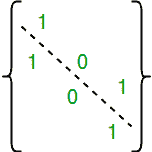

# 集合上对称关系的个数

> 原文:[https://www . geesforgeks . org/number-symmetric-relations-set/](https://www.geeksforgeeks.org/number-symmetric-relations-set/)

给定一个数 n，找出前 n 个自然数{1，2，..n}。
示例:

```
Input  : n = 2
Output : 8
Given set is {1, 2}. Below are all symmetric relation.
{}
{(1, 1)}, 
{(2, 2)},
{(1, 1), (2, 2)}, 
{(1, 2), (2, 1)} 
{(1, 1), (1, 2), (2, 1)},
{(2, 2), (1, 2), (2, 1)}, 
{(1, 1), (1, 2), (2, 1), (1, 2)} 

Input  : n = 3
Output : 64
```

集合 A 上的一个关系‘R’被说成是对称的，如果 xRy 然后 yRx 为每 x，y ∈ A
或者如果(x，y) ∈ R，那么(y，x) ∈ R 为每 x，y？一

> 对称关系总数为**2<sup>n(n+1)/2</sup>T3。
> **这个公式是怎么用的？**
> 如果每个单元格(I，j)的值与该单元格(j，I)相同，则关系 R 是对称的。对角线可以有任何值。** 
> 
> 
> 
> 有 n 个对角线值，对角线值的总可能组合= 2 <sup>n</sup>
> 有 n<sup>2</sup>–n 个非对角线值。我们只能为其中的一半选择不同的值，因为当我们为单元格(I，j)选择一个值时，单元格(j，I)会得到相同的值。
> 所以非对角线值的组合= 2<sup>(N2–n)/2</sup>
> 整体组合= 2<sup>n</sup>* 2<sup>(N2–n)/2</sup>=**2<sup>n(n+1)/2</sup>**

## C++

```
// C++ program to count total symmetric relations
// on a set of natural numbers.
#include <bits/stdc++.h>

// function find the square of n
unsigned int countSymmetric(unsigned int n)
{
    // Base case
    if (n == 0)
        return 1;

   // Return 2^(n(n + 1)/2)
   return 1 << ((n * (n + 1))/2);
}

// Driver code
int main()
{
    unsigned int n = 3;

    printf("%u", countSymmetric(n));
    return 0;
}
```

## Java 语言(一种计算机语言，尤用于创建网站)

```
// Java program to count total symmetric
// relations on a set of natural numbers.
import java.io.*;
import java.util.*;

class GFG {

    // function find the square of n
    static int countSymmetric(int n)
    {
        // Base case
        if (n == 0)
            return 1;

    // Return 2^(n(n + 1)/2)
    return 1 << ((n * (n + 1)) / 2);
    }

    // Driver code
    public static void main (String[] args)
    {
        int n = 3;
        System.out.println(countSymmetric(n));
    }
}

// This code is contributed by Nikita Tiwari.
```

## 蟒蛇 3

```
# Python 3 program to count
# total symmetric relations
# on a set of natural numbers.

# function find the square of n
def countSymmetric(n) :
    # Base case
    if (n == 0) :
        return 1

    # Return 2^(n(n + 1)/2)
    return (1 << ((n * (n + 1))//2))

# Driver code

n = 3
print(countSymmetric(n))

# This code is contributed
# by Nikita Tiwari.
```

## C#

```
// C# program to count total symmetric
// relations on a set of natural numbers.
using System;

class GFG {

    // function find the square of n
    static int countSymmetric(int n)
    {
        // Base case
        if (n == 0)
            return 1;

    // Return 2^(n(n + 1)/2)
    return 1 << ((n * (n + 1)) / 2);
    }

    // Driver code
    public static void Main ()
    {
        int n = 3;
        Console.WriteLine(countSymmetric(n));
    }
}

// This code is contributed by vt_m.
```

## 服务器端编程语言（Professional Hypertext Preprocessor 的缩写）

```
<?php
// PHP program to count total symmetric
// relations on a set of natural numbers.

// function find the square of n
function countSymmetric($n)
{
    // Base case
    if ($n == 0)
        return 1;

    // Return 2^(n(n + 1)/2)
    return 1 << (($n * ($n + 1))/2);
}

    // Driver code
    $n = 3;
    echo(countSymmetric($n));

// This code is contributed by vt_m.
?>
```

## java 描述语言

```
<script>

// JavaScript program to count total symmetric
// relations on a set of natural numbers.

// function find the square of n
    function countSymmetric(n)
    {
        // Base case
        if (n == 0)
            return 1;

    // Return 2^(n(n + 1)/2)
    return 1 << ((n * (n + 1)) / 2);
    }

// Driver Code

        let n = 3;
        document.write(countSymmetric(n));

</script>
```

**输出:**

```
64
```