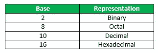
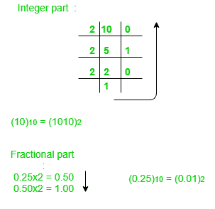
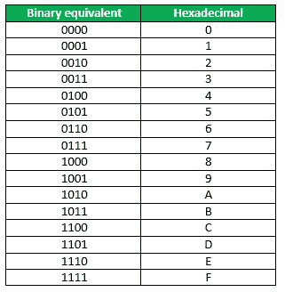

# 数字系统和基数转换

> 原文:[https://www . geesforgeks . org/number-system-and-base-conversions/](https://www.geeksforgeeks.org/number-system-and-base-conversions/)

电子和数字系统可以使用各种不同的数字系统(例如十进制、十六进制、八进制、二进制)。

基数为 N 或基数为 b 的数可以写成:

```
(N)b = dn-1 dn-2 -- -- -- -- d1 d0 . d-1 d-2 -- -- -- -- d-m
```

上图中，d <sub>n-1</sub> 到 d <sub>0</sub> 为整数部分，然后跟随一个基点，然后 d <sub>-1</sub> 到 d <sub>-m</sub> 为小数部分。

d <sub>n-1</sub> =最高有效位(MSB)
d <sub>-m</sub> =最低有效位(LSB)



**如何将一个数从一个基数转换成另一个基数？**

遵循示例插图:

## 1.十进制到二进制

(10.25) <sub>10</sub>



**注意:**继续将小数部分乘以 2，直到得到小数部分 0.00。
(0.25)<sub>10</sub>=(0.01)<sub>2</sub>

**回答:**(10.25)<sub>10</sub>=(1010.01)<sub>2</sub>

## 2.二进制到十进制

```
(1010.01)2 
1x23 + 0x22 + 1x21+ 0x20 + 0x2 -1 + 1x2 -2 = 8+0+2+0+0+0.25 = 10.25 
(1010.01)2 = (10.25)10 
```

## 3.十进制到八进制

```
(10.25)10 
(10)10 = (12)8 
Fractional part: 
0.25 x 8 = 2.00 
```

**注意:**继续将小数部分乘以 8，直到得到小数部分. 00。
(. 25)<sub>10</sub>=(. 2)<sub>8</sub>

**回答:**(10.25)<sub>10</sub>=(12.2)<sub>8</sub>

## 4.八进制到十进制

```
(12.2)8
1 x 81 + 2 x 80 +2 x 8-1 = 8+2+0.25 = 10.25 
(12.2)8 = (10.25)10 
```

## 5.十六进制到二进制

要从十六进制转换为二进制，请写入十六进制的 4 位二进制等价物。



(3A)<sub>16</sub>=(00111010)<sub>2</sub>

## 6.二进制到十六进制

要从二进制转换为十六进制，请从右端开始将位分组为 4 组，并为 4 位二进制写入等效的十六进制。在左侧添加额外的 0 来调整组。

```
1111011011
0011 1101 1011
(001111011011 )2 = (3DB)16 
```

本文由 **Kriti Kushwaha** 供稿。

如果你发现任何不正确的地方，或者你想分享更多关于上面讨论的话题的信息，请写评论。