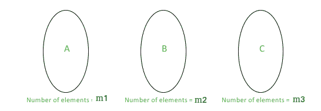

# 在欧几里得平面上给定一组直线可以形成的三角形的数量

> 原文:[https://www . geesforgeks . org/number-triangles-can-formed-给定-set-line-euclidean-plane/](https://www.geeksforgeeks.org/number-triangles-can-formed-given-set-lines-euclidean-plane/)

给定欧几里得平面上的一组 L = {l <sub>1</sub> ，l <sub>2</sub> ，……，l <sub>n</sub> }条不同的直线。i <sup>第</sup>行由公式 a<sub>I</sub>x+b<sub>I</sub>y = c<sub>I</sub>给出。找出用集合 l 中的线可以构成的三角形的数量。注意，没有两对线在同一点相交。
注意:这个问题没有提到线不能平行，这就使得问题很难解决。

**示例:**

```
Input: a[] = {1, 2, 3, 4}
       b[] = {2, 4, 5, 5}
       c[] = {5, 7, 8, 6}
Output: 2
The number of triangles that can be formed are: 2

Input: a[] = {1, 2, 3, 2, 4, 1, 2, 3, 4, 5}
       b[] = {2, 4, 6, 3, 6, 5, 10, 15, 20, 25}
       c[] = {3, 5, 11, 10, 9, 17, 13, 11, 7, 3}
Output: 30
The number of triangles that can be formed are: 30
```

### 朴素算法

朴素算法可以描述为:

1.  从集合 l 中拾取 3 条任意线。
2.  现在检查是否可以使用选定的 3 条线形成三角形。这可以通过检查它们是否成对并行来轻松完成。
3.  如果可以形成三角形，则递增计数器。

**时间复杂度:**有 <sup>n</sup> C <sub>3</sub> 三胞胎的线路。对于每个三元组，我们必须进行 3 次比较，以检查任何 2 条线是否平行，这意味着检查可以在 O(1)时间内完成。这使得幼稚算法 O(n <sup>3</sup> )。

### 有效算法

这也可以在 O(n log n)中实现。高效算法背后的逻辑描述如下。
我们将集合 L 划分为不同的子集。子集的形成基于斜率，即特定子集中的所有线具有相同的斜率，即它们彼此平行。

让我们考虑三套(比如 A、B 和 C)。对于一个特定的集合(比如 A)，属于这个集合的线都是相互平行的。如果我们有 A、B 和 C，我们可以从每组中选择一条线来得到一个三角形，因为这些线都不会平行。通过生成子集，我们确保了没有两条平行线被拾取在一起。



如果我们只有这 3 个子集，

```
Number of triangles = (Number of ways to pick a line from A) * 
                      (Number of ways to pick a line from B) * 
                      (Number of ways to pick a line from C) 
                   = m1*m2*m3
Here m1 is count of elements with first slope (in Set A)
Here m2 is count of elements with first slope (in Set B)
Here m3 is count of elements with first slope (in Set C)
```

同样，如果我们有 **4 个子集**，我们可以扩展这个逻辑得到，
三角形的数量= m1 * m2 * m3+m1 * m2 * M4+m1 * m3 * M4+m2 * m3 * M4

对于大于 3 的子集数，如果我们有‘k’个子集，我们的任务是找到一次取 3 的子集的元素数之和。这可以通过维护计数数组来实现。我们制作一个计数数组，其中计数 <sub>i</sub> 表示平行线第 i <sup>个</sup>子集的计数。

```
We one by one compute following values.
sum1 = m1 + m2 + m3 .....
sum2 = m1*m2 + m1*m3 + ... + m2*m3 + m2*m4 + ...
sum3 = m1*m2*m3 + m1*m2*m4 + ...... m2*m3*m4 + ....
sum3 gives our final answer
```

## C++

```
// C++ program to find the number of
// triangles that can be formed
// using a set of lines in Euclidean
// Plane
#include <bits/stdc++.h>
using namespace std;

#define EPSILON numeric_limits<double>::epsilon()

// double variables can't be checked precisely
// using '==' this function returns true if
// the double variables are equal
bool compareDoubles(double A, double B)
{
    double diff = A-B;
    return (diff<EPSILON) && (-diff<EPSILON);
}

// This function returns the number of triangles
// for a given set of lines
int numberOfTringles(int a[], int b[], int c[], int n)
{
    //slope array stores the slope of lines
    double slope[n];
    for (int i=0; i<n; i++)
        slope[i] = (a[i]*1.0)/b[i];

    // slope array is sorted so that all lines
    // with same slope come together
    sort(slope, slope+n);

    // After sorting slopes, count different
    // slopes. k is index in count[].
    int count[n], k = 0;
    int this_count = 1;   // Count of current slope
    for (int i=1; i<n; i++)
    {
        if (compareDoubles(slope[i], slope[i-1]))
            this_count++;
        else
        {
            count[k++] = this_count;
            this_count = 1;
        }
    }
    count[k++] = this_count;

    // calculating sum1 (Sum of all slopes)
    // sum1 = m1 + m2 + ...
    int sum1 = 0;
    for (int i=0; i<k; i++)
        sum1 += count[i];

    // calculating sum2\. sum2 = m1*m2 + m2*m3 + ...
    int sum2 = 0;
    int temp[n];  // Needed for sum3
    for (int i=0; i<k; i++)
    {
        temp[i] = count[i]*(sum1-count[i]);
        sum2 += temp[i];
    }
    sum2 /= 2;

    // calculating sum3 which gives the final answer
    // m1 * m2 * m3 + m2 * m3 * m4 + ...
    int sum3 = 0;
    for (int i=0; i<k; i++)
        sum3 += count[i]*(sum2-temp[i]);
    sum3 /= 3;

    return sum3;
}

// Driver code
int main()
{
    // lines are stored as arrays of a, b
    // and c for 'ax+by=c'
    int a[] = {1, 2, 3, 4};
    int b[] = {2, 4, 5, 5};
    int c[] = {5, 7, 8, 6};

    // n is the number of lines
    int n = sizeof(a)/sizeof(a[0]);

    cout << "The number of triangles that"
            " can be formed are: "
         << numberOfTringles(a, b, c, n);

    return 0;
}
```

## Java 语言(一种计算机语言，尤用于创建网站)

```
// Java program to find the number of
// triangles that can be formed
// using a set of lines in Euclidean
// Plane
import java.util.*;

class GFG{

static double EPSILON = 1.0842e-19;

// Double variables can't be checked precisely
// using '==' this function returns true if
// the double variables are equal
static boolean compareDoubles(double A, double B)
{
    double diff = A - B;
    return (diff < EPSILON) &&
          (-diff < EPSILON);
}

// This function returns the number of
// triangles for a given set of lines
static int numberOfTringles(int []a, int []b,
                            int []c, int n)
{

    // Slope array stores the slope of lines
    Vector<Double> slope = new Vector<>();
    for(int i = 0; i < n; i++)
        slope.add((double)(a[i] * 1.0) / b[i]);

    // Slope array is sorted so that all lines
    // with same slope come together
    Collections.sort(slope);

    // After sorting slopes, count different
    // slopes. k is index in count[].
    int []count = new int [n];
    int k = 0;

    // Count of current slope
    int this_count = 1;

    for(int i = 1; i < n; i++)
    {
        if (compareDoubles((double)slope.get(i),
                           (double)slope.get(i - 1)))
            this_count++;
        else
        {
            count[k++] = this_count;
            this_count = 1;
        }
    }
    count[k++] = this_count;

    // Calculating sum1 (Sum of all slopes)
    // sum1 = m1 + m2 + ...
    int sum1 = 0;
    for(int i = 0; i < k; i++)
        sum1 += count[i];

    // Calculating sum2\. sum2 = m1*m2 + m2*m3 + ...
    int sum2 = 0;

    // Needed for sum3
    int temp[] = new int [n];

    for(int i = 0; i < k; i++)
    {
        temp[i] = count[i] * (sum1 - count[i]);
        sum2 += temp[i];
    }
    sum2 /= 2;

    // Calculating sum3 which gives the
    // final answer
    // m1 * m2 * m3 + m2 * m3 * m4 + ...
    int sum3 = 0;
    for(int i = 0; i < k; i++)
        sum3 += count[i] * (sum2 - temp[i]);

    sum3 /= 3;

    return sum3;
}

// Driver code
public static void main(String[] args)
{

    // Lines are stored as arrays of a, b
    // and c for 'ax+by=c'
    int a[] = { 1, 2, 3, 4 };
    int b[] = { 2, 4, 5, 5 };
    int c[] = { 5, 7, 8, 6 };

    // n is the number of lines
    int n = a.length;

    System.out.println("The number of triangles " +
                       "that can be formed are: " +
                       numberOfTringles(a, b, c, n));
}
}

// This code is contributed by Stream_Cipher
```

## C#

```
// C# program to find the number of
// triangles that can be formed
// using a set of lines in Euclidean
// Plane
using System.Collections.Generic;
using System; 

class GFG{

static double EPSILON = 1.0842e-19;

// Double variables can't be checked precisely
// using '==' this function returns true if
// the double variables are equal
static bool compareDoubles(double A, double B)
{
    double diff = A - B;
    return (diff < EPSILON) &&
          (-diff < EPSILON);
}

// This function returns the number of
// triangles for a given set of lines
static int numberOfTringles(int []a, int []b,
                            int []c, int n)
{

    // Slope array stores the slope of lines
    List<double> slope = new List<double>();
    for(int i = 0; i < n; i++)
        slope.Add((double)(a[i] * 1.0) / b[i]);

    // Slope array is sorted so that all lines
    // with same slope come together
    slope.Sort();

    // After sorting slopes, count different
    // slopes. k is index in count[].
    int []count = new int [n];
    int k = 0;

    // Count of current slope
    int this_count = 1;

    for(int i = 1; i < n; i++)
    {
        if (compareDoubles((double)slope[i],
                           (double)slope[i - 1]))
            this_count++;
        else
        {
            count[k++] = this_count;
            this_count = 1;
        }
    }
    count[k++] = this_count;

    // Calculating sum1 (Sum of all slopes)
    // sum1 = m1 + m2 + ...
    int sum1 = 0;
    for(int i = 0; i < k; i++)
        sum1 += count[i];

    // Calculating sum2\. sum2 = m1*m2 + m2*m3 + ...
    int sum2 = 0;

    // Needed for sum3
    int []temp = new int [n];
    for(int i = 0; i < k; i++)
    {
        temp[i] = count[i] * (sum1 - count[i]);
        sum2 += temp[i];
    }
    sum2 /= 2;

    // Calculating sum3 which gives
    // the final answer
    // m1 * m2 * m3 + m2 * m3 * m4 + ...
    int sum3 = 0;

    for(int i = 0; i < k; i++)
        sum3 += count[i] * (sum2 - temp[i]);

    sum3 /= 3;

    return sum3;
}

// Driver code
public static void Main()
{

    // lines are stored as arrays of a, b
    // and c for 'ax+by=c'
    int []a = { 1, 2, 3, 4 };
    int []b = { 2, 4, 5, 5 };
    int []c = { 5, 7, 8, 6 };

    // n is the number of lines
    int n = a.Length;

     Console.WriteLine("The number of triangles " +
                       "that can be formed are: " +
                       numberOfTringles(a, b, c, n));
}
}

// This code is contributed by Stream_Cipher
```

## java 描述语言

```
<script>
      // JavaScript program to find the number of
      // triangles that can be formed
      // using a set of lines in Euclidean
      // Plane
      const EPSILON = 1.0842e-19;

      // Double variables can't be checked precisely
      // using '==' this function returns true if
      // the double variables are equal
      function compareDoubles(A, B) {
        var diff = A - B;
        return diff < EPSILON && -diff < EPSILON;
      }

      // This function returns the number of
      // triangles for a given set of lines
      function numberOfTringles(a, b, c, n) {
        // Slope array stores the slope of lines
        var slope = [];
        for (var i = 0; i < n; i++) slope.push(parseFloat(a[i] * 1.0) / b[i]);

        // Slope array is sorted so that all lines
        // with same slope come together
        slope.sort();

        // After sorting slopes, count different
        // slopes. k is index in count[].
        var count = new Array(n).fill(0);
        var k = 0;

        // Count of current slope
        var this_count = 1;

        for (var i = 1; i < n; i++) {
          if (compareDoubles(parseFloat(slope[i]), parseFloat(slope[i - 1])))
            this_count++;
          else {
            count[k++] = this_count;
            this_count = 1;
          }
        }
        count[k++] = this_count;

        // Calculating sum1 (Sum of all slopes)
        // sum1 = m1 + m2 + ...
        var sum1 = 0;
        for (var i = 0; i < k; i++) sum1 += count[i];

        // Calculating sum2\. sum2 = m1*m2 + m2*m3 + ...
        var sum2 = 0;

        // Needed for sum3
        var temp = new Array(n).fill(0);
        for (var i = 0; i < k; i++) {
          temp[i] = count[i] * (sum1 - count[i]);
          sum2 += temp[i];
        }
        sum2 /= 2;

        // Calculating sum3 which gives
        // the final answer
        // m1 * m2 * m3 + m2 * m3 * m4 + ...
        var sum3 = 0;
        for (var i = 0; i < k; i++) sum3 += count[i] * (sum2 - temp[i]);
        sum3 /= 3;
        return sum3;
      }

      // Driver code
      // lines are stored as arrays of a, b
      // and c for 'ax+by=c'
      var a = [1, 2, 3, 4];
      var b = [2, 4, 5, 5];
      var c = [5, 7, 8, 6];

      // n is the number of lines
      var n = a.length;

      document.write(
        "The number of triangles " +
          "that can be formed are: " +
          numberOfTringles(a, b, c, n)
      );

      // This code is contributed by rdtank.
    </script>
```

**输出:**

```
The number of triangles that can be formed are: 2
```

**时间复杂度:**代码中所有的循环都是 O(n)。因此，该实现中的时间复杂度由用于对斜率数组进行排序的排序函数驱动。这使得算法 O(nlogn)。

本文由**安雅金达尔**供稿。如果你喜欢 GeeksforGeeks 并想投稿，你也可以使用[write.geeksforgeeks.org](https://write.geeksforgeeks.org)写一篇文章或者把你的文章邮寄到 review-team@geeksforgeeks.org。看到你的文章出现在极客博客主页上，帮助其他极客。
如果你发现任何不正确的地方，或者你想分享更多关于上面讨论的话题的信息，请写评论。