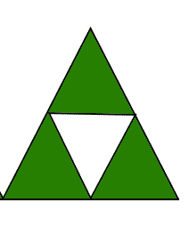
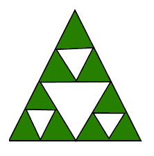

# N 次移动后的三角形数量

> 原文:[https://www.geeksforgeeks.org/number-triangles-n-moves/](https://www.geeksforgeeks.org/number-triangles-n-moves/)

第 n 步求三角形个数，
**规则:**在开始处画一个等边三角形。在第 I 步中，取未着色的三角形，将每个三角形分成 4 个面积相等的部分，并给中间部分涂上颜色。计算三角形的数量，直到第 n 步。

**示例:**

```
Input : 1
Output : 5 
Explanation: In 1st move we get
```



```
Input : 2
Output : 17 
Explanation: In 2nd move we get
```



**天真的做法:**
第 n 个图形中的三角形数量是第(n-1)个图形中的三角形数量+2 的 3 倍。通过观察我们可以看到，第 n 个图形是由 3 个类似于(n-1)图形的三角形和一个倒三角形组成的。我们还考虑到已经形成的更大的三角形。因此，第 n 个图形中的三角形数量变为(第(n-1)个图形中的三角形数量)*3 + 2。

## C++

```
// C++ program to calculate the number of equilateral
// triangles
#include <bits/stdc++.h>
using namespace std;
// function to calculate number of triangles in Nth step
int numberOfTriangles(int n)
{
    int answer[n + 1] = { 0 };
    answer[0] = 1;
    for (int i = 1; i <= n; i++) 
        answer[i] = answer[i - 1] * 3 + 2;

    return answer[n];
}

// driver program 
int main()
{
    int n = 2;
    cout << numberOfTriangles(n);
    return 0;
}
```

## Java 语言(一种计算机语言，尤用于创建网站)

```
// Java program to find middle of three 
// distinct numbers to calculate the 
// number of equilateral triangles
import java.util.*;

class Triangle
{   
    // function to calculate number of 
    // triangles in Nth step
    public static int numberOfTriangles(int n)
    {
        int[] answer = new int[n+1];
        answer[0] = 1;

        for (int i = 1; i <= n; i++) 
            answer[i] = answer[i - 1] * 3 + 2;

        return answer[n];
    }

    // driver code
    public static void main(String[] args)
    {
        int n = 2;
        System.out.println(numberOfTriangles(n));
    }
}

// This code is contributed by rishabh_jain
```

## 蟒蛇 3

```
# Python3 code to calculate the 
# number of equilateral triangles

# function to calculate number 
# of triangles in Nth step
def numberOfTriangles (n) :
    answer = [None] * (n + 1);
    answer[0] = 1;
    i = 1
    while i <= n: 
        answer[i] = answer[i - 1] * 3 + 2;
        i = i + 1

    return answer[n];

# Driver code
n = 2
print(numberOfTriangles(n))

# This code is contributed by "rishabh_jain".
```

## C#

```
// C# program to find middle of three 
// distinct numbers to calculate the 
// number of equilateral triangles
using System;

class Triangle
{ 
    // function to calculate number of 
    // triangles in Nth step
    public static int numberOfTriangles(int n)
    {
        int[] answer = new int[n+1];
        answer[0] = 1;

        for (int i = 1; i <= n; i++) 
            answer[i] = answer[i - 1] * 3 + 2;

        return answer[n];
    }

    // Driver code
    public static void Main()
    {
        int n = 2;
        Console.WriteLine(numberOfTriangles(n));
    }
}

// This code is contributed by vt_m
```

## 服务器端编程语言（Professional Hypertext Preprocessor 的缩写）

```
<?php
// PHP program to calculate
// the number of equilateral
// triangles

// function to calculate number
// of triangles in Nth step
function numberOfTriangles($n)
{
    $answer = array();
    $answer[0] = 1;
    for ($i = 1; $i <= $n; $i++) 
        $answer[$i] = $answer[$i - 1] * 
                               3 + 2;

    return $answer[$n];
}

    // Driver Code
    $n = 2;
    echo numberOfTriangles($n);

// This code is contributed by anuj_67.
?>
```

## java 描述语言

```
<script>

// Javascript program to calculate 
// the number of equilateral
// triangles

// Function to calculate number
// of triangles in Nth step
function numberOfTriangles(n)
{
    let answer = new Uint8Array(n + 1);
    answer[0] = 1;

    for(let i = 1; i <= n; i++)
        answer[i] = answer[i - 1] * 3 + 2;

    return answer[n];
}

// Driver code
let n = 2;

document.write(numberOfTriangles(n));

// This code is contributed by Mayank Tyagi

</script>
```

**输出:**

```
17
```

**时间复杂度:** O(n)

一个有效的解决方案是推导出第 n 步的公式:
如果我们对每一步都遵循天真的方法，那么我们得到第 n 步的三角形数量

> (2*(3^n))-1.

## C++

```
// C++ program to calculate the number of 
// equilateral triangles
#include <bits/stdc++.h>
using namespace std;

// function to calculate number of triangles 
// in Nth step
int numberOfTriangles(int n)
{
    int ans = 2 * (pow(3, n)) - 1;
    return ans;
}

// driver program 
int main()
{
    int n = 2;
    cout << numberOfTriangles(n);
    return 0;
}
```

## Java 语言(一种计算机语言，尤用于创建网站)

```
// Java program to find middle of three 
// distinct numbers to calculate the
// number of equilateral triangles
import java.util.*;
import static java.lang.Math.pow;

class Triangle
{   
    // function to calculate number 
    // of triangles in Nth step
    public static double numberOfTriangles(int n)
    {
        double ans = 2 * (pow(3, n)) - 1;
        return ans;
    }

    // driver code
    public static void main(String[] args)
    {
        int n = 2;
        System.out.println(numberOfTriangles(n));
    }
}

// This code is contributed by rishabh_jain
```

## 蟒蛇 3

```
# Python3 code to calculate the 
# number of equilateral triangles

# function to calculate number
# of triangles in Nth step
def numberOfTriangles (n) :
    ans = 2 * (pow(3, n)) - 1;
    return ans;

# Driver code
n = 2
print (numberOfTriangles(n))

# This code is contributed by "rishabh_jain".
```

## C#

```
//C# program to find middle of three 
// distinct numbers to calculate the
// number of equilateral triangles
using System;

class Triangle
{ 
    // function to calculate number 
    // of triangles in Nth step
    public static double numberOfTriangles(int n)
    {
        double ans = 2 * (Math.Pow(3, n)) - 1;
        return ans;
    }

    // Driver code
    public static void Main()
    {
        int n = 2;
        Console.WriteLine(numberOfTriangles(n));
    }
}

// This code is contributed by vt_m
```

## 服务器端编程语言（Professional Hypertext Preprocessor 的缩写）

```
<?php
// PHP program to calculate the 
// number of equilateral triangles

// function to calculate 
// number of triangles 
// in Nth step
function numberOfTriangles($n)
{
    $ans = 2 * (pow(3, $n)) - 1;
    return $ans;
}

    // Driver Code
    $n = 2;
    echo numberOfTriangles($n);

// This code is contributed by anuj_67.
?>
```

## java 描述语言

```
<script>
// javascript program to find middle of three 
// distinct numbers to calculate the
// number of equilateral triangles

    // function to calculate number
    // of triangles in Nth step
    function numberOfTriangles(n) 
    {
        var ans = 2 * (Math.pow(3, n)) - 1;
        return ans;
    }

    // Driver code
        var n = 2;
        document.write(numberOfTriangles(n));

// This code is contributed by aashish1995
</script>
```

**输出:**

```
17
```

**时间复杂度:** O(log n)，需要 log n 来计算 3^n.