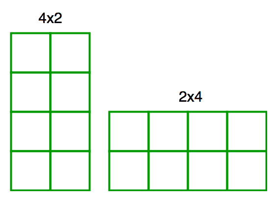

# 使用 N 个单位正方形形成的唯一矩形的数量

> 原文:[https://www . geesforgeks . org/number-unique-矩形-formed-using-n-unit-squares/](https://www.geeksforgeeks.org/number-unique-rectangles-formed-using-n-unit-squares/)

给你 N 个单位的正方形(边长 1 个单位的正方形)，要求你用这些正方形做矩形。你必须计算出你所能做出的旋转唯一矩形的数量。旋转唯一是什么意思？嗯，两个矩形是旋转唯一的，如果一个不能旋转到与另一个相等。

示例–4×2 矩形可以顺时针旋转 90 度，使其与 2×4 矩形完全相同，因此这些矩形不是唯一的。



**示例:**

```
Input : N = 4
Output : 5
We can make following five rectangles 
1 x 1, 1 x 2, 2 x 2, 1 x 3 and 1 x 4

Input : N = 5
Output : 6

Input : 6
Output : 8
```

那么我们如何解决这个问题呢？
每个矩形都是由它的长度和高度唯一决定的。
一个长度= l，高度= h 的矩形，那么 l * h < = n 被认为等价于一个长度= h，高度= l 的矩形，前提是 l 不等于 h。如果我们可以在这些对中有某种“排序”，那么我们就可以避免把(l，h)和(h，l)算作不同的矩形。定义这种排序的一种方法是:

假设长度<= height and count for all such pairs such that length*height <= n. 
我们有，长度< =高度
或者，长度*长度< =长度*高度
或者，长度*长度< = n
或者，长度< = sqrt(n)

## C++

```
// C++ program to count rotationally equivalent
// rectangles with n unit squares
#include<bits/stdc++.h>
using namespace std;

int countRect(int n)
{
    int ans = 0;
    for (int length = 1; length <= sqrt(n); ++length)
    for (int height = length; height*length <= n; ++height)
            // height >= length is maintained
        ans++;
    return ans;
}

// Driver code
int main() {
    int n = 5;
    printf("%d", countRect(n));
    return 0;
}
```

## Java 语言(一种计算机语言，尤用于创建网站)

```
// Java program to count rotationally equivalent
// rectangles with n unit squares
class GFG {

    static int countRect(int n)
    {
        int ans = 0;

        for (int length = 1; length <= Math.sqrt(n);
                                           ++length)
            for (int height = length; height*length <= n;
                                                ++height)
                // height >= length is maintained
                ans++;

        return ans;
    }

    //driver code
    public static void main (String[] args)
    {
        int n = 5;

        System.out.print(countRect(n));
    }
}

// This code is contributed by Anant Agarwal.
```

## 蟒蛇 3

```

# Python3 program to count rotationally 
# equivalent rectangles with n unit squares
import math

def countRect(n):

    ans = 0
    for length in range(1, int(math.sqrt(n)) + 1):
        height = length
        while(height * length <= n):

            # height >= length is maintained
            ans += 1
            height += 1
    return ans

# Driver code
n = 5
print(countRect(n))

# This code is contributed by Anant Agarwal.
```

## C#

```
// C# program to count rotationally 
// equivalent rectangles with n unit
// squares
using System;

class GFG {

    static int countRect(int n)
    {
        int ans = 0;
        for (int length = 1; 
            length <= Math.Sqrt(n); ++length)

            for (int height = length; 
                     height*length <= n; ++height)
                ans++;

        return ans;
    }

    //driver code
    public static void Main()
    {

        int n = 5;

        Console.Write(countRect(n));
    }
}

//This code is contributed by Anant Agarwal.
```

## 服务器端编程语言（Professional Hypertext Preprocessor 的缩写）

```
<?php
// PHP program to count 
// rotationally equivalent 
// rectangles with n unit squares
function countRect($n)
{
    $ans = 0;
    for ($length = 1; 
         $length <= sqrt($n); $length++)
    for ($height = $length; 
         $height * $length <= $n; $height++)
            // height >= length is maintained
        $ans++;
    return $ans;
}

// Driver code
$n = 5;
echo countRect($n);

// This code is contributed by @ajit
?>
```

## java 描述语言

```
<script>

// Javascript program to count rotationally 
// equivalent rectangles with n unit
// squares
function countRect(n)
{
    let ans = 0;
    for(let length = 1; 
            length <= parseInt(Math.sqrt(n), 10); 
          ++length)

        for(let height = length; 
                height * length <= n; 
              ++height)
            ans++;

    return ans;
}

// Driver code
let n = 5;

document.write(countRect(n));

// This code is contributed by divyesh072019

</script>
```

**输出:**

```
6 
```

本文由**赫蒙萨卡尔**供稿。如果你喜欢 GeeksforGeeks 并想投稿，你也可以使用[write.geeksforgeeks.org](http://www.write.geeksforgeeks.org)写一篇文章或者把你的文章邮寄到 review-team@geeksforgeeks.org。看到你的文章出现在极客博客主页上，帮助其他极客。
如果你发现任何不正确的地方，或者你想分享更多关于上面讨论的话题的信息，请写评论。