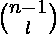
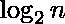
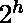
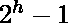
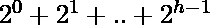

# 用 n 个不同的整数形成堆的方法数

> 原文:[https://www . geesforgeks . org/number-way-form-heap-n-distinct-integers/](https://www.geeksforgeeks.org/number-ways-form-heap-n-distinct-integers/)

给定 n，n 个不同的整数可以组成多少个不同的[最大堆](https://www.geeksforgeeks.org/binary-heap/)？
示例:

```
Input : n = 3
Output : Assume the integers are 1, 2, 3.
Then the 2 possible max heaps are:       
            3
           / \
          1   2

           3
          / \
         2   1

Input : n = 4
Output : Assume the integers are 1, 2, 3, 4.
Then the 3 possible max heaps are:
        4 
       / \ 
      3   2 
     / 
    1

        4 
       / \ 
      2   3 
     / 
    1

        4 
       / \ 
      3   1 
     / 
    2
```

由于**根**只有一个元素，所以一定是最大的数。现在我们还有 n-1 个剩余元素。这里的主要观察是，由于最大堆属性，堆节点的**结构**在所有情况下都将保持不变，但是只有节点中的值会改变。
假设**左子树**中有 **l** 元素，**右子树**中有 **r** 元素。现在求根，l + r = n-1。由此可见，我们可以**选择**左子树剩余的 n-1 个元素中的任意 l 个，因为它们都比根小。
我们知道有种方法可以做到这一点。接下来，对于这些的每个实例，我们可以有许多具有 l 元素的堆，对于其中的每个实例，我们可以有许多具有 r 元素的堆。因此我们可以把它们看作子问题，**重复**得到最终答案为:
T(n) =  * T(L) * T(R)。
现在我们必须找到给定 n 的 l 和 r 的**值**，我们知道堆的高度 h = 。此外，任何堆的第 h **级**中可以存在的元素的最大数量，m = ，其中根在第 0 级。此外，堆的最后一级中实际存在的元素数量 p = n –(–1)。(从开始到倒数第二级出现的节点数)。这样就可以有两种**情况**:当最后一级大于等于半填充时:
l =–1，如果 p > = m / 2
(或者)最后一级小于半填充时:
l =–1–((m/2)–p，如果 p < m / 2
(我们这里得到–1，因为左子树有节点。
由此我们也可以说 r = n–l–1。
我们可以使用本文[中讨论的**动态编程**方法在此](https://www.geeksforgeeks.org/dynamic-programming-set-9-binomial-coefficient/)中找到的值。类似地，如果我们查看上面形成的**最优子结构**递归的递归树，我们可以看到它也具有**重叠子问题**属性，因此可以使用动态规划求解:

```
             T(7)
            /    \
          T(3)   T(3)
         /  \     /  \    
     T(1)  T(1) T(1) T(1) 
```

以下是上述方法的实施:

## C++

```
// CPP program to count max heaps with n distinct keys
#include <iostream>
using namespace std;

#define MAXN 105 // maximum value of n here

// dp[i] = number of max heaps for i distinct integers
int dp[MAXN];

// nck[i][j] = number of ways to choose j elements
//             form i elements, no order */
int nck[MAXN][MAXN];

// log2[i] = floor of logarithm of base 2 of i
int log2[MAXN];

// to calculate nCk
int choose(int n, int k)
{
    if (k > n)
        return 0;
    if (n <= 1)
        return 1;
    if (k == 0)
        return 1;

    if (nck[n][k] != -1)
        return nck[n][k];

    int answer = choose(n - 1, k - 1) + choose(n - 1, k);
    nck[n][k] = answer;
    return answer;
}

// calculate l for give value of n
int getLeft(int n)
{
    if (n == 1)
        return 0;

    int h = log2[n];

    // max number of elements that can be present in the
    // hth level of any heap
    int numh = (1 << h); //(2 ^ h)

    // number of elements that are actually present in
    // last level(hth level)
    // (2^h - 1)
    int last = n - ((1 << h) - 1);

    // if more than half-filled
    if (last >= (numh / 2))
        return (1 << h) - 1; // (2^h) - 1
    else
        return (1 << h) - 1 - ((numh / 2) - last);
}

// find maximum number of heaps for n
int numberOfHeaps(int n)
{
    if (n <= 1)
        return 1;

    if (dp[n] != -1)
        return dp[n];

    int left = getLeft(n);
    int ans = (choose(n - 1, left) * numberOfHeaps(left)) *
                             (numberOfHeaps(n - 1 - left));
    dp[n] = ans;
    return ans;
}

// function to initialize arrays
int solve(int n)
{
    for (int i = 0; i <= n; i++)
        dp[i] = -1;

    for (int i = 0; i <= n; i++)
        for (int j = 0; j <= n; j++)
            nck[i][j] = -1;

    int currLog2 = -1;
    int currPower2 = 1;

    // for each power of two find logarithm
    for (int i = 1; i <= n; i++) {
        if (currPower2 == i) {
            currLog2++;
            currPower2 *= 2;
        }
        log2[i] = currLog2;
    }

    return numberOfHeaps(n);
}

// driver function
int main()
{
    int n = 10;
    cout << solve(n) << endl;
    return 0;
}
```

## Java 语言(一种计算机语言，尤用于创建网站)

```
// Java program to count max heaps with n distinct keys
class GFG
{

    static int MAXN = 105; // maximum value of n here

    // dp[i] = number of max heaps for i distinct integers
    static int[] dp = new int[MAXN];

    // nck[i][j] = number of ways to choose j elements
    //         form i elements, no order */
    static int[][] nck = new int[MAXN][MAXN];

    // log2[i] = floor of logarithm of base 2 of i
    static int[] log2 = new int[MAXN];

    // to calculate nCk
    public static int choose(int n, int k)
    {
        if (k > n)
        {
            return 0;
        }
        if (n <= 1)
        {
            return 1;
        }
        if (k == 0)
        {
            return 1;
        }

        if (nck[n][k] != -1)
        {
            return nck[n][k];
        }

        int answer = choose(n - 1, k - 1) + choose(n - 1, k);
        nck[n][k] = answer;
        return answer;
    }

    // calculate l for give value of n
    public static int getLeft(int n)
    {
        if (n == 1)
        {
            return 0;
        }

        int h = log2[n];

        // max number of elements that can be present in the
        // hth level of any heap
        int numh = (1 << h); //(2 ^ h)

        // number of elements that are actually present in
        // last level(hth level)
        // (2^h - 1)
        int last = n - ((1 << h) - 1);

        // if more than half-filled
        if (last >= (numh / 2))
        {
            return (1 << h) - 1; // (2^h) - 1
        }
        else
        {
            return (1 << h) - 1 - ((numh / 2) - last);
        }
    }

    // find maximum number of heaps for n
    public static int numberOfHeaps(int n)
    {
        if (n <= 1)
        {
            return 1;
        }

        if (dp[n] != -1)
        {
            return dp[n];
        }

        int left = getLeft(n);
        int ans = (choose(n - 1, left) * numberOfHeaps(left))
                * (numberOfHeaps(n - 1 - left));
        dp[n] = ans;
        return ans;
    }

    // function to initialize arrays
    public static int solve(int n)
    {
        for (int i = 0; i <= n; i++)
        {
            dp[i] = -1;
        }

        for (int i = 0; i <= n; i++)
        {
            for (int j = 0; j <= n; j++)
            {
                nck[i][j] = -1;
            }
        }

        int currLog2 = -1;
        int currPower2 = 1;

        // for each power of two find logarithm
        for (int i = 1; i <= n; i++)
        {
            if (currPower2 == i)
            {
                currLog2++;
                currPower2 *= 2;
            }
            log2[i] = currLog2;
        }

        return numberOfHeaps(n);
    }

    // Driver code
    public static void main(String[] args)
    {
        int n = 10;
        System.out.print(solve(n));
    }
}

// This code has been contributed by 29AjayKumar
```

## 蟒蛇 3

```
# Python program to count max heaps with n distinct keys

MAXN = 105 # maximum value of n here

# dp[i] = number of max heaps for i distinct integers
dp = [0]*MAXN

# nck[i][j] = number of ways to choose j elements
#             form i elements, no order */
nck = [[0 for i in range(MAXN)] for j in range(MAXN)]

# log2[i] = floor of logarithm of base 2 of i
log2 = [0]*MAXN

# to calculate nCk
def choose(n, k):
    if (k > n):
        return 0
    if (n <= 1):
        return 1
    if (k == 0):
        return 1

    if (nck[n][k] != -1):
        return nck[n][k]

    answer = choose(n - 1, k - 1) + choose(n - 1, k)
    nck[n][k] = answer
    return answer

# calculate l for give value of n
def getLeft(n):
    if (n == 1):
        return 0

    h = log2[n]

    # max number of elements that can be present in the
    # hth level of any heap
    numh = (1 << h) #(2 ^ h)

    # number of elements that are actually present in
    # last level(hth level)
    # (2^h - 1)
    last = n - ((1 << h) - 1)

    # if more than half-filled
    if (last >= (numh // 2)):
        return (1 << h) - 1 # (2^h) - 1
    else:
        return (1 << h) - 1 - ((numh // 2) - last)

# find maximum number of heaps for n
def numberOfHeaps(n):
    if (n <= 1):
        return 1

    if (dp[n] != -1):
        return dp[n]

    left = getLeft(n)
    ans = (choose(n - 1, left) * numberOfHeaps(left)) * (numberOfHeaps(n - 1 - left))
    dp[n] = ans
    return ans

# function to initialize arrays
def solve(n):
    for i in range(n+1):
        dp[i] = -1

    for i in range(n+1):
        for j in range(n+1):
            nck[i][j] = -1

    currLog2 = -1
    currPower2 = 1

    # for each power of two find logarithm
    for i in range(1,n+1):
        if (currPower2 == i):
            currLog2 += 1
            currPower2 *= 2
        log2[i] = currLog2
    return numberOfHeaps(n)

# Driver code
n = 10
print(solve(n))

# This code is contributed by ankush_953
```

## C#

```
// C# program to count max heaps with n distinct keys
using System;

class GFG
{
    static int MAXN = 105; // maximum value of n here

    // dp[i] = number of max heaps for i distinct integers
    static int[] dp = new int[MAXN]; 

    // nck[i][j] = number of ways to choose j elements
    //             form i elements, no order */
    static int[,] nck = new int[MAXN,MAXN]; 

    // log2[i] = floor of logarithm of base 2 of i
    static int[] log2 = new int[MAXN]; 

    // to calculate nCk
    public static int choose(int n, int k)
    {
        if (k > n)
            return 0;
        if (n <= 1)
            return 1;
        if (k == 0)
            return 1;

        if (nck[n,k] != -1)
            return nck[n,k];

        int answer = choose(n - 1, k - 1) + choose(n - 1, k);
        nck[n,k] = answer;
        return answer;
    }

    // calculate l for give value of n
    public static int getLeft(int n)
    {
        if (n == 1)
            return 0;

        int h = log2[n];

        // max number of elements that can be present in the 
        // hth level of any heap
        int numh = (1 << h); //(2 ^ h)

        // number of elements that are actually present in
        // last level(hth level)
        // (2^h - 1)
        int last = n - ((1 << h) - 1);

        // if more than half-filled
        if (last >= (numh / 2))
            return (1 << h) - 1; // (2^h) - 1
        else
            return (1 << h) - 1 - ((numh / 2) - last);
    }

    // find maximum number of heaps for n
    public static int numberOfHeaps(int n)
    {
        if (n <= 1)
            return 1;

        if (dp[n] != -1)
            return dp[n];

        int left = getLeft(n);
        int ans = (choose(n - 1, left) * numberOfHeaps(left)) * 
                                 (numberOfHeaps(n - 1 - left));
        dp[n] = ans;
        return ans;
    }

    // function to initialize arrays
    public static int solve(int n)
    {
        for (int i = 0; i <= n; i++)
            dp[i] = -1;

        for (int i = 0; i <= n; i++)
            for (int j = 0; j <= n; j++)
                nck[i,j] = -1;

        int currLog2 = -1;
        int currPower2 = 1;

        // for each power of two find logarithm
        for (int i = 1; i <= n; i++) {
            if (currPower2 == i) {
                currLog2++;
                currPower2 *= 2;
            }
            log2[i] = currLog2;
        }

        return numberOfHeaps(n);
    }

    // driver function
    static void Main()
    {
        int n = 10;
        Console.Write(solve(n));
    }
    //This code is contributed by DrRoot_
}
```

## java 描述语言

```
<script>

// JavaScript program to count max heaps with n distinct keys

let MAXN = 105; // maximum value of n here

// dp[i] = number of max heaps for i distinct integers
let dp = new Array(MAXN);

// nck[i][j] = number of ways to choose j elements
    //         form i elements, no order */
let nck = new Array(MAXN);
for(let i=0;i<MAXN;i++)
{
    nck[i]=new Array(MAXN);
    for(let j=0;j<MAXN;j++)
        nck[i][j]=0;
}

// log2[i] = floor of logarithm of base 2 of i
let log2 = new Array(MAXN);

 // to calculate nCk
function choose(n,k)
{
    if (k > n)
        {
            return 0;
        }
        if (n <= 1)
        {
            return 1;
        }
        if (k == 0)
        {
            return 1;
        }

        if (nck[n][k] != -1)
        {
            return nck[n][k];
        }

        let answer = choose(n - 1, k - 1) + choose(n - 1, k);
        nck[n][k] = answer;
        return answer;
}

 // calculate l for give value of n
function getLeft(n)
{
    if (n == 1)
        {
            return 0;
        }

        let h = log2[n];

        // max number of elements that can be present in the
        // hth level of any heap
        let numh = (1 << h); //(2 ^ h)

        // number of elements that are actually present in
        // last level(hth level)
        // (2^h - 1)
        let last = n - ((1 << h) - 1);

        // if more than half-filled
        if (last >= (numh / 2))
        {
            return (1 << h) - 1; // (2^h) - 1
        }
        else
        {
            return (1 << h) - 1 - ((numh / 2) - last);
        }
}

// find maximum number of heaps for n
function numberOfHeaps(n)
{
    if (n <= 1)
        {
            return 1;
        }

        if (dp[n] != -1)
        {
            return dp[n];
        }

        let left = getLeft(n);
        let ans = (choose(n - 1, left) * numberOfHeaps(left))
                * (numberOfHeaps(n - 1 - left));
        dp[n] = ans;
        return ans;
}

// function to initialize arrays
function solve(n)
{
    for (let i = 0; i <= n; i++)
        {
            dp[i] = -1;
        }

        for (let i = 0; i <= n; i++)
        {
            for (let j = 0; j <= n; j++)
            {
                nck[i][j] = -1;
            }
        }

        let currLog2 = -1;
        let currPower2 = 1;

        // for each power of two find logarithm
        for (let i = 1; i <= n; i++)
        {
            if (currPower2 == i)
            {
                currLog2++;
                currPower2 *= 2;
            }
            log2[i] = currLog2;
        }

        return numberOfHeaps(n);
}

// Driver code
let n = 10;
document.write(solve(n));

// This code is contributed by rag2127

</script>
```

**输出:**

```
3360
```