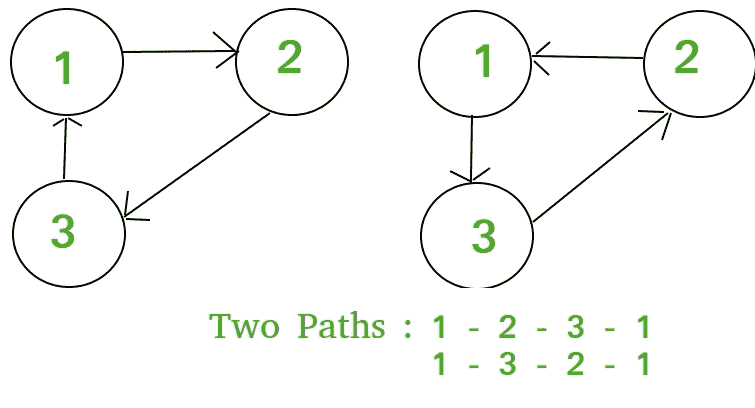

# 从特定节点开始的大小为 k 的循环数

> 原文:[https://www . geesforgeks . org/number-way-node-make-loop-size-k-undirected-complete-connected-graph-n-nodes/](https://www.geeksforgeeks.org/number-ways-node-make-loop-size-k-undirected-complete-connected-graph-n-nodes/)

给定两个正整数 **n，k** 。考虑完全连通图中 n 个节点的无向完全连通图。任务是计算一个人可以从任何节点开始，并通过访问 K 个节点返回到它的方式的数量。
示例:

```
Input : n = 3, k = 3
Output : 2
```



```
Input : n = 4, k = 2
Output : 3
```

让 **f(n，k)** 成为一个函数，它返回从任意节点开始并通过访问 K 个节点返回到该节点的多种方式。
如果我们从一个节点开始和结束，那么我们有 K–1 个中间节点选择，因为我们已经在开始选择了一个节点。对于每个中间选择，您有 n–1 个选项。因此，这将产生(n–1)<sup>k–1</sup>但是之后我们必须移除导致更小循环的所有选择，所以我们减去 **f(n，k–1)**。
于是，递推关系变为，
f(n，k)=(n–1)<sup>k–1</sup>–f(n，k–1)与基本情况 f(n，2)= n–1。
扩张时，
f(n，k)=(n–1)<sup>k–1</sup>–(n–1)<sup>k–2</sup>+(n–1)<sup>k–3</sup>…..(n–1)(比如方程 1)
将 f(n，k)除以(n–1)
f(n，k)/(n–1)=(n–1)<sup>k–2</sup>–(n–1)<sup>k–3</sup>+(n–1)<sup>k–4</sup>…..1(比如方程 2)
在添加方程 1 和方程 2 时，
f(n，k) + f(n，k)/(n–1)=(n–1)<sup>k–1</sup>+(-1)<sup>k</sup>T33】f(n，k)*((n-1)+1)/(n–1)=(n–1)<sup>k–1</sup>+(-1)<sup>k【T36</sup>

## C++

```
// C++ Program to find number of cycles of length
// k in a graph with n nodes.
#include <bits/stdc++.h>
using namespace std;

// Return the Number of ways from a
// node to make a loop of size K in undirected
// complete connected graph of N nodes
int numOfways(int n, int k)
{
    int p = 1;

    if (k % 2)
        p = -1;

    return (pow(n - 1, k) + p * (n - 1)) / n;
}

// Driven Program
int main()
{
    int n = 4, k = 2;
    cout << numOfways(n, k) << endl;
    return 0;
}
```

## Java 语言(一种计算机语言，尤用于创建网站)

```
// Java Program to find number of
// cycles of length k in a graph
// with n nodes.
public class GFG {

    // Return the Number of ways
    // from a node to make a loop
    // of size K in undirected
    // complete connected graph of
    // N nodes
    static int numOfways(int n, int k)
    {
        int p = 1;

        if (k % 2 != 0)
            p = -1;

        return (int)(Math.pow(n - 1, k)
                    + p * (n - 1)) / n;
    }

    // Driver code
    public static void main(String args[])
    {
        int n = 4, k = 2;

        System.out.println(numOfways(n, k));
    }
}

// This code is contributed by Sam007.
```

## 蟒蛇 3

```
# python Program to find number of 
# cycles of length k in a graph 
# with n nodes.

# Return the Number of ways from a
# node to make a loop of size K in
# undirected complete connected 
# graph of N nodes
def numOfways(n,k):

    p = 1

    if (k % 2):
        p = -1

    return (pow(n - 1, k) +
                   p * (n - 1)) / n

# Driver code
n = 4
k = 2
print (numOfways(n, k))

# This code is contributed by Sam007.
```

## C#

```
// C# Program to find number of cycles
// of length k in a graph with n nodes.
using System;

class GFG {

    // Return the Number of ways from
    // a node to make a loop of size
    // K in undirected complete 
    // connected graph of N nodes
    static int numOfways(int n, int k)
    {
        int p = 1;

        if (k % 2 != 0)
            p = -1;

        return (int)(Math.Pow(n - 1, k)
                     + p * (n - 1)) / n;
    }

    // Driver code
    static void Main()
    {
        int n = 4, k = 2;

        Console.Write( numOfways(n, k) );
    }
}

// This code is contributed by Sam007.
```

## 服务器端编程语言（Professional Hypertext Preprocessor 的缩写）

```
<?php
// PHP Program to find number
// of cycles of length
// k in a graph with n nodes.

// Return the Number of ways from a
// node to make a loop of size K 
// in undirected complete connected
// graph of N nodes
function numOfways( $n, $k)
{
$p = 1;

if ($k % 2)
    $p = -1;

return (pow($n - 1, $k) + 
        $p * ($n - 1)) / $n;
}

    // Driver Code
    $n = 4;
    $k = 2;
    echo numOfways($n, $k);

// This code is contributed by vt_m. 
?>
```

## java 描述语言

```
<script>

// JavaScript Program to find number of
// cycles of length k in a graph
// with n nodes.

    // Return the Number of ways
    // from a node to make a loop
    // of size K in undirected
    // complete connected graph of
    // N nodes
    function numOfways(n, k)
    {
        let p = 1;

        if (k % 2 != 0)
            p = -1;

        return (Math.pow(n - 1, k)
                    + p * (n - 1)) / n;
    }

// Driver code
         let n = 4, k = 2;
        document.write(numOfways(n, k));

    // This code is contributed by code_hunt.
</script>
```

**Output:** 

```
3
```