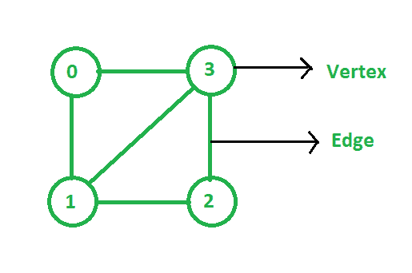

# 对图形的观察

> 原文:[https://www.geeksforgeeks.org/observations-on-graph/](https://www.geeksforgeeks.org/observations-on-graph/)

一个 [**图形**](https://www.geeksforgeeks.org/graph-data-structure-and-algorithms/) 是一个非线性的[数据结构](https://www.geeksforgeeks.org/data-structures/)用于表示一组对象，其中一些对象对是连接的。互连的对象由称为**顶点**的点表示，连接顶点的线称为**边**。顶点用 **V** 表示，边用 **E** 表示。也可以说，图是一对集合 **(V，E)** 。例如:

在上图中，顶点集 **V = {0，1，2，3}** 和边集 **E = {(0，1)，(0，3)，(1，2)，(1，3)，(2，3)}** 。

图表的一些观察结果如下:

*   **在不考虑自循环的情况下，N 个顶点的无向图的最大边数:**由于每个节点都可以连接到所有其他节点，因此第一个节点可以连接到**(N–1)个节点**。第二个节点可以连接到**(N-2)个节点**等等。因此，

> 边的总数为:1+2+3 ++ N =**N *(N–1)/2**条边

*   **在不考虑自循环的情况下，N 个顶点的有向图的最大边数:**每条边都有它的开始顶点和结束顶点。起始顶点有 **N 个选择**。因为没有自循环，所以有**(N–1)个选择**作为结束顶点。所以通过将这些选择相乘来计算所有可能的选择。因此，

> 边的总数为:**N *(N–1)**

*   **有 N 个自循环顶点的图的最大边数:**

> 边的总数为: **N*N**

*   **有 N 个顶点的无向图的最小边数:**由于[图是连通的](https://www.geeksforgeeks.org/check-if-a-directed-graph-is-connected-or-not/)，那么从每个顶点到每隔一个顶点必须有唯一的路径，去掉任何边都会使图断开。通过将 **1** 放置在上三角形的每一行中来实现最小值。现在，如果邻接矩阵的维数是 **NxN** ，那么第一行在上三角形中有**(N–1)**元素，第二行在上三角形中有**(N–2)**元素，以此类推。最后一行在上三角中有 **0 元素**。即**(N–1)**共有“上三角”行，每一行只有 **1** 。因此，

> 边的总数为:**(N–1)**

*   **具有 N 个顶点和 E 条边的未加权图的可能邻接矩阵的数量:**对于具有 **N 个顶点的[未加权图](https://www.geeksforgeeks.org/shortest-path-unweighted-graph/)，它可以表示为一个 **(NxN)** 矩阵(2D [数组](https://www.geeksforgeeks.org/introduction-to-arrays/))，每个值为 **0** (表示不存在边)或 **1** (表示存在边)。**

现在，如果第一行有 **N 个不同的选择**，那么第二行就有**(N–1)个选择**(因为已知边 1，2 的信息)，以此类推。总的可能性是:

> N *(N–1)*(N–2)*……* 1 =**N！**

或者可以说等于 N 个元素的排列数即 **N！**。

*   **具有 N 个顶点和 E 条边的图可能的邻接列表的数量:**类似于上面的解释。等于边的排列数即 **E！**。
*   **设 G 为一个图，其中所有顶点的******度至少为 2。那么 G 包含一个循环:**假设 **G** 简单，让 P 为最长路径为**(v0v1v2…va 1va)**。鉴于**vat23】的度数为>t24】2**，**vat29】必须与至少一个不是**(va–1)**的顶点 **v** 相邻，如果 **v ∉ {v 0 ，…，v 然而，P 被选择为最大长度，因此这是不可能的，因此 **v ∈ {v 0 …，va–2}**。因此，如果 **v = v i** ，那么 v i+1 ，…，v a、T58】vI**就是一个循环。****
*   **凯莱公式:**

> 对于 N ≤ 1，在 N-1 个钟形顶点上有精确的**NN–2T3】树形图。**