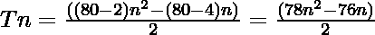

# 八角数

> 原文:[https://www.geeksforgeeks.org/octacontagon-number/](https://www.geeksforgeeks.org/octacontagon-number/)

给定一个数字 **N** ，任务是找到**N<sup>th</sup>T5[八角数](https://en.wikipedia.org/wiki/Octacontagon)。**

> 一个[八进制数](https://en.wikipedia.org/wiki/Octacontagon)是一类整数。它有一个 80 边的多边形，叫做八角形。第 N 个八边形数是 80 个数的点，所有其他点都被一个公共的共享角包围并形成一个图案。前几个八进制数是 **1，80，237，472……**

**示例:**

> **输入:** N = 2
> **输出:** 80
> **说明:**
> 第二个八进制数是 80。
> 
> **输入:**N = 3
> T3】输出: 237

**方法:**第 N 个八角数由公式给出:

*   s 边多边形的第 n 项= 
*   因此，80 边多边形的第 n 项是

> 

下面是上述方法的实现:

## C++

```
// C++ program for above approach
#include <bits/stdc++.h>
using namespace std;

// Finding the nth octacontagon Number
int octacontagonNum(int n)
{
    return (78 * n * n - 76 * n) / 2;
}

// Driver Code
int main()
{
    int n = 3;
    cout <<"3rd octacontagon Number is = "
         << octacontagonNum(n);

    return 0;
}

// This code is contributed by shivanisinghss2110
```

## C

```
// C program for above approach
#include <stdio.h>
#include <stdlib.h>

// Finding the nth octacontagon Number
int octacontagonNum(int n)
{
    return (78 * n * n - 76 * n) / 2;
}

// Driver program to test above function
int main()
{
    int n = 3;
    printf("3rd octacontagon Number is = %d",
           octacontagonNum(n));

    return 0;
}
```

## Java 语言(一种计算机语言，尤用于创建网站)

```
// Java program for above approach
import java.util.*;
class GFG{

// Finding the nth octacontagon Number
static int octacontagonNum(int n)
{
    return (78 * n * n - 76 * n) / 2;
}

// Driver Code
public static void main(String args[])
{
    int n = 3;
    System.out.print("3rd octacontagon Number is = " +
                                  octacontagonNum(n));
}
}

// This code is contributed by Akanksha_Rai
```

## 蟒蛇 3

```
# Python3 program for above approach

# Finding the nth octacontagon number
def octacontagonNum(n):

    return (78 * n * n - 76 * n) // 2

# Driver code
n = 3
print("3rd octacontagon Number is = ",
                   octacontagonNum(n))

# This code is contributed by divyamohan123
```

## C#

```
// C# program for above approach
using System;
class GFG{

// Finding the nth octacontagon Number
static int octacontagonNum(int n)
{
    return (78 * n * n - 76 * n) / 2;
}

// Driver Code
public static void Main()
{
    int n = 3;
    Console.Write("3rd octacontagon Number is = " +
                               octacontagonNum(n));
}
}

// This code is contributed by Akanksha_Rai
```

## java 描述语言

```
<script>

// Javascript program for above approach

// Finding the nth octacontagon Number
function octacontagonNum(n)
{
    return (78 * n * n - 76 * n) / 2;
}

// Driver Code
var n = 3;
document.write("3rd octacontagon Number is = " + octacontagonNum(n));

</script>
```

**Output:** 

```
3rd octacontagon Number is = 237
```

***时间复杂度:** O(1)*

***辅助空间:** O(1)*

**参考资料:**[https://en . Wikipedia . org/wiki/octagon](https://en.wikipedia.org/wiki/Octacontagon)