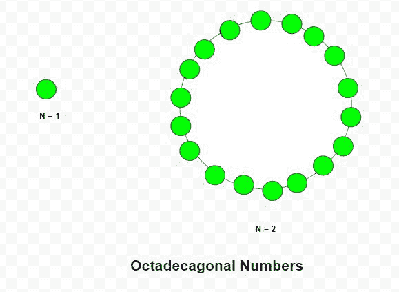

# 十八烷基数

> 原文:[https://www.geeksforgeeks.org/octadecagonal-number/](https://www.geeksforgeeks.org/octadecagonal-number/)

给定一个数字 **N** ，任务是找到第 N 个<sup>第</sup>十八行数字。

> 十八进制数是一类图形数。它有一个 18 边的多边形，叫做十八边形。第 N<sup>个十八边数计数的十八个数点和所有其他点被一个共同的共享角包围并形成一个图案。前几个十八进制数字是 **1、18、51、100、165、246、343……**</sup>

**例:**

> **输入:** N = 2
> **输出:** 18
> **说明:**
> 第二个十八进制数是 18。
> **输入:** N = 6
> **输出:** 246



**方法:**第 N <sup>个</sup>十八烷基数由公式给出:

以下是上述方法的实现:

## C++

```
// C++ program to find Nth
// Octadecagonal number

#include <bits/stdc++.h>
using namespace std;

// Function to find N-th
// Octadecagonal number
int Octadecagonal_num(int n)
{
    // Formula to calculate nth
    // Octadecagonal number
    return (16 * n * n - 14 * n) / 2;
}

// Driver code
int main()
{
    int n = 3;
    cout << Octadecagonal_num(n) << endl;

    n = 10;
    cout << Octadecagonal_num(n) << endl;

    return 0;
}
```

## Java 语言(一种计算机语言，尤用于创建网站)

```
// Java program to find Nth
// octadecagonal number
import java.io.*;
import java.util.*;

class GFG{

// Function to find N-th
// octadecagonal number
static int Octadecagonal_num(int n)
{

    // Formula to calculate nth
    // octadecagonal number
    return (16 * n * n - 14 * n) / 2;
}

// Driver code
public static void main(String[] args)
{
    int n = 3;
    System.out.println(Octadecagonal_num(n));

    n = 10;
    System.out.println(Octadecagonal_num(n));
}
}

// This code is contributed by coder001
```

## 蟒蛇 3

```
# Python3 program to find Nth
# octadecagonal number

# Function to find N-th
# octadecagonal number
def Octadecagonal_num(n):

    # Formula to calculate nth
    # octadecagonal number
    return (16 * n * n - 14 * n) / 2

# Driver code   
n = 3
print(int(Octadecagonal_num(n)))

n = 10
print(int(Octadecagonal_num(n)))

# This code is contributed by divyeshrabadiya07    
```

## C#

```
// C# program to find Nth
// octadecagonal number
using System;

class GFG{

// Function to find N-th
// octadecagonal number
static int Octadecagonal_num(int n)
{

    // Formula to calculate nth
    // octadecagonal number
    return (16 * n * n - 14 * n) / 2;
}

// Driver code
public static void Main(string[] args)
{
    int n = 3;
    Console.Write(Octadecagonal_num(n) + "\n");

    n = 10;
    Console.Write(Octadecagonal_num(n) + "\n");
}
}

// This code is contributed by rutvik_56
```

## java 描述语言

```
<script>

    // Javascript program to find Nth
    // Octadecagonal number 

    // Function to find N-th
    // Octadecagonal number
    function Octadecagonal_num(n)
    {

        // Formula to calculate nth
        // Octadecagonal number
        return (16 * n * n - 14 * n) / 2;
    }

    let n = 3;
    document.write(Octadecagonal_num(n) + "</br>");
    n = 10;
    document.write(Octadecagonal_num(n));

    // This code is contributed by divyesh072019.
</script>
```

**Output:** 

```
51
730
```

**参考:**T2】https://en.wikipedia.org/wiki/Polygonal_number