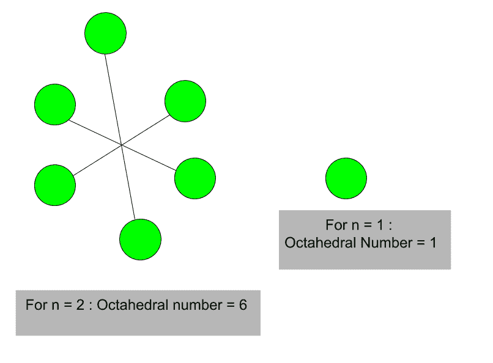

# 八面体数

> 原文:[https://www.geeksforgeeks.org/octahedral-number/](https://www.geeksforgeeks.org/octahedral-number/)

给定一个数 n，任务是找到第 n 个八面体数。
一个[八面体数](https://en.wikipedia.org/wiki/Octahedral_number)属于一个图形数，它是由紧密堆积的球体构成的八面体中的球体数。前几个八面体数(其中 n = 0，1，2，3……)。)分别是:0、1、6、19 等等。
**示例:**

> 输入:4
> 输出:44
> 输入:8
> 输出:344



第 n 个八面体数的公式:

```
n * (2n2+1) / 3
```

## C++

```
// C++ program to find nth
// octahedral number
#include <bits/stdc++.h>
using namespace std;

// Function to find
// octahedral number
int octahedral_num(int n)
{
    // Formula to calculate nth
    // octahedral number
    return n * (2 * n * n + 1) / 3;
}

// Drivers code
int main()
{
    int n = 5;

    // print result
    cout << n << "th Octahedral number: ";
    cout << octahedral_num(n);
    return 0;
}
```

## Java 语言(一种计算机语言，尤用于创建网站)

```
// Java program to find nth octahedral
// number
import java.io.*;

class GFG {

    // Function to find octahedral number
    static int octahedral_num(int n)
    {

        // Formula to calculate nth
        // octahedral number
        // and return it into main function.
        return n * (2 * n * n + 1) / 3;
    }

    // Driver Code
    public static void main(String[] args)
    {
        int n = 5;
        // print result
        System.out.print(n + "th Octahedral"
                         + " number: ");
        System.out.println(octahedral_num(n));
    }
}
```

## 蟒蛇 3

```
# Python 3 program to find nth
# octahedral number

# Function to find
# octahedral number
def octahedral_num(n) :

    # Formula to calculate nth
    # octahedral number
    return n * (2 * n * n + 1) // 3

# Driver Code
if __name__ == '__main__' :

    n = 5
    print(n,"th Octahedral number: "
                , octahedral_num(n))

# This code is contributed ajit.
```

## C#

```
// C# program to find nth
// Octahedral number
using System;

class GFG
{

    // Function to find
    // octahedral number
    static int octahedral_num(int n)
    {

        // Formula to calculate
        // nth octahedral number
        // and return it into
        // main function.
        return n * (2 * n *
                    n + 1) / 3;
    }

    // Driver Code
    static public void Main ()
    {
        int n = 5;

        // print result
        Console.Write(n + "th Octahedral"
                        + " number: ");
        Console.WriteLine(octahedral_num(n));
    }
}

// This code is Contributed by m_kit
```

## 服务器端编程语言（Professional Hypertext Preprocessor 的缩写）

```
<?php
// PHP program to find nth
// octahedral number

// Function to find
// octahedral number
function octahedral_num( $n)
{
    // Formula to calculate nth
    // octahedral number
    // and return it into main function.
    return $n * (2 * $n * $n + 1) / 3;
}

// Drivers Code
$n = 5;

// print result
echo $n, "th Octahedral number: ";
echo octahedral_num($n);

?>
```

## java 描述语言

```
<script>

// JavaScript program to find nth
// octahedral number

// Function to find
// octahedral number
function octahedral_num( n)
{
    // Formula to calculate nth
    // octahedral number
    // and return it into main function.
    return n * (2 * n * n + 1) / 3;
}

// Drivers Code
let n = 5;

// print result
document.write( n+ "th Octahedral number: ");
document.write(octahedral_num(n));

// This code is contributed by Bobby

</script>
```

**输出:**

```
5th Octahedral number: 85
```

参考:[https://en.wikipedia.org/wiki/Octahedral_number](https://en.wikipedia.org/wiki/Octahedral_number)T2】