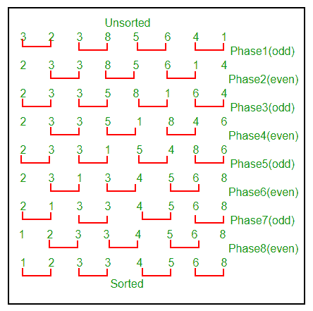

# 奇偶排序/砖块排序

> 原文:[https://www.geeksforgeeks.org/odd-even-sort-brick-sort/](https://www.geeksforgeeks.org/odd-even-sort-brick-sort/)

这基本上是[冒泡排序](https://www.geeksforgeeks.org/bubble-sort/)的变体。该算法分为两个阶段——奇数阶段和偶数阶段。该算法一直运行到数组元素被排序，并且在每次迭代中出现两个阶段——奇数阶段和偶数阶段。
在奇数阶段，我们对奇数索引元素执行冒泡排序，在偶数阶段，我们对偶数索引元素执行冒泡排序。

## C++

```
// A C++ Program to implement Odd-Even / Brick Sort
#include<bits/stdc++.h>
using namespace std;

// A function to sort the algorithm using Odd Even sort
void oddEvenSort(int arr[], int n)
{
    bool isSorted = false; // Initially array is unsorted

    while (!isSorted)
    {
        isSorted = true;

        // Perform Bubble sort on odd indexed element
        for (int i=1; i<=n-2; i=i+2)
        {
            if (arr[i] > arr[i+1])
             {
                swap(arr[i], arr[i+1]);
                isSorted = false;
              }
        }

        // Perform Bubble sort on even indexed element
        for (int i=0; i<=n-2; i=i+2)
        {
            if (arr[i] > arr[i+1])
            {
                swap(arr[i], arr[i+1]);
                isSorted = false;
            }
        }
    }

    return;
}

// A utility function ot print an array of size n
void printArray(int arr[], int n)
{
   for (int i=0; i < n; i++)
       cout << arr[i] << " ";
   cout << "\n";
}

// Driver program to test above functions.
int main()
{
    int arr[] = {34, 2, 10, -9};
    int n = sizeof(arr)/sizeof(arr[0]);

    oddEvenSort(arr, n);
    printArray(arr, n);

    return (0);
}
```

## Java 语言(一种计算机语言，尤用于创建网站)

```
// Java Program to implement
// Odd-Even / Brick Sort
import java.io.*;

class GFG
{
    public static void oddEvenSort(int arr[], int n)
    {
        boolean isSorted = false; // Initially array is unsorted

        while (!isSorted)
        {
            isSorted = true;
            int temp =0;

            // Perform Bubble sort on odd indexed element
            for (int i=1; i<=n-2; i=i+2)
            {
                if (arr[i] > arr[i+1])
                {
                    temp = arr[i];
                    arr[i] = arr[i+1];
                    arr[i+1] = temp;
                    isSorted = false;
                }
            }

            // Perform Bubble sort on even indexed element
            for (int i=0; i<=n-2; i=i+2)
            {
                if (arr[i] > arr[i+1])
                {
                    temp = arr[i];
                    arr[i] = arr[i+1];
                    arr[i+1] = temp;
                    isSorted = false;
                }
            }
        }

        return;
    }
    public static void main (String[] args)
    {
        int arr[] = {34, 2, 10, -9};
        int n = arr.length;

        oddEvenSort(arr, n);
        for (int i=0; i < n; i++)
            System.out.print(arr[i] + " ");

        System.out.println(" ");
    }
}
// Code Contribute by Mohit Gupta_OMG <(0_o)>
```

## 蟒蛇 3

```
# Python Program to implement
# Odd-Even / Brick Sort

def oddEvenSort(arr, n):
    # Initially array is unsorted
    isSorted = 0
    while isSorted == 0:
        isSorted = 1
        temp = 0
        for i in range(1, n-1, 2):
            if arr[i] > arr[i+1]:
                arr[i], arr[i+1] = arr[i+1], arr[i]
                isSorted = 0

        for i in range(0, n-1, 2):
            if arr[i] > arr[i+1]:
                arr[i], arr[i+1] = arr[i+1], arr[i]
                isSorted = 0

    return

arr = [34, 2, 10, -9]
n = len(arr)

oddEvenSort(arr, n);
for i in range(0, n):
    print(arr[i], end = ' ')

# Code Contribute by Mohit Gupta_OMG <(0_o)>
```

## C#

```
// C# Program to implement
// Odd-Even / Brick Sort
using System;

class GFG
{
    public static void oddEvenSort(int []arr, int n)
    {
        // Initially array is unsorted
        bool isSorted = false;

        while (!isSorted)
        {
            isSorted = true;
            int temp =0;

            // Perform Bubble sort on
            // odd indexed element
            for (int i = 1; i <= n - 2; i = i + 2)
            {
                if (arr[i] > arr[i+1])
                {
                    temp = arr[i];
                    arr[i] = arr[i+1];
                    arr[i+1] = temp;
                    isSorted = false;
                }
            }

            // Perform Bubble sort on
            // even indexed element
            for (int i = 0; i <= n - 2; i = i + 2)
            {
                if (arr[i] > arr[i+1])
                {
                    temp = arr[i];
                    arr[i] = arr[i+1];
                    arr[i+1] = temp;
                    isSorted = false;
                }
            }
        }
        return;
    }

    // Driver code
    public static void Main ()
    {
        int []arr = {34, 2, 10, -9};
        int n = arr.Length;

        // Function calling
        oddEvenSort(arr, n);
        for (int i = 0; i < n; i++)
            Console.Write(arr[i] + " ");

        Console.WriteLine(" ");
    }
}

// This code is contributed by Sam007
```

## java 描述语言

```
<script>

// Javascript Program to implement
// Odd-Even / Brick Sort

   function oddEvenSort(arr, n)
    {
        // Initially array is unsorted

        let isSorted = false;

        while (!isSorted)
        {
            isSorted = true;
            let temp =0;

            // Perform Bubble sort on odd indexed element
            for (let i=1; i<=n-2; i=i+2)
            {
                if (arr[i] > arr[i+1])
                {
                    temp = arr[i];
                    arr[i] = arr[i+1];
                    arr[i+1] = temp;
                    isSorted = false;
                }
            }

            // Perform Bubble sort on even indexed element
            for (let i=0; i<=n-2; i=i+2)
            {
                if (arr[i] > arr[i+1])
                {
                    temp = arr[i];
                    arr[i] = arr[i+1];
                    arr[i+1] = temp;
                    isSorted = false;
                }
            }
        }

        return;
    }

// Driver Code

        let arr = [34, 2, 10, -9];
        let n = arr.length;

        oddEvenSort(arr, n);
        for (let i=0; i < n; i++)
            document.write(arr[i] + " ");

        document.write(" ");

</script>
```

**输出:**

```
-9 2 10 34 
```

我们在数组= {3，2，3，8，5，6，4，1}
上使用下图演示了上述算法



正确性证明请参考[维基](https://en.wikipedia.org/wiki/Odd%E2%80%93even_sort#Proof_of_Correctness)。
时间复杂度:O(N <sup>2</sup> )其中，N =输入数组中的元素个数。
辅助空间:O(1)。就像冒泡排序一样，这也是一种就地算法。
**练习**
在我们的程序中，在每次迭代中，我们首先对奇数索引元素进行冒泡排序，然后对偶数索引元素进行冒泡排序。
如果先对偶数索引元素执行冒泡排序，再对奇数索引元素执行冒泡排序，会得到排序结果吗？
**参考文献**
[https://en.wikipedia.org/wiki/Odd%E2%80%93even_sort](https://en.wikipedia.org/wiki/Odd%E2%80%93even_sort)
本文由 Rachit Belwariar 供稿。如果你喜欢极客博客并想投稿，你也可以写一篇文章并把你的文章邮寄到 review-team@geeksforgeeks.org。看到你的文章出现在极客博客主页上，帮助其他极客。
发现有不正确的地方请写评论，或者想分享更多以上讨论话题的信息