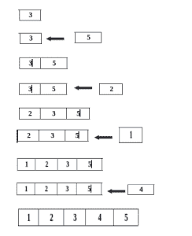

# 在线算法

> 原文:[https://www.geeksforgeeks.org/online-algorithm/](https://www.geeksforgeeks.org/online-algorithm/)

在线算法是一种能够以串行方式逐件处理其输入的算法，即按照输入被馈送到算法的顺序，而不需要从一开始就获得全部输入。

相比之下，**离线算法**从一开始就给出了整个问题数据，并被要求输出一个解决手头问题的答案。

例如，考虑排序算法 **[选择排序](https://www.geeksforgeeks.org/selection-sort/) t** 和**T5】插入排序** :

选择排序算法通过从未排序的部分重复寻找最小元素(考虑升序)并将其放在开头来对数组进行排序。这需要访问整个输入；因此，它是一种离线算法。另一方面，插入排序在每次迭代中考虑一个输入元素，并在不考虑未来元素的情况下产生部分解决方案。因此插入排序是一种在线算法。

**在线算法示例(插入排序):**

因为在线算法不知道整个输入，所以它可能会做出后来证明不是最优的决定，
请注意，插入排序会产生最优结果。因此，对于许多问题，在线算法无法与离线算法的性能相匹配。

**在线算法的例子有:**
1。插入排序
2。感知器
3。水库采样
4。贪婪算法
5。对头模式
6。测量任务系统
7。优势算法

**在线问题:**有很多问题提供不止一个在线算法作为解决方案:
1。加拿大旅行者问题
2。线性搜索问题
3。k-服务器问题
4。作业车间调度问题
5。列表更新问题
6。土匪问题
7。秘书问题

**参考:**T2[https://en.wikipedia.org/wiki/Online_algorithm](https://en.wikipedia.org/wiki/Online_algorithm)

本文由**舒巴姆拉纳**供稿。如果你喜欢 GeeksforGeeks 并想投稿，你也可以使用[contribute.geeksforgeeks.org](http://www.contribute.geeksforgeeks.org)写一篇文章或者把你的文章邮寄到 contribute@geeksforgeeks.org。看到你的文章出现在极客博客主页上，帮助其他极客。

如果你发现任何不正确的地方，或者你想分享更多关于上面讨论的话题的信息，请写评论。