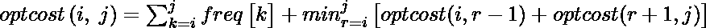

# 最优二叉查找树| DP-24

> 原文:[https://www . geesforgeks . org/optimal-binary-search-tree-DP-24/](https://www.geeksforgeeks.org/optimal-binary-search-tree-dp-24/)

给定一个排序的数组键*【0..n-1]* 个搜索关键字和一个数组 *freq[0..频率计数的 n-1]* ，其中*频率【I】*是搜索*键【I】*的次数。构建所有关键字的二叉查找树，以便所有搜索的总成本尽可能小。
我们先来定义一个 BST 的成本。BST 节点的成本是该节点的级别乘以其频率。根的级别是 1。

**示例:**

```
Input:  keys[] = {10, 12}, freq[] = {34, 50}
There can be following two possible BSTs 
        10                       12
          \                     / 
           12                 10
          I                     II
Frequency of searches of 10 and 12 are 34 and 50 respectively.
The cost of tree I is 34*1 + 50*2 = 134
The cost of tree II is 50*1 + 34*2 = 118 

Input:  keys[] = {10, 12, 20}, freq[] = {34, 8, 50}
There can be following possible BSTs
    10                12                 20         10              20
      \             /    \              /             \            /
      12          10     20           12               20         10  
        \                            /                 /           \
         20                        10                12             12  
     I               II             III             IV             V
Among all possible BSTs, cost of the fifth BST is minimum.  
Cost of the fifth BST is 1*50 + 2*34 + 3*8 = 142 
```

**1)最优子结构:**
频率的最优成本..j]可以使用以下公式递归计算。

我们需要计算 ***的 optCost(0，n-1)*** 才能找到结果。
上面公式的思路很简单，我们一个个尝试把所有节点都作为根(第二项 r 从 I 到 j 不等)。当我们将 *rth* 节点作为根时，我们递归地计算从 I 到 r-1 和从 r+1 到 j 的最优成本。
我们将从 I 到 j 的频率之和相加(见上述公式中的第一项)

**将 I 到 j 的频率之和相加的原因:**

这可以分为两部分，一部分是 freq[r]+从 I 到 j 除 r 之外的所有元素的频率之和，添加 freq[r]项是因为它将是根，这意味着级别为 1，因此 freq[r]*1=freq[r]。现在实际部分来了，我们将剩余元素的频率相加，因为当我们以 r 为根时，除了 r 之外的所有元素都比子问题中计算的低 1 级。让我更清楚地说，为了计算 optcost(i，j)，我们假设 r 作为根，并计算所有 i <=r<=j. Here for every subproblem we are  choosing one node as a root. But in reality the level of subproblem root and all its descendant nodes will be 1 greater than the level of the parent problem root. Therefore the frequency of all the nodes except r should be added which accounts to the descend in their level compared to level assumed in subproblem.
**2)重叠子问题**
的 opt(i，r-1)+opt(r+1，j)的最小值以下是简单遵循上述递归结构的递归实现。

## C++

```
// A naive recursive implementation of
// optimal binary search tree problem
#include <bits/stdc++.h>
using namespace std;

// A utility function to get sum of
// array elements freq[i] to freq[j]
int sum(int freq[], int i, int j);

// A recursive function to calculate
// cost of optimal binary search tree
int optCost(int freq[], int i, int j)
{
    // Base cases
    if (j < i)  // no elements in this subarray
        return 0;
    if (j == i) // one element in this subarray
        return freq[i];

    // Get sum of freq[i], freq[i+1], ... freq[j]
    int fsum = sum(freq, i, j);

    // Initialize minimum value
    int min = INT_MAX;

    // One by one consider all elements
    // as root and recursively find cost
    // of the BST, compare the cost with
    // min and update min if needed
    for (int r = i; r <= j; ++r)
    {
        int cost = optCost(freq, i, r - 1) +
                   optCost(freq, r + 1, j);
        if (cost < min)
            min = cost;
    }

    // Return minimum value
    return min + fsum;
}

// The main function that calculates
// minimum cost of a Binary Search Tree.
// It mainly uses optCost() to find
// the optimal cost.
int optimalSearchTree(int keys[],
                      int freq[], int n)
{
    // Here array keys[] is assumed to be
    // sorted in increasing order. If keys[]
    // is not sorted, then add code to sort
    // keys, and rearrange freq[] accordingly.
    return optCost(freq, 0, n - 1);
}

// A utility function to get sum of
// array elements freq[i] to freq[j]
int sum(int freq[], int i, int j)
{
    int s = 0;
    for (int k = i; k <= j; k++)
    s += freq[k];
    return s;
}

// Driver Code
int main()
{
    int keys[] = {10, 12, 20};
    int freq[] = {34, 8, 50};
    int n = sizeof(keys) / sizeof(keys[0]);
    cout << "Cost of Optimal BST is "
         << optimalSearchTree(keys, freq, n);
    return 0;
}

// This is code is contributed
// by rathbhupendra
```

## C

```
// A naive recursive implementation of optimal binary
// search tree problem
#include <stdio.h>
#include <limits.h>

// A utility function to get sum of array elements
// freq[i] to freq[j]
int sum(int freq[], int i, int j);

// A recursive function to calculate cost of optimal
// binary search tree
int optCost(int freq[], int i, int j)
{
   // Base cases
   if (j < i)      // no elements in this subarray
     return 0;
   if (j == i)     // one element in this subarray
     return freq[i];

   // Get sum of freq[i], freq[i+1], ... freq[j]
   int fsum = sum(freq, i, j);

   // Initialize minimum value
   int min = INT_MAX;

   // One by one consider all elements as root and
   // recursively find cost of the BST, compare the
   // cost with min and update min if needed
   for (int r = i; r <= j; ++r)
   {
       int cost = optCost(freq, i, r-1) +
                  optCost(freq, r+1, j);
       if (cost < min)
          min = cost;
   }

   // Return minimum value
   return min + fsum;
}

// The main function that calculates minimum cost of
// a Binary Search Tree. It mainly uses optCost() to
// find the optimal cost.
int optimalSearchTree(int keys[], int freq[], int n)
{
     // Here array keys[] is assumed to be sorted in
     // increasing order. If keys[] is not sorted, then
     // add code to sort keys, and rearrange freq[]
     // accordingly.
     return optCost(freq, 0, n-1);
}

// A utility function to get sum of array elements
// freq[i] to freq[j]
int sum(int freq[], int i, int j)
{
    int s = 0;
    for (int k = i; k <=j; k++)
       s += freq[k];
    return s;
}

// Driver program to test above functions
int main()
{
    int keys[] = {10, 12, 20};
    int freq[] = {34, 8, 50};
    int n = sizeof(keys)/sizeof(keys[0]);
    printf("Cost of Optimal BST is %d ",
               optimalSearchTree(keys, freq, n));
    return 0;
}
```

## Java 语言(一种计算机语言，尤用于创建网站)

```
// A naive recursive implementation of optimal binary
// search tree problem
public class GFG
{
    // A recursive function to calculate cost of
        // optimal binary search tree
    static int optCost(int freq[], int i, int j)
    {
       // Base cases
       if (j < i)      // no elements in this subarray
         return 0;
       if (j == i)     // one element in this subarray
         return freq[i];

       // Get sum of freq[i], freq[i+1], ... freq[j]
       int fsum = sum(freq, i, j);

       // Initialize minimum value
       int min = Integer.MAX_VALUE;

       // One by one consider all elements as root and
           // recursively find cost of the BST, compare the
           // cost with min and update min if needed
       for (int r = i; r <= j; ++r)
       {
           int cost = optCost(freq, i, r-1) +
                          optCost(freq, r+1, j);
           if (cost < min)
              min = cost;
       }

       // Return minimum value
       return min + fsum;
    }

    // The main function that calculates minimum cost of
        // a Binary Search Tree. It mainly uses optCost() to
        // find the optimal cost.
    static int optimalSearchTree(int keys[], int freq[], int n)
    {
         // Here array keys[] is assumed to be sorted in
             // increasing order. If keys[] is not sorted, then
             // add code to sort keys, and rearrange freq[]
             // accordingly.
         return optCost(freq, 0, n-1);
    }

    // A utility function to get sum of array elements
        // freq[i] to freq[j]
    static int sum(int freq[], int i, int j)
    {
        int s = 0;
        for (int k = i; k <=j; k++)
           s += freq[k];
        return s;
    }

    // Driver code
    public static void main(String[] args) {
        int keys[] = {10, 12, 20};
        int freq[] = {34, 8, 50};
        int n = keys.length;
        System.out.println("Cost of Optimal BST is " +
                         optimalSearchTree(keys, freq, n));
    }
}
// This code is contributed by Sumit Ghosh
```

## 蟒蛇 3

```
# A naive recursive implementation of
# optimal binary search tree problem

# A recursive function to calculate
# cost of optimal binary search tree
def optCost(freq, i, j):

    # Base cases
    if j < i:     # no elements in this subarray
        return 0
    if j == i:     # one element in this subarray
        return freq[i]

    # Get sum of freq[i], freq[i+1], ... freq[j]
    fsum = Sum(freq, i, j)

    # Initialize minimum value
    Min = 999999999999

    # One by one consider all elements as
    # root and recursively find cost of
    # the BST, compare the cost with min
    # and update min if needed
    for r in range(i, j + 1):
        cost = (optCost(freq, i, r - 1) +
                optCost(freq, r + 1, j))
        if cost < Min:
            Min = cost

    # Return minimum value
    return Min + fsum

# The main function that calculates minimum
# cost of a Binary Search Tree. It mainly
# uses optCost() to find the optimal cost.
def optimalSearchTree(keys, freq, n):

    # Here array keys[] is assumed to be
    # sorted in increasing order. If keys[]
    # is not sorted, then add code to sort 
    # keys, and rearrange freq[] accordingly.
    return optCost(freq, 0, n - 1)

# A utility function to get sum of
# array elements freq[i] to freq[j]
def Sum(freq, i, j):
    s = 0
    for k in range(i, j + 1):
        s += freq[k]
    return s

# Driver Code
if __name__ == '__main__':
    keys = [10, 12, 20]
    freq = [34, 8, 50]
    n = len(keys)
    print("Cost of Optimal BST is",
           optimalSearchTree(keys, freq, n))

# This code is contributed by PranchalK
```

## C#

```
// A naive recursive implementation of optimal binary
// search tree problem
using System;

class GFG
{
    // A recursive function to calculate cost of
    // optimal binary search tree
    static int optCost(int []freq, int i, int j)
    {

    // Base cases
    // no elements in this subarray
    if (j < i)    
        return 0;

    // one element in this subarray   
    if (j == i)    
        return freq[i];

    // Get sum of freq[i], freq[i+1], ... freq[j]
    int fsum = sum(freq, i, j);

    // Initialize minimum value
    int min = int.MaxValue;

    // One by one consider all elements as root and
    // recursively find cost of the BST, compare the
    // cost with min and update min if needed
    for (int r = i; r <= j; ++r)
    {
        int cost = optCost(freq, i, r-1) +
                        optCost(freq, r+1, j);
        if (cost < min)
            min = cost;
    }

    // Return minimum value
    return min + fsum;
    }

    // The main function that calculates minimum cost of
    // a Binary Search Tree. It mainly uses optCost() to
    // find the optimal cost.
    static int optimalSearchTree(int []keys, int []freq, int n)
    {
        // Here array keys[] is assumed to be sorted in
        // increasing order. If keys[] is not sorted, then
        // add code to sort keys, and rearrange freq[]
        // accordingly.
        return optCost(freq, 0, n-1);
    }

    // A utility function to get sum of array elements
    // freq[i] to freq[j]
    static int sum(int []freq, int i, int j)
    {
        int s = 0;
        for (int k = i; k <=j; k++)
        s += freq[k];
        return s;
    }

    // Driver code
    public static void Main()
    {
        int []keys = {10, 12, 20};
        int []freq = {34, 8, 50};
        int n = keys.Length;
        Console.Write("Cost of Optimal BST is " +
                        optimalSearchTree(keys, freq, n));
    }
}

// This code is contributed by Sam007
```

## java 描述语言

```
<script>
//Javascript Implementation

// A recursive function to calculate
// cost of optimal binary search tree
function optCost(freq, i, j)
{
    // Base cases
    if (j < i)  // no elements in this subarray
        return 0;
    if (j == i) // one element in this subarray
        return freq[i];

    // Get sum of freq[i], freq[i+1], ... freq[j]
    var fsum = sum(freq, i, j);

    // Initialize minimum value
    var min = Number. MAX_SAFE_INTEGER;

    // One by one consider all elements
    // as root and recursively find cost
    // of the BST, compare the cost with
    // min and update min if needed
    for (var r = i; r <= j; ++r)
    {
        var cost = optCost(freq, i, r - 1) +
                   optCost(freq, r + 1, j);
        if (cost < min)
            min = cost;
    }

    // Return minimum value
    return min + fsum;
}

// The main function that calculates
// minimum cost of a Binary Search Tree.
// It mainly uses optCost() to find
// the optimal cost.
function optimalSearchTree(keys, freq, n)
{
    // Here array keys[] is assumed to be
    // sorted in increasing order. If keys[]
    // is not sorted, then add code to sort
    // keys, and rearrange freq[] accordingly.
    return optCost(freq, 0, n - 1);
}

// A utility function to get sum of
// array elements freq[i] to freq[j]
function sum(freq, i, j)
{
    var s = 0;
    for (var k = i; k <= j; k++)
    s += freq[k];
    return s;
}

// Driver Code

var keys = [10, 12, 20];
var freq = [34, 8, 50];
var n = keys.length;
document.write("Cost of Optimal BST is " +
    optimalSearchTree(keys, freq, n));

// This code is contributed by shubhamsingh10
</script>
```

**输出:**

```
Cost of Optimal BST is 142
```

上述简单递归方法的时间复杂度是指数级的。需要注意的是，上面的函数一次又一次地计算相同的子问题。我们可以看到许多子问题在 freq[1]的递归树中重复出现..4].


由于相同的子问题被再次调用，这个问题具有重叠子问题的性质。所以最优 BST 问题同时具有动态规划问题的两个性质(参见[这个](https://www.geeksforgeeks.org/overlapping-subproblems-property-in-dynamic-programming-dp-1/)和[这个](https://www.geeksforgeeks.org/optimal-substructure-property-in-dynamic-programming-dp-2/))。像其他典型的[动态规划(DP)问题一样，](https://www.geeksforgeeks.org/archives/tag/dynamic-programming)相同子问题的重新计算可以通过以自下而上的方式构造临时数组 cost[][]来避免。
**动态规划解决方案**
以下是使用动态规划解决最佳 BST 问题的 C/C++实现。我们使用辅助数组代价[n][n]来存储子问题的解。成本[0][n-1]将决定最终结果。实现中的挑战是，必须首先填充所有对角线值，然后填充位于对角线正上方的线上的值。换句话说，我们必须首先填充所有成本[i][i]值，然后填充所有成本[i][i+1]值，然后填充所有成本[i][i+2]值。那么如何以这样的方式填充 2D 数组呢>实现中使用的思路与[矩阵链乘法问题](https://www.geeksforgeeks.org/matrix-chain-multiplication-dp-8/)相同，我们使用一个变量‘L’来表示链长，并逐个递增‘L’。我们使用“I”和“L”的值计算列号“j”。

## C++

```
// Dynamic Programming code for Optimal Binary Search
// Tree Problem
#include <bits/stdc++.h>
using namespace std;

// A utility function to get sum of array elements
// freq[i] to freq[j]
int sum(int freq[], int i, int j);

/* A Dynamic Programming based function that calculates
minimum cost of a Binary Search Tree. */
int optimalSearchTree(int keys[], int freq[], int n)
{
    /* Create an auxiliary 2D matrix to store results
    of subproblems */
    int cost[n][n];

    /* cost[i][j] = Optimal cost of binary search tree
    that can be formed from keys[i] to keys[j].
    cost[0][n-1] will store the resultant cost */

    // For a single key, cost is equal to frequency of the key
    for (int i = 0; i < n; i++)
        cost[i][i] = freq[i];

    // Now we need to consider chains of length 2, 3, ... .
    // L is chain length.
    for (int L = 2; L <= n; L++)
    {
        // i is row number in cost[][]
        for (int i = 0; i <= n-L+1; i++)
        {
            // Get column number j from row number i and
            // chain length L
            int j = i+L-1;
            cost[i][j] = INT_MAX;

            // Try making all keys in interval keys[i..j] as root
            for (int r = i; r <= j; r++)
            {
            // c = cost when keys[r] becomes root of this subtree
            int c = ((r > i)? cost[i][r-1]:0) +
                    ((r < j)? cost[r+1][j]:0) +
                    sum(freq, i, j);
            if (c < cost[i][j])
                cost[i][j] = c;
            }
        }
    }
    return cost[0][n-1];
}

// A utility function to get sum of array elements
// freq[i] to freq[j]
int sum(int freq[], int i, int j)
{
    int s = 0;
    for (int k = i; k <= j; k++)
    s += freq[k];
    return s;
}

// Driver code
int main()
{
    int keys[] = {10, 12, 20};
    int freq[] = {34, 8, 50};
    int n = sizeof(keys)/sizeof(keys[0]);
    cout << "Cost of Optimal BST is " << optimalSearchTree(keys, freq, n);
    return 0;
}

// This code is contributed by rathbhupendra
```

## C

```
// Dynamic Programming code for Optimal Binary Search
// Tree Problem
#include <stdio.h>
#include <limits.h>

// A utility function to get sum of array elements
// freq[i] to freq[j]
int sum(int freq[], int i, int j);

/* A Dynamic Programming based function that calculates
  minimum cost of a Binary Search Tree. */
int optimalSearchTree(int keys[], int freq[], int n)
{
    /* Create an auxiliary 2D matrix to store results
      of subproblems */
    int cost[n][n];

    /* cost[i][j] = Optimal cost of binary search tree
       that can be  formed from keys[i] to keys[j].
       cost[0][n-1] will store the resultant cost */

    // For a single key, cost is equal to frequency of the key
    for (int i = 0; i < n; i++)
        cost[i][i] = freq[i];

    // Now we need to consider chains of length 2, 3, ... .
    // L is chain length.
    for (int L=2; L<=n; L++)
    {
        // i is row number in cost[][]
        for (int i=0; i<=n-L+1; i++)
        {
            // Get column number j from row number i and
            // chain length L
            int j = i+L-1;
            cost[i][j] = INT_MAX;

            // Try making all keys in interval keys[i..j] as root
            for (int r=i; r<=j; r++)
            {
               // c = cost when keys[r] becomes root of this subtree
               int c = ((r > i)? cost[i][r-1]:0) +
                       ((r < j)? cost[r+1][j]:0) +
                       sum(freq, i, j);
               if (c < cost[i][j])
                  cost[i][j] = c;
            }
        }
    }
    return cost[0][n-1];
}

// A utility function to get sum of array elements
// freq[i] to freq[j]
int sum(int freq[], int i, int j)
{
    int s = 0;
    for (int k = i; k <=j; k++)
       s += freq[k];
    return s;
}

// Driver program to test above functions
int main()
{
    int keys[] = {10, 12, 20};
    int freq[] = {34, 8, 50};
    int n = sizeof(keys)/sizeof(keys[0]);
    printf("Cost of Optimal BST is %d ",
                 optimalSearchTree(keys, freq, n));
    return 0;
}
```

## Java 语言(一种计算机语言，尤用于创建网站)

```
// Dynamic Programming Java code for Optimal Binary Search
// Tree Problem
public class Optimal_BST2 {

    /* A Dynamic Programming based function that calculates
        minimum cost of a Binary Search Tree.  */
    static int optimalSearchTree(int keys[], int freq[], int n) {

        /* Create an auxiliary 2D matrix to store results of
           subproblems */
        int cost[][] = new int[n + 1][n + 1];

        /* cost[i][j] = Optimal cost of binary search tree that
           can be formed from keys[i] to keys[j]. cost[0][n-1]
           will store the resultant cost */

        // For a single key, cost is equal to frequency of the key
        for (int i = 0; i < n; i++)
            cost[i][i] = freq[i];

        // Now we need to consider chains of length 2, 3, ... .
        // L is chain length.
        for (int L = 2; L <= n; L++) {

            // i is row number in cost[][]
            for (int i = 0; i <= n - L + 1; i++) {

                // Get column number j from row number i and
                // chain length L
                int j = i + L - 1;
                cost[i][j] = Integer.MAX_VALUE;

                // Try making all keys in interval keys[i..j] as root
                for (int r = i; r <= j; r++) {

                    // c = cost when keys[r] becomes root of this subtree
                    int c = ((r > i) ? cost[i][r - 1] : 0)
                            + ((r < j) ? cost[r + 1][j] : 0) + sum(freq, i, j);
                    if (c < cost[i][j])
                        cost[i][j] = c;
                }
            }
        }
        return cost[0][n - 1];
    }

    // A utility function to get sum of array elements
    // freq[i] to freq[j]
    static int sum(int freq[], int i, int j) {
        int s = 0;
        for (int k = i; k <= j; k++) {
            if (k >= freq.length)
                continue;
            s += freq[k];
        }
        return s;
    }

    public static void main(String[] args) {

        int keys[] = { 10, 12, 20 };
        int freq[] = { 34, 8, 50 };
        int n = keys.length;
        System.out.println("Cost of Optimal BST is "
                + optimalSearchTree(keys, freq, n));
    }

}
//This code is contributed by Sumit Ghosh
```

## 蟒蛇 3

```
# Dynamic Programming code for Optimal Binary Search
# Tree Problem

INT_MAX = 2147483647

""" A Dynamic Programming based function that
calculates minimum cost of a Binary Search Tree. """
def optimalSearchTree(keys, freq, n):

    """ Create an auxiliary 2D matrix to store
        results of subproblems """
    cost = [[0 for x in range(n)]
               for y in range(n)]

    """ cost[i][j] = Optimal cost of binary search
    tree that can be formed from keys[i] to keys[j].
    cost[0][n-1] will store the resultant cost """

    # For a single key, cost is equal to
    # frequency of the key
    for i in range(n):
        cost[i][i] = freq[i]

    # Now we need to consider chains of
    # length 2, 3, ... . L is chain length.
    for L in range(2, n + 1):

        # i is row number in cost
        for i in range(n - L + 2):

            # Get column number j from row number
            # i and chain length L
            j = i + L - 1
            if i >= n or j >= n:
                break
            cost[i][j] = INT_MAX

            # Try making all keys in interval
            # keys[i..j] as root
            for r in range(i, j + 1):

                # c = cost when keys[r] becomes root
                # of this subtree
                c = 0
                if (r > i):
                    c += cost[i][r - 1]
                if (r < j):
                    c += cost[r + 1][j]
                c += sum(freq, i, j)
                if (c < cost[i][j]):
                    cost[i][j] = c
    return cost[0][n - 1]

# A utility function to get sum of
# array elements freq[i] to freq[j]
def sum(freq, i, j):

    s = 0
    for k in range(i, j + 1):
        s += freq[k]
    return s

# Driver Code
if __name__ == '__main__':
    keys = [10, 12, 20]
    freq = [34, 8, 50]
    n = len(keys)
    print("Cost of Optimal BST is",
           optimalSearchTree(keys, freq, n))

# This code is contributed by SHUBHAMSINGH10
```

## C#

```
// Dynamic Programming C# code for Optimal Binary Search
// Tree Problem
using System;

class GFG
{
    /* A Dynamic Programming based function that calculates
    minimum cost of a Binary Search Tree. */
    static int optimalSearchTree(int []keys, int []freq, int n) {

        /* Create an auxiliary 2D matrix to store results of
        subproblems */
        int [,]cost = new int[n + 1,n + 1];

        /* cost[i][j] = Optimal cost of binary search tree that
        can be formed from keys[i] to keys[j]. cost[0][n-1]
        will store the resultant cost */

        // For a single key, cost is equal to frequency of the key
        for (int i = 0; i < n; i++)
            cost[i,i] = freq[i];

        // Now we need to consider chains of length 2, 3, ... .
        // L is chain length.
        for (int L = 2; L <= n; L++) {

            // i is row number in cost[][]
            for (int i = 0; i <= n - L + 1; i++) {

                // Get column number j from row number i and
                // chain length L
                int j = i + L - 1;
                cost[i,j] = int.MaxValue;

                // Try making all keys in interval keys[i..j] as root
                for (int r = i; r <= j; r++) {

                    // c = cost when keys[r] becomes root of this subtree
                    int c = ((r > i) ? cost[i,r - 1] : 0)
                            + ((r < j) ? cost[r + 1,j] : 0) + sum(freq, i, j);
                    if (c < cost[i,j])
                        cost[i,j] = c;
                }
            }
        }
        return cost[0,n - 1];
    }

    // A utility function to get sum of array elements
    // freq[i] to freq[j]
    static int sum(int []freq, int i, int j) {
        int s = 0;
        for (int k = i; k <= j; k++) {
            if (k >= freq.Length)
                continue;
            s += freq[k];
        }
        return s;
    }

    public static void Main() {

        int []keys = { 10, 12, 20 };
        int []freq = { 34, 8, 50 };
        int n = keys.Length;
        Console.Write("Cost of Optimal BST is "
                + optimalSearchTree(keys, freq, n));
    }
}
// This code is contributed by Sam007
```

## java 描述语言

```
<script>
// Dynamic Programming code for Optimal Binary Search
// Tree Problem

/* A Dynamic Programming based function that calculates
minimum cost of a Binary Search Tree. */
function optimalSearchTree(keys, freq, n)
{
    /* Create an auxiliary 2D matrix to store results
    of subproblems */
    var cost = new Array(n);
    for (var i = 0; i < n; i++)
        cost[i] = new Array(n);

    /* cost[i][j] = Optimal cost of binary search tree
    that can be formed from keys[i] to keys[j].
    cost[0][n-1] will store the resultant cost */

    // For a single key, cost is equal to frequency of the key
    for (var i = 0; i < n; i++)
        cost[i][i] = freq[i];

    // Now we need to consider chains of length 2, 3, ... .
    // L is chain length.
    for (var L = 2; L <= n; L++)
    {
        // i is row number in cost[][]
        for (var i = 0; i <= n-L+1; i++)
        {
            // Get column number j from row number i and
            // chain length L
            var j = i+L-1;
            if ( i >= n || j >= n)
                break
            cost[i][j] = Number. MAX_SAFE_INTEGER;

            // Try making all keys in interval keys[i..j] as root
            for (var r = i; r <= j; r++)
            {
            // c = cost when keys[r] becomes root of this subtree
            var c = 0;
            if (r > i)
                c += cost[i][r-1]
            if (r < j)
                c += cost[r+1][j]
            c += sum(freq, i, j);
            if (c < cost[i][j])
                cost[i][j] = c;
            }
        }
    }
    return cost[0][n-1];
}

// A utility function to get sum of array elements
// freq[i] to freq[j]
function sum(freq, i, j)
{
    var s = 0;
    for (var k = i; k <= j; k++)
        s += freq[k];
    return s;
}
var keys = [10, 12, 20];
var freq = [34, 8, 50];
var n = keys.length;
document.write("Cost of Optimal BST is " +
    optimalSearchTree(keys, freq, n));

// This code contributed by shubhamsingh10
</script>
```

**输出:**

```
Cost of Optimal BST is 142
```

**注释**
**1)** 上述解的时间复杂度是 O(n^4).通过预先计算频率和，而不是一次又一次地调用 sum()，时间复杂度可以很容易地降低到 O(n^3。
**2)** 在上面的解决方案中，我们只计算了最优成本。该解决方案可以很容易地修改，以存储结构的基站也。我们可以创建另一个大小为 n 的辅助数组来存储树的结构。我们需要做的就是，将选择的“r”存储在最里面的循环中。
如果发现有不正确的地方，或者想分享更多关于上述话题的信息，请写评论。