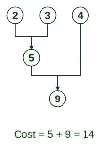
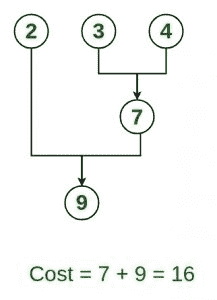
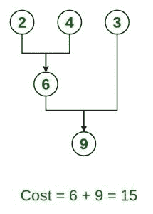
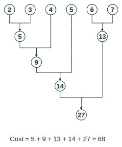

# 最佳文件合并模式

> 原文:[https://www.geeksforgeeks.org/optimal-file-merge-patterns/](https://www.geeksforgeeks.org/optimal-file-merge-patterns/)

给定 n 个排序文件，任务是找到达到最佳合并模式所需的最小计算量。
当两个或多个排序后的文件要合并在一起形成一个文件时，达到该文件所需的最小计算量称为**最佳合并模式**。

如果需要合并 2 个以上的文件，那么可以成对进行。例如，如果需要合并 4 个文件 A、B、C、D，首先将 A 与 B 合并得到 X1，将 X1 与 C 合并得到 X2，将 X2 与 D 合并得到 X3 作为输出文件。

如果我们有两个大小为 m 和 n 的文件，总计算时间将为 m+n。这里，我们使用[贪婪](https://www.geeksforgeeks.org/greedy-algorithms/)策略，将所有存在的文件中大小最小的两个文件合并。

**示例:**
给定 3 个大小为 2、3、4 单位的文件。找到组合这些文件的最佳方式

> **输入:** n = 3，大小= {2，3，4}
> **输出:** 14
> **说明:**这些文件有不同的组合方式:
> **方法 1:** 最优方法
> 
> 
> 
> **方法二:**
> 
> 
> 
> **方法三:**
> 
> 
> 
> **输入:** n = 6，大小= {2，3，4，5，6，7}
> **输出:** 68
> **说明:**组合这些文件的最佳方式
> 
> 
> 
> **输入:** n = 5，大小= {5，10，20，30，30 }
> T3】输出: 205
> 
> **输入:** n = 5，大小= {8，8，8，8，8 }
> T3】输出: 96

**进场:**

> 节点表示具有给定大小的文件，并且给定的节点大于 2
> 
> 1.  添加优先级队列(最小堆)中的所有节点。{node.weight =文件大小}
> 2.  初始化计数= 0 //变量来存储文件计算。
> 3.  重复进行(优先级队列的大小大于 1)
>     1.  创建新节点
>     2.  新节点= pq.poll()。权重+pq.poll()。重量；//pq 表示优先级队列，去掉第一个最小和第二个最小的元素，加上它们的权重，得到一个新的节点
>     3.  count += node.weight
>     4.  将新节点添加到优先级队列中；
>         
> 4.  计数是最终答案

下面是上述方法的实现:

## C++

```
// C++ program to implement
// Optimal File Merge Pattern
#include <bits/stdc++.h>
using namespace std;

// Function to find minimum computation
int minComputation(int size, int files[])
{

    // Create a min heap
    priority_queue<int, vector<int>, greater<int> > pq;

    for (int i = 0; i < size; i++) {

        // Add sizes to priorityQueue
        pq.push(files[i]);
    }

    // Variable to count total Computation
    int count = 0;

    while (pq.size() > 1) {

        // pop two smallest size element
        // from the min heap
        int first_smallest = pq.top();
        pq.pop();
        int second_smallest = pq.top();
        pq.pop();

        int temp = first_smallest + second_smallest;

        // Add the current computations
        // with the previous one's
        count += temp;

        // Add new combined file size
        // to priority queue or min heap
        pq.push(temp);
    }
    return count;
}

// Driver code
int main()
{

    // No of files
    int n = 6;

    // 6 files with their sizes
    int files[] = { 2, 3, 4, 5, 6, 7 };

    // Total no of computations
    // do be done final answer
    cout << "Minimum Computations = "
         << minComputation(n, files);

    return 0;
}

// This code is contributed by jaigoyal1328
```

## Java 语言(一种计算机语言，尤用于创建网站)

```
// Java program to implement
// Optimal File Merge Pattern

import java.util.PriorityQueue;
import java.util.Scanner;

public class OptimalMergePatterns {

    // Function to find minimum computation
    static int minComputation(int size, int files[])
    {

        // create a min heap
        PriorityQueue<Integer> pq = new PriorityQueue<>();

        for (int i = 0; i < size; i++) {

            // add sizes to priorityQueue
            pq.add(files[i]);
        }

        // variable to count total computations
        int count = 0;

        while (pq.size() > 1) {

            // pop two smallest size element
            // from the min heap
            int temp = pq.poll() + pq.poll();

            // add the current computations
            // with the previous one's
            count += temp;

            // add new combined file size
            // to priority queue or min heap
            pq.add(temp);
        }

        return count;
    }

    public static void main(String[] args)
    {

        // no of files
        int size = 6;

        // 6 files with their sizes
        int files[] = new int[] { 2, 3, 4, 5, 6, 7 };

        // total no of computations
        // do be done final answer
        System.out.println("Minimum Computations = "
                           + minComputation(size, files));
    }
}
```

## 蟒蛇 3

```
# Python Program to implement
# Optimal File Merge Pattern

class Heap():
    # Building own implementation of Min Heap
    def __init__(self):

        self.h = []

    def parent(self, index):
        # Returns parent index for given index

        if index > 0:
            return (index - 1) // 2

    def lchild(self, index):
        # Returns left child index for given index

        return (2 * index) + 1

    def rchild(self, index):
        # Returns right child index for given index

        return (2 * index) + 2

    def addItem(self, item):

        # Function to add an item to heap
        self.h.append(item)

        if len(self.h) == 1:

            # If heap has only one item no need to heapify
            return

        index = len(self.h) - 1
        parent = self.parent(index)

        # Moves the item up if it is smaller than the parent
        while index > 0 and item < self.h[parent]:
            self.h[index], self.h[parent] = self.h[parent], self.h[parent]
            index = parent
            parent = self.parent(index)

    def deleteItem(self):

        # Function to add an item to heap
        length = len(self.h)
        self.h[0], self.h[length-1] = self.h[length-1], self.h[0]
        deleted = self.h.pop()

        # Since root will be violating heap property
        # Call moveDownHeapify() to restore heap property
        self.moveDownHeapify(0)

        return deleted

    def moveDownHeapify(self, index):

        # Function to make the items follow Heap property
        # Compares the value with the children and moves item down

        lc, rc = self.lchild(index), self.rchild(index)
        length, smallest = len(self.h), index

        if lc < length and self.h[lc] <= self.h[smallest]:
            smallest = lc

        if rc < length and self.h[rc] <= self.h[smallest]:
            smallest = rc

        if smallest != index:
            # Swaps the parent node with the smaller child
            self.h[smallest], self.h[index] = self.h[index], self.h[smallest]

            # Recursive call to compare next subtree
            self.moveDownHeapify(smallest)

    def increaseItem(self, index, value):
        # Increase the value of 'index' to 'value'

        if value <= self.h[index]:
            return

        self.h[index] = value
        self.moveDownHeapify(index)

class OptimalMergePattern():
    def __init__(self, n, items):

        self.n = n
        self.items = items
        self.heap = Heap()

    def optimalMerge(self):

        # Corner cases if list has no more than 1 item
        if self.n <= 0:
            return 0

        if self.n == 1:
            return self.items[0]

        # Insert items into min heap
        for _ in self.items:
            self.heap.addItem(_)

        count = 0
        while len(self.heap.h) != 1:
            tmp = self.heap.deleteItem()
            count += (tmp + self.heap.h[0])
            self.heap.increaseItem(0, tmp + self.heap.h[0])

        return count

# Driver Code
if __name__ == '__main__':
    OMP = OptimalMergePattern(6, [2, 3, 4, 5, 6, 7])
    ans = OMP.optimalMerge()
    print(ans)

# This code is contributed by Rajat Gupta
```

**Output**

```
Minimum Computations = 68
```